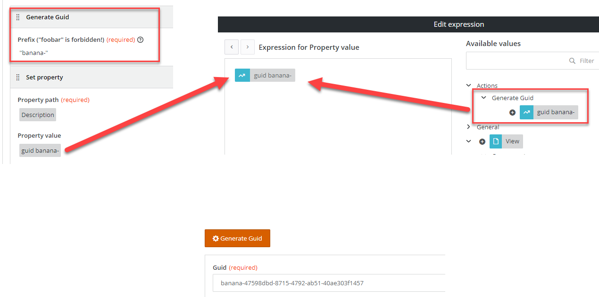

<h1 style="text-align:center">Javascript Actions</h1>

## Content Details:  
Actions are elements that can be used in buttons in View Designer and will be executed at runtime, in a synchronous chain.  
One action can consume the output from a previous action.  
If one action throws an error, following actions will not be executed.  
Actions can be asynchronous, though this is not usually how they are used.

> **:warning:**  
> It is advised to use the BMC OOTB components and if they do not fit the business need to leverage the BMC Adapt libraries to ensure a uniform UX experience.

## How to create an Action?:
You can use our schematics to generate a skeleton code.
Go in the webapp folder and type:
```bash
yarn run ng g rx-view-action "<action-name>"
```
For example:
```bash
yarn run ng g rx-view-action "launch-url"
```

> :memo:  
> To do a "dry run", which means trying to create the action without actually creating or updating the files, add "--dry-run" at the end of the command line, for example:
> ```bash
> yarn run ng g rx-view-action "launch-url" --dry-run
> ```


## Action list
> :memo:  
> The information for the Actions listed here are not exhaustive and should not be taken as a tutorial.  
> Only some specific or interesting details are listed here. Please refer to each Action code as the code is heavily commented.

* [get-user-information](#get-user-information),
* [notification](#notification),
* [confirmation-ootb ](#confirmation-ootb ),
* [confirmation](#confirmation),
* [fruit-picker](#fruit-picker),
* [generate-guid](#generate-guid),
* [matrix](#matrix),


---

<a name="get-user-information"></a>
### get-user-information:
<details> 
<summary>Get user information screenshot</summary>  


</details>

* Description:
  * Gets user information and returns this information in output parameters,
  * Shows how to:
    * Runtime:
      * Leverage BMC **RxCurrentUserService** BMC service,
      * We must return an Observable containing the different output parameters, here:
        ```typescript
            const result: IPlainObject = {};
        
            result['userId'] = of(this.rxCurrentUserService.get().userId);
            result['userName'] = of(this.rxCurrentUserService.getName());
            result['userLoginName'] = of(this.rxCurrentUserService.get().loginName);
            result['userFullName'] = of(this.rxCurrentUserService.get().fullName);
        
            return forkJoin(result);
        ```
* Complexity: :hot_pepper:
* Used in the example:
  * View: AC Get User Information,

---

<a name="notification"></a>
### notification:
<details> 
<summary>Notification screenshot</summary>  


</details>

* Description:
  * Display a notification message leveraging the BMC RxNotificationService service,
  * Shows how to: 
    * Design Time:  
      * Use a selection / dropdown input parameter with values, 
      * Leverage a localized message field:
        ```typescript
            {
              name: 'message',
              label: 'Message',
              // This setting indicates that this message can be localized.
              // This means that when used in a view, the view definition will hold
              // a guid for this message.
              // When downloading the bundle localization strings you will be able to
              // translate the message to a different locale and upload the localization
              // back into the bundle.
              // At runtime the UI will automatically display the value in the right locale
              // or the one set in the view designer by default.
              localizable: true,
              enableExpressionEvaluation: true,
              isRequired: true,
              editor: ExpressionFormControlComponent
            }
        ```
  * Runtime:
    * Leverage **RxNotificationService** BMC service to display a notification message,
    * How to call the message localized version,
    * The action must return an Observable with the output parameter value, if any,
    * In this example there is no output parameter, we just need to return EMPTY:
      ```typescript
        return EMPTY;
      ```
* Complexity: :hot_pepper:
* Used in the example:
  * View: AC Notification,

---

<a name="confirmation-ootb"></a>
### confirmation-ootb:
<details> 
<summary>Confirmation (ootb) screenshot</summary>  


</details>

* Description:
  * Displays a confirmation message asking for the user to confirm his / her choice,
  * Shows how to:
    * Design Time:
      * Define two input parameters,
    * Runtime:
      * Leverage **RxModalService** BMC service to display an OOTB confirmation window,
      * How to stop the action execution chain if the user does not confirm:
      ```typescript
      return throwError(null);
      ```
      * How to continue the action chain passing EMPTY:
      ```typescript
      return EMPTY;
      ```
* Complexity: :hot_pepper: 
* Used in the example:
  * View: AC Confirmation OOTB,

> **:memo:**  
> The **RxModalService** BMC service returns a boolean Observable which is not enough to "stop" the action chain if necessary.  
> That is why we trap it and return EMPTY or throwError.  
> throwError will not display any error message in the UI.

---

<a name="confirmation"></a>
### confirmation:
<details> 
<summary>Confirmation screenshot</summary>  


</details>

* Description:
  * Displays a confirmation message asking for the user to confirm his / her choice. The user will need to enter his / her name to confirm,
  * Show how to:
    * Design Time:
      * Define a title and message input parameters,
    * Design manager:
      * Validate input parameters,
    * Runtime:
      * Leverages **AdaptModalService** Adapt service to display a custom dialog modal window,
      * The name will be passed as an Output parameter,
      * Stop the action execution chain if the user does not confirm, else will return the signature,
      ```typescript
          // AdaptModalService.open returns a promise, we need to return an Observable.
          return from(this.adaptModalService.open(modalDialogConfig)).pipe(
            switchMap((signature: string) => {
              if (signature) {
                return forkJoin({
                  // Output parameter.
                  signature: of(signature)
                });
              } else {
                // throwing an error will not be displayed in the UI but will
                // stop the action chain (following actions will not be executed).
                return throwError(null);
              }
            })
          );
      ```
* Complexity: :hot_pepper: :hot_pepper:
* Used in the example:
  * View: AC Confirmation,

---

<a name="fruit-picker"></a>
### fruit-picker:
<details> 
<summary>Fruit picker screenshot</summary>  


</details>

* Description:
  * This example is more a demo of advanced design time techniques,
  * Show how to:
    * Design time:
      * Use a selection input parameter which gets its data from the record definition "com.example.test210500:fruits" and fill the selection field,
      * Generate dynamic input parameters which depend on the value selected in the selection input parameter,
      * Inject a service in an Action, we do not use the ```constructor``` but the injector, for example:
      ```typescript
      private rxRecordInstanceDataPageService = this.injector.get<RxRecordInstanceDataPageService>(RxRecordInstanceDataPageService);
      ```
      * Have one output parameter,
    * Design manager:
      * Validate dynamic input parameters,
    * Runtime:
      * Returns a Fruit configuration object, 
      * Call a custom POST rest api call (FruitRest) at runtime and wait for its execution before passing the result to the next action,
* Complexity: :hot_pepper: :hot_pepper: :hot_pepper: :hot_pepper:
* Used in the example:
  * View: AC Fruits,

> **:memo:**  
> For this example it is recommended to go through the source code as it is heavily commented.
---

<a name="generate-guid"></a>
### generate-guid:
<details> 
<summary>Generate guid screenshot</summary>  


</details>

* Description:
  * Generates a guid prefixed by a string provided during design time,
  * Show how to:
    * Design time:
      * Have one input parameter and one output parameter,
      * The output parameter name depends on the input parameter value,
    * Design manager:
      * Validate the input parameter,
    * Runtime:
      * Leverage the **RxGuidService** BMC service to generate a guid and return the value in the output parameter:
      ```typescript
          const result: IPlainObject = {};
          const guidKey = 'guid' + this.cleanPrefix(params.prefix);
      
          result[guidKey] = of(this.rxGuidService.generate(params.prefix));
      
          return forkJoin(result);
      ```
  * The output parameter is dynamic and depends on this "prefix" input parameter value,
  * Leverages **RxGuidService** BMC service,
* Complexity: :hot_pepper: :hot_pepper: :hot_pepper:
* Used in the example:
  * View: AC Generate Guid,

---

<a name="matrix"></a>
### matrix:
<details> 
<summary>Generate guid screenshot</summary>  


</details>

* Description:
  * This example is an Easter Egg which still shows some advanced techniques,
  * Shows how to:
    * Runtime:
      * Dynamically load javascript scripts at runtime using the custom **DynamicScriptLoaderServiceService** [service](./JAVASCRIPT_SERVICES.MD#DynamicScriptLoaderServiceService):
      ```typescript
            this.dynamicScriptLoaderServiceService.setCacheBuster(true);
      
            this.dynamicScriptLoaderServiceService.load(MATRIX_OPTIONS.libraries.p5, MATRIX_OPTIONS.libraries.matrix).then(data => {
              this.addARabbit();
              this.playWhiteRabbit();
              console.log('Scripts loaded successfully!');
            }).catch(error => console.log(error));
      ```
      * Insert an HTML object (YouTube iframe video) in the DOM:
      ```typescript
        private playWhiteRabbit(): void {
          const body = document.body;
          const audioDiv = document.createElement('div');
      
          audioDiv.style.display = 'none';
          audioDiv.innerHTML = `<iframe title='YouTube video player' type=\"text/html\" width='640'
          height='390' src='https://www.youtube.com/embed/WANNqr-vcx0?autoplay=1&loop=1' frameborder='0'
          allow="autoplay; fullscreen"></iframe>`;
      
          body.appendChild(audioDiv);
        }
      ```
      * Open an Innovation Studio View ("com.example.test210500:Sample view with input and output parameters") in a modal window using the **RxViewActionService** BMC service:
        * Passing an input parameter,
        * Getting a value back when the view is closed,
      * Use **RxNotificationService** BMC service to display a notification,							
* Complexity: :hot_pepper: :hot_pepper: :hot_pepper: :hot_pepper:
* Used in the example:
  * View: AC Matrix Easter Egg,
* Third party libraries / credits:
  * p5.js,
  * https://github.com/emilyxxie/green_rain/blob/master/README.md,
  * Jefferson Airplane (White Rabbit),
