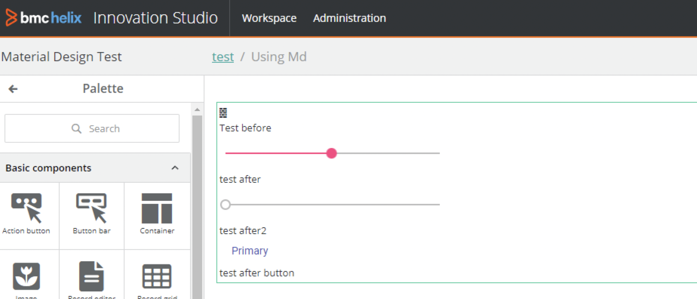

<h1 style="text-align:center">Using Google Material</h1>

## Table Of Contents:
* [What is Google Material?](#google-material)
* [Difference with other NPM libraries](#difference)
* [Using Google Material Components](#using-google-material)


> :memo:  
> We recommend using the Adapt components instead of Google Material components as most components are available in Adapt; for example a progress bar, fields, sliders etc...  
> The steps provided below are here as an integration example.  

<a name="google-material"></a>
## What is the Google Material?
Google Material is a component library provided by Google, for example sliders, etc...  


<a name="difference"></a>
## Difference with other NPM libraries
Some installation steps are a bit different from the ones usually provided for "standard" NPM libraries, for example one to generate the [qr-code-generator](./JAVASCRIPT_VIEW_COMPONENTS.MD#qr-code-generator).  

> **:memo:**  
> Be sure to add them at the library level, for example:
> ```bash
> cd src/main/webapp/libs/com-example-test210500
> npm install @angular/material --save

The problem is that Google will declare some Angular libraries in the package.json "devDependencies" section rather than the "peerDependencies" (animations, cdk, common, core, forms, platform-browser, etc...). Those are already defined in the main "package.json" and so should be put in the "peerDependencies" section
```json
"devDependencies":{
    "@angular/animations":"^10.2.4",
    "@angular/cdk":"^10.2.7",
    "@angular/common":"^10.2.4",
    "@angular/core":"^10.2.4",
    "@angular/forms":"^10.2.4",
    "@angular/platform-browser":"^10.2.4",
    "rxjs":"^6.6.3",
    "zone.js":"^0.10.3"
}
```
We need to move some of those angular dependencies to the "peerDependencies" section and just leave the one that is not declared in our main package.json in the "dependencies" (so here @angular/material), such as:
```json
  "peerDependencies": {
    "@angular/common": "^10.2.4",
    "@angular/core": "^10.2.4",
    "@angular/animations": "^10.2.4",
    "@angular/cdk": "^10.2.7",
    "@angular/forms": "^10.2.4",
    "@angular/platform-browser": "^10.2.4",
    "rxjs": "^6.6.3",
    "zone.js": "^0.10.3"
  },
  "dependencies": {
    "@angular/material": "^10.2.7",
    "tslib": "^2.0.0"
  }
```

The other main difference is that a css theme needs to be provided as by default none is. If no css theme is specified the components will not be displayed properly.  
This can be done importing a Google material theme in the library main scss file, for example here "/bundle/src/main/webapp/libs/com-example-test210500/src/lib/styles/com-example-test210500.scss":
```scss
@import '~@angular/material/prebuilt-themes/indigo-pink.css';
```

<a name="using-google-material"></a>
## Using Google Material Components
Once the NPM library is installed and the css theme specified you can use the Google Material components as any other components, for example here in a View Component module importing the slider (MatSliderModule) and button (MatButtonModule):
```ts
import { NgModule } from '@angular/core';
import { CommonModule } from "@angular/common";
import { FormsModule } from '@angular/forms';
import { UsingMdDesignComponent } from './using-md-design.component';
import { MatSliderModule } from '@angular/material/slider';
import { MatButtonModule } from "@angular/material/button";

@NgModule({
  imports: [CommonModule, FormsModule, MatSliderModule, MatButtonModule],
  declarations: [UsingMdDesignComponent],
  entryComponents: [UsingMdDesignComponent]
})
export class UsingMdDesignModule {
}
```

And in the view component html file:
```html
<span class="d-icon-wall"></span> <br>
Test before <br>
<mat-slider min="1" max="100" step="1" value="50"></mat-slider>
<br>
test after <br>
<mat-slider aria-label="unit(s)"></mat-slider>
<br>
test after2 <br>
<button mat-button color="primary">Primary</button>
<br>
test after button <br>
```
The view component scss file overrides the slider width:
```scss
mat-slider {
  width: 300px;
}
```

Which gives if we use the slider and button in a view component design time:
