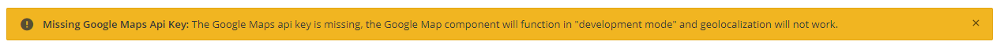
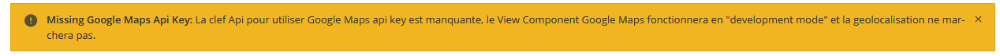
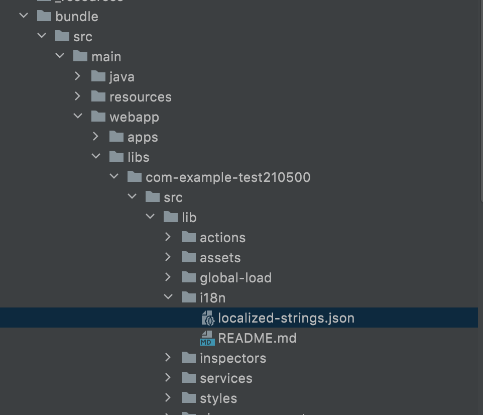
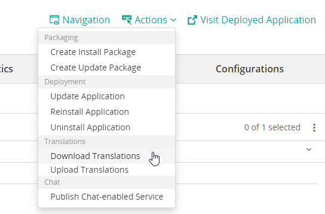

<h1 style="text-align:center">Localization</h1>

## Table Of Contents:
* [Introduction](#introduction)
* [Important note](#important)
* [How to leverage localization in your Angular code?](#angular)  
* [How to leverage localization in your Java code?](#java)  
* [How to localize your application?](#localize)  


<a name="introduction"></a>
## Introduction
> :memo:  
> Please refer to the [BMC documentation](https://docs.bmc.com/docs/helixplatform/localizing-a-digital-service-application-851871419.html?src=search) for more information.
  
It is already possible to localize [codeless objects and strings](https://docs.bmc.com/docs/helixplatform/localizing-a-digital-service-application-851871419.html#LocalizingaDigitalServiceapplication-TolocalizeOOTBviewcomponentdefinitions) used in View Designer or even in some [fields](https://docs.bmc.com/docs/helixplatform/localizing-field-values-851871240.html). This allows you to provide an interface in your end-user locale.  

It is also possible to localize the strings used in your Javascript or Java code, for example the error messages or labels.  
For example in the [google-maps-component](../_details/JAVASCRIPT_VIEW_COMPONENTS.MD#google-maps-component) View Component one warning message is actually localized:  
  
Once localized in French:



<a name="important"></a>
## Important note
A modification is required in order for the localized strings to be exported properly to the server.  
Open the file "/package/pom.xml" and change this entry:
```xml
<clientStringsFile>${project.basedir}/../bundle/src/main/webapp/resources/i18n/localized-strings.json</clientStringsFile>
```
By:
```xml
<clientStringsFile>${project.basedir}/../bundle/src/main/webapp/dist/apps/shell/assets/i18n/localized-strings.json</clientStringsFile>
```
  
Open the file "/bundle/src/main/webapp/angular.json" and be sure that this entry is in the "assets" object (of course change the "the-library-name" by the correct name)
```json
            "assets": [
              // ...
              {
                "glob": "**/*",
                "input": "libs/<the-library-name>/src/lib/i18n/",
                "output": "assets/i18n/"
              }
            ]
```

For example for this application which has the library "com-example-test210500" we would have:  
```json
            "assets": [
              // ...
              {
                "glob": "**/*",
                "input": "libs/com-example-test210500/src/lib/i18n/",
                "output": "assets/i18n/"
              }
            ]
```
  
This will ensure that the file "localized-strings.json" will be copied correctly in the dist folder to be picked up by the pom.xml file.

> :memo:



<a name="angular"></a>
## How to leverage localization in your Angular code?
The [google-maps-component](../_details/JAVASCRIPT_VIEW_COMPONENTS.MD#google-maps-component) View Component leverages a localized string for the warning message. For this there are several steps.
  
Add the string in the file "src/main/webapp/libs/com-example-test210500/src/lib/i18n/localized-strings.json" under the key/message format:
```json
{
"com.example.test210500.view-components.google-maps-component.missing-api-key": "The Google Maps api key is missing, the Google Map component will function in \"development mode\" and geolocalization will not work."
}
```
In your Angular code you will need to leverage the **TranslateService** service **instant** method with they key:
```typescript
    import { TranslateService } from '@ngx-translate/core';
    // ...
    constructorprivate translateService: TranslateService) {
        // ...
    }
    // ...
    alertConfiguration: Alert = {
        variant: 'warning',
        title: 'Missing Google Maps Api Key: ',
        content: this.translateService.instant('com.example.test210500.view-components.google-maps-component.missing-api-key')
    };
```
You can also use the **TranslateService** directly in your html code using its pipe, for example:
```html
<span>{{"com.example.test210500.view-components.google-maps-component.missing-api-key" | translate}}</span>
```

> :memo:  
> Please see the [How to localize your application?](#localize) chapter to see how to localize this string in different locales.


<a name="java"></a>
## How to leverage localization in your Java code?
Localization in the Java code is mostly used for exception handling. A very good example is provided in the [tutorial](https://docs.bmc.com/docs/helixplatform/logging-and-error-handling-for-the-mealorderservice-851869878.html).
Based on the documentation above a GET rest api has been created that throw a "FruitException" exception. You can see the [FruitRest](../_details/JAVA.MD#FruitRest) example for more details.  
As described above, the message Ids are stored in the file "src/main/resources/localized-strings.properties" under the format "key=message":
```text
600100=Is Tomato a Fruit?
600101=Is Apple a fruit?
```

> :warning:  
> In order for the server to use the strings you will need to run this command once to upload the strings to the server, please see the [How to localize your application?](#localize) chapter:
> ```bash
> mvn clean install -Plocalization
> ````
> else the server would not find the error message and return:
> ```json
> [
>   {
>     "messageType": "ERROR",
>     "messageNumber": 600100,
>     "messageText": "Message not found, [bundleId = com.example.test210500, messageNum = 600100]",
>     "appendedText": "TOMATO"
>   },
>   {
>     "messageType": "ERROR",
>     "messageNumber": 303,
>     "messageText": "Record Definition does not exist on server.",
>     "appendedText": "TOMATO"
>   }
> ]
> ```

> :memo:  
> Please see the [How to localize your application?](#localize) chapter to see how to localize this string in different locales.


<a name="localize"></a>
## How to localize your application?
### Export "local" strings to the server
Type this command to export the strings defined in the files "src/main/webapp/libs/com-example-test210500/src/lib/i18n/localized-strings.json" and "src/main/resources/localized-strings.properties" to the server:
```bash
mvn clean install -Plocalization
```

> :memo:    
This command needs to be executed only when you add new strings in your Java or Javascript code.

### Download the English strings to localize them
Once the strings are uploaded you need to download all the strings to localize (the one you just exported, and the ones used in codeless objects) using the Bundle "Actions -> Download Translations" menu.  
This will export the strings in English:


> :memo:  
> Since the localized strings might be cached by the web browser, it is recommended to perform a "force refresh" of the web browser page before downloading the Translations (Control + F5 on PC, Command + R on Mac). 
  
The strings are in key / value pair, for example:
```json
{
  "600100": "Is Tomato a Fruit?",
  "4fad4300-6056-4fda-a410-48b2f14ac894": "Hide Star Rating",
  "com.example.test210500.view-components.google-maps-component.missing-api-key": "The Google Maps api key is missing, the Google Map component will function in \"development mode\" and geolocalization will not work."
}
```

Translate them in a new locale in a text editor for example here in French.  
Each new locale must be an object attribute. For each "key" you can provide a localized version. For example here:
```json
{
  "fr": {
    "600100": "La tomate est'elle un fruit?",
    "4fad4300-6056-4fda-a410-48b2f14ac894": "Cacher Star Rating",
    "com.example.test210500.view-components.google-maps-component.missing-api-key": "La clef Api pour utiliser Google Maps api key est manquante, le View Component Google Maps fonctionnera en \"development mode\" et la geolocalisation ne marchera pas."
  }
}
```
> :warning:  
> You do not need to provide the English locale again.

> :warning:  
> All resource are exported, even the icon names, you do not want to localize those values. Only localize what is needed.

### Upload the localized strings to the server
Once the strings are translated, upload them on the server using the bundle "Actions -> Upload Translations" menu:


Once the strings are uploaded to the server, you need to import them "locally" to add them to your application bundle before providing it to your customer. You can use the usual maven command:
```bash
mvn clean install -Pexport
```

The strings should then be available in the file "src/main/definitions/db/localized-strings.def".  
For example here for the string with the key "com.example.test210500.view-components.google-maps-component.missing-api-key" you can see the English and French version:
```text
begin localizable string
   name           : LSGAAC47FSUC1AQT777FQT777FPCXX
   timestamp      : 1621645241
   owner          : Demo
   last-changed   : Demo
   bundle         : com.example.test210500
   stringId       : com.example.test210500.view-components.google-maps-component.missing-api-key
   owner-objects  : 40\0
   object-prop    : 3\60093\0\90016\4\1\1\90015\2\4\
   locale         : fr
   string-text    : La clef Api pour utiliser Google Maps api key est manquante, le View Component Google Maps fonctionnera en "development mode" et la geolocalisation ne ma&
   string-text    : rchera pas.
end
begin localizable string
   name           : LSGAAC47FY79WAQS0BWHQS0BWH0X0T
   timestamp      : 1620262784
   owner          : Demo
   last-changed   : ARSERVER
   bundle         : com.example.test210500
   stringId       : com.example.test210500.view-components.google-maps-component.missing-api-key
   owner-objects  : 40\0
   object-prop    : 3\60093\0\90016\4\1\1\90015\2\4\
   locale         : default
   string-text    : The Google Maps api key is missing, the Google Map component will function in "development mode" and geolocalization will not work.
end
```
For a Java string:
```text
begin localizable string
   name           : LSGAAC47FSUC1AQT7LAXQT7LAXP77A
   timestamp      : 1621649841
   owner          : Demo
   last-changed   : Demo
   bundle         : com.example.test210500
   stringId       : 600100
   owner-objects  : 35\0
   object-prop    : 3\60093\0\90016\4\1\1\90015\2\4\
   locale         : default
   string-text    : Is Tomato a Fruit?
end
```
