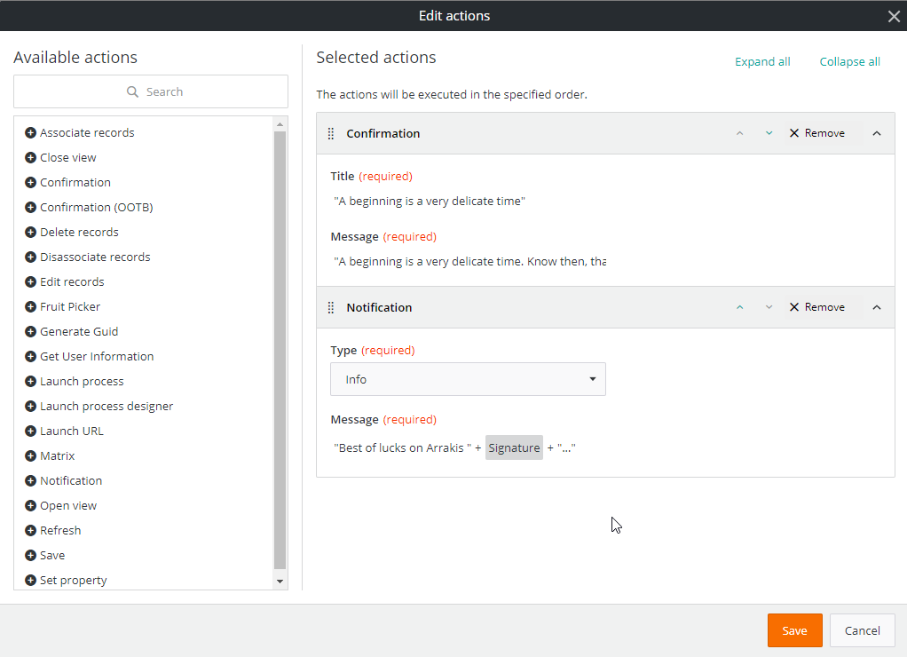
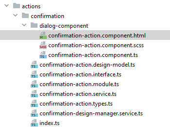

<h1 style="text-align:center">Creating an Action</h1>

## Table Of Contents:
* [Introduction](#introduction)
* [Action architecture](#architecture)
  * [Action definition](#action-definition)
  * [File structure](#file-structure)
* [How to create an Action?](#create-action)
* [Confirmation code walk-through](#confirmation)
  * [Design Time](./DESIGN_TIME.MD)
  * [Runtime](./RUNTIME.MD)


<a name="introduction"></a>
## Introduction
> :memo:  
> The flow from this tutorial is coming from the [BMC Documentation](https://docs.bmc.com/docs/helixplatform/creating-custom-actions-851871315.html?src=search).

Custom action is a service (Angular service) that allows you to map an action to the UI elements in the View designer. You can create a custom action (JavaScript action) that can be mapped to an action button or a cell in a record grid in a view definition.
  
For example, if you want to display a confirmation window (that displays a modal confirmation window) on the click of an action button, you can create an action for the confirmation modal window (via code), and then map the action to an action button in the View designer.

In this example we will detail the action [confirmation](../../_details/JAVASCRIPT_ACTIONS.MD#confirmation).

  
> :warning:  
> You must ensure that you follow naming conventions (namespacing) for all angular object names and all HTML filenames in shared code.  
> See [coding and naming guidelines](../CODING_NAMING_GUIDELINES.MD).


<a name="architecture"></a>
## Action architecture
<a name="action-definition"></a>
### Action definition
A Javascript Action that can be triggered by a button action for example usually:
* Allows input parameter(s),
* Executes some code,
  * Here we display a confirmation modal window, and we wait for user confirmation,
* Returns output parameter(s) or prevent next actions to be executed,

It can be part of an action "chain" where actions are executed one after another and can consume a previous action output parameter(s).  
For example here the "Notification" action consumes the "Confirmation" "Signature" output parameter.  
This chaining is usually synchronous in nature, we expect the previous action to finish before executing the next one.  
A previous action can also "stop" the chain, here if the user does not "confirm" his/her choice we do not expect the next action "Notification" to execute:



<a name="file-structure"></a>
### File structure
An action has usually this file structure:
* .module: Action registration,
  * Contains its name and reference to the other necessary objects or services (name, definition, execution, validation),
  * The action module is imported in the main library module,
* .design-model: Declares the Action Input and Output parameters,
  * Will be executed at **design time**, in View Designer,
* .design-manager.service: Contains the Action Input Parameters validation logic,
  * Will be executed at **design time**, in View Designer,
* .service: Contains the code that will be executed during runtime when the user clicks on the button,
  * Will be executed at **runtime**,
* .interface: Contains the design and runtime interfaces,
  * Usually the input parameters interfaces that will be used in the .design-model and service,

> :memo:  
> In the Confirmation example we use other files:
> .types: Contains some constants,
> /dialog-component: Contains the Angular Component that will be used in the modal window,  




<a name="create-action"></a>
## How to create an Action?:
You can use our schematics to generate a skeleton code.
> :memo:  
> A schematic is a templating system which will automatically create the necessary files, name them appropriately and automatically import the necessary modules in the main library.  

Go in the webapp folder and type:
```bash
yarn run ng g rx-view-action "<action-name>"
```
For example:
```bash
yarn run ng g rx-view-action "confirmation"
```

> :memo:  
> To do a "dry run", which means trying to create the action without actually creating or updating the files, add "--dry-run" at the end of the command line, for example:
> ```bash
> yarn run ng g rx-view-action "confirmation" --dry-run
> ```

> :memo:  
> It is highly recommended leveraging this capability rather than creating the file structure manually.  


<a name="confirmation"></a>
## Confirmation code walk-through
* Click [here](./DESIGN_TIME.MD) for the Design Time chapter,
* Click [here](./RUNTIME.MD) for the Runtime chapter,
