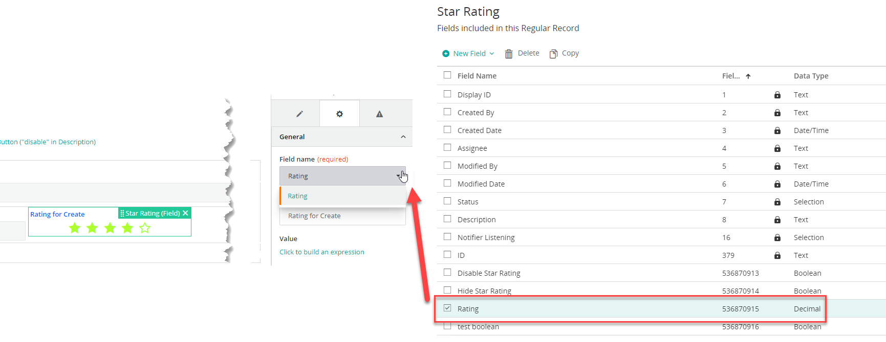
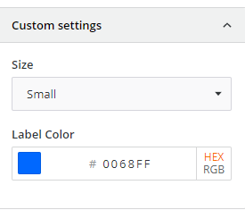
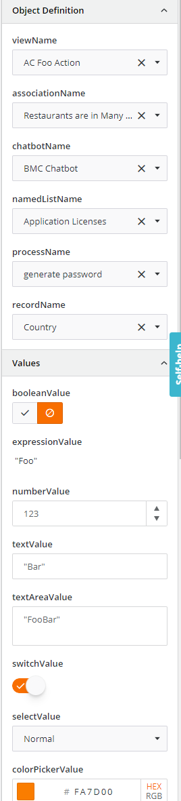

<h1 style="text-align:center">Creating a Record Field View Component: Design Time (design.model)</h1>

## Table Of Contents:
* [Introduction](#introduction)
* [Record Field View Component difference with a Standalone View Component](#design-model-inheritance)
* [What is the design.model file?](#design-model)
* [Supported field types](#supported-field-types)
* [Setting the default or current values](#design-model-getInitialProperties)
* [Describing the Input Parameters](#design-model-updateInspectorConfig)
  * [Color picker and selection](#other-types)
* [Input parameters validation](#design-model-setValidationIssues)
* [Constructor](#design-model-constructor)

<a name="introduction"></a>
## Introduction
We are going to focus here on the design time aspect of the [star-rating-field](../../_details/JAVASCRIPT_RECORD_FIELD_VIEW_COMPONENTS.MD#star-rating-field) example and more specifically on the "design.model".  
In another chapter we will see the [design time Component](./DESIGN_TIME_COMPONENT.MD).  

> :warning:  
> The flow is very similar to the one defined in a [standalone view component](../_view-component/DESIGN_TIME_MODEL.MD) but there are some very important differences which will be highlighted below.


<a name="design-model-inheritance"></a>
## Record Field View Component difference with a Standalone View Component
The main difference is that as we saw in the [registration](./REGISTRATION.MD) most Input Parameters are inherited and do not need to be declared again as taken caren of by the parent Component.  
We are extending **BaseRecordEditorFieldDesign** in the case of a Record Field View Component and do not have to "worry" about Input Parameters belonging to a "base record field".  
As a reminder here are the Input Parameters already declared and taken care of:
```typescript
// Some properties are inherited from the base record editor field design defined in "IBaseRecordEditorFieldProperties":
label, model (value)
fieldId: string;
label: string;
disabled: string;
hidden: string;
value?: string;
styles?: string;
```

<a name="design-model"></a>
## What is the design.model file?
The [design.model](../../bundle/src/main/webapp/libs/com-example-test210500/src/lib/view-components/star-rating-field/design/star-rating-field-design.model.ts) is an Angular service that will be executed at design time which declares the Action Input and Output parameters and the Input parameters validation,  
> :memo:  
> It is referred in the [registration.module](./REGISTRATION.MD) under the **designComponentModel** property,

It is constituted from several "blocks":
* Setting the default Input parameter values, or those already saved in the **getInitialProperties()** method,
* Updating the Input parameter list and their characteristics in the **getInspectorConfig()** method,
* Implement the custom Input parameters validation in the **validate()** method,


<a name="supported-field-types"></a>
## Supported field types
As we saw earlier a Record Field View Component will read or store its value from / to a Record Definition field.  
Some field types are more suited than others to store those values. For example for the "star-rating-field" we want to store the number of stars selected by an End User, so a 
"number".  
We will then define in the **fieldResourceTypes** the different field types we allow the Business Analyst to pick in, here "integer", "decimal" and "real":
```typescript
  // This is the list of record instance fields types that can be used for the Star Rating field.
  fieldResourceTypes = [RX_RECORD_DEFINITION.resourceTypes.integer, RX_RECORD_DEFINITION.resourceTypes.decimal, RX_RECORD_DEFINITION.resourceTypes.real];
```

In this example we can see in the "Field Name" dropdown that we filter out automatically the existing fields to only show those matching the allowed types:


> :memo:  
> "fieldResourceTypes" is an inherited property from **BaseRecordEditorFieldDesign**.


<a name="design-model-getInitialProperties"></a>
## Setting the default or current values
The **getInitialProperties()** is automatically called by the "parent" code and must return custom Input Parameters default or current values (so here "size" and "labelColor"):
* initialProperties: contains the current Input Parameter values set in the View Designer,
  In the returned object we:
  * Set their default values,
  * Get the inherited Input Parameters default and current values using the **BaseRecordEditorFieldDesign.getInitialProperties()** method,
  * Override the Custom Input Parameters if necessary with the current values (initialProperties) with the spread operator,
    * ```...initialProperties```
```typescript
  static getInitialProperties(initialProperties?: IStarRatingFieldDesignTimeParameters): IStarRatingFieldDesignTimeParameters {
  return {
    // Custom field properties default values.
    size: '',
    labelColor: '#000000',
    // Common values shared across all fields.
    ...BaseRecordEditorFieldDesign.getInitialProperties(),
    // Values already saved in View Designer for this field (if any).
    ...initialProperties
  }
}
```
> :warning:  
> All the values are stored as strings in the View definition. If some inspectors expect a different type, like a **BooleanFormControlComponent** would expect a boolean for example, we need to cast them into the right type.  

> :memo:
> All Input parameters should be declared in the [.interface](../../bundle/src/main/webapp/libs/com-example-test210500/src/lib/view-components/star-rating-field/design/star-rating-field.interface.ts) to ensure a strong Typing. Do not forget that the interface for design time needs to extend **IBaseRecordEditorFieldProperties** and should only contain the custom Input Parameters (not the inherited ones):
> ```typescript
> export interface IStarRatingFieldDesignTimeParameters extends IBaseRecordEditorFieldProperties {
> size?: string;
> labelColor?: string;
> }
> ```

<br>  

<a name="design-model-updateInspectorConfig"></a>
## Describing the Input Parameters
Another difference with a Standalone View Component is how the custom Input Parameters are added to the inherited ones.  
The method **getInspectorConfig()** is automatically called, and we can "pipe" it to add our own custom Input Parameters, here in the local method **this.editInspectorConfig()**:
```typescript
  getInspectorConfig(): Observable<IViewDesignerInspectorConfig> {
    return super.getInspectorConfig()
      .pipe(
        map(
          (inspectorConfig: IViewDesignerInspectorConfig) => this.editInspectorConfig(inspectorConfig)
        )
      );
  };
```

In this local method we declare the two custom Input Parameters "size" and "labelColor" and we add those to a new control group (section) "Custom Settings" using ```inspectorConfig.inspectorSectionConfigs.push(customConfiguration);```.  
The method needs to return the full Inspector Configuration containing the inherited Input Parameters and the new ones:
```typescript
  private editInspectorConfig(inspectorConfig: IViewDesignerInspectorConfig) : IViewDesignerInspectorConfig {
  // We need to append the field specific properties to the inspector configuration. By default all parameters are under the "General" group.
  // We need to add more controls into the controls array or add to the existing Control.
  // Here is an example with the common property "fieldId":
  // {
  //   "inspectorSectionConfigs": [
  //   {
  //     "label": "General",
  //     "controls": [
  //       {
  //         "name": "fieldId",
  //         "options": {
  //           "label": "Field name",
  //           "required": true,
  //           "options": [
  //             {
  //               "name": "Rating",
  //               "id": "536870915"
  //             }
  //           ]
  //         }
  //       }
  //     ]
  //   }
  // ]
  // }

  // In this example we will add a new Control group 'Custom settings' in the inspectorSectionConfigs array.
  const customConfiguration: IViewDesignerInspectorSectionConfig = {
    label: 'Custom settings',
    controls: [
      {
        name: 'size',
        component: SelectFormControlComponent,
        options: {
          label: 'Size',
          // the list of options must be an array of id and name, such as:
          // [{id:'', name:''},...]
          // Both id and name must be Strings (ISelectOption[]).
          options: values(STAR_RATING_FIELD_SIZE_OPTIONS.sizeOptions),
          sortAlphabetically: false
        } as ISelectFormControlOptions
      },
      {
        name: 'labelColor',
        component: ColorPickerFormControlComponent,
        options: {
          label: 'Label Color'
        }
      }
    ]
  };

  inspectorConfig.inspectorSectionConfigs.push(customConfiguration);

  // If we wanted to add the custom properties in the "General" control we would do something like:
  // The first entry should be the "General" control group.
  // inspectorConfig.inspectorSectionConfigs[0].controls = inspectorConfig.inspectorSectionConfigs[0].controls.concat(customConfiguration.controls);

  return inspectorConfig;
}
```

<details> 
<summary>Custom Settings screenshot</summary>  


</details>

As you can see there are some different "types", defined using the "component" attribute that we call internally "form control components" or "inspectors".  
The "component" attribute will define how the Input parameter will be set in the View designer. You can leverage the OOTB inspectors or create your own as described in this [document](../../_details/JAVASCRIPT_INSPECTORS.MD).  
A nearly full list of "inspectors" is inside the example [test-debug-component](../../bundle/src/main/webapp/libs/com-example-test210500/src/lib/view-components/test-debug-component/):
<details> 
<summary>Inspectors screenshot</summary>  


</details>

---
<a name="other-types"></a>
### Color picker and selection
Some types are a bit more complex, for example picking a color from a color picker or selecting a value from a dropdown list  
Those inspectors are provided OOTB.   
Some parameters leverage those more "complex" types, like:
* labelColor: color picked using a color picker component **ColorPickerFormControlComponent**,
* size: list of possible values displayed in a dropdown list using the component **SelectFormControlComponent**,

For the "labelColor" input parameter:
* **"name"** should match the input parameter name, this is not the "label" displayed in the view designer,
* "Component" needs to be set to "ColorPickerFormControlComponent",
* "options" contains the field properties,
  * label: Label displayed in the View Designer,
```typescript
{
  name: 'labelColor',
  component: ColorPickerFormControlComponent,
  options: {
    label: 'Label Color'
  }
}
```

For the "size" input parameter:
* **"name"** should match the input parameter name, this is not the "label" displayed in the view designer,
* "Component" needs to be set to "SelectFormControlComponent",
* "options" contains the field properties and typed as "ISelectFormControlOptions",
  * label: Label displayed in the View Designer,
  * options: Values displayed in the dropdown,
    * The list of options must be an array of id and name, such as:
    * ```[{id:'', name:''},...]```
    * Both id and name must be Strings (ISelectOption[]). 
  * sortAlphabetically: Are the labels sorted or not,
```typescript
{
  name: 'size',
  component: SelectFormControlComponent,
  options: {
    label: 'Size',
    options: values(STAR_RATING_SIZE_OPTIONS.sizeOptions),
    sortAlphabetically: false
  } as ISelectFormControlOptions
}
```
> :memo:  
> The options are defined this way in the file [star-rating.types.ts](../../bundle/src/main/webapp/libs/com-example-test210500/src/lib/view-components/star-rating-field/star-rating-field.types.ts).  
> The lodash **values** utility will return an array of the object values:
> ```typescript
> export const STAR_RATING_SIZE_OPTIONS = {
>   sizeOptions: {
>     large: {
>       id: String(RxRatingSize.lg),
>       name: 'Large'
>     },
>     normal: {
>       id: String(RxRatingSize.md),
>       name: 'Normal'
>     },
>     small: {
>       id: String(RxRatingSize.sm),
>       name: 'Small'
>     },
>     extraSmall: {
>       id: String(RxRatingSize.xs),
>       name: 'Extra Small'
>     }
>   }
> }
> ```


<a name="design-model-setValidationIssues"></a>
## Input parameters validation
Another difference with a Standalone View Component is how the custom Input Parameters are added to the inherited ones.  
The **validate()** method is automatically called by the "parent" code, we can implement it and add our custom validation on the custom Input Parameters.    
The goal of this method is to return the existing validation issues with the ones from the custom Input Parameters, for this we "pipe" the parent **validate()** method and add our own validation error messages (here on the "labelColor" custom Input Parameter):  
```typescript
  validate(componentProperties: IStarRatingFieldDesignTimeParameters): Observable<IViewComponentDesignValidationIssue[]> {
    return super.validate(componentProperties).pipe(
      switchMap((validation: IViewComponentDesignValidationIssue[]) => {
        const validationIssues: IViewComponentDesignValidationIssue[] = validation || [];

        if (toUpper(componentProperties.labelColor) === '#FFFFFF') {
          validationIssues.push(this.sandbox.createWarning('Setting the Label Color to white could lead to an invisible label.', 'labelColor'));
        }

        return of(validationIssues);
      })
    );
  }
```

> :memo:  
> If there are error messages the Business Analyst will not be able to save the view.

<a name="design-model-constructor"></a>
## Constructor
The **constructor()** method simply call the parent constructor:
```typescript
  constructor(public injector: Injector, public sandbox: IViewComponentDesignSandbox<IStarRatingFieldDesignTimeParameters>) {
    super(injector, sandbox);
  }
```
