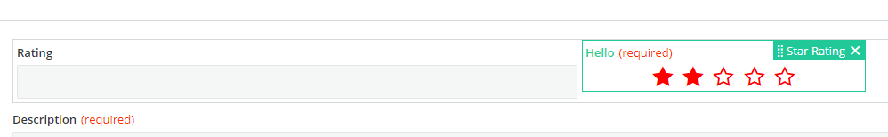

<h1 style="text-align:center">Creating a View Component: Design Time (design.component)</h1>

## Table Of Contents:
* [Introduction](#introduction)
* [".module": Registering the Angular Component](#module)
* [Design Time Component template (.html)](#component-template)
* [Design time Component logic (.ts)](#component-logic)
  * [Subscribing to the Input Parameters changes](#component-logic-subscription)
  * [Updating the default number of stars](#component-logic-update)

  
<a name="introduction"></a>
## Introduction
We are going to focus here on the design time aspect of the [star-rating](../../_details/JAVASCRIPT_VIEW_COMPONENTS.MD#star-rating) example and more specifically on the "design.component" which is the Angular Component displayed in the View Designer canvas:


We will also handle the ".module" responsible for its registration.  
The design time Component is a regular Angular Component. 


<a name="module"></a>
## ".module": Registering the Angular Component
There is usually nothing to do or modify in this file which is automatically generated by the schematics.  
The only modification to these files are usually third party Angular modules that the Angular Component is leveraging.  
In the "star-rating" example we leverage the Adapt **adapt-rx-rating** component, so we need to import its module **AdaptRxRatingModule**.  
The **FormsModule** module is necessary as we are using "ngModel" in the [component template](#component-template).  
The imports are usually automatically performed by your IDE (like Webstorm):
```typescript
import { NgModule } from '@angular/core';
import { CommonModule } from '@angular/common';
import { FormsModule } from '@angular/forms';
import { StarRatingDesignComponent } from './star-rating-design.component';
import { AdaptRxRatingModule } from '@bmc-ux/adapt-angular';

@NgModule({
  imports: [CommonModule, FormsModule, AdaptRxRatingModule],
  declarations: [StarRatingDesignComponent],
  entryComponents: [StarRatingDesignComponent]
})
export class StarRatingDesignModule {
}
```

> :memo:  
> The design time module **StarRatingDesignModule** is automatically imported in the [registration.module](./REGISTRATION.MD) if you used the BMC Schematics.


<a name="component-template"></a>
## Design Time Component template (.html)
The Angular Component template is a regular [html](../../bundle/src/main/webapp/libs/com-example-test210500/src/lib/view-components/star-rating/design/star-rating-design.component.html) html file.  
Here it leverages the Adapt **adapt-rx-rating** Component. This Component requires the module **AdaptRxRatingModule** to be imported in the design time component module as seen in the [previous chapter](#module).  
The Adapt Component has multiple attributes that will be passed by the design time component [typescript file](../../bundle/src/main/webapp/libs/com-example-test210500/src/lib/view-components/star-rating/design/star-rating-design.component.ts).  
When the Business Analyst will choose a value clicking on one of the stars an event "onRateChange" will be emitted and handled by the method **onRateChange()**: 
```html
<adapt-rx-rating
  [size]="selectedSize"
  [style]="labelStyle"
  [classList]="starRatingParameters.cssStyles"
  [required]="starRatingParameters.isRequired"
  [readonly]="isReadonly"
  [label]="starRatingParameters.label"
  [(ngModel)]="starRatingParameters.defaultNumberOfStars"
  (onRateChange)="onRateChange($event)">
</adapt-rx-rating>
```


<a name="component-logic"></a>
## Design time Component logic (.ts)
The Angular Component logic is a regular Component [typescript](../../bundle/src/main/webapp/libs/com-example-test210500/src/lib/view-components/star-rating/design/star-rating-design.component.ts) file.  

<a name="component-logic-subscription"></a>
### Subscribing to the Input Parameters changes
View Designer will automatically pass as **Input()** the "model" object from the [model.design](./DESIGN_TIME_MODEL.MD#design-model):
```typescript
  @Input()
  model: StarRatingDesignModel;
```

As we saw in the [model.design](./DESIGN_TIME_MODEL.MD#design-model-component-preparation) we had to pass the "sandbox" object in the variable "modelSandbox".  
We subscribe to the **this.model.modelSandbox.componentProperties$** Observable to subscribe to the Input Parameters to display the number of stars, the label, the label's color etc...:
* starRatingParameters: the Input Parameters,
* selectedSize: size of the Adapt **adapt-rx-rating** Component,
* labelStyle: label's custom color,
We force the Angular change detection to ensure the display of the Adapt **adapt-rx-rating** is matching the different properties.
```typescript
  ngOnInit(): void {
    combineLatest([this.model.modelSandbox.componentProperties$])
      .subscribe(([componentProperties]) => {
        this.starRatingParameters = componentProperties as IStarRatingParameters;
        // Adapt expects an enum value for the size (RxRatingSize), though the options return a String
        // so we need to cast it into a Number.
        this.selectedSize = this.starRatingParameters.size ? Number(this.starRatingParameters.size) : this.selectedSize;

        if (this.starRatingParameters.labelColor) {
          this.labelStyle = {
            color: this.starRatingParameters.labelColor
          };
        }

        // We need to trigger the change detection because rx-rating component does not update.
        this.changeDetectorRef.detectChanges();
      });
  }
```


<a name="component-logic-update"></a>
### Updating the default number of stars
When the Business Analyst clicks on a star, we saw [previously](#component-template) that Adapt will fire an event "onRateChange" and call the method **onRateChange()**.  
Adapt pass the number of stars selected, we catch it and update the Input Parameter "defaultNumberOfStars" accordingly calling the method **this.model.modelSandbox.updateComponentProperties()** passing back all Input Parameters:
```typescript
  onRateChange(value: number) {
    this.starRatingParameters = {
      ...this.starRatingParameters,
      defaultNumberOfStars: value
    };

    this.model.modelSandbox.updateComponentProperties(this.starRatingParameters);
  }
```
