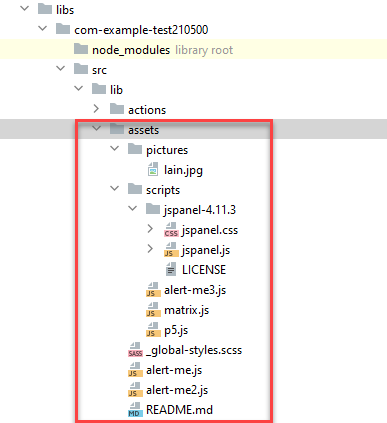
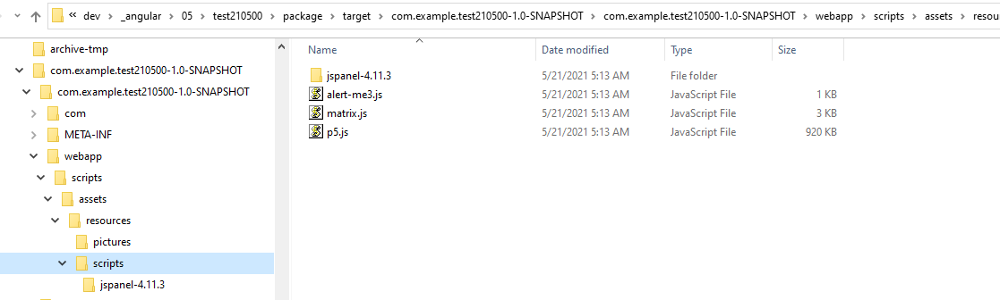
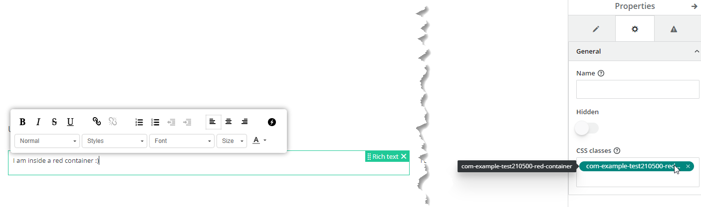

<h1 style="text-align:center">Assets</h1>

## Table Of Contents:
* [What is the /assets/ folder?](#assets)
* [How to make sure those resources are copied inside the bundle?](#best-practices)  
* [How to access the /assets/ resources during debug and production modes?](#access)  
* [Picture example](#example-picture)  
* [Pure Javascript script and css](#example-script-css)  
* [Global css class](#global-css)  
  
  
<a name="assets"></a>
## What is the /assets/ folder?
Sometimes it is necessary to refer to objects that are not Angular Components, Actions or Services, for example fonts, pure javascript libraries or stylesheets.  
It is possible to refer / load pure javascript scripts or stylesheets using the custom service [DynamicScriptLoaderServiceService](./JAVASCRIPT_SERVICES.MD#DynamicScriptLoaderServiceService) at runtime, but sometimes it is not possible, or it might be better to host specific versions.  
In this case it is possible to put those resources in the library /assets/ folder:  
```bash
src/main/webapp/libs/<libraryName>/src/lib/assets
```
For example:
```bash
src/main/webapp/libs/com-example-test210500/src/lib/assets
```
  
In this example we have some pure javascript scripts (.js), stylesheets (.css or .scss) and a picture:


The goal is to copy those objects in the application bundle, here once the bundle is uncompressed:


You can then refer those objects in your code at runtime as they will be available, some examples will be available below.


<a name="best-practices"></a>
## How to make sure those resources are copied inside the bundle?
For this you need to ensure that the content of the /assets/ folder is copied during the build. This is done in the file "angular.json" where you need to declare each folder you want to copy.  
In our example we have different folders and file structures:
```bash
/assets/pictures/lain.jpg
/assets/scripts/alert-me3.js
/assets/scripts/matrix.js
/assets/scripts/p5.js
/assets/scripts/jspanel-4.11.3/jspanel.css
/assets/scripts/jspanel-4.11.3/jspanel.js
```

In the [angular.json](../bundle/src/main/webapp/angular.json) file we can declare each folder or file in the "assets" section.  You will need to replace the `library-name` and `bundle-artifact-id` by your values (please see the warning below):
```json
"assets": [
  {
    "glob": "**/*",
    "input": "libs/<library-name>/src/lib/assets/<folder>/",
    "output": "assets/libs/<bundle-artifact-id>/resources/pictures/"
  }
]
```

> :warning:  
> It is very important in the `output` to refer the bundle `artifactId`, or the resources will not be copied properly in your application bundle.  
> The `artifactId` can be found in the `/bundle/pom.xml` file, for example here:
> ```xml
>     <groupId>com.example</groupId>
>     <artifactId>test210500</artifactId>
>     <version>1.0-SNAPSHOT</version>
>     <packaging>bundle</packaging>
> ```
> the artifactId would be ```test210500```.
> So in our case:
> ```json
> "assets": [
>   {
>     "glob": "**/*",
>     "input": "libs/com-example-test210500/src/lib/assets/<folder>/",
>     "output": "assets/libs/test210500/resources/pictures/"
>   }
> ]
> ```

In this example we are going to copy the "pictures" and "scripts" folder: 
```json
"assets": [
  {
    "glob": "**/*",
    "input": "libs/com-example-test210500/src/lib/assets/pictures/",
    "output": "assets/libs/test210500/resources/pictures/"
  },
  {
    "glob": "**/*",
    "input": "libs/com-example-test210500/src/lib/assets/scripts/",
    "output": "assets/libs/test210500/resources/scripts/"
  }
]
```

> :warning:  
> Do NOT set a script in the "angular.json" `scripts` section as it would override your View Components, Actions and other objects.


<a name="global-css"></a>
## How to create "global" css styles that are loaded at the same time as your application?
Sometimes it is useful to have "global" css classes available, for to use for example to style a **Container** object in View Designer.  
One solution is to add those classes in your library main scss file:
```bash
src/main/webapp/libs/c<library-name>/src/lib/styles/<library-name>.scss
```
For example [here](../bundle/src/main/webapp/libs/com-example-test210500/src/lib/styles/com-example-test210500.scss):
```bash
src/main/webapp/libs/com-example-test210500/src/lib/styles/com-example-test210500.scss
```

```scss
// It is used in the star-rating view component.
.com-example-test210500-star-rating-green-star {
  // We override the Adapt default color for the star color.
  .a-rating__item {
    color: greenyellow;
  }
}
```
This file will automatically be loaded when the application loads.

Another solution is to put a .scss file containing those classes in the /assets/ folder and declare it in the [angular.json](../bundle/src/main/webapp/angular.json) in the `styles` section.  
For example, we want to make sure this file content is loaded at application startup:
```bash
/assets/_global-styles.scss
```
We would need to declare it in the "angular.json" file in the "styles" section. During build all the files declared here will be minified:
```json
"styles": [
  {
    "input": "libs/<library-name>/src/lib/styles/<library-name>.scss",
    "bundleName": "<library-name>"
  },
  {
    "input": "libs/<library-name>/src/lib/assets/_global-styles.scss",
    "bundleName": "<library-name>"
  }
]
```

In our case:
```json
"styles": [
  {
    "input": "libs/com-example-test210500/src/lib/styles/com-example-test210500.scss",
    "bundleName": "com-example-test210500"
  },
  {
    "input": "libs/com-example-test210500/src/lib/assets/_global-styles.scss",
    "bundleName": "com-example-test210500"
  }
]
```

> :warning:  
> Do NOT remove the entry of the main library scss file (here "com-example-test210500.scss"), add a new entry.  
> The "bundleName" needs to be identical as the main .scss file value.

> :warning:  
> To avoid collision with existing classes be sure to respect the [coding and naming guidelines](../_guides/CODING_NAMING_GUIDELINES.MD).


<a name="access"></a>
## How to access the /assets/ resources during debug and production modes?
When testing your application or library using the [debug mode](../_guides/DEBUG-LOGGING.MD) (`npm start --apihost=192.168.159.135` for example) the path to access the scripts / resources in the assets' folder is different from production:

> **:memo:**  
> When serving the files locally the path to external resources (javascript / pictures / fonts...) will not be the same.  
> Some examples:  
> Javascript in debug mode:  
> http://localhost:4200/helix/assets/libs/test210500/resources/scripts/alert-me.js  
> Javascript in production mode:  
> http://192.168.159.135:8008/com.example.test210500/scripts/assets/resources/scripts/alert-me.js
>
> Picture in debug mode:  
> http://localhost:4200/helix/assets/libs/test210500/resources/pictures/lain.jpg  
> Picture in production mode:  
> http://192.168.159.135:8008/com.example.test210500/scripts/assets/resources/pictures/lain.jpg
>
> Those files are stored in:  
> src/main/webapp/libs/com-example-test210500/src/lib/assets/pictures/lain.jpg  
> src/main/webapp/libs/com-example-test210500/src/lib/assets/alert-me.js
  
To avoid this problem where you would have to maintain two different paths for development and production modes a custom service [GetAssetPathService](./JAVASCRIPT_SERVICES.MD#GetAssetPathService) has been created:
* The service will detect the current execution mode and will return the correct path to the "assets" folder,
* You can use this service to dynamically load the resource correctly, whether it is a picture, a script or a css file.
* You need to call the service passing as parameter the bundle name, such as:
```typescript
    this.rootAssetPath = this.getAssetPathService.getAssetRootPath('com.example.test210500');
```
Use it to complete the path to the different assets, for example:
```typescript
  promises.push(this.dynamicScriptLoaderServiceService.loadScriptByUrl(assetFolderPath + 'scripts/jspanel-4.11.3/jspanel.js', 'jspaneljs'));
  promises.push(this.dynamicScriptLoaderServiceService.loadStylesheetByUrl(assetFolderPath + 'scripts/jspanel-4.11.3/jspanel.css', 'jspanelcss'));
```
```html

```
  
You can look how it was implemented for example in:
* View Components: floating-panel, lmame,


---

<a name="example-picture"></a>
### Picture:
You can look how a picture is used in the [lmame](./JAVASCRIPT_VIEW_COMPONENTS.MD#lmame) View component:  
```html

```

> :memo:  
> Please see the [How to access the /assets/ resources during debug and production modes?](#access) section to see why we have a "assetRootPath" variable here since the path to the assets' folder is different at debug and production mode.


---

<a name="example-script-css"></a>
### Pure Javascript script and css:
You can look how those are loaded dynamically at runtime using the [DynamicScriptLoaderServiceService](./JAVASCRIPT_SERVICES.MD#DynamicScriptLoaderServiceService) custom service the [floating-panel](./JAVASCRIPT_VIEW_COMPONENTS.MD#floating-panel) View component:  
```typescript
const promises: any[] = [];
// ...
promises.push(this.dynamicScriptLoaderServiceService.loadScriptByUrl(assetFolderPath + 'scripts/jspanel-4.11.3/jspanel.js', 'jspaneljs'));
promises.push(this.dynamicScriptLoaderServiceService.loadStylesheetByUrl(assetFolderPath + 'scripts/jspanel-4.11.3/jspanel.css', 'jspanelcss'));

Promise.all(promises).then((result) => {
    // ...
});
```


---

<a name="global-css"></a>
### Global css class:
You can look how a global css class is used in the View "Test Lmame Label View Components and global css pure javascript assets". More details are in this [guide](../_guides/_css/CSS.MD).  
```scss
.com-example-test210500-red-container {
    border: 1px solid red;
}
```
In the View Designer you can then use this class in a **Container** Component for example:


> :warning:  
> To avoid collision with existing Css Classes be sure to respect the [coding and naming guidelines](../_guides/CODING_NAMING_GUIDELINES.MD).
