<h1 style="text-align:center">Javascript View Components</h1>

<a name="standalone-view-components"></a>
## Content Details:
View Components are elements that can be dragged & dropped in View Designer to create a UI experience.  
They usually have two different components, one for Design time (View Designer) and one for Runtime, when the view is displayed.  
A View component can have input and output parameters.  
Usually a View Component is created when there is a lack in the components provided OOTB by BMC, for example a Gradient, a Lifecycle bar, Charts etc...

> **:memo:**  
> It is advised to use the BMC OOTB components and if they do not fit the business need to leverage the BMC Adapt libraries to ensure a uniform UX experience.


### What is the difference between a Standalone View Component, and a Record Field View Component?:
* Standalone View Component:
  * It can be used anywhere in the View Designer and does not rely on a Record Editor to get data.
  * It can be a chart for example, or a lifecycle bar.
* [Record Field View Component](./JAVASCRIPT_RECORD_FIELD_VIEW_COMPONENTS.MD):
  * It is designed to be used within a Record Editor field and is mapped to one of its field (for example a Numeric field),
  * It inherits the default base attributes (value, disabled, hidden) which do not need to be declared as input parameters,
  * It can be a star rating field for example,

## How to create a Standalone View Component?:
You can use our schematics to generate a skeleton code.
Go in the webapp folder and type:
```bash
yarn run ng g rx-view-component "<view-component-name>"
```
For example:
```bash
yarn run ng g rx-view-component "gradient"
```

> :memo:  
> To do a "dry run", which means trying to create the action without actually creating or updating the files, add "--dry-run" at the end of the command line, for example:
> ```bash
> yarn run ng g rx-field-view-component "gradient" --dry-run
> ```

## View Component list
> :memo:  
> The information for the View Components listed here are not exhaustive and should not be taken as a tutorial.  
> Only some specific or interesting details are listed here. Please refer to each View Component code as the code is heavily commented.  
  
* [label](#label),
* [lmame](#lmame),
* [code-viewer](#code-viewer),
* [iframe](#iframe),
* [display-gradient](#display-gradient),
* [generate-password](#generate-password),
* [youtube-player](#youtube-player),
* [google-maps-component](#google-maps-component),
* [bar-chart-component](#bar-chart-component),
* [call-command](#call-command),
* [call-process](#call-process),
* [webcam](#webcam),
* [qr-code-scanner](#qr-code-scanner),
* [digital-signature](#digital-signature),
* [get-data-example](#get-data-example),
* [list-icons](#list-icons),
* [user-preferences](#user-preferences),
* [admin-preferences](#admin-preferences),
* [captcha](#captcha),
* [access-grid](#access-grid),
* [floating-panel](#floating-panel),
* [test-debug-component](#test-debug-component),
* [custom-datapagequery](#custom-datapagequery),
* [custom-grid](#custom-grid),
* [lifecycle](#lifecycle),
* [wizard](#wizard),
* [star-rating](#star-rating),
* [qr-code-generator](#qr-code-generator),
* [open-blade](#open-blade),


---


<a name="label"></a>
### label:
<details> 
<summary>label</summary>  

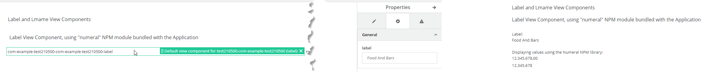
</details>

* Description:
  * This view component is very simple and is pretty much the output of the view component schematic,
  * It just displays a label in the UI, and some numeric values formatted using the Numeral NPM library,
  * Shows how to:
    * Design Time:
      * Simple implementation implementing the BMC **IViewDesignerComponentModel**,
      * Declare one Input parameter,
    * Runtime:
      * Consume a NPM module, here Numeral,
      * Subscribe to the configuration object (containing the Input Parameter),
* Complexity: :hot_pepper:
* Third party libraries:
  * NPM: numeral (https://www.npmjs.com/package/numeral),
* Used in the example:
  * View: Test Lmame Label View Components and global css pure javascript assets,

> **:warning:**  
> This example is very simple as the design model implements **IViewDesignerComponentModel** which requires less effort but has more limitation.  
> In more complex example the design model will extend and implement different objects, for example for the wizard view component. It is recommended to use this approach:    
> ```typescript
> extends ViewDesignerComponentModel implements IViewDesignerComponentModel<IWizardParameters>
> ```

> **:memo:**  
> Be sure that the NPM library(ies) used in the library are not already provided by the Platform (Lodash for example). If third party NPM libraries are necessary be sure to add them at the library level, for example:
> ```bash
> cd src/main/webapp/libs/com-example-test210500
> npm install numeral --save
> ```  
> That should add the library in the package.json dependencies section:
> ```json
>  "dependencies": {
>    "numeral": "2.0.6"
> }
>```  


---

<a name="lmame"></a>
### lmame:
  <details> 
  <summary>lmame</summary>  
  
  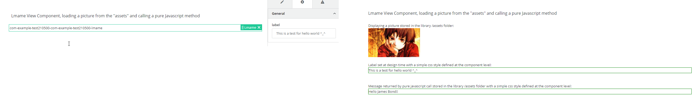
  </details>
  
  * Description:
    * This view component has one input parameter that will be displayed at runtime,
    * Shows how to:
      * Design Time:
        * Simple implementation implementing the BMC **IViewDesignerComponentModel**,
        * Declare one Input parameter,
      * Runtime:
        * Display a picture stored in the library /assets/ folder,
        * Load and invoke a pure javascript code stored in the library /assets/ folder,
        * Subscribe only to the Input Parameter change,
  * Complexity: :hot_pepper:
  * Used in the example:
    * View: Test Lmame Label View Components and global css pure javascript assets,
  * Credits:
    * Lain (Pioneer LDC),

> **:warning:**  
> This example is very simple as the design model implements **IViewComponentDesignSandbox** which requires less effort but has more limitation.  
> In more complex example the design model will extend and implement different objects, for example for the wizard view component. It is recommended to use this approach:    
> ```typescript
> extends ViewDesignerComponentModel implements IViewDesignerComponentModel<IWizardParameters>
> ```

> **:memo:**  
> The picture is in the lib assets folder.  
> bundle/src/main/webapp/libs/com-example-test210500/src/lib/assets/pictures/lain.jpg  
> At maven build it is put in a specific folder so can be available at runtime.  
> The glob in the angular.json file will make sure it is copied in a specific folder of the /dist/.  
> It is VERY important that you have the bundle maven project.artifactid in the path where the files will be copied:  
> ```
> /libs/<project.artifactid>/
> ```
> with artifactId being defined in the pom.xml:  
> ```xml
> <artifactId>test210500</artifactId>
> ```
> So for example:
> ```json
> {
>   "glob": "**/*",
>   "input": "libs/com-example-test210500/src/lib/assets/pictures/",
>   "output": "assets/libs/test210500/resources/pictures/"
> }
> ```
> The reason is at the copy resource step in maven this specific path will be copied to be embedded in the bundle jar file:  
> ```xml
> <configuration>
>   <outputDirectory>${basedir}/target/web-build/webapp/scripts/assets</outputDirectory>
>   <resources>
>   <resource>
>   <directory>${basedir}/src/main/webapp/dist/apps/shell/assets/libs/${project.artifactId}</directory>
>   </resource>
>   </resources>
> </configuration>
> ```
> At runtime the picture in this example will be available at different urls depending on the code running in development or production mode, hence the use of the **getAssetPathService** service to get the Assets path.  
> Please see the **getAssetPathService** [documentation](./JAVASCRIPT_SERVICES.MD#GetAssetPathService) for more details.

> **:memo:**  
>  In this example we want to trigger a javascript method from a pure javascript file which is in bundle/src/main/webapp/libs/com-example-test210500/src/lib/assets/scripts/lma3.js.  
>  As this is pure Javascript code and is not typed, Angular does not know this method, so we need to cheat and declare the method as "any".  
>  Please check "DynamicScriptLoaderServiceService" service [documentation](./JAVASCRIPT_SERVICES.MD#DynamicScriptLoaderServiceService) for more details on how to load a pure javascript library:
> ```typescript
>       declare var alertMe3: any;
>       // ...
>       this.dynamicScriptLoaderServiceService.load('com.example.test210500.lma3').then(data => {
>           console.log('Script loaded successfully!');
>           this.hello = alertMe3('James Bond!');
>       }).catch(error => console.log(error));
> ```

> **:memo:**  
> In this example we only subscribe to the input parameter change and only when its value has changed.  
> For this we leverage standard rxJs operators:  
> ```typescript
> this.config.pipe(
>   // Input parameter.
>   pluck('lmame'),
>   distinctUntilChanged(),
>   takeUntil(this.destroyed$)
> ).subscribe((lmame: string) => {
>   this.lmame = lmame;
> });
> ```

---

<a name="code-viewer"></a>
### code-viewer:
  <details> 
  <summary>code-viewer</summary>  

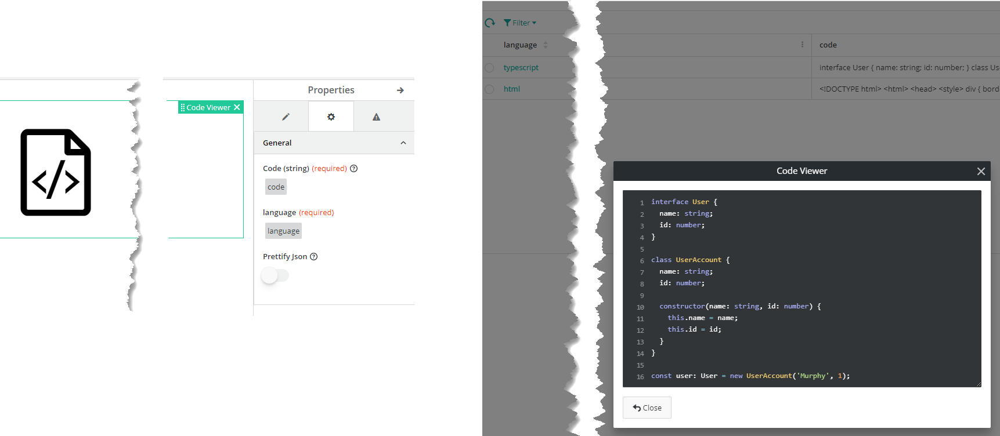
  </details>

* Description:
  * This view component shows code highlighted depending on its language,
  * Shows how to:
    * Design Time:
      * Standard implementation implementing the BMC **IViewDesignerComponentModel** and extending **ViewDesignerComponentModel** which is the recommended way,
      * Declare different Input parameters and showing how to use different Field types **ExpressionFormControlComponent** and **SwitchFormControlComponent**,
        * > **:memo:**  
          **ExpressionFormControlComponent** allows the Business Analyst to enter values or refer to other fields like view input parameters,  
          **SwitchFormControlComponent** allows the business analyst to use a switch to set a boolean value,
        * Cast boolean value in the **getInitialProperties()** method that sets the initial input parameter values,
      * Validate the input parameters,
    * Runtime:
      * Leverage the Adapt **Adapt Code Viewer** component,
      * Subscribe only to the Input Parameter changes when the configuration object is different using the rxJs operators and lodash isEqual operator:
        * ```typescript
            this.config.pipe(
                distinctUntilChanged(isEqual),
                takeUntil(this.destroyed$)
            ).subscribe((config: ICodeViewerParameters) => {
          ```
* Complexity: :hot_pepper:
* Used in the example:
  * View: "VC Code Viewer" launches the view "VC Code Viewer Modal", VC Accessing grid, VC HCaptcha,

> **:warning:**  
> When an input parameter is of type **ExpressionFormControlComponent** you are required to pass the dataDictionary and the operators:
> ```typescript
> {
>   name: 'language',
>   component: ExpressionFormControlComponent,
>   options: {
>     label: 'language',
>     dataDictionary$: this.expressionConfigurator.getDataDictionary(),
>     operators: this.expressionConfigurator.getOperators(),
>     isRequired: true
>   } as IExpressionFormControlOptions
> }, 
> ```

> **:warning:**  
> When using a boolean value in the input parameters you will have to cast it as a boolean in the **getInitialProperties()** method that sets the initial input parameter values as the value is stored as a string in the view definition, here for the input parameter "prettifyJson":
> ```typescript
> // Method called automatically that sets the view component input parameters
> // default values or current values.
> static getInitialProperties(initialProperties?: ICodeViewerParameters): ICodeViewerParameters {
>   return {
>     code: '',
>     language: '',
>     ...initialProperties,
>     //  We have to cast the "prettifyJson" value to Boolean as it is stored as a string in the properties
>     // even if declared as boolean in the registration module.
>     // The SwitchFormControlComponent require a boolean value.
>     prettifyJson: initialProperties && String(initialProperties.prettifyJson) === 'true'
>   }
> }
> ```

---

<a name="iframe"></a>
### iframe:
  <details> 
  <summary>iframe</summary>  

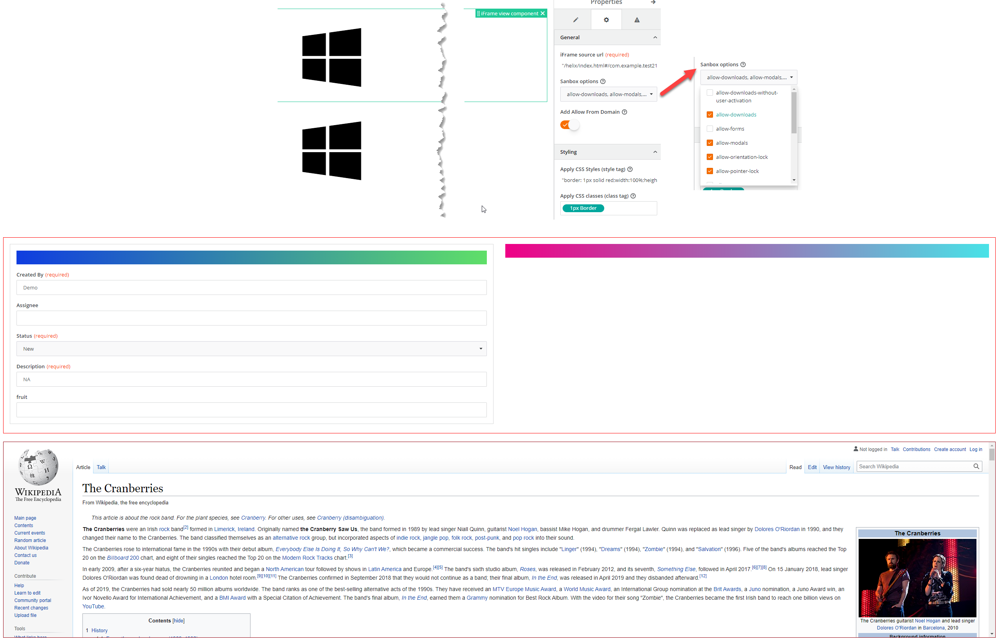
  </details>

* Description:
  * This view component allows to:
    * Display an url in an iFrame,
    * Set the different iFrame sandbox properties,
    * Add "allow-from-domain" query parameter if needed, and the url is a Helix Url,
  * Shows how to:
    * Design Time:
      * Standard implementation implementing the BMC **IViewDesignerComponentModel** and extending **ViewDesignerComponentModel** which is the recommended way,
      * Declare different Input parameters and showing how to use different Field types **ExpressionFormControlComponent**, **ISelectFormControlOptions** and **SwitchFormControlComponent**,
        * Create a list of values to be displayed in a selection field and allowing multi-selection,
          * As per boolean fields, the values need to be parsed since stored as a string in the view definition:
          ```typescript
            //  We have to cast the "sandboxOptions" value to array of strings as it is stored as a string in the properties
            // even if declared as array of strings in the registration module.
            // This is because we allow multiple values to be selected.
            sandboxOptions: initialProperties.sandboxOptions ? JSON.parse(String(initialProperties.sandboxOptions)) : []
          ```
        * Cast boolean value in the **getInitialProperties()** method that sets the initial input parameter values (see [code-viewer](#code-viewer) component :memo:),
      * Create several Input parameter "controls" to group input parameters under different "accordion",
      * Use the BMC css class picker leveraging **TagsFormControlComponent** and its validator **validateCssClassName**,
      * Add a tooltip to an Input parameter,
      * Validate the input parameters,
    * Runtime:
      * Subscribe only to the Input Parameter changes when the configuration object is different using the rxJs operators and lodash isEqual operator (see [code-viewer](#code-viewer), component :memo:),
      * Use the Angular **DomSanitizer** to create an iFrame Safe url,
* Complexity: :hot_pepper: :hot_pepper:
* Used in the example:
  * View: VC iFrame,

---

<a name="display-gradient"></a>
### display-gradient:
  <details> 
  <summary>display-gradient</summary>  

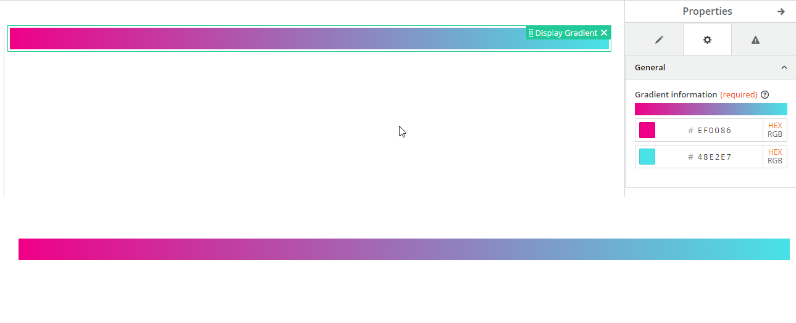
  </details>

* Description:
  * This view component allows to display a gradient,
  * Shows how to:
    * Design Time:
      * Standard implementation implementing the BMC **IViewDesignerComponentModel** and extending **ViewDesignerComponentModel** which is the recommended way,
      * Leverages the custom inspector (Form Control Component) **GradientComponent** ([see here](./JAVASCRIPT_INSPECTORS.MD#gradient)),
      * Setting a default value for the gradient in the **getInitialProperties** method,
        ```typescript
        gradient: `${GRADIENT_COMPONENT_OPTIONS.defaultValues.left}|${GRADIENT_COMPONENT_OPTIONS.defaultValues.right}`,
        ```
      * Add a tooltip to the Input parameter,
      * Validate the input parameter,
      * Allows the view component to be displayed in a record editor:
      ```typescript
        options: {
          canBeEmbeddedInRecordEditor: true
        }
      ```
    * Design Time Component:
      * Display in View Designer the gradient as the Business Analyst selects the different colors,
      * Subscribes to the different input parameters in real time and creates the gradient accordingly leveraging the custom service **GradientService**, 
    * Runtime:
      * Subscribe only to the "gradient" Input Parameter changes and when its value actually changes,
        ```typescript
          this.config.pipe(
            pluck('gradient'),
            distinctUntilChanged()
          ).subscribe((gradient: string) => {
        ```
* Complexity: :hot_pepper:
* Used in the example:
  * View: VC Gradient,

---

<a name="generate-password"></a>
### generate-password:
  <details> 
  <summary>generate-password</summary>  

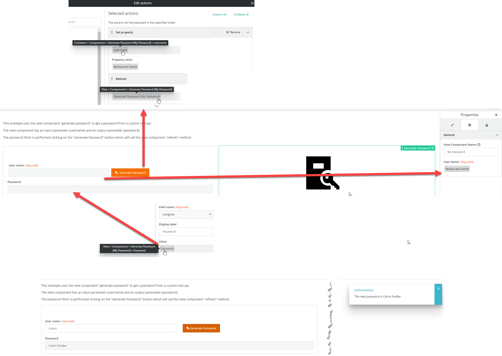
  </details>

* Description:
  * This view component generates a (fake) password for a given username,
  * Shows how to:
    * Design Time:
      * Standard implementation implementing the BMC **IViewDesignerComponentModel** and extending **ViewDesignerComponentModel** which is the recommended way,
      * Leverages the OOTB inspectors **ExpressionFormControlComponent** and **TextFormControlComponent**,
      * Shows how to allow a special "name" input parameter that can be used by the Business Analyst to specifically identify the View Component in the data dictionnary or the breakcrumb:
        ```typescript
          const componentName = name ? `${this.sandbox.descriptor.name} (${name})` : this.sandbox.descriptor.name;
          // ...
          this.sandbox.setCommonDataDictionary(this.prepareDataDictionary(componentName));
          // ...
          this.sandbox.setBreadcrumbs(componentName);
        ```
        <details> 
          <summary>Breadcrumb and data dictionary</summary>  

          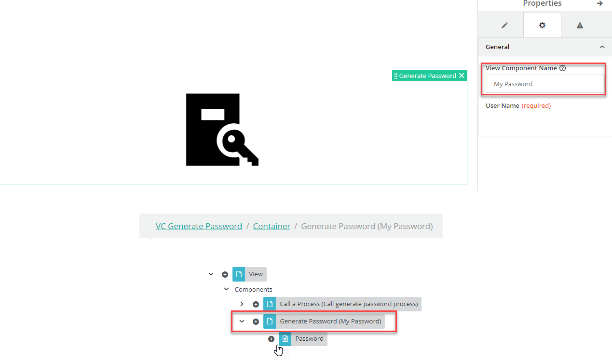
        </details>
      * Add a tooltip to the Input parameter,
      * Validate the input parameter,
      * Allows the "username" input parameter to be accessed through a button "set property" action through the **prepareSetProperties()** method:
        ```typescript
            // Preparing the settable properties, aka the properties that can be set
            // through a button action "set property".
            // In our case we want only to expose the username.
            private prepareSetProperties(): IViewComponentDesignSettablePropertiesDataDictionary {
              return [
                {
                  label: 'username',
                  expression: this.getExpressionForProperty('username'),
                }
              ];
            }
        ```
      * Define an output parameter "password" using the **prepareDataDictionary()** method,
        ```typescript
            // Preparing the data dictionary (for the output parameters for example).
            // In our case we will export the password.
            private prepareDataDictionary(componentName: string): IViewComponentDesignCommonDataDictionaryBranch {
              return {
                label: componentName,
                expression: this.getExpressionForProperty('api'),
                children: [
                  {
                    label: 'Password',
                    expression: this.getExpressionForProperty('password')
                  }
                ]
              }
            }
        ```
        * > **:memo:**   
           The "refresh" action that can be accessed by a button "refresh" action will appear since an output parameter is defined.  
           Handling the "refresh" action is done in the runtime component and is not required.
    * Runtime:
      * Subscribe only to the username Input Parameter changes and when its value actually changes,
        ```typescript
          this.config.pipe(
            pluck('username'),
            distinctUntilChanged()
          ).subscribe((username: string) => {
        ```
      * Consumes the custom Rest Api **SimpleRest** (see [here](./JAVA.MD#SimpleRest)) using Angular **HttpClient**,
      * Implement the "refresh" and "setProperty" actions overriding the default View Component apis:
        ```typescript
            private api = {
              setProperty: this.setProperty.bind(this),
              // In this example we use the refresh method to get the password.
              refresh: this.refresh.bind(this)
            };
            // ...
            this.notifyPropertyChanged('api', this.api);
        ```
      * Sets the "password" output parameter and broadcast its value using the **notifyPropertyChanged()** method:
        ```typescript
            this.notifyPropertyChanged('password', password);
        ```
      * Shows how to use the **RxNotificationService**, **RxLogService** BMC services,
* Complexity: :hot_pepper: :hot_pepper:
* Used in the example:
  * View: VC Generate Password,

---
  
<a name="youtube-player"></a>
### youtube-player:
  <details> 
  <summary>youtube-player</summary>  

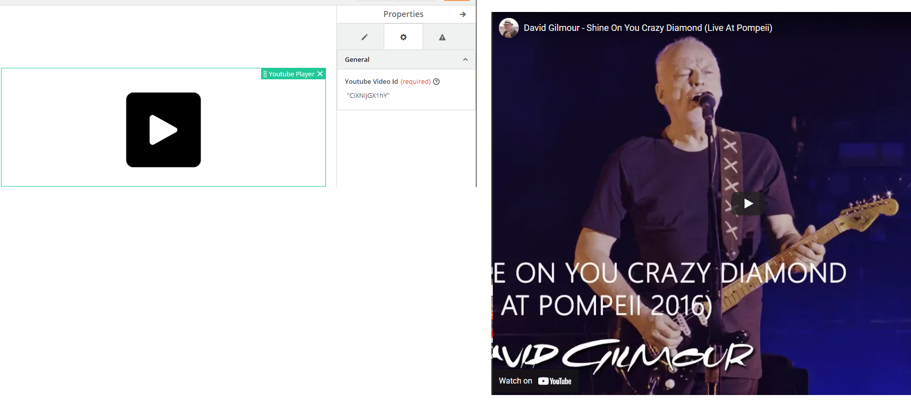
  </details>

* Description:
  * This view component embeds a YouTube video,
  * Shows how to:
    * Design Time:
      * Standard implementation implementing the BMC **IViewDesignerComponentModel** and extending **ViewDesignerComponentModel** which is the recommended way,
      * Has one input parameter leveraging the OOTB inspector **ExpressionFormControlComponent**,
      * How to validate the input parameter,
      * How to implement a Tooltip in the Input parameter definition,
    * Runtime:
      * Dynamically load the YouTube javascript apis using the **DynamicScriptLoaderServiceService** (see [here](./JAVASCRIPT_SERVICES.MD#DynamicScriptLoaderServiceService)):
        ```typescript
            this.dynamicScriptLoaderServiceService.loadScriptByUrl('https://www.youtube.com/iframe_api', 'youtube').then((result) => {
              // We subscribe to the "videoId" input parameter changes.
              this.config.pipe(
                pluck('videoId'),
                distinctUntilChanged(),
                takeUntil(this.destroyed$)
              ).subscribe((videoId: string) => {
                this.videoId = videoId;
              });
            });
        ```
      * Subscribe only to the videoId Input Parameter changes and when its value actually changes,
      * Leverage the official Google **youtube-player** Angular Component,
        * Please see the **:warning:** note below,
* Complexity: :hot_pepper: :hot_pepper:
* Third party libraries:
  * NPM Modules: @angular/youtube-player (https://www.npmjs.com/package/@angular/youtube-player),
* Credits:
  * https://jinalshah999.medium.com/official-angular-components-google-map-youtube-player-clipboard-67f04531ffc4,
  * David Gilmour, Rick Astley, Pink Floyd,
* Used in the example:
  * View: VC Youtube Player,
  
> **:warning:**   
>  Due to YouTube security measures some videos might not load with the "Video unavailable" error message if the hosting domain has an IP address and not a domain name with SSL enabled.  
>  It should however work fine if the domain is "localhost".

> **:memo:**  
> Be sure that the NPM library(ies) used in the library are not already provided by the Platform (Lodash for example). If third party NPM libraries are necessary be sure to add them at the library level, for example:
> ```bash
> cd src/main/webapp/libs/com-example-test210500
> npm install @angular/youtube-player --save
> ```  
> That should add the library in the package.json dependencies section:
> ```json
>  "dependencies": {
>    "@angular/youtube-player": "^11.2.10"
> }
>```  
  
---

<a name="google-maps-component"></a>
### google-maps-component:
  <details> 
  <summary>google-maps-component</summary>  

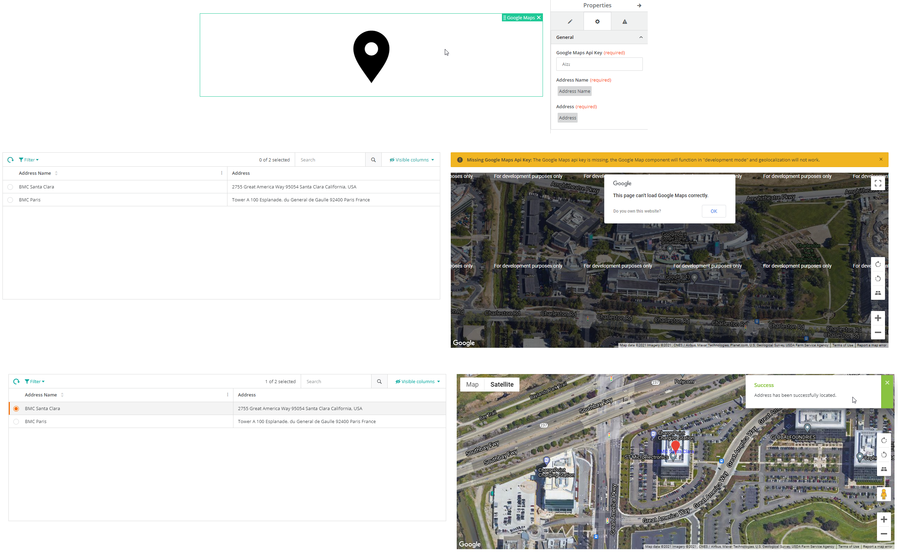
  </details>

* Description:
  * This view component embeds a Google Maps and use the geocoder service to locate an address on the map,
    * Please see the **:warning:** section, no Google Maps Api key is provided in this example,
  * Shows how to:
    * Design Time:
      * Standard implementation implementing the BMC **IViewDesignerComponentModel** and extending **ViewDesignerComponentModel** which is the recommended way,
      * Has input parameters leveraging the OOTB inspector **ExpressionFormControlComponent** and **TextFormControlComponent**,
      * How to validate the input parameters,
    * Runtime:
      * Dynamically load the Google Maps javascript apis and necessary css styles using the **DynamicScriptLoaderServiceService** (see [here](./JAVASCRIPT_SERVICES.MD#DynamicScriptLoaderServiceService)):
        ```typescript
            const promises: any[] = [];
            // ...
            promises.push(this.dynamicScriptLoaderServiceService.loadScriptByUrl('https://maps.googleapis.com/maps/api/js?key=' + this.componentData.apiKey, 'google-maps-api-key'));
            promises.push(this.dynamicScriptLoaderServiceService.loadStylesheetByUrl('https://fonts.googleapis.com/css?family=Roboto:300,400,500&display=swap', 'google-maps-font'));
            promises.push(this.dynamicScriptLoaderServiceService.loadStylesheetByUrl('https://fonts.googleapis.com/icon?family=Material+Icons', 'google-maps-icons'));
    
            Promise.all(promises).then((result) => {
              // Clearing the busy indicator.
              this.completeBusyIndicatorObserver();
              this.areResourcesLoaded = true;
              this.localizeAddress(this.componentData.address, this.componentData.addressName);
            });
        ```
      * Subscribe to the Input Parameters changes and when their value actually change to leverage Google **geocoder** service to locate an address,
      * Leverage the **Adapt Busy Indicator** to show a loading effect while the Google Maps apis load, or the address is localized,
      * Leverage **Adapt Alert** Component to display a warning message if no Google Maps api key is set, 
      * Leverage **RxNotificationService** BMC Service, 
      * Leverage the official Google **google-maps** Angular Component,
        * Please see the **:warning:** note below,
      * Use localization to localize a message, here the warning message is localized. The string **com.example.test210500.view-components.google-maps-component.missing-api-key** is defined in the file "src/main/webapp/libs/com-example-test210500/src/lib/i18n/localized-strings.json":
        ```json
        {
          "com.example.test210500.view-components.google-maps-component.missing-api-key": "The Google Maps api key is missing, the Google Map component will function in \"development mode\" and geolocalization will not work."
        }
        ```
        To consume the message leverage the **TranslateService** service:
        ```typescript
          alertConfiguration: Alert = {
            variant: 'warning',
            title: 'Missing Google Maps Api Key: ',
            // content: 'The Google Maps api key is missing, the Google Map component will function in "development mode" and geolocalization will not work.'
            content: this.translateService.instant('com.example.test210500.view-components.google-maps-component.missing-api-key')
          };
        ```
* Complexity: :hot_pepper: :hot_pepper:
* Third party libraries:
  * NPM Modules: @angular/google-maps (https://www.npmjs.com/package/@angular/google-maps),
* Used in the example:
  * View: VC Google Maps,
  
> **:warning:**   
>  A valid Google Maps api key needs to be provided for the example and View Component to function properly.

> **:memo:**  
> Be sure that the NPM library(ies) used in the library are not already provided by the Platform (Lodash for example). If third party NPM libraries are necessary be sure to add them at the library level, for example:
> ```bash
> cd src/main/webapp/libs/com-example-test210500
> npm install @angular/google-maps --save
> ```  
> That should add the library in the package.json dependencies section:
> ```json
>  "dependencies": {
>    "@angular/google-maps": "^11.2.10"
> }
>```

---

  
<a name="bar-chart-component"></a>
### bar-chart-component:
  <details> 
  <summary>bar-chart-component</summary>  

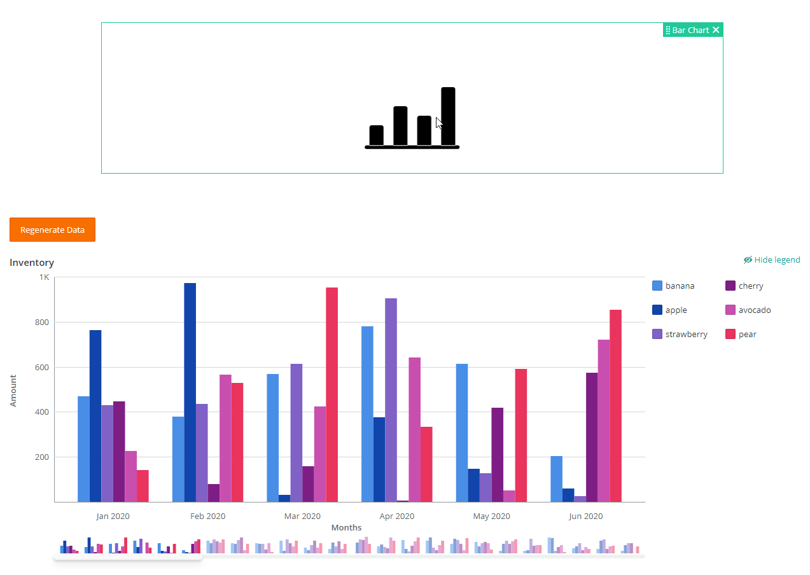
  </details>

* Description:
  * This view component creates a bar chart leveraging Adapt **AdaptChartsModule**,
  * Shows how to:
    * Design Time:
      * There are no input parameters in this example,
    * Runtime:
      * Leverage Adapt **adapt-stacked-chart** component to display random data,
      * Implements some Adapt chart component event (**clickChart**),
      * Leverage Adapt button object ```<button adapt-button btn-type="primary"```,  
        * Clicking on the button will generate different random data,  
      * Leverage the **Adapt Busy Indicator** to show a loading effect while the Google Maps apis load, or the address is localized,
* Complexity: :hot_pepper:
* Used in the example:
  * View: VC Bar Chart,

---
  
<a name="call-command"></a>
### call-command:
  <details> 
  <summary>call-command</summary>  

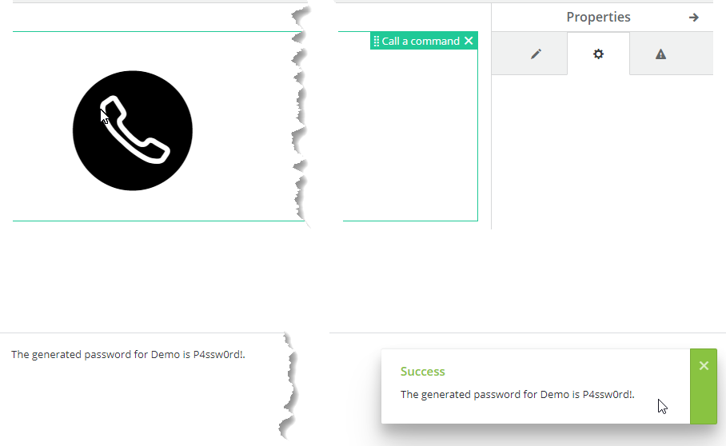
  </details>

* Description:
  * This view component consumes the custom Java command [**Test210500GeneratePasswordCommand**](./JAVA.MD#Test210500GeneratePasswordCommand),
  * Shows how to:
    * Design Time:
      * There are no input parameters in this example,
    * Runtime:
      * Leverage the following BMC Services:
        * **RxCurrentUserService** to get user information,
        * **RxCommandFactoryService** to call a command,
        * **RxNotificationService** to display a notification message,
* Complexity: :hot_pepper:
* Used in the example:
  * View: VC Call Command,

---
  
<a name="call-process"></a>
### call-process:
  <details> 
  <summary>call-process</summary>  

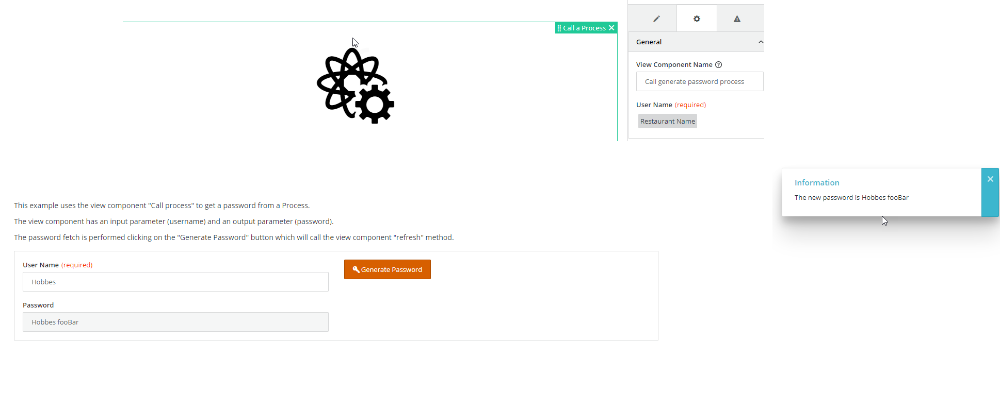
  </details>

* Description:
  * This view component calls a process, passing input parameters and consumes its output parameters,
  * Shows how to:
    * Design Time:
      * The design time is very equivalent to the View Component [generate-password](#generate-password),
        * It has an Input parameter, an Output parameter, allows to set the "username" input parameter through a button "set property" action,
        * We can set a "name" to the view component to distinct it in the data dictionary and the breadcrumbs,
    * Runtime:
      * Implement the "set Property" and "refresh" methods (see the View Component [generate-password](#generate-password)),
        * The "set property" will set a value in the "username" input parameter,
        * The "refresh", when called, will trigger the call to the Process,
      * Leverage the following BMC Services:
        * **RxLaunchProcessViewActionService** to call the process "com.example.test210500:generate password",
        * **rxLogService** to log in the web browser console,
        * **RxNotificationService** to display a notification message,
    * Broadcast the View Component output parameter using the method **this.notifyPropertyChanged()**,
* Complexity: :hot_pepper: :hot_pepper:
* Used in the example:
  * View: VC Generate Password,

---

<a name="webcam"></a>
### webcam:
  <details> 
  <summary>webcam</summary>  

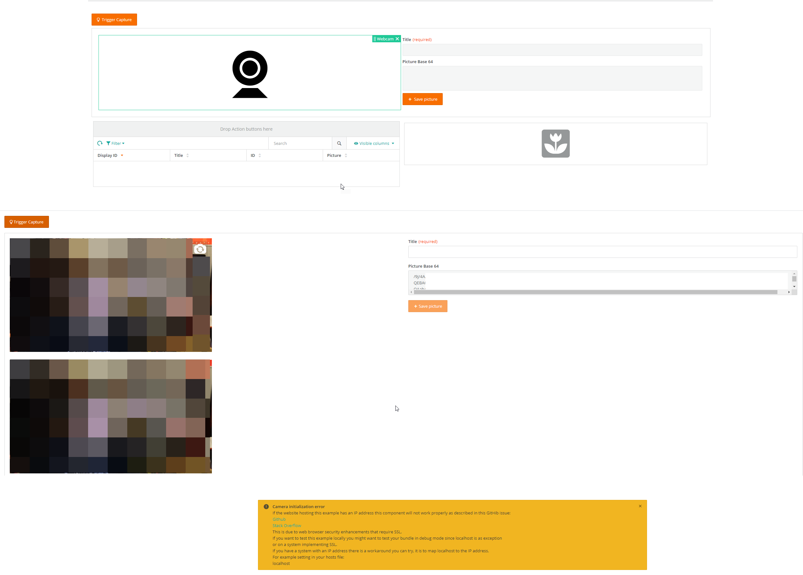
  </details>

* Description:
  * This view component displays a webcam field and can perform a screenshot,
  * Shows how to:
    * Design Time:
      * Embed a View Component in a record editor:
        ```typescript
              options: {
                canBeEmbeddedInRecordEditor: true
              }
        ```
      * This View Component does not have Input Parameters but has an Output Parameter "pictureBase64",
      * 
    * Runtime:
      * Implement the "refresh" method to trigger the webcam capture,
      * Leverage the **webcam** component and some of its events:
        * Please see the **:warning:** section about the use of webcam in a web browser,
        * Clicking on the webcam picture will trigger a capture,
          ```html
          <webcam *ngIf="isInitialized"
                  (imageCapture)="onCaptureImage($event)"
                  (initError)="onInitError($event)"
                  (imageClick)="onImageClick($event)"
                  [allowCameraSwitch]="true"
                  [trigger]="onCaptureRequested()"
                  [captureImageData]="true"
                  [imageQuality]="1">
          </webcam>
          ```
      * Leverage the Adapt **Alert** component to display a warning message if the webcam field cannot be initialized (please see the **:warning:** section below),
      * Broadcast the View Component output parameter when a capture is done using the method **this.notifyPropertyChanged()**,
    * Usage in the demo View:
      * We show how to get the Webcam output which is a picture in base 64, call a process passing this data and creating an Attachment using the **Create Attachment** activity to save it in a Record Instance using the **Create Record** activity,
        * The process used is "Save Webcam picture",
* Complexity: :hot_pepper: :hot_pepper: 
* Third party libraries:
  * NPM module: ngx-webcam (https://github.com/basst314/ngx-webcam),
* Used in the example:
  * View: VC Webcam,
  
> **:memo:**  
> Be sure that the NPM library(ies) used in the library are not already provided by the Platform (Lodash for example). If third party NPM libraries are necessary be sure to add them at the library level, for example:
> ```bash
> cd src/main/webapp/libs/com-example-test210500
> npm install ngx-webcam --save
> ```  
> That should add the library in the package.json dependencies section:
> ```json
>  "dependencies": {
>    "ngx-webcam": "^0.3.2"
> }
>```

> **:memo:**  
> You can access more complex examples in the NPM module documentation: 
> https://github.com/basst314/ngx-webcam  
> If you desire to switch from one webcam to another click on the webcam icon on top right of the webcam field to cycle through the different webcams.

> **:warning:**
> Important note:  
> If the website hosting this example has an IP address this component will not work properly as described in this GitHib issue:  
> https://github.com/zxing-js/library/issues/225  
> https://stackoverflow.com/questions/34197653/getusermedia-in-chrome-47-without-using-https/34198101#34198101  
> This is due to web browser security enhancements that require SSL.  
> If you want to test this example locally you might want to test your bundle in debug mode since localhost is as exception or on a system implementing SSL.  
> If you have a system with an IP address there is a workaround you can try, it is to map localhost to the IP address.  
> For example setting in your hosts file:  
> ```theWebsiteIp> localhost```   
> The View Component will display an error message when it cannot initialize the webcam:  
<details> 
  <summary>webcam initialization error</summary>

  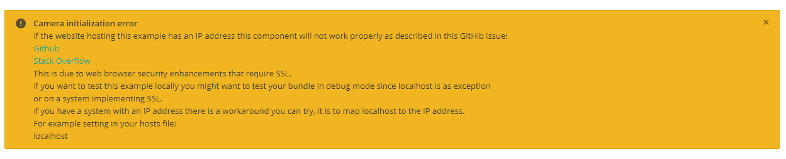
</details>

---

<a name="qr-code-scanner"></a>
### qr-code-scanner:
  <details> 
  <summary>qr-code-scanner</summary>  

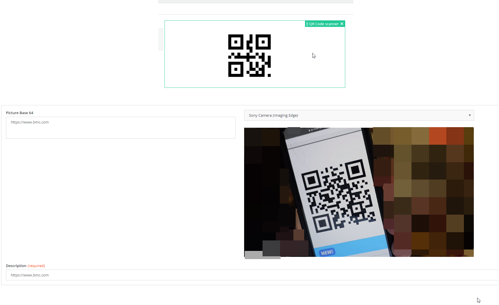
  </details>

* Description:
  * This view uses a webcam to capture a QR Code and broadcast this code in an Output Parameter,
  * Shows how to:
    * Design Time:
      * Embed a View Component in a record editor:
        ```typescript
              options: {
                canBeEmbeddedInRecordEditor: true
              }
        ```
      * This View Component does not have Input Parameters but has an Output Parameter "qrCode",
    * Runtime:
      * Leverage the **zxing-scanner** component and some of its events, we also get the list of the available webcams and sets those in an Adapt **adapt-rx-select** Component,
          ```html
            <zxing-scanner [enable]="isScanningEnabled"
              [formats]="allowedFormats"
              [(device)]="zxingSelectedDevice"
              (deviceChange)="onDeviceChange($event)"
              (camerasFound)="onCamerasFound($event)"
              (camerasNotFound)="onCamerasNotFound()"
              (scanSuccess)="onScanSuccess($event)"
              (permissionResponse)="permissionResponse($event)"
              (scanError)="onScanError($event)">
            </zxing-scanner>
          ```
        * Please see the **:warning:** section about the use of webcam in a web browser,
        * When the Component will detect a QR code it will automatically set the value in the View Component Output parameter "qrCode" and broadcast it,
          * In this use case we use a trick to force the broadcast of the captured QR Code as the **notifyChanged()** method usually only broadcast the value once if it is the same:
            ```typescript
                // We have to do this in the case where the same qrcode is scanned and consumed by a record
                // editor field for example. If we delete the field content as the scanned value would be
                // the same the value would not be broadcasted anymore.
                // If we want to force the broadcast of the qr code only once, comment out the line below:
                this.notifyPropertyChanged('qrCode', null);
                // Broadcasting the output parameter with the qr code value.
                this.notifyPropertyChanged('qrCode', qrCode, null);
            ```
      * Leverage the Adapt **Alert** component to display a warning message if the webcam field cannot be initialized (please see the **:warning:** section below),
* Complexity: :hot_pepper: :hot_pepper:
* Third party libraries:
  * NPM modules:
    * https://github.com/zxing-js/ngx-scanner,
    * @zxing/browser,
    * @zxing/library,
    * @zxing/ngx-scanner,
* Used in the example:
  * View: VC QR Code Scanner,
  
> **:memo:**  
> Be sure that the NPM library(ies) used in the library are not already provided by the Platform (Lodash for example). If third party NPM libraries are necessary be sure to add them at the library level, for example:
> ```bash
> cd src/main/webapp/libs/com-example-test210500
> npm install @zxing/browser@latest --save
> npm install @zxing/library@latest --save
> npm install @zxing/ngx-scanner@latest --save
> ```  
> :warning: VERY IMPORTANT, be sure to have those versions in the package.json file as the latest versions have problem with Angular 10 and 11:
> ```json
>  "dependencies": {
>    "@zxing/browser": "0.0.5"
>    "@zxing/library": "0.18.5",
>    "@zxing/ngx-scanner": "3.1.3",
> }
>```

> **:memo:**  
> You can access more complex examples in the NPM module documentation: 
> https://github.com/zxing-js/ngx-scanner  

> **:warning:**
> Important note:  
> If the website hosting this example has an IP address this component will not work properly as described in this GitHib issue:  
> https://github.com/zxing-js/library/issues/225  
> https://stackoverflow.com/questions/34197653/getusermedia-in-chrome-47-without-using-https/34198101#34198101  
> This is due to web browser security enhancements that require SSL.  
> If you want to test this example locally you might want to test your bundle in debug mode since localhost is as exception or on a system implementing SSL.  
> If you have a system with an IP address there is a workaround you can try, it is to map localhost to the IP address.  
> For example setting in your hosts file:  
> ```theWebsiteIp> localhost```   
> The View Component will display an error message when it cannot initialize the webcam:  
<details> 
  <summary>webcam initialization error</summary>

  
</details>

---

<a name="digital-signature"></a>
### digital-signature:
  <details> 
  <summary>digital-signature</summary>  

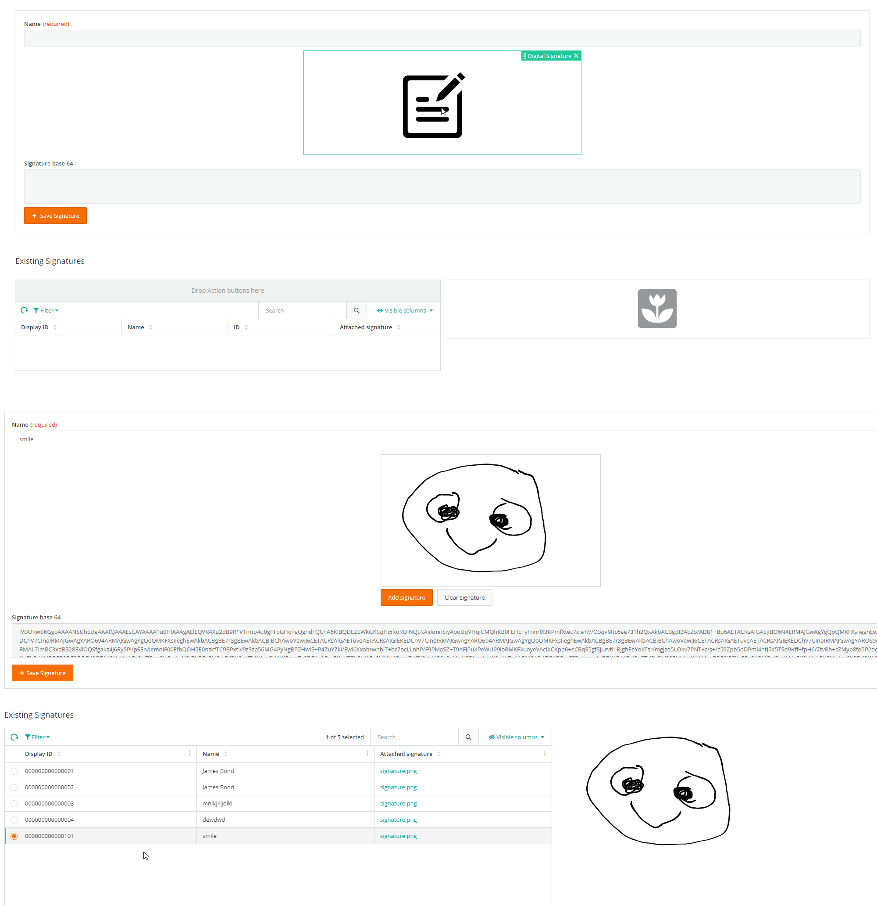
  </details>

* Description:
  * This view component allows an End User to sign using a mouse or finger on mobile devices and save the output as a picture,
  * Shows how to:
    * Design Time:
      * Embed a View Component in a record editor:
        ```typescript
              options: {
                canBeEmbeddedInRecordEditor: true
              }
        ```
      * This View Component does not have Input Parameters but has an Output Parameter "signature",
    * Runtime:
      * Implement the **signature-pad** Component to let the user sign (or doodle) and implement some of its events:
        ```html
          <signature-pad #signaturePad
            [options]="signaturePadOptions"
            (onBeginEvent)="drawStart()"
            (onEndEvent)="drawComplete()">
          </signature-pad>
        ```
      * Leverage the Adapt buttons to broadcast the current signature or clear the current signature,
      * Broadcast the View Component output parameter when the **signature-pad** Component thinks the signature is done. This can be done manually as well. The broadcast is performed using the method **this.notifyPropertyChanged()**,
    * Usage in the demo View:
      * We show how to get the Signature output which is a picture in base 64, call a process passing this data and creating an Attachment using the **Create Attachment** activity to save it in a Record Instance using the **Create Record** activity,
        * The process used is "Add signature",
* Complexity: :hot_pepper:
* Third party libraries:
  * NPM module: angular2-signaturepad (https://www.npmjs.com/package/angular2-signaturepad) which leverages https://www.npmjs.com/package/signature_pad,
* Used in the example:
  * View: VC Digital signature,

> **:memo:**  
> Be sure that the NPM library(ies) used in the library are not already provided by the Platform (Lodash for example). If third party NPM libraries are necessary be sure to add them at the library level, for example:
> ```bash
> cd src/main/webapp/libs/com-example-test210500
> npm install angular2-signaturepad --save
> ```  
> You should then have this entry in the library package.json file:
> ```json
>  "dependencies": {
>    "angular2-signaturepad": "^3.0.4"
> }
>```

---

<a name="get-data-example"></a>
### get-data-example:
  <details> 
  <summary>get-data-example</summary>  

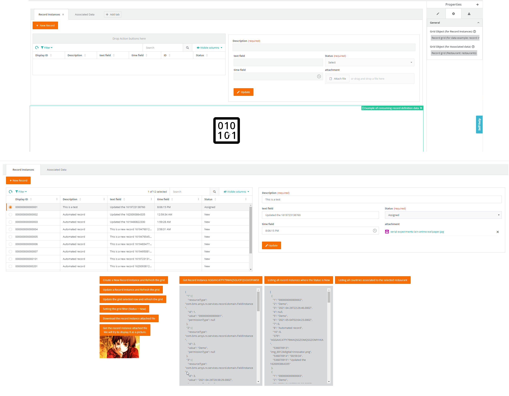
  </details>

* Description:
  * This view component shows how to consume BMC OOTB services to get data from record definitions or associations:
    * Get a specific record instance,
    * Get a specific record instance from a grid first selectedRow,
    * Get several record instances (datapagequery),
    * Get associated data,
    * Call a grid refresh method to refresh a grid,
    * Set a grid filter,
    * Create a new record instance,
    * Update an existing record instance,
    * Download an attachment and get its download url,
    * Get an attachment picture and display it in the web browser,
  * Shows how to:
    * Design Time:
      * Accept a grid component as input parameters, the "enableExpressionEvaluation" must be true since the grid reference is an expression that needs to be evaluated at runtime:
      ```typescript
                name: 'gridObject',
                enableExpressionEvaluation: true
              }
      ```
      In the design model this would reflect with a **ExpressionFormControlComponent** type:
      ```typescript
        {
          name: 'gridObject',
          component: ExpressionFormControlComponent,
          options: {
            label: 'Grid Object (for Record Instances)',
            tooltip: new Tooltip('Please select the grid to use to get record instance data.'),
            dataDictionary$: this.expressionConfigurator.getDataDictionary(),
            operators: this.expressionConfigurator.getOperators(),
          } as IExpressionFormControlOptions
        }
      ```
    * Runtime:
      * The data are fetched from the record instance "com.example.test210500:for data example" or association "com.example.test210500:Restaurants are in Many Countries",
      * Get a specific record instance directly or from a grid first selectedRow using **RxRecordInstanceService** BMC Service using its **get()** method:
      ```typescript
          this.rxRecordInstanceService.get(GET_DATA_EXAMPLE_OPTIONS.recordDefinitionName, this.recordInstanceId).subscribe((recordInstance: RecordInstance))
      ```
      * Get several record instances (datapagequery) using **RxRecordInstanceDataPageService** BMC service using its **get()** method,
        * You can set in the object parameter the record definition to tap into, the sorts, the fields to fetch, the qualification etc...,
        ```typescript
            const params: IDataPageParams = {
              // Record Definition to fetch data into.
              recorddefinition: GET_DATA_EXAMPLE_OPTIONS.recordDefinitionName,
              // List of field Ids we want to fetch. This is an array of field Ids.
              propertySelection: values(GET_DATA_EXAMPLE_OPTIONS.fields).concat(values(RX_RECORD_DEFINITION.coreFieldIds)),
              // Page size (-1 = all).
              pageSize: -1,
              // Start Index (if we want to handle the pagination), 0 means we want to get
              // from the first record instance.
              startIndex: 0,
              // Query criteria. Here we want to fetch the record instances where
              // 'Status' = "New", so once using the field Ids and the status values:
              // '7' = "0"
              queryExpression: GET_DATA_EXAMPLE_OPTIONS.queryExpression
            };
        
            this.rxRecordInstanceDataPageService.get({params}).subscribe((results: IDataPageResult) => {
            // ...
            });
          }
        ```
      * Get associated data using **RxAssociationInstanceDataPageService** BMC service using its **get()** method:
        * You can set in the object parameter the association definition to tap into, which node to tap into since an association has a left (nodeA) or right (nodeB) side, the parent record instance Id, the fields to fetch etc...,
        * You can query from either side of the association,
        ```typescript
            const params = {
              // We want to get all possible records.
              pageSize: -1,
              // Starting from the first record.
              startIndex: 0,
              // Association to follow. nodeA (left part) is Restaurant, right part (nodeB) are countries.
              // Here we want the countries associated to a specific restaurant.
              associationDefinition: GET_DATA_EXAMPLE_OPTIONS.associationDefinitionName,
              // We want the data from the 'nodeB', here the countries.
              nodeToQuery: RX_ASSOCIATION_DEFINITION.roles.second.value,
              // The "parent" instanceId, here the nodeA (Restaurants).
              associatedRecordInstanceId: '',
              // We need only the default fields in this example (core fields).
              propertySelection: values(RX_RECORD_DEFINITION.coreFieldIds),
              useDefaultRoleNames: true
            };
        
            // Note:
            // It is not necessary to define the "source" record definition (here the restaurants)
            // we will devise it from the association definition name and the node to query.
            params.associatedRecordInstanceId = restaurantInstanceId;
        
            this.rxAssociationInstanceDataPageService.get({params}).subscribe((results: IDataPageResult) => {
                // ...
            });
        ```
      * Create a new record instance using **RxRecordInstanceService** BMC Service, here we create a blank record instance using the **getNew()** method and save it using the **create()** method:
      ```typescript
          this.rxRecordInstanceService.getNew(GET_DATA_EXAMPLE_OPTIONS.recordDefinitionName).subscribe((recordInstance: RecordInstance) => {
            // Setting some values.
            recordInstance.setFieldValue(RX_RECORD_DEFINITION.coreFieldIds.description, 'Automated record');
            recordInstance.setFieldValue(GET_DATA_EXAMPLE_OPTIONS.fields.textFieldId, 'This is a new record ' + Date.now());
      
            // We have to use the create method when creating a new record instance.
            this.rxRecordInstanceService.create(recordInstance).subscribe(() => {
                // ...
            });
          });
      ```
      * Update an existing record instance using **RxRecordInstanceService** BMC Service, here we fetch a record instance and modify it using the **save()** method:
      ```typescript
          this.rxRecordInstanceService.get(GET_DATA_EXAMPLE_OPTIONS.recordDefinitionName, recordInstanceId).subscribe((recordInstance: RecordInstance) => {
              recordInstance.setFieldValue(GET_DATA_EXAMPLE_OPTIONS.fields.textFieldId, 'Updated the ' + Date.now());
      
              this.rxRecordInstanceService.save(recordInstance).subscribe(() => {
                  // ...
              });
            });
      ```
      * Download an attachment using **RxRecordInstanceService** BMC Service using the **downloadAttachment()** method:
      > **:memo:**  
      The attachment will then be downloaded automaticatlly.
      ```typescript
      this.rxRecordInstanceService.downloadAttachment(GET_DATA_EXAMPLE_OPTIONS.recordDefinitionName, GET_DATA_EXAMPLE_OPTIONS.fields.attachmentFieldId, recordInstanceId, filename);
      ```
        * To get the downloadUrl you can use the **getAttachmentDownloadUrl()** method:
        ```typescript
        this.rxRecordInstanceService.getAttachmentDownloadUrl(GET_DATA_EXAMPLE_OPTIONS.recordDefinitionName, GET_DATA_EXAMPLE_OPTIONS.fields.attachmentFieldId, recordInstanceId);
        ```
      * Get an attachment picture and display it in the web browser using **DomSanitizer** Angular service and using **RxRecordInstanceService** BMC Service using the **getAttachment()** method:
      ```typescript
              this.rxRecordInstanceService.getAttachment(GET_DATA_EXAMPLE_OPTIONS.recordDefinitionName, GET_DATA_EXAMPLE_OPTIONS.fields.attachmentFieldId, recordInstanceId).subscribe((attachmentContent: Blob) => {
                // Creating an image object, reference:
                // https://developer.mozilla.org/en-US/docs/Web/JavaScript/Reference/Global_Objects/Uint8Array
                if (attachmentContent) {
                  const urlCreator = window.URL || window.webkitURL;
      
                  this.pictureContent = this.domSanitizer.bypassSecurityTrustUrl(urlCreator.createObjectURL(attachmentContent));
                }
              });
      ```
      * Leverage **rx-json-viewer** component to display Json formatted data,
      * Leverage Adapt **button**,
      * Access grid object and:
        * Get a grid first selected row using its **getFirstSelectedRow()** method,
        * Refresh a grid using its **refresh()** method,
        * Set a grid filter using its **setFilter()** method,
      * Leverage the **RxNotificationService** BMC service to display a notification,
* Complexity: :hot_pepper:
* Used in the example:
  * View: VC Getting Record Definition Data,

> **:memo:**  
> Setting grid filters can be challenging, it is recommende to look at the sample code as it is heavily commented.  


---

<a name="list-icons"></a>
### list-icons:
  <details> 
  <summary>list-icons</summary>  

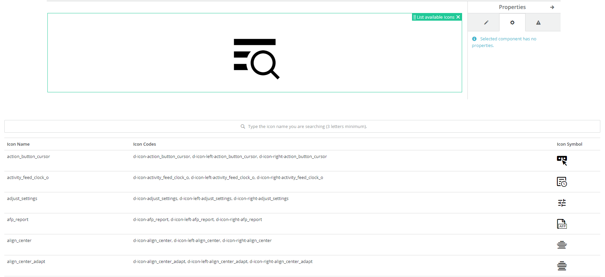
  </details>

* Description:
  * This view component is a utility that gets the list of available icons and display them in a grid fashion, allowing you to see and search them,
  * Shows how to:
    * Runtime:
      * Leverage Adapt **adapt-rx-search** to display a search bar (we use the Pipe **iconFilter** for the filtering later in the table):
      ```html
      <adapt-rx-search
        [(ngModel)]="searchingValue"
        [placeholder]="'Type the icon name you are searching (3 letters minimum).'"
        [debounceTime]="300"
      ></adapt-rx-search>
      ```
      * Leverage Adapt **adapt-alert** to display an alert when no result is found:
      ```html
      <adapt-alert
        [hidden]="numberOfFilteredIcons"
        [config]="alertConfiguration">
      </adapt-alert>
      ``` 
* Complexity: :hot_pepper:
* Used in the example:
  * View: VC Icon List,


---

<a name="user-preferences"></a>
### user-preferences:
  <details> 
  <summary>user-preferences</summary>  

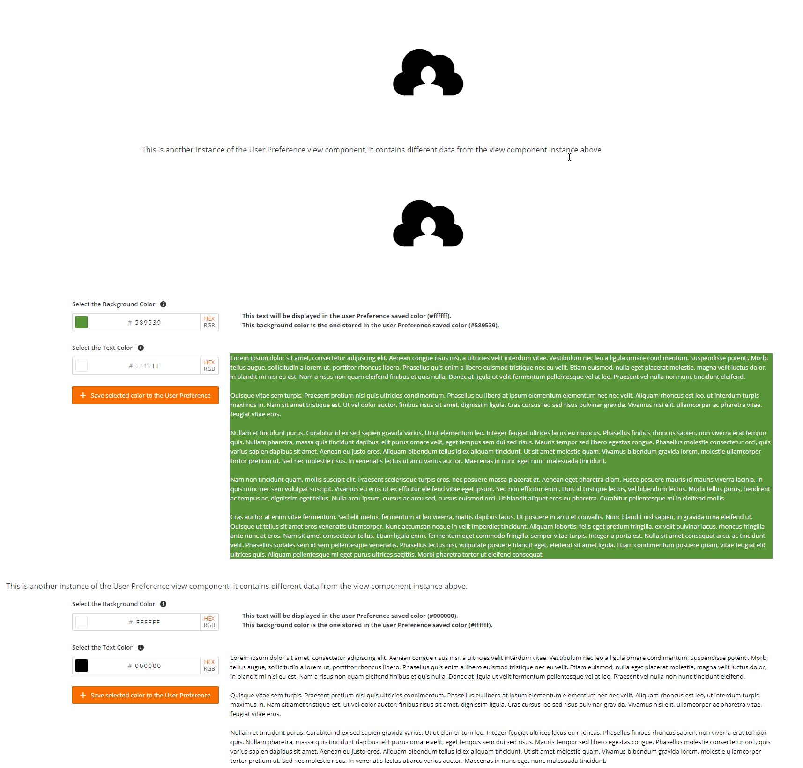
  </details>

* Description:
  * This view component shows how to tap into the "User Preferences". "User Preferences" allows you to get and save data specific for one user and one View Component. For example a user could decide to select a list of columns to display in a grid and this information would be saved for this user and when logging back the column list would be loaded, and the user would find back the columns he / she selected,
  * In this example we use an Adapt **adapt-color-picker** and store the color when the user picks one,  
  * Shows how to:
    * Runtime:
      * Leverage Adapt **adapt-button** to display a button and **adapt-icon** to display an icon with a popover message,
      * Leverage **RxUserPreferencesService** BMC service to:
        * Store a user preference for a view component instance using **setUiComponentPreferences()** method:
        ```typescript
            const userPreferencesData: IUserPreferencesData = {
              // ...
              // In our use case it will contain a stringified version of this object IUserPreferencesColorValues:
              // {
              //   textColor: string;
              //   backgroundColor: string;
              // }
              preferences: '',
              // View component type (name), here in this example we use the view component type as defined in
              // the registration.module.
              componentTypeName: USER_PREFERENCES_OPTIONS.userPreferencesDefaultValues.componentName,
              // View component version. This can be any value.
              version: USER_PREFERENCES_OPTIONS.userPreferencesDefaultValues.componentVersion,
              // View component instance Id (guid).
              componentId: viewComponentGuid
            };
        
            // We want to store the color values as this object IUserPreferencesColorValues,
            // so we create the object, set it and stringify it:
            // {
            //   textColor: '#FFFFFF',
            //   backgroundColor: '#000000'
            // }
        
            const updatedColorValues: IUserPreferencesColorValues = {
              textColor: userPreferencesColorObjects.textColor.value,
              backgroundColor: userPreferencesColorObjects.backgroundColor.value
            }
        
            userPreferencesData.preferences = JSON.stringify(updatedColorValues);
        
            this.rxUserPreferencesService.setUiComponentPreferences(userPreferencesData, viewComponentGuid);
        ```
        * Access a user preference for a view component instance using the **getUiComponentPreferences()** method:
        ```typescript
            this.rxUserPreferencesService.getUiComponentPreferences(viewComponentGuid)
        ```
* Complexity: :hot_pepper:
* Used in the example:
  * View: VC User Preferences,


---

<a name="admin-preferences"></a>
### admin-preferences:
  <details> 
  <summary>admin-preferences</summary>  

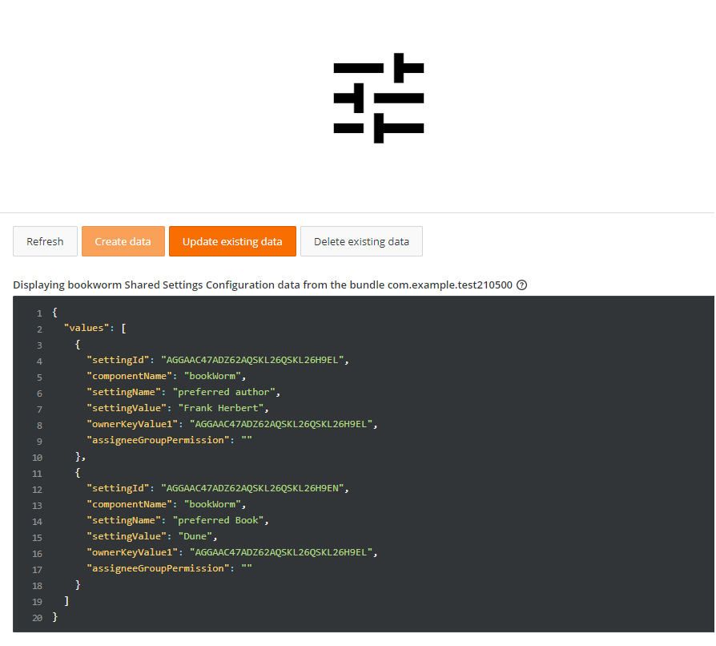
  </details>

* Description:
  * Admin configuration are the settings that can be set in a bundle "Configurations" tab, type "Shared Settings", 
  * In this example we can delete / create / update Shared Settings information about a book,
    <details> 
      <summary>admin-preferences-configuration</summary>  
    
    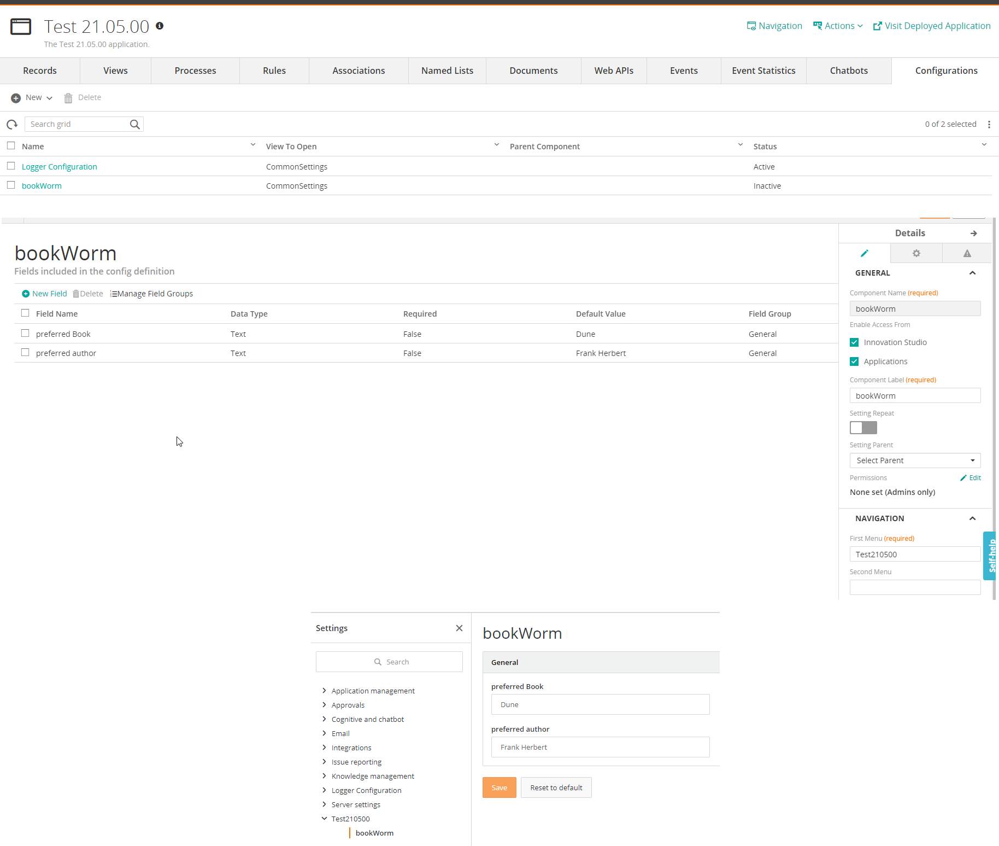
      </details>

  * Shows how to:
    * Runtime:
      * Leverage Adapt **adapt-button** to display a button, **adapt-rx-control-label** to display a label, and **adapt-code-viewer** to display the json payload,
      * Leverage **RxAdminSettingsService** BMC service to:
        * Get the existing entry using **getComponentSettings()** method, the "componentName" is here "bookWorm", and the name of the "Shared Settings" defined in the bundle "Configurations":
        ```typescript
            this.rxAdminSettingsService.getComponentSettings(ADMIN_PREFERENCES_OPTIONS.componentName).subscribe((result: IAdminComponentSettings) => {
              // ...
            });
        ```  
        * Store a new entry using **createComponentSettings()** method, the "componentName" is here "bookWorm", and the name of the "Shared Settings" defined in the bundle "Configurations":
        ```typescript
            // We need to build the IAdminComponentSetting[] object, field per field.
            // As you can see we do not ned to set any value in the identifier.
            const values: IAdminComponentSetting[] = [
              {
                componentName: ADMIN_PREFERENCES_OPTIONS.componentName,
                settingName: ADMIN_PREFERENCES_OPTIONS.settingPreferredAuthorName,
                settingValue: 'Frank Herbert',
                // Default values when creating a new configuration.
                assigneeGroupPermission: null,
                ownerKeyValue1: null,
                settingId: null
              },
              {
                componentName: ADMIN_PREFERENCES_OPTIONS.componentName,
                settingName: ADMIN_PREFERENCES_OPTIONS.settingPreferredBookName,
                settingValue: 'Dune',
                // Default values when creating a new configuration.
                assigneeGroupPermission: null,
                ownerKeyValue1: null,
                settingId: null
              }
            ];
        
            this.rxAdminSettingsService.createComponentSettings(ADMIN_PREFERENCES_OPTIONS.componentName, values).subscribe(() => {
              // ...
            });
        ```
        * Updating the existing entry using **updateComponentSettings()** method, the "componentName" is here "bookWorm", and the name of the "Shared Settings" defined in the bundle "Configurations", and the "ownerKey" is the attribute "ownerKeyValue1" that is coming when fetching the configuration:
        ```typescript
              // Very important, we need for the update and delete operations to provide not only the configuration name but also the ownerKey (identifier), so for example:
              // bookWorm/AGGAAC47ADZ62AQSK43BQSK43BGQ7G
              this.rxAdminSettingsService.updateComponentSettings(`${ADMIN_PREFERENCES_OPTIONS.componentName}/${ownerKey}`, this.adminComponentData).subscribe(() => {
                // ...
              });
        ```
        * Delete the existing entry using **deleteComponentSettings()** method, the "componentName" is here "bookWorm", and the name of the "Shared Settings" defined in the bundle "Configurations", and the "ownerKey" is the attribute "ownerKeyValue1" that is coming when fetching the configuration:
        ```typescript
              // Very important, we need for the update and delete operations to provide not only the configuration name but also the ownerKey (identifier), so for example:
              // bookWorm/AGGAAC47ADZ62AQSK43BQSK43BGQ7G
              this.rxAdminSettingsService.deleteComponentSettings(`${ADMIN_PREFERENCES_OPTIONS.componentName}/${ownerKey}`).subscribe(() => {
                this.getCurrentData();
              });
        ```
* Complexity: :hot_pepper: :hot_pepper:
* Used in the example:
  * View: VC Admin Preferences,
  

---

<a name="captcha"></a>
### captcha:
  <details> 
  <summary>captcha</summary>  

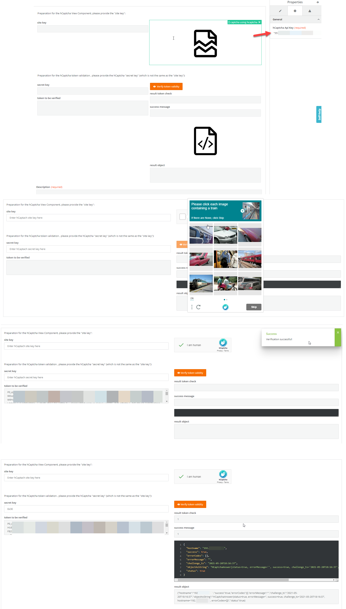
  </details>

* Description:
  * Shows how to leverage [hCaptcha](https://www.hcaptcha.com/) captcha,
    * > :memo:  
       Implementing Google reCaptcha would be pretty much equivalent as the apis are pretty much the same,
    * > :warning:  
      In order to function properly a hCaptcha api key (called site key) is needed. This site key is not provided in this example,
  * Shows how to:
    * Design time:
      * Define one input parameter type **ExpressionFormControlComponent** and its validation as well as one output parameter,
    * Runtime:
      * Leverage the hCaptcha Angular component **ng-hcaptcha** to set up the captcha and implement some of its events:
      ```html
      <ng-hcaptcha (verify)="onVerify($event)"
                   (expired)="onExpired($event)"
                   (error)="onError($event)"
                   [siteKey]="siteKey">
      </ng-hcaptcha>
      ```
      * The hCaptcha configuration is very simple and only requires the api key (site key),
      * When the user solves the Captcha challenge the object will be sent into the **onVerify()** method,
* View example:  
  * The view also implements the Token backend verification calling the process "Validate hCaptcha token",
  * You can check the Custom Activity [CheckHCaptchaToken](./JAVA.MD#CheckHCaptchaToken) for more information,
    * > :warning:  
      The Custom Activity requires a hCaptcha Secret Key which is not provided by this example, 
* Complexity: :hot_pepper:
* Third party libraries:
  * NPM modules: ng-hcaptcha, https://www.hcaptcha.com/, https://github.com/hCaptcha/ng-hcaptcha
* Used in the example:
  * View: VC HCaptcha,

> **:memo:**  
> Be sure that the NPM library(ies) used in the library are not already provided by the Platform (Lodash for example). If third party NPM libraries are necessary be sure to add them at the library level, for example:
> ```bash
> cd src/main/webapp/libs/com-example-test210500
> npm install --save ng-hcaptcha
> ```  
> That should add the library in the package.json dependencies section:
> ```json
>  "dependencies": {
>    "ng-hcaptcha": "^1.0.0-beta.3"
> }
>```  


---

<a name="access-grid"></a>
### access-grid:
  <details> 
  <summary>access-grid</summary>  

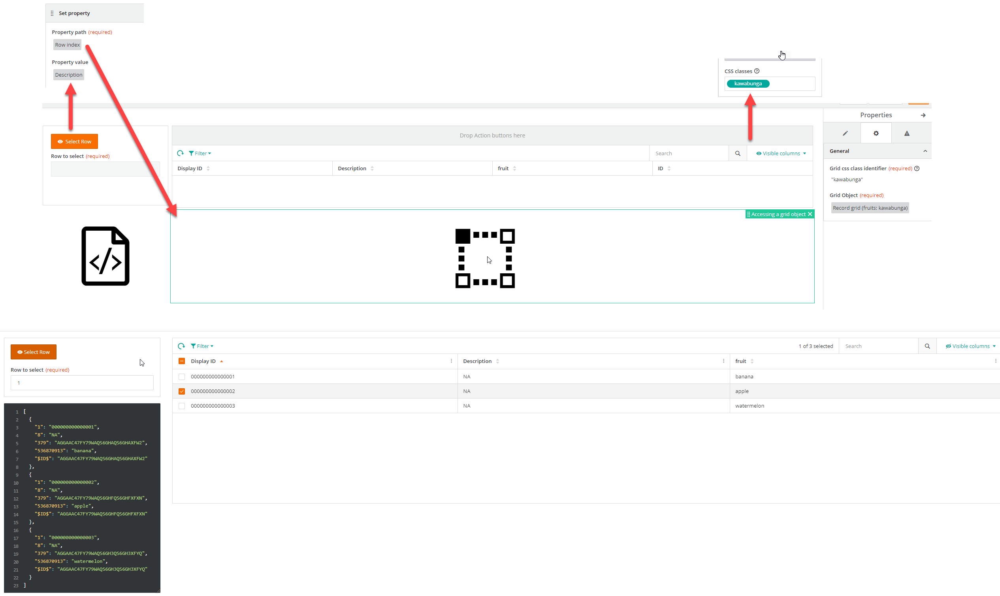
  </details>

* Description:
  * Access a BMC grid object Angular Component instance to get its data and select a specific row for example,
    * > :warning:  
      For now the grid object do not expose all of its api objects, so we need to use the custom **GetComponentService** [service](./JAVASCRIPT_SERVICES.MD#GetComponentService) to fetch the Component instance from the Native Element. This must be considered as a workaround for now,
  * Shows how to:
    * Design time:
      * Define two input parameters type **ExpressionFormControlComponent**, and their validation as well as one output parameter,
        * The third input parameter "rowIndex" is purposely not defined in the **setInspectorConfig()** method that describes the input properties,
          * This way it will not be displayed in the View Designer,
          * We make it accessible only through a button "set property" action with the use of the method **prepareSetProperties()**,
          ```typescript
            private prepareSetProperties(): IViewComponentDesignSettablePropertiesDataDictionary {
              return [
                {
                  label: 'Row index',
                  expression: this.getExpressionForProperty('rowIndex'),
                }
              ];
            }
          ```
          > :warning:  
          In order to see in the "set property" input parameter in the data dictionary the View Component needs to have at least one output parameter. There is no direct link between both but that is how it works.
    * Runtime:
      * Override the view component "setProperty" method by ours to trap the "rowIndex" set by a "set property" button action and registering it:
      ```typescript
      private api = {
        setProperty: this.setProperty.bind(this)
      };
      // ...
      this.notifyPropertyChanged('api', this.api);
      // ...
      setProperty(propertyPath: string, propertyValue: any): void {
        switch (propertyPath) {
        case 'rowIndex': {
            this.selectRow(propertyValue);
            break;
          }
        default: {
            this.rxLogService.warning(`Standalone Field: property ${propertyPath} is not settable, value was ${propertyValue}.`);
          }
        }
      }
      ```
      * We leverage the custom **GetComponentService** [service](./JAVASCRIPT_SERVICES.MD#GetComponentService) to get the Angular Component instance from the grid and access its methods,
        * We search in the DOM Document for a grid with a specific class, the class name has been also provided in the View Component through the "gridCssClassTag" input parameter,
        * > :warning:  
          For now the grid object do not expose all of its api objects so this must be considered as a workaround for now,
      * Once we have the grid Component instance we can:
        * Subscribe to the data changes to display them:
        ```typescript
              this.recordGridComponent.adaptTable.tableService.valueSource$.subscribe((dataRows) => {
                // ...                
              });
        ```
        * Use the Adapt apis (which actually leverage the **PrimeNG table** object) to select one row. For this we need first to unselect the previously selected rows, then select one row. Even if only one row is selected the selection needs to be passed as an Array:
        ```typescript
              const selectedRows = this.recordGridComponent.adaptTable.getRowSelectionArray();
        
              if (selectedRows) {
                this.recordGridComponent.adaptTable.removeFromRowSelection(selectedRows);
              }
              // ...
              this.recordGridComponent.adaptTable.addToRowSelection([this.currentRows[index]])
        ```
* Complexity: :hot_pepper: :hot_pepper:
* Used in the example:
  * View: VC Accessing grid,
  

---

<a name="floating-panel"></a>
### floating-panel:
  <details> 
  <summary>floating-panel</summary>  

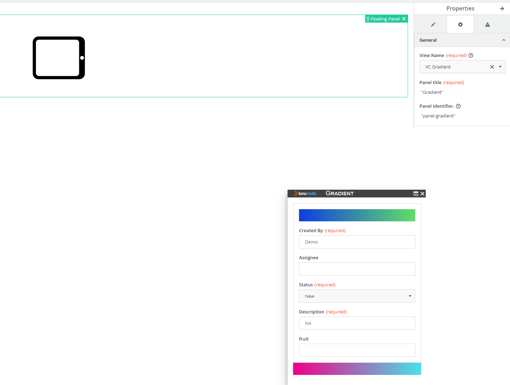
  </details>

* Description:
  * This view component allows to display an Innovation Studio view in a Panel. The panel can be moved around, minimized, maximized, resized and stays during navigation,
      * We leverage for this a pure Javascript library that we will load dynamically when needed using the custom service **DynamicScriptLoaderServiceService** (see [here](./JAVASCRIPT_SERVICES.MD#DynamicScriptLoaderServiceService)),
  * Shows how to:
    * Design Time:
      * Standard implementation implementing the BMC **IViewDesignerComponentModel** and extending **ViewDesignerComponentModel** which is the recommended way,
      * Has input parameters leveraging the OOTB inspector **ExpressionFormControlComponent** and one input parameter leveraging the inspector **RxDefinitionPickerComponent** which allows the end user to select an object definition, in our case a View:
      ```typescript
        {
          name: 'viewName',
          component: RxDefinitionPickerComponent,
          options: {
            label: 'View Name',
            tooltip: new Tooltip('Innovation Studio View Name to be displayed in the floating panel.'),
            definitionType: RxDefinitionPickerType.View,
            required: true
          } as IDefinitionPickerComponentOptions
        }
      ```
      * The input parameter "panelIdentifier" will be useful to identify a panel, if it is defined, and a panel with this identifier has already been created a new panel will not be created, else a new panel will be created,      
      * How to validate the input parameters (errors and warning),
      * How to implement a Tooltip in the Input parameter definition,
    * Runtime:
      * Dynamically load the panel javascript library and styles using the custom service **DynamicScriptLoaderServiceService**, once the resources are loaded the panel is created:
      ```typescript
      const promises: any[] = [];
      // ...
      promises.push(this.dynamicScriptLoaderServiceService.loadScriptByUrl(assetFolderPath + 'scripts/jspanel-4.11.3/jspanel.js', 'jspaneljs'));
      promises.push(this.dynamicScriptLoaderServiceService.loadStylesheetByUrl(assetFolderPath + 'scripts/jspanel-4.11.3/jspanel.css', 'jspanelcss'));
      
      Promise.all(promises).then((result) => {
        this.createPanel();
      });
      ```
      * As the jsPanel Javascript object is not known by Angular we need to declare it as "any":
      ```typescript
      declare var jsPanel: any;
      ```
      * The panel displays the Innovation Studio view in an iFrame, so we need to build the iFrame url and set it:
      ```typescript
      const url = '/helix/index.html#/com.example.test210500/iview/' + this.componentData.viewName;
      // ...
      this.panelObject = jsPanel.create(config).setTheme(FLOATING_PANEL_OPTIONS.defaultPanelTheme);
      ```
* Complexity: :hot_pepper:
* Third party libraries:
  * Library: https://jspanel.de/
* Used in the example:
  * View: VC Floating Panel,

---

<a name="test-debug-component"></a>
### test-debug-component:
  <details> 
  <summary>test-debug-component</summary>  

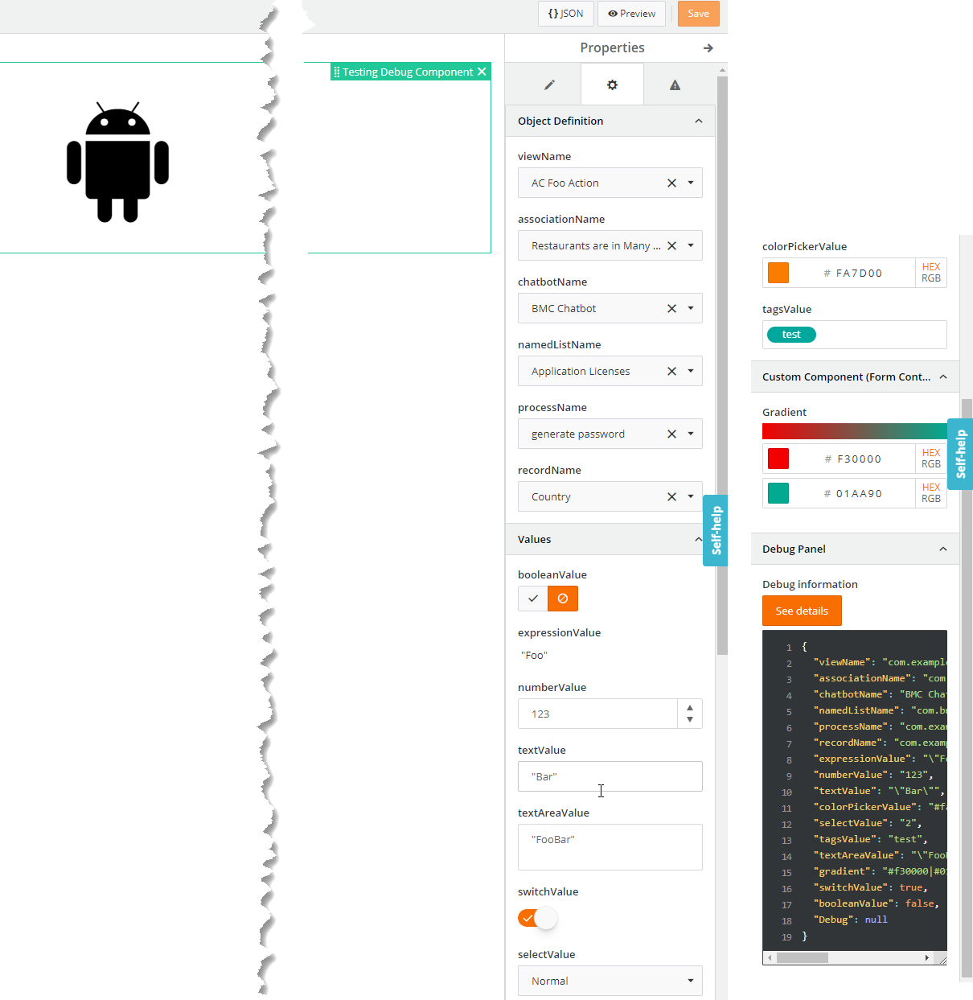
  </details>

* Description:
  * This view component is more a demo of pretty much all the input parameter types you can leverage in View Designer,
  * Shows how to:
    * Design Time:
      * Standard implementation implementing the BMC **IViewDesignerComponentModel** and extending **ViewDesignerComponentModel** which is the recommended way,
          > :memo:  
          It is recommended to look at the code to see the different types.
      * Leverage much all possible input parameters types (switches, view definition picker, process definition picker etc...),
      * leverage some custom inspectors such as [gradient](./JAVASCRIPT_INSPECTORS.MD#gradient) and [log-parameters](./JAVASCRIPT_INSPECTORS.MD#log-parameters), 
      * Cast an input parameter value to a boolean value if necessary since values are stored as string in a view definition:
      ```typescript
        static getInitialProperties(initialProperties?: ITestDebugComponentParameters): ITestDebugComponentParameters {
          return {
            // Definitions
            viewName: '',
            associationName: '',
            chatbotName: '',
            namedListName: '',
            processName: '',
            recordName: '',
            // Values
            expressionValue: '"Foo"',
            numberValue: '123',
            textValue: '"Bar"',
            colorPickerValue: '',
            selectValue: STAR_RATING_SIZE_OPTIONS.sizeOptions.normal.id,
            tagsValue: '',
            textAreaValue: '"FooBar"',
            // Custom Component
            gradient: `${GRADIENT_COMPONENT_OPTIONS.defaultValues.left}|${GRADIENT_COMPONENT_OPTIONS.defaultValues.right}`,
            ...initialProperties,
            //  We have to cast the "booleanValue" and "switchValue" values to Boolean as it is stored as a string in the properties
            // even if declared as boolean in the registration module.
            // The BooleanFormControlComponent and SwitchFormControlComponent require a boolean value.
            booleanValue: initialProperties && String(initialProperties.booleanValue) === 'true',
            switchValue: initialProperties && String(initialProperties.switchValue) === 'true',
          }
        }
      ```
    * Runtime:
      * Display a gradient leveraging the custom **GradientService** from the [gradient](./JAVASCRIPT_INSPECTORS.MD#gradient) inspector,
      * Display all input parameters in an Adapt **adapt-code-viewer** component,
      * Leverage Adapt **adapt-rx-control-label** component,
* Complexity: :hot_pepper:
* Used in the example:
  * View: VC Test Debug,


---

<a name="custom-datapagequery"></a>
### custom-datapagequery:
  <details> 
  <summary>custom-datapagequery</summary>  

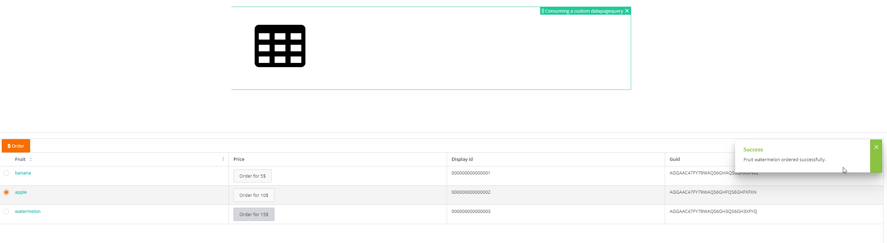
  </details>

* Description:
  * This view component use the **rx-record-grid** BMC grid Component to consume a custom datapage query [Test210500FruitDataPageQuery](./JAVA.MD#test210500fruitdatapagequery),
  * The grid is also customized to add a button in one of the cell, 
  * Shows how to:
    * Design Time:
      * Standard implementation implementing the BMC **IViewDesignerComponentModel** and extending **ViewDesignerComponentModel** which is the recommended way,
    * Runtime:
      * Leverage the **rx-record-grid** BMC grid Component to create a custom grid,
      ```html
      <rx-record-grid #fruitsRecordGrid [config]="fruitsRecordGridConfig$">
      </rx-record-grid>
      ```
      This is necessary to access the grid object and its methods:
      ```typescript
        @ViewChild('fruitsRecordGrid', {static: true})
        fruitsRecordGrid: RecordGridComponent;
      ```
        > :warning:  
        Due to a bug it is necessary to set the current Component in the grid configuration:
        ```this.fruitsRecordGrid.pageComponent = CustomDatapagequeryComponent;```
      * The grid configuration is an Observable here and is a bit complex, here since we are using a custom datapage query and not a record definition we need to manually implement the **getRecordDefinition()** and **getData()** methods. The **recordIdField** is very important and tell which field is the "unique" identifier in a row. If there are multiple same values several rows could be visually selected at once. Here the field will be the "guid" field:
      ```typescript
          this.fruitsRecordGridConfig$ = of({
            // Actions buttons will be display in the grid when at least one row is selected.
            actionButtons: [
                // ...
            ],
            getRecordDefinition: () => of(this.getRecordDefinition()),
            getData: (queryParams: IRecordGridDataPageParams) => this.getData(queryParams),
            enableRowSelection: RowSelectionMode.Single,
            columns: [
                // ...
            ],
            recordIdField: CUSTOM_DATAPAGEQUERY_OPTIONS.fields.guid.fieldId,
            styles: 'flex-fill'
          });
      ```
      * Add actions for a grid that will be displayed on top of the grid when at least one row is selected:
      ```typescript
              {
                label: 'Order',
                iconCls: 'dollar',
                style: 'primary',
                disabled: () => this.fruitsRecordGrid.api.getSelectedRowCount() !== 1,
                // Actions executed on click.
                actions: [
                  {
                    name: () => {
                      this.orderFruit()
                    }
                  }
                ]
              }
            
      ```
      * The cellTemplate are defined in the html as **ng-template**. In this cell template you can access the current row (dataItem), and the field (column.field). This allows us in this example to add a button in the column and call the **orderFruitFromPriceField()** method passing the current row the user clicked on:
      ```html
      <!--Cell template-->
      <ng-template #priceTemplate let-dataItem="dataItem" let-column="column">
        <button adapt-button btn-type="secondary"
                size="default"
                (click)="orderFruitFromPriceField(dataItem)">
          <span>Order for {{dataItem[column.field]}}</span>
        </button>
      </ng-template>
      ```
      It is necessary to refer each template using **@ViewChild()** before using them in a column:
      ```typescript
        @ViewChild('priceTemplate', {static: true})
        priceTemplate: TemplateRef<DataCellTemplateParams>;
      ```
      * Declare the columns in two steps
        * Column by column, adding actions or template to columns if necessary:
        ```typescript
                {
                  index: 0,
                  title: CUSTOM_DATAPAGEQUERY_OPTIONS.fields.fruit.label,
                  // Here the fieldIds are actually labels as the datapagequery returns
                  // key value pairs with <label>: <value>.
                  fieldId: `${CUSTOM_DATAPAGEQUERY_OPTIONS.fields.fruit.fieldId}`,
                  // We only allow filter, golbal search and filter for this column.
                  clickable: true,
                  sortable: true,
                  filterable: true,
                  // Actions happening when clicking on this column value.
                  actions: [
                    {
                      // The previousActionResult would be useful if there were multiple chained actions.
                      // It would contain the previous action result.
                      // The lastActionRow contains the row information the user clicked in.
                      // It can be different from the selected row.
                      name: (previousActionResult: any, lastActionRow: IRowDataItem) => this.orderThisFruit(lastActionRow)
                    }
                  ]
                },
                {
                  index: 1,
                  title: CUSTOM_DATAPAGEQUERY_OPTIONS.fields.price.label,
                  fieldId: `${CUSTOM_DATAPAGEQUERY_OPTIONS.fields.price.fieldId}`,
                  cellTemplate: this.priceTemplate,
                  sortable: false,
                  filterable: false
                }
        ```
        * Then the column definition as we need to map them as Record definition fields and is consumed by the **getRecordDefinition()** method:
        ```typescript
              fieldDefinitions: [
                {
                  id: CUSTOM_DATAPAGEQUERY_OPTIONS.fields.fruit.fieldId,
                  resourceType: RX_RECORD_DEFINITION.resourceTypes.character
                },
                {
                  id: CUSTOM_DATAPAGEQUERY_OPTIONS.fields.price.fieldId,
                  resourceType: RX_RECORD_DEFINITION.resourceTypes.character
                },
                {
                  id: CUSTOM_DATAPAGEQUERY_OPTIONS.fields.displayId.fieldId,
                  resourceType: RX_RECORD_DEFINITION.resourceTypes.character
                },
                {
                  id: CUSTOM_DATAPAGEQUERY_OPTIONS.fields.guid.fieldId,
                  resourceType: RX_RECORD_DEFINITION.resourceTypes.character
                }
              ]
        ```
      * Call the custom datapage query, this is done in the **getData()** method which receives a lot of information such as the filters used by the end users, the sort order(s), the searched text etc... Here we simply pass the information to the [Test210500FruitDataPageQuery](./JAVA.MD#test210500fruitdatapagequery) which will apply the sort and filter if necessary.
      ```typescript
        // We intercept the call that fetches the data to call the custom datapage query.
        private getData(queryParams: IRecordGridDataPageParams): Observable<IDataPageResult> {
          // In this example we only allow the column "fruit" to be filterable and sortable.
          // This also means that the main search will only work for the "fruit" column.
          // This will end up with a sort being:
          // sortBy: ["-fruit"] or sortBy: ["fruit"]
          // And the queryExpression on the format:
          // <filterExpression> AND <searchExpression>, for example if there is a filter
          // on fruit with the text "ap" and we use the main search with "le" we would have
          // automatically in the queryExpression:
          // "('fruit' = \"ap\") AND ('fruit' LIKE \"%le%\")"
          // We will have to take those cases into account in the custom datapage query.
      
          // Consuming the custom datapage query:
          return this.customDatapagequeryDataPageService.get({
            params: queryParams
          });
        }
      ```
      * As you can see we are calling a **CustomDatapagequeryDataPageService** in the **getData()** call, this service extends Datapage:
      ```typescript
      @Injectable()
      export class CustomDatapagequeryDataPageService extends DataPage {
        constructor(injector: Injector) {
          super(injector, CUSTOM_DATAPAGEQUERY_OPTIONS.datapageQueryName);
        }
      }
      ```
* Complexity: :hot_pepper: :hot_pepper:
* Used in the example:
  * View: VC Custom datapage query,

> :memo:  
> More information around a custom grid and its properties is in the example [custom-grid](#custom-grid).


---

<a name="custom-grid"></a>
### custom-grid:
  <details> 
  <summary>custom-grid</summary>  

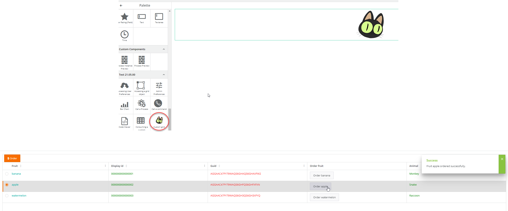
  </details>

* Description:
  * This view component use the **rx-record-grid** BMC grid Component to display data from a record instances and implementing custom columns / column templates,
  * This view component also shows how to create a custom icon displayed in the View Designer palette,
    * This is done by referencing a non-existing icon in the registration module file and having a global css style applied in the file "src/main/webapp/libs/com-example-test210500/src/lib/styles/com-example-test210500.scss":
      ```typescript
      icon: 'com-example-test210500-custom-grid-icon'
      ```
      ```scss
      .d-icon-com-example-test210500-custom-grid-icon {
        background: url('data:image/png;base64,iVBORw(...))Jggg==');
        background-repeat: no-repeat;
        background-position: center;
      }
      ```
  * Shows how to:
    * Design Time:
      * Standard implementation implementing the BMC **IViewDesignerComponentModel** and extending **ViewDesignerComponentModel** which is the recommended way,
    * Runtime:
      * Leverage the **rx-record-grid** BMC grid Component to create a custom grid,
      ```html
      <rx-record-grid #fruitsRecordGrid [config]="fruitsRecordGridConfig$">
      </rx-record-grid>
      ```
      This is necessary to access the grid object and its methods:
      ```typescript
        @ViewChild('fruitsRecordGrid', {static: true})
        fruitsRecordGrid: RecordGridComponent;
      ```
        > :warning:  
        Due to a bug it is necessary to set the current Component in the grid configuration:
        ```this.fruitsRecordGrid.pageComponent = CustomGridComponent;```
      * The grid configuration is an Observable here and is a bit complex, here since we are creating "fake" columns (that do not exist in the record definition defined in "recordDefinitionName") we need to manually implement the **getRecordDefinition()** and **getData()** methods. The **recordIdField** is very important and tell which field is the "unique" identifier in a row. If there are multiple same values several rows could be visually selected at once. Here the field will be the "guid" field:
    ```typescript
        this.fruitsRecordGrid.pageComponent = CustomGridComponent;
    
    // Creating the grid configuration.
    this.fruitsRecordGridConfig$ = of({
      // Actions buttons will be display in the grid when at least one row is selected.
      actionButtons: [
          // ...
      ],
      recordDefinitionName: CUSTOM_GRID_OPTIONS.recordDefinitionName,
      // Note:
      // The calls getRecordDefinition() and getData() are optional if
      // you are consuming the record definition records. In our case we will
      // create custom columns so we need to define the columns, their definition as fields
      // and intercept the getData() call to remove the non existing fields from the query.
      getRecordDefinition: () => of(this.getRecordDefinition()),
      getData: (queryParams: IRecordGridDataPageParams) => this.getData(queryParams),
      enableRowSelection: RowSelectionMode.Single,
      columns: [
          // ...
      ],
      styles: 'flex-fill'
    });
    ```
    * Add actions for a grid that will be displayed on top of the grid when at least one row is selected:
    ```typescript
            {
              label: 'Order',
              iconCls: 'dollar',
              style: 'primary',
              disabled: () => this.fruitsRecordGrid.api.getSelectedRowCount() !== 1,
              // Actions executed on click.
              actions: [
                {
                  name: () => {
                    this.orderFruit()
                  }
                }
              ]
            }
    ```
    * The cellTemplate are defined in the html as **ng-template**. In this cell template you can access the current row (dataItem), and the field (column.field). This allows us in this example to add a button in the column and call the **orderFruitFromPriceField()** method passing the current row the user clicked on:
      ```html
      <!--Cell template-->
      <ng-template #priceTemplate let-dataItem="dataItem" let-column="column">
        <button adapt-button btn-type="secondary"
                size="default"
                (click)="orderFruitFromPriceField(dataItem)">
          <span>Order for {{dataItem[column.field]}}</span>
        </button>
      </ng-template>
      ```
    It is necessary to refer each template using **@ViewChild()** before using them in a column:
      ```typescript
        @ViewChild('priceTemplate', {static: true})
        priceTemplate: TemplateRef<DataCellTemplateParams>;
      ```
      * Declare the columns in two steps
        * Column by column, adding actions or template to columns if necessary. Some Have actions defined like the one with "index 0", a cell template like the one with "index 3". Here the columns with index 3 and 4 are not actually tied to a field of the record definition.
          * The column at index 3 will piggyback an existing field, but we will display other data,
          * The column at index 4 is a totally new column not tied to an existing field,
          ```typescript
          {
            index: 0,
                    title: CUSTOM_GRID_OPTIONS.fields.fruit.label,
                    // The fieldId in the configuration must be a string.
                    fieldId: `${CUSTOM_GRID_OPTIONS.fields.fruit.fieldId}`,
                    clickable: true,
                    sortable: true,
                    filterable: true,
                    // Actions happening when clicking on this column value.
                    actions: [
              {
                // The previousActionResult would be useful if there were multiple chained actions.
                // It would contain the previous action result.
                // The lastActionRow contains the row information the user clicked in.
                // It can be different from the selected row.
                name: (previousActionResult: any, lastActionRow: IRowDataItem) => this.orderThisFruit(lastActionRow)
              }
            ]
          },
          // Here as a trick we will display custom values but rather than changing
          // the id as the column below we will just piggyback an existing field (guid)
          // and just change the value at runtime in the template to our own.
          // You cannot search or filter on the custom columns as the data only existing at runtime.
          {
            index: 3,
                  title: 'Order fruit',
                  fieldId: `${CUSTOM_GRID_OPTIONS.fields.guid.fieldId}`,
                  cellTemplate: this.customColumnBasedOnExistingField,
                  sortable: false,
                  filterable: false
          },
          // This is a custom column but we have to use a trick.
          // We will use a fieldId that does not exist for this column as Id
          // and during get(data) we will need to make sure to remove this fake column
          // from the list of column to fetch.
          // You cannot search or filter on the custom columns as the data only existing at runtime.
          // LMA:: TODO:: Add flag to tell UI it's a custom field and should not be fetched
          // / added to propertySelection?
          {
            index: 4,
                  title: 'Animal',
                  fieldId: CUSTOM_GRID_OPTIONS.nonExistingColumn,
                  cellTemplate: this.nonExistingColumnTemplate,
                  filterable: false,
                  sortable: false
          }
          ```
        * Then the column definition as we need to map them as Record definition fields and is consumed by the **getRecordDefinition()** method. We have to define the columns that do not exist (here index 3 and index 4):
          ```typescript
                fieldDefinitions: [
            {
              id: CUSTOM_GRID_OPTIONS.fields.fruit.fieldId,
              resourceType: RX_RECORD_DEFINITION.resourceTypes.character
            },
            {
              id: CUSTOM_GRID_OPTIONS.fields.displayId.fieldId,
              resourceType: RX_RECORD_DEFINITION.resourceTypes.character
            },
            {
              id: CUSTOM_GRID_OPTIONS.fields.guid.fieldId,
              resourceType: RX_RECORD_DEFINITION.resourceTypes.character
            },
            // Here as a trick we will display custom values but rather than changing
            // the id as the column below we will just piggyback an existing field
            // and just change the value at runtime in the template to our own.
            {
              id: CUSTOM_GRID_OPTIONS.fields.guid.fieldId,
              resourceType: RX_RECORD_DEFINITION.resourceTypes.character
            },
            // This is a custom column but we have to use a trick.
            // We will use a fieldId that does not exist for this column as Id
            // and during get(data) we will need to make sure to remove this fake column
            // from the list of column to fetch.
            {
              id: CUSTOM_GRID_OPTIONS.nonExistingColumn,
              resourceType: RX_RECORD_DEFINITION.resourceTypes.character
            }
          ]
          ```
      * In the **getData()** method we have to remove the non existing column defined at index 4. The filters, search and other properties will be passed "as is":
        ```typescript
          private getData(queryParams: IRecordGridDataPageParams): Observable<IDataPageResult> {
            // We have to remove the non existing column from the list of columns to fetch.
            const params: IRecordGridDataPageParams = {...queryParams};
            const index = params.propertySelection.indexOf(CUSTOM_GRID_OPTIONS.nonExistingColumn);
        
            if (index !== -1) {
              params.propertySelection.splice(index, 1);
            }
        
            // This is necessary.
            delete params.searchText;
        
            // return data;
            return this.rxRecordInstanceDataPageService.get({params});
          }
        ```
* Complexity: :hot_pepper: :hot_pepper:
* Used in the example:
  * View: VC Custom grid,

> :memo:  
> More information around a custom grid and its properties is in the example [custom-datapagequery](#custom-datapagequery).

> :memo:  
> If you just want to display data from a record definition without adding columns you can simply not override the **getRecordDefinition()** and **getData()** methods.


---

<a name="lifecycle"></a>
### lifecycle:
  <details> 
  <summary>lifecycle</summary>  

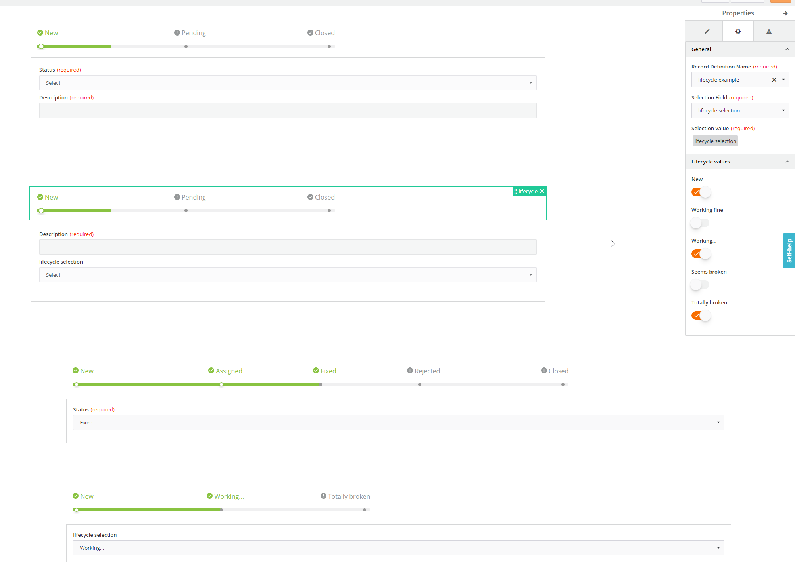
  </details>

* Description:
  * This view component displays a lifecycle bar. The available Status values are configurable at Design Time,
  * Shows how to:
    * Design Time:
      * Standard implementation implementing the BMC **IViewDesignerComponentModel** and extending **ViewDesignerComponentModel** which is the recommended way,
      * Leverage the **RxDefinitionPickerComponent** component to pick up a record definition (type "RxDefinitionPickerType.RegularRecord"),
        * Once the record definition is selected we will look for its selection fields to feed another input parameter type **SelectFormControlComponent**,
          * Once the field selected we will then create dynamically as many switches (**SwitchFormControlComponent**) as there are status values, the will all become Dynamic Input Parameters. As for the actions (see [fruit-picker](./JAVASCRIPT_ACTIONS.MD#fruit-picker)) the dynamic fields are stored here as ```statusList.<selectionValue>```:
          ```typescript
          {
            label: 'Lifecycle values',
              controls: [
              // Those values are those from the selection field (for example 0: new).
              // Those are dynamic input parameters.
              // As a reminder they are stored in the definition as:
              // statusList.<selectionValue> = "true", for example:
              // statusList.0 = "false"
              // You can look at the "fruit-picker" action for more details.
              // We build an array of input parameters (IFormControlBuilderConfig).
              ...(model.selectionFieldId ? _map(statusList, (status: ILifeCycleOption) => {
                return {
                  name: `statusList.${status.id}`,
                  component: SwitchFormControlComponent,
                  options: {
                    label: status.name
                  } as ISwitcherFormControlOptions
                }
              }) : [])
            ]
          }
          ```
      > :memo:  
      Please look at the design model code to see how this is implemented as the code is heavily commented.  
      The main idea is to have different Observable that will be fired when the record definition is picked. Then the list of selection fields will be fetched. This will trigger the fetch of the different selection values.  
      > Once all data are fetched a call is done to the method **setInspectorConfig()** which sets the input parameters properties, passing all necessary information (field list, status list etc...),
      * Validation of input parameters and dynamic input parameters (at least one status is necessary),
    * Design time component:
      * Leverage the Adapt **Workflow** component to display a dummy lifecycle bar,
    * Runtime:
      * Leverage the Adapt **Workflow** component to display the status selected in View Designer,
      ```html
      <adapt-workflow-carousel *ngIf="!isConfigurationInProgress">
        <adapt-workflow-carousel-slide *ngFor="let workflowStep of workflowSteps; let index = index">
          <adapt-workflow-step [title]="workflowStep.label"
                               [title-icon]="workflowStep.icon"
                               [type]="workflowStep.variant"
                               [size]="size"
                               [active]="index === 0"
          ></adapt-workflow-step>
        </adapt-workflow-carousel-slide>
        <adapt-workflow-bar [progress]="workflowProgress"
                            [activeIndex]="activeIndex"
                            [size]="size"
        ></adapt-workflow-bar>
      </adapt-workflow-carousel>
      ```
      * We get the status configuration only once to configure the Adapt **Step** component:
      ```typescript
          this.config.pipe(
            take(1)
          ).subscribe((config: ILifecycleParameters) => {
      ```
      * Once the initial configuration is done we only subscribe to the status change to change the progression in the lifecycle component:
      ```typescript
          this.config.pipe(
            pluck('selectionValue'),
            distinctUntilChanged(),
            takeUntil(this.destroyed$)
          ).subscribe((selectionValue: string) => {
            this.selectStep(Number(selectionValue));
          });
      ```
      * Access a record definition object leveraging the **RxRecordDefinitionCacheService** BMC service:
      ```typescript
      return this.rxRecordDefinitionCacheService.getRecordDefinition(recordDefinitionName)
      ```
* Complexity: :hot_pepper: :hot_pepper: :hot_pepper:
* Used in the example:
  * View: VC LifeCycle,

> :warning:  
> It seems there is no way to clear the input parameter dynamic fields at it is possible for the Actions.  
> This explains why the previous values are still visible in the view definition, though we set them to null to ignore them at runtime.


---

<a name="wizard"></a>
### wizard:
  <details> 
  <summary>wizard</summary>  

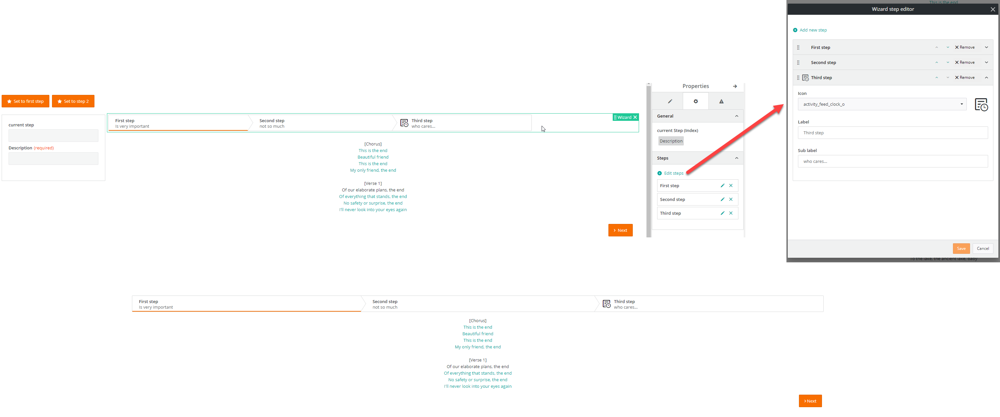
  </details>

* Description:
  * This view component can be used to create a Wizard, allowing you to create a progression bar,
  * It will implement the custom Inspector [step-editor](./JAVASCRIPT_INSPECTORS.MD#step-editor) to allow the business analyst to create the steps, 
  * Shows how to:
    * Design Time:
      * Standard implementation implementing the BMC **IViewDesignerComponentModel** and extending **ViewDesignerComponentModel** which is the recommended way,
      * Implement the custom Inspector [step-editor](./JAVASCRIPT_INSPECTORS.MD#step-editor) to allow the business analyst to create the steps:
        ```typescript
        {
          label: 'Steps', 
            controls: [
            {
              name: this.STEPS_KEY,
              component: StepEditorComponent,
              options: {
                label: 'Steps',
                isRequired: true
              } as IStepEditorOptions
            }
          ]
        }
        ```
      * Since the steps are an array of **StepsMenuItem** we need to cast them when setting the default or current values are they are stored as a string in the view definition:
      ```typescript
        static getInitialProperties(initialProperties?: IWizardParameters): IWizardParameters {
          return {
            currentStep: 0,
            ...initialProperties,
            // The stepList is an array of StepsMenuItem but is stored as a string even if it is
            // defined as an object in the interface. so we need to parse it back to an object.
            stepList: initialProperties.stepList ? JSON.parse(String(initialProperties.stepList)) : []
          }
        }
      ```
      * For the validation we want that when an error is detected for a specific step to open the step editor and focus on the step that has a problem,
        * For this it is very important in the **validate()** method to set the error "propretyName" to the input parameter name ("stepList") here, and NOT the step name or id for example. In our case the "stepList" is stored in "this.STEPS_KEY". To know which step has an error, we simply pass in "data" the index of the step. The [step-editor](./JAVASCRIPT_INSPECTORS.MD#step-editor) will read this value and focus the relevant step:
        ```typescript
                const error: IViewComponentDesignValidationIssue = {
                  description: 'The label is required.',
                  propertyName: this.STEPS_KEY,
                  type: 'error',
                  data: {
                    actionIndex: index
                  }
                };
        ```
      * Allow the "currentStep" input parameter to be set through a button "set property" action through the **prepareSetProperties()** method:
      ```typescript
          this.sandbox.setSettablePropertiesDataDictionary(componentName, this.prepareSetProperties());
          // ...
          return [
            {
              label: 'Current step (index)',
              expression: this.getExpressionForProperty('currentStep'),
            }
          ];
      ```
    * Design Time Component:
      * Leverage the Adapt **Steps** component to display the steps created by the Business Analyst in realtime,
        * For this it is necessary to get the "sandbox" object from the design model:
        ```typescript
        modelSandbox: IViewComponentDesignSandbox;
        //...
        this.modelSandbox = sandbox;
        ```
        In the design component:
        ```typescript
        @Input()
        model: WizardDesignModel;
        // ...
        this.model.modelSandbox.getComponentPropertyValue('stepList').subscribe()
        ```
    * Runtime:
      * Leverage the Adapt **Steps** component to display the status selected in View Designer,
        * :warning: Due to an adapt defect we need to use some ReplaySubject() to only get the configuration once. Then we would only subscribe to the "currentStep" input parameter to change the step,
      * Implement the "setProperty" method to allow a button to set the "currentStep" input parameter with a "set property" action:
      ```typescript
      api = {
        setProperty: this.setProperty.bind(this)
      };
      // ...
      this.notifyPropertyChanged('api', this.api);
      ```
* Complexity: :hot_pepper: 
* Used in the example:
  * View: VC Wizard,

> :warning:  
> The Adapt Steps component has several defects right now, and some workarounds have been applied to remediate those.


---

<a name="star-rating"></a>
### star-rating:
  <details> 
  <summary>star-rating</summary>  

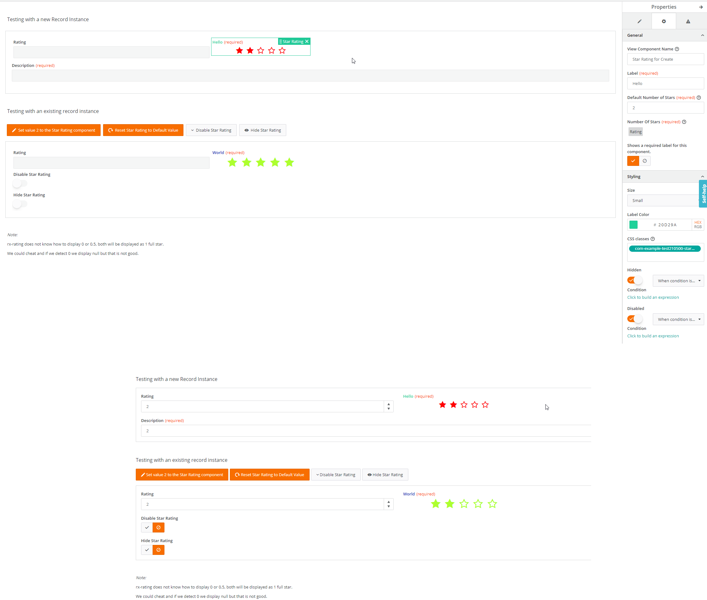
  </details>

* Description:
  * This view component will display a Star Rating component that will allow an end user to select from 0 to 5 stars,
  * This is the standalone version of the Record Field View Component [star-rating-field](./JAVASCRIPT_RECORD_FIELD_VIEW_COMPONENTS.MD#star-rating-field). The main difference is this version does not need a Record Editor field to function, 
  * It will implement the custom Inspector [step-editor](./JAVASCRIPT_INSPECTORS.MD#step-editor) to allow the business analyst to create the steps, 
  * Shows how to:
    * Design Time:
      * Standard implementation implementing the BMC **IViewDesignerComponentModel** and extending **ViewDesignerComponentModel** which is the recommended way,
      * Define multiple input parameters type, **TextFormControlComponent**, **ExpressionFormControlComponent**, **BooleanFormControlComponent**, **SelectFormControlComponent**,  **TagsFormControlComponent**, **ColorPickerFormControlComponent**,
        * Some properties are using the special Inspector **OptionalExpressionControlComponent** which are more dedicated to the "hidden" and "disabled" input parameters,
          * They will display a Switch, and a selection field to define if the property should be always true / false or depend on an Expression,
      * Set the input parameters default values or current values,
          * It shows also how to cast boolean value in the **getInitialProperties()** since the boolean value is stored as a string in the view definition:
          ```typescript
            static getInitialProperties(initialProperties?: IStarRatingParameters): IStarRatingParameters {
              return {
                // Name is a general property and does not need to be declared in the view component registration module.
                name: '',
                defaultNumberOfStars: 2.5,
                numberOfStars: 0,
                numberOfStarsSelected: 0,
                hidden: false,
                disabled: false,
                label: '',
                size: '',
                cssStyles: null,
                labelColor: '#000000',
                // isRequired: false,
                ...initialProperties,
                //  We have to cast the "isRequired" value to Boolean as it is stored as a string in the properties
                // even if declared as boolean in the registration module.
                // The BooleanFormControlComponent requires a boolean value.
                isRequired: initialProperties && String(initialProperties.isRequired) === 'true'
              }
            }
          ```
      * Implement a special "name" input parameter that can be used by the Business Analyst to specifically identify the View Component in the data dictionary or the breadcrumb:
      ```typescript
        const componentName = name ? `${this.sandbox.descriptor.name} (${name})` : this.sandbox.descriptor.name;
        // ...
        this.sandbox.setCommonDataDictionary(this.prepareDataDictionary(componentName));
        // ...
        this.sandbox.setBreadcrumbs(componentName);
      ```
      * Allow some input parameters to be accessed through a button "set property" action through the **prepareSetProperties()** method:
      ```typescript
      this.sandbox.setSettablePropertiesDataDictionary(componentName, this.prepareSetProperties());
      // ...
      private prepareSetProperties(): IViewComponentDesignSettablePropertiesDataDictionary {
        return [
          {
            label: 'Hidden',
            expression: this.getExpressionForProperty('hidden'),
          },
          {
            label: 'Disabled',
            expression: this.getExpressionForProperty('disabled'),
          },
          {
            label: 'numberOfStars',
            expression: this.getExpressionForProperty('numberOfStars'),
          }
        ];
      }
      ```
    * Declare an output parameter:
    ```typescript
      this.sandbox.setCommonDataDictionary(this.prepareDataDictionary(componentName));
      // ...
      private prepareDataDictionary(componentName: string): IViewComponentDesignCommonDataDictionaryBranch {
        return {
          label: componentName,
          expression: this.getExpressionForProperty('api'),
          children: [
            {
              label: 'Number Of Stars Selected',
              expression: this.getExpressionForProperty('numberOfStarsSelected')
            }
          ]
        }
      }
    ```
    * Validate the input parameters:
    ```typescript
      this.validate(this.sandbox, componentProperties);
      // ...
      private validate(
        sandbox: IViewComponentDesignSandbox,
        model: any
      ): IViewComponentDesignValidationIssue[] {
        let validationIssues = [];
    
        // The model contains the input parameter values.
        if (model.defaultNumberOfStars < 0 ||  model.defaultNumberOfStars > 5 ) {
          validationIssues.push(sandbox.createError('The default number of stars must be a number between 0 and 5.', 'defaultNumberOfStars'));
        }
    
        if (!model.label) {
          validationIssues.push(sandbox.createError('The label cannot be empty.', 'label'));
        }
    
        // We are leveraging the Platform Css class validator.
        validationIssues = validationIssues.concat(validateCssClassNames(model.cssStyles));
    
        return validationIssues;
      }
    ```
    * Design Time Component:
      * Leverage the Adapt **adapt-rx-rating** component to display the options set by the Business Analyst in realtime,
        * For this it is necessary to get the "sandbox" object from the design model:
        ```typescript
        modelSandbox: IViewComponentDesignSandbox;
        // ...
        this.modelSandbox = sandbox
        ```
        In the design component:
        ```typescript
        combineLatest([this.model.modelSandbox.componentProperties$])
        ```
      * We can also change the default number of stars to display directly clicking in the star rating design component. For this we need to set the input parameters values and update the component properties:
      ```typescript
          this.starRatingParameters = {
            ...this.starRatingParameters,
            defaultNumberOfStars: value
          };
      
          this.model.modelSandbox.updateComponentProperties(this.starRatingParameters);
      ```
    * Runtime:
      * Leverage the Adapt **adapt-rx-rating** component,
      * Implement the "refresh", "focus" and "setProperty" methods overriding the default View Component apis:
      ```typescript
      api = {
        setProperty: this.setProperty.bind(this),
        setFocus: this.setFocus.bind(this),
        // In this example we use the refresh method to set the view component to default values.
        refresh: this.refresh.bind(this)
      };
      // ...
      this.notifyPropertyChanged('api', this.api);
      // ...
      
      refresh(): Observable<any> {
        this.componentInputParametersValues.numberOfStars = this.componentInputParametersValues.defaultNumberOfStars;
        this.notifyPropertyChanged('numberOfStarsSelected', this.componentInputParametersValues.numberOfStars);
      
        return EMPTY;
      }
      
      setProperty(propertyPath: string, propertyValue: any): void {
        switch (propertyPath) {
        case 'hidden': {
            this.componentInputParametersValues.hidden = propertyValue;
            break;
          }
        case 'disabled': {
            this.componentInputParametersValues.disabled = propertyValue;
            break;
          }
        case 'numberOfStars': {
            this.componentInputParametersValues.numberOfStars = propertyValue;
            this.notifyPropertyChanged('numberOfStarsSelected', this.componentInputParametersValues.numberOfStars);
            break;
          }
        default: {
            this.rxLogService.warning(`Standalone Field: property ${propertyPath} is not settable, value was ${propertyValue}.`);
          }
        }
      }
      
      setFocus(): Observable<any> {
        this.rxLogService.warning('Executing the view component focus method.');
      
        return EMPTY;
      }
      ```
      * When the number of star changes (when the user clicks on one star or when the value is changed by a button action "set property") the component broadcast the new values using the output parameter "numberOfStarsSelected":
      ```typescript
      this.notifyPropertyChanged('numberOfStarsSelected', this.componentInputParametersValues.numberOfStars);
      ```
* Complexity: :hot_pepper: :hot_pepper:
* Used in the example:
  * View: VC star rating as standalone view component,

  
---

<a name="qr-code-generator"></a>
### qr-code-generator:
  <details> 
  <summary>qr-code-generator</summary>  

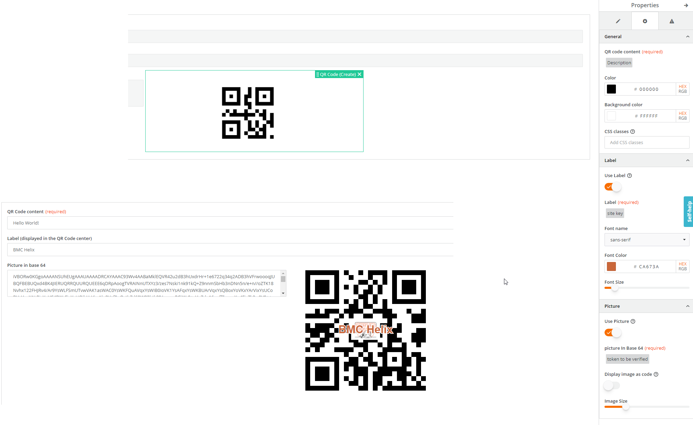
  </details>

* Description:
  * This view component will generate a QR code and has a multiple of options (picture in its center, label, size, color etc...),
  * It will implement the custom Inspector [slider](./JAVASCRIPT_INSPECTORS.MD#slider) to set the font and QR Code size, 
  * Shows how to:
    * Design Time:
      * Standard implementation implementing the BMC **IViewDesignerComponentModel** and extending **ViewDesignerComponentModel** which is the recommended way,
      * Define multiple input parameters type, **ColorPickerFormControlComponent**, **TagsFormControlComponent**, **SwitchFormControlComponent**, **ExpressionFormControlComponent**,  **SelectFormControlComponent**, **SliderComponent**,
    * Display some input parameters conditionally, for example the options specifics for the picture will not be displayed if the Business Analyst did not turn the "usePicture" switch on.
      * We listen to the "usePicture" value change with a "usePicture$" Observable,
      * When its value change we update the Input Parameters configuration accordingly,
    ```typescript
          // If the usePicture property change we have to add / remove some configuration fields.
          const usePicture$ = this.sandbox.componentProperties$.pipe(
            pluck('usePicture'),
            distinctUntilChanged()
          );
          // ...
          const labelAndPicture$ = combineLatest([useLabel$,usePicture$]);
          // ...
          // Resetting picture input parameter values if necessary.
          usePicture$.pipe(
                  skip(1)
          ).subscribe((usePicture) => {
            this.sandbox.updateComponentProperties({
              usePicture,
              // Here if the we want to use the picture we reset the linked input parameters to their default values.
              // The fields themselves will be added later through the subscription of labelAndPicture$.
              ...(usePicture ?
                      {
                        pictureBase64: '',
                        imageAsCode: false,
                        imageSize: QR_CODE_GENERATOR_OPTIONS.defaultValues.fontSize
                      }
                      : {})
            });
          });
          // ...
          labelAndPicture$.subscribe(([useLabel, usePicture]) => {
            // Setting the input parameters properties.
            this.sandbox.updateInspectorConfig(this.setInspectorConfig(initialComponentProperties, useLabel, usePicture));
          });
          // ...
          private setInspectorConfig(model, useLabel: boolean, usePicture: boolean) {
          // ...
            {
              label: 'Picture',
              controls: [
                // If the picture is selected we add three more options.
                {
                  name: 'usePicture',
                  component: SwitchFormControlComponent,
                  options: {
                    label: 'Use Picture',
                    tooltip: new Tooltip('The picture will be displayed in the center of the Qr Code, behind of the label (if any label is set).')
                  } as ISwitcherFormControlOptions
                },
                ...(usePicture ? [
                  {
                    name: 'pictureBase64',
                    component: ExpressionFormControlComponent,
                    options: {
                      label: 'picture In Base 64',
                      dataDictionary$: this.expressionConfigurator.getDataDictionary(),
                      operators: this.expressionConfigurator.getOperators(),
                      isRequired: true
                    } as IExpressionFormControlOptions
                  },
                  {
                    name: 'imageAsCode',
                    component: SwitchFormControlComponent,
                    options: {
                      label: 'Display image as code',
                      tooltip: new Tooltip('The picture will be merged with the QR code.')
                    } as ISwitcherFormControlOptions
                  },
                  {
                    name: 'imageSize',
                    component: SliderComponent,
                    options: {
                      label: 'Image Size',
                      minValue: 0,
                      maxValue: 100
                    } as ISliderOptions
                  }
                ] : [])
              ]
            }
    ```
    * Validate the input parameters,
    * Runtime:
      * Leverage the **ngx-kjua** component passing the different parameters to the Component,
* Complexity: :hot_pepper: :hot_pepper:
* Third party libraries:
  * NPM modules: ngx-kjua (https://github.com/werthdavid/ngx-kjua),
* Used in the example:
  * View: VC QR code generator,

> **:memo:**  
> Be sure that the NPM library(ies) used in the library are not already provided by the Platform (Lodash for example). If third party NPM libraries are necessary be sure to add them at the library level, for example:
> ```bash
> cd src/main/webapp/libs/com-example-test210500
> npm install ngx-kjua --save
> ```  
> That should add the library in the package.json dependencies section:
> ```json
>  "dependencies": {
>    "ngx-kjua": "^1.12.3"
> }
>```  


---


<a name="open-blade"></a>
### open-blade:
<details> 
<summary>open-blade</summary>

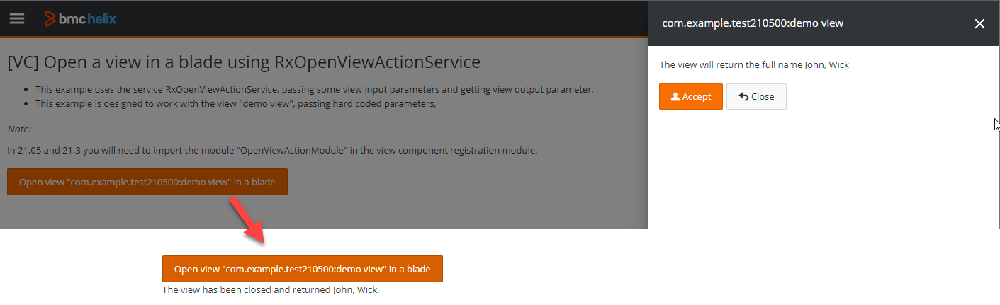  
</details>

* Description:
  * This view component shows how to open an Innovation Studio view in a blade, programmatically,
  * The example in view "VC Open view in blade":
    * Opens the view "demo view passing two hardcoded view input parameters,
    * Gets the view output parameter result if the view is closed or detects if the view has been closed using a "act as cancel" action,
  * Shows how to:
    * Design Time:
      * Simple implementation implementing the BMC **IViewDesignerComponentModel**,
      * Declare one Input parameter which leverages the OOTB inspector **RxDefinitionPickerComponent** with a type **RxDefinitionPickerType.View** to pick a view from the view definition picker,
    * Runtime:
      * Implement BMC OOTB **RxOpenViewActionService** service to open the view in a blade, passing view input parameters and getting the view ouput parameter on close,
* Complexity: :hot_pepper:
* Used in the example:
  * View: "VC Open view in blade", it opens the view "demo view",

> **:warning:**  
> In 21.05 and 21.3 it is necessary to import the module **OpenViewActionModule**, which contains the service **RxOpenViewActionService**, in the view component registration.module.ts file (here open-blade-registration.module.ts). This is done to avoid dependency injection error executing the code after the bundle is deployed and the view component is used.
> This will not be necessary in future releases.
> ```typescript
> import { OpenViewActionModule } from '@helix/platform/view/actions';
>
> @NgModule({
> imports: [OpenBladeDesignModule, OpenBladeModule, OpenViewActionModule]
> })
> ```
> **:memo:**    
> This dependency injection problem does not happen when the view component runs in debug mode.

---
