<h1 style="text-align:center">Debugging and Logging</h1>

## Table Of Contents:
* [Introduction](#introduction)  
* [How to debug Angular code (design time)?](#angular-design-time)  
* [How to debug Angular code (runtime)?](#angular-design-time)  
* [How to debug Java code?](#angular-runtime)  
* [Difference between debugging an Application or Library](#angular-application-library)  
* [Implementing logging in your code](#angular-application-library)  
  * [In Java](#angular-application-library)  
  * [In Angular](#angular-application-library)  
  * [Browser logging](#browser-logging)  
* [How to debug a Process or a Rule?](#process-rule)  


<a name="introduction"></a>
## Introduction
It is possible to actively debug UI components (View Component, Action) or Java components (Rest Api, Activity, Command, etc...) or passively enabling logs.

> :memo:   
> It is not possible to easily debug an environment that is protected by RSSO or hosted on BMC Saas servers.  
> The main reasons are:  
> * For Angular code: there would be an authentication error,
> * For Java code: the Java debug port is closed for security reasons,


<a name="angular-design-time"></a>
## How to debug Angular code (design time)?
We will leverage the usual Angular debug capabilities, using here ```npm start``` and passing the local sandbox IP or domain name.  
:memo: This command needs to be launched in the bundle "webapp" folder, for example:
```bash
/bundle/src/main/webapp
```

Here is the command to launch. apihost refers to the local sandbox server ip address or domain name:
```bash
npm start --apihost=<server-ip-or-domain-name>
```
For example:
```bash
npm start --apihost=192.168.159.135
```

Once the debug session is ready the bundle is ready to be debugged on "localhost" and port "4200":
```text
** Angular Live Development Server is listening on localhost:4200, open your browser on http://localhost:4200/helix **
```
<details> 
<summary>Angular debug session</summary>  

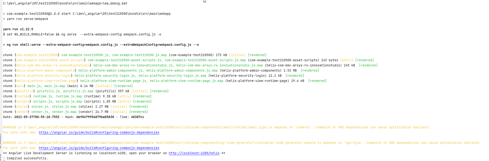
</details>

To debug the view in design time simply take the View url and replace the domain name and port by the "localhost" and "4200".
For example:
```text
http://192.168.159.135:8008/helix/index.html#/com.bmc.arsys.rx.innovationstudio/bundle/com.example.test210500/view/com.example.test210500:AC%20Fruits
```
Would be transformed to:
```text
http://localhost:4200/helix/index.html#/com.bmc.arsys.rx.innovationstudio/bundle/com.example.test210500/view/com.example.test210500:AC%20Fruits
```

You can then launch the web browser "developer tools" and debug your code as you would do with a standard Angular application.
<details> 
<summary>Angular debug example</summary>  

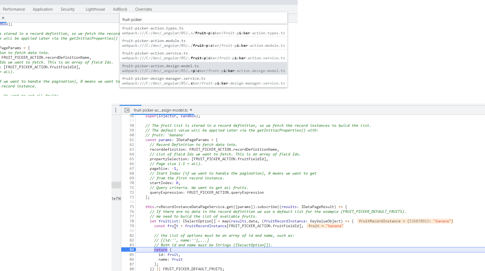
</details>

You can modify the code locally in your favorite IDE, the code change will be picked up automatically, the web browser page will then reload, and your latest changes will then be available.  
You do not need to deploy the bundle again to test the changes:
<details> 
<summary>Angular debug code update</summary>  

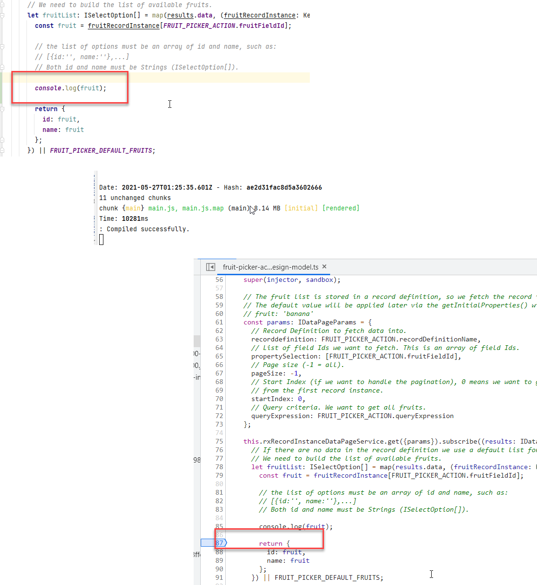
</details>

> :memo:  
> Once the debug session is finished of course you will need to deploy the bundle so end users can enjoy the latest changes.

> :warning:  
> Do not forget, when debugging Angular code, to set the RX_SDK_HOME folder to the SDK folder path as explained in the [documentation](https://docs.bmc.com/docs/is221/setting-up-your-ide-and-installing-bmc-helix-innovation-studio-sdk-1039589980.html?src=search), for example on Windows:
>  ```bash
> SET RX_SDK_HOME=C:\dev\sdk\com.bmc.arsys.rx.sdk-22.1.03
> ```
> On Mac Os:
>  ```bash
> export RX_SDK_HOME=/Users/<userName>/sdk/com.bmc.arsys.rx.sdk-22.1.03
> ```


<a name="angular-runtime"></a>
## How to debug Angular code (runtime)?
We will leverage the usual Angular debug capabilities, using here ```npm start``` and passing the local sandbox IP or domain name.  
:memo: This command needs to be launched in the bundle "webapp" folder, for example:
```bash
/bundle/src/main/webapp
```

Here is the command to launch. apihost refers to the local sandbox server ip address or domain name:
```bash
npm start --apihost=<server-ip-or-domain-name>
```
For example:
```bash
npm start --apihost=192.168.159.135
```

Once the debug session is ready the bundle is ready to be debugged on "localhost" and port "4200":
```text
** Angular Live Development Server is listening on localhost:4200, open your browser on http://localhost:4200/helix **
```
<details> 
<summary>Angular debug session</summary>  


</details>

To debug the view in runtime simply navigate to the runtime View url and replace the domain name and port by the "localhost" and "4200".
For example:
```text
http://192.168.159.135:8008/helix/index.html#/com.example.test210500/view/com.example.test210500:AC%20Fruits
```
Would be transformed to:
```text
http://localhost:4200/helix/index.html#/com.example.test210500/view/com.example.test210500:AC%20Fruits
```

You can then launch the web browser "developer tools" and debug your code as you would do with a standard Angular application.
<details> 
<summary>Angular debug example</summary>  

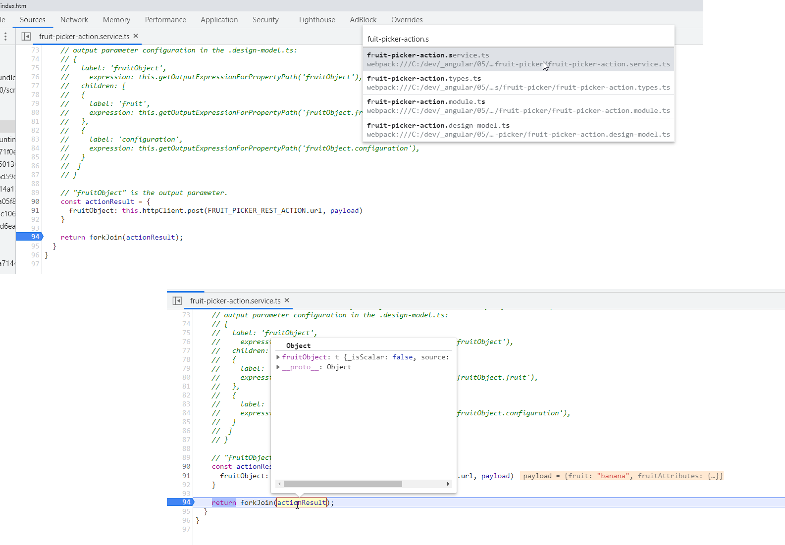
</details>

As for the [design time](#angular-design-time) You can modify the code locally in your favorite IDE, the code change will be picked up automatically, the web browser page will then reload, and your latest changes will then be available.  
You do not need to deploy the bundle again to test the changes:
<details> 
<summary>Angular debug code update</summary>  

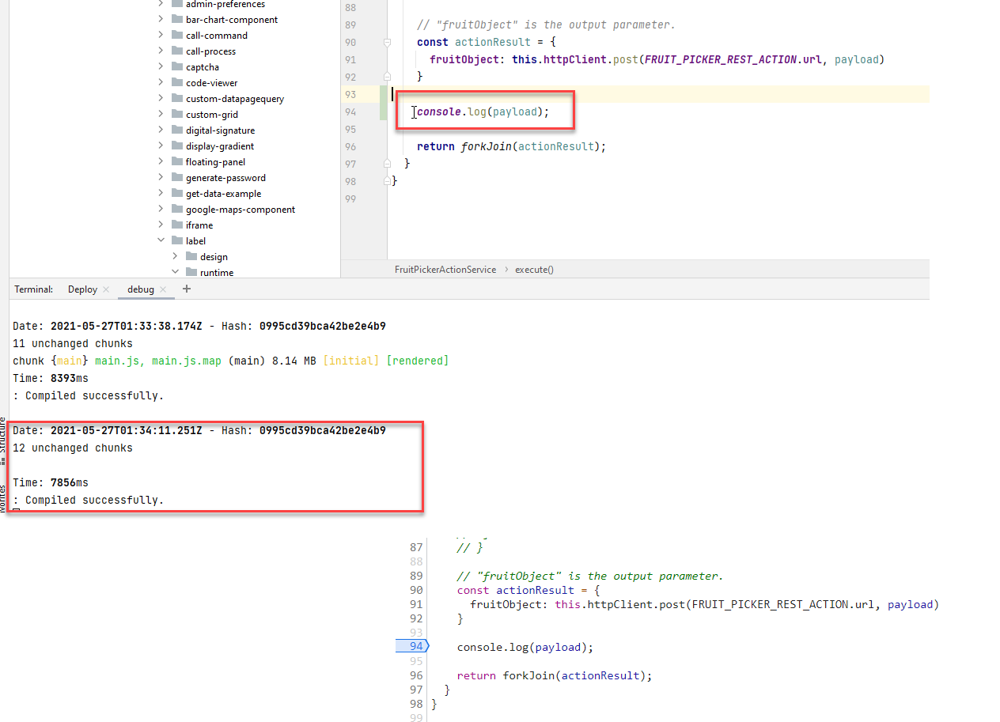
</details>

> :memo:  
> Once the debug session is finished of course you will need to deploy the bundle so end users can enjoy the latest changes.

> :warning:  
> Do not forget, when debugging Angular code, to set the RX_SDK_HOME folder to the SDK folder path as explained in the [documentation](https://docs.bmc.com/docs/is221/setting-up-your-ide-and-installing-bmc-helix-innovation-studio-sdk-1039589980.html?src=search), for example on Windows:
>  ```bash
> SET RX_SDK_HOME=C:\dev\sdk\com.bmc.arsys.rx.sdk-22.1.03
> ```
> On Mac Os:
>  ```bash
> export RX_SDK_HOME=/Users/<userName>/sdk/com.bmc.arsys.rx.sdk-22.1.03
> ```


> :warning:  
> Do not forget, when debugging Angular code, to set the RX_SDK_HOME folder to the SDK folder path as explained in the [documentation](https://docs.bmc.com/docs/is221/setting-up-your-ide-and-installing-bmc-helix-innovation-studio-sdk-1039589980.html?src=search), for example on Windows:
>  ```bash
> SET RX_SDK_HOME=C:\dev\sdk\com.bmc.arsys.rx.sdk-22.1.03
> ```
> On Mac Os:
>  ```bash
> export RX_SDK_HOME=/Users/<userName>/sdk/com.bmc.arsys.rx.sdk-22.1.03
> ```


<a name="java"></a>
## How to debug Java code?
This can be done leveraging the OOTB "remote connection" debug configuration from your favorite Java IDE such as Eclipse or IntelliJ Idea.  
In this example I am using IntelliJ Idea, but you can do the same on pretty much all IDEs.  
We simply need to set a "Remote JVM Debug" configuration, using as "Host" the server domain or IP and as "Port" the port "12444" which is the Java debug port:  
<details> 
<summary>Java debug configuration</summary>  

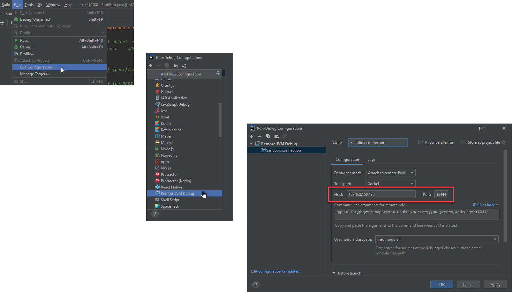
</details>

You can now trigger the debug session, set breakpoints in your code and debug the code:
<details> 
<summary>Java debug example</summary>  

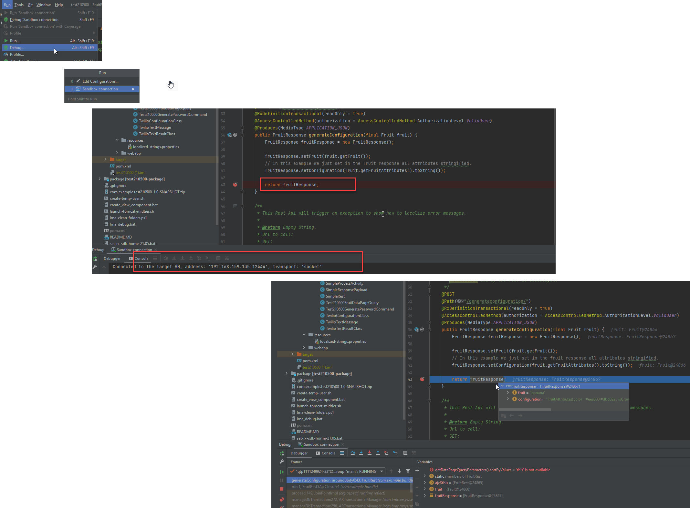
</details>

> :memo:  
> As explained on this [BMC Community post](https://community.bmc.com/s/question/0D53n00007Zn4MlCAJ/innovation-studio-remote-debugging-super-slow), Eclipse can take quite some time to connect to a Sandbox since it tries to synchronize all threads.  
> Some other IDEs like IntelliJ Idea do not by default and connect much faster.


> :memo:  
> The changes performed locally might not be reflected at execution, you might need to deploy your bundle with the Java code changes.

> :warning:  
> It is recommended to disconnect the "remote server" connection once the debug is finished.
> It is recommended to advise other team members or end users that a debug session is active as stopping at a breakpoint will impact other developers and end users.

> :memo:   
> It is not possible to debug a server hosted on BMC Saas servers for security reasons. All debug operations should be done on a local sandbox.  


<a name="angular-application-library"></a>
## Difference between debugging an Application or Library
> :memo:  
> There is no difference for Java debugging, only for Angular debugging.
  
> :memo:  
> There is no difference for Angular design time debugging.
  
There are some differences between a bundle Application or Library when trying to debug runtime View Components or Actions.    
The main difference is that a bundle Library does not have a shell and cannot be launch from the Application Switcher or through the "Visit Deployed Application" link:
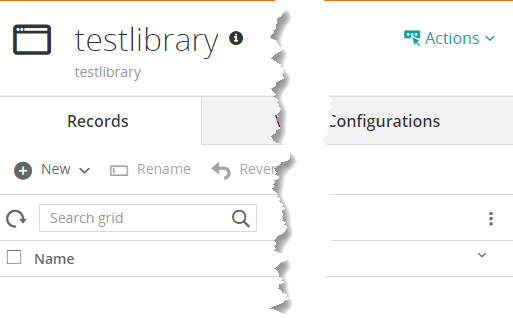


In order to debug the "runtime" part of a View Component, or an Action you would need to use this View Component or Action in an Application.  
The Application can be a coded or codeless application.  
Like described in the [How to debug Angular code (runtime)?](#angular-runtime) section you simply need to:
* Launch the library in debug mode using the command:
  ```bash
  npm start --apihost=<server-ip-or-domain-name>
  ```
* Launch the Application where the View Component or Action is used and change the base url to localhost:4200, for example from:
    ```text
    http://192.168.159.135:8008/helix/index.html#/com.example.test210500/view/com.example.test210500:VC%20Getting%20Record%20Definition%20Data
    ```
    To:
    ```text
    http://localhost:4200/helix/index.html#/com.example.test210500/view/com.example.test210500:VC%20Getting%20Record%20Definition%20Data
    ```

> :warning:  
> Do not forget, when debugging Angular code, to set the RX_SDK_HOME folder to the SDK folder path as explained in the [documentation](https://docs.bmc.com/docs/is221/setting-up-your-ide-and-installing-bmc-helix-innovation-studio-sdk-1039589980.html?src=search), for example on Windows:
>  ```bash
> SET RX_SDK_HOME=C:\dev\sdk\com.bmc.arsys.rx.sdk-122.1.03
> ```
> On Mac Os:
>  ```bash
> export RX_SDK_HOME=/Users/<userName>/sdk/com.bmc.arsys.rx.sdk-22.1.03
> ```


<a name="logs"></a>
## Implementing logging in your code
<a name="logs-java"></a>
### In Java
You can use the BMC **logger** service to log information in your Java code as described in this [tutorial](https://docs.bmc.com/docs/is221/logging-and-error-handling-for-the-mealorderservice-1039588775.html):
```javascript
ServiceLocator.getLogger().error("Message");
```

A file will be generated in the server with the name matching your bundle name. This configuration is created automatically in the bundle "Configurations". You can change the name, or the log level in the "Administration" console:
<details> 
<summary>Logger configuration</summary>  

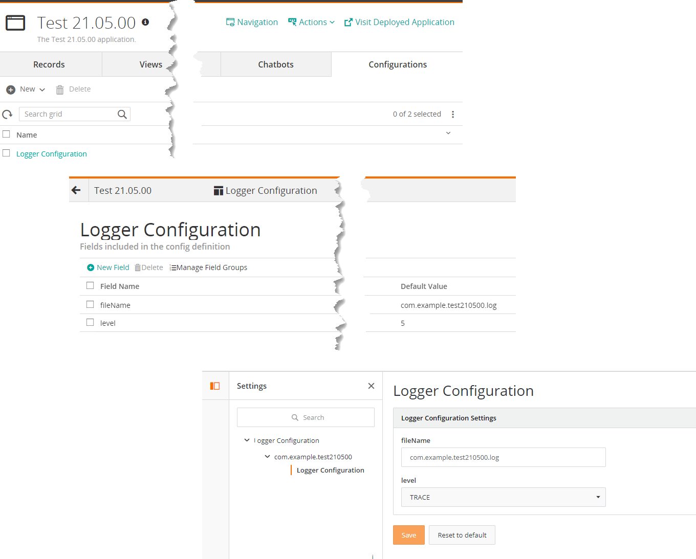
</details>

> :memo:  
> It is recommended to let the file name as proposed.

> :memo: 
> This logger is also used when getting debug information in the UI as described in the ["browser logging" documentation](https://docs.bmc.com/docs/is221/enabling-browser-logging-in-an-application-1039590051.html?src=search).  
> Please see the ["browser logging"](#browser-logging) section below.


<a name="logs-angular"></a>
### In Angular
You can use the **RxLogService** BMC Service to add logs to your Angular code. It is recommended to do so rather than using ```console.log```.  
This service is used in several examples, here is the implementation in the ["star-rating"](../_details/JAVASCRIPT_VIEW_COMPONENTS.MD#star-rating) View Component:
```typescript
import { RxLogService } from '@helix/platform/shared/api';
// ...
constructor(private rxLogService: RxLogService)
// ...
this.rxLogService.warning('Executing the view component focus method.');
```

> :warning:  
> Those logs will not be displayed in the web browser console by default, you need to enable the ["browser logging"](#browser-logging) as described below.


<a name="browser-logging"></a>
### Browser logging
It is possible to activate ["browser logging"](https://docs.bmc.com/docs/is221/enabling-browser-logging-in-an-application-1039590051.html?src=search) as described in the documentation.  
Enabling browsing login will allow you to see:
* [Angular](#logs-angular) logs,
* [Java](#logs-java) logs,
* Sql, Api, [Process, Rule](#process-rule) logs,

In order to see the logs you need to launch the web browser console (hitting F12 for Chrome for example) and set the log level in the Console window, using the object ```rx.logger.setCategories()```.  
This method accepts an array of type of logs, type ```rx.logger.setCategories()``` to get a list of available values:
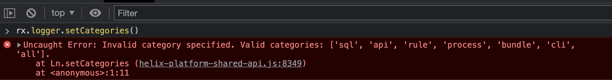
  
Here for example we set the logs "api" and "sql":
```rx.logger.setCategories(['api', 'sql'])```
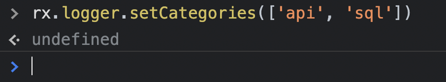
  
You can see the type of logs currently being logged typing ```rx.logger.getCategories()```:
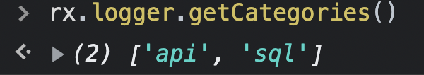

In order to reset the log categories, simply use the setCategories() method with an empty array, ```rx.logger.setCategories([])```:
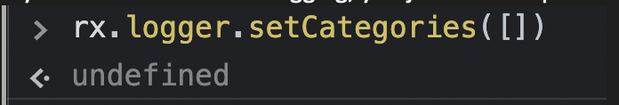

> :warning:  
> Some logs are not accessible to all users. For example server logs will not be displayed for non admin users.

> :warning:  
> Some server logs will not be displayed in the UI, for example if not triggered by a UI interaction (click on a button for example).  
> This can happen for Processes triggered by a Time Based Rule, asynchronous processes or background tasks operations.
> If you wish to access those logs it is recommended to enable the server logs in the Administration console as described in the ["How to debug a Process or a Rule?"](#process-rule) section below.


<a name="process-rule"></a>
## How to debug a Process or a Rule?
You can refer to the official [documentation](https://docs.bmc.com/docs/is221/enabling-and-downloading-logs-from-bmc-helix-innovation-studio-1039590046.html) on how to enable Process logs in the Administration console.  
[TODO] A file "process.log" will be created in the server, containing the process and rules logs.
