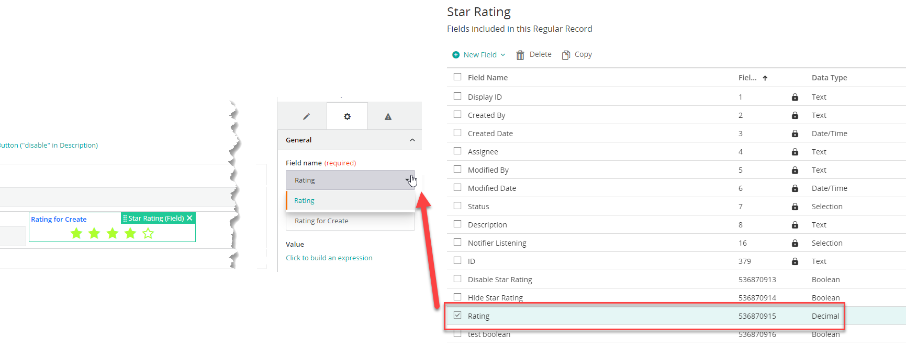

<h1 style="text-align:center">Creating a Record Field view component</h1>

## Table Of Contents:
* [Introduction](#introduction)
* [Record field view component architecture](#architecture)
  * [Record field view component definition](#view-component-definition)
  * [File structure](#file-structure)
* [How to create a record field view component?](#create-view-component)
* [Star-rating code walk-through](#star-rating)
  * [Registration](./REGISTRATION.MD)
  * Design Time
    * [Design time (Model)](./DESIGN_TIME_MODEL.MD)
    * [Design time (Component)](./DESIGN_TIME_COMPONENT.MD)
  * [Runtime](./RUNTIME.MD)


<a name="introduction"></a>
## Introduction
The View designer consists of built-in view components (like record grid, record editor). You can create your own custom view components. A view component is a regular Angular component. To create a custom view component you can create an Angular component and register it to make it available in the View designer.  
A Record Field view component is a component that cannot function on its own as it needs to be embedded in a **record editor** component (like a Text, Number, Selection field for example).  
If you wish to create a field view component which does not depend on a **record editor** please check this [tutorial](../_view-component/VIEW_COMPONENT.MD).  

For example, if you want end users to let their feedback in your application using a "star rating" component rather than using a number field you can create such a graphical view component.  

In this example we will detail the view component [star-rating-field](../../_details/JAVASCRIPT_RECORD_FIELD_VIEW_COMPONENTS.MD#star-rating-field).  
This view component leverages the Adapt **adapt-rx-rating** component that will allow us to speed up the development time as we will not need to code the component itself but embed it.

  
> :warning:  
> You must ensure that you follow naming conventions (namespacing) for all angular object names and all HTML filenames in shared code.  
> See [coding and naming guidelines](../CODING_NAMING_GUIDELINES.MD).


<a name="architecture"></a>
## Record field view component architecture
<a name="view-component-definition"></a>
### Record field view component definition
A Record Field view component is placed in a "record editor" field in a View and usually:
* Is linked to a Record Definition field
  * For example a Number field storing the number of stars,
* Executes some code,
  * For example here we set the number of stars and react when the end user selects the number of stars,
* Set the linked record definition field value,
  * For example when the End User selects a star in the star rating component,




<a name="file-structure"></a>
### File structure
A view component has usually this file structure, separated in two folders:
* "root" level (registration):
  * registration.module: Contains its name and reference to the other necessary objects or services (name, definition, execution, validation),
    * The registration module is imported in the main library module,
* /design:
  * Files necessary for the design time in View designer,
    * Display in the palette and the canvas, how to display the Input Parameters, validation code,
    * Their code will be executed at **design time**, in View Designer, 
  * .module: Design time module referencing the design time component,
  * .design.model: Declares the view component Input and Output parameters as well as the Input Parameters validation,
  * .design.component (ts and html): Angular component that will be displayed in the View designer canvas,
  * .interface: Necessary interface, usually the Input Parameters,
* /runtime:
  * Files necessary for runtime operation,
    * Display in the runtime view, how to consume the Input Parameters, execute code and broadcast Output Parameters,
    * Their code will be executed at **runtime**, 
  * .module: runtime module referencing the runtime component,
  * .component (ts and html): Angular component that will be displayed at runtime, in the view,

> :memo:  
> In the star-rating example we use other files:
> .types: Contains some constants, 


<a name="create-view-component"></a>
## How to create a record field view component?:
You can use our schematics to generate a skeleton code.  
> :memo:  
> A schematic is a templating system which will automatically create the necessary files, name them appropriately and automatically import the necessary modules in the main library.  
  
Go in the webapp folder and type:
```bash
yarn run ng g rx-field-view-component "<view-component-name>"
```
For example:
```bash
yarn run ng g rx-field-view-component "star-rating-field"
```

> :memo:  
> To do a "dry run", which means trying to create the view component without actually creating or updating the files, add "--dry-run" at the end of the command line, for example:
> ```bash
> yarn run ng g rx-field-view-component "star-rating-field" --dry-run
> ```

> :memo:  
> It is highly recommended leveraging this capability rather than creating the file structure manually.  


<a name="star-rating"></a>
## Star rating field code walk-through
* Click [here](./REGISTRATION.MD) for the Registration chapter,
* Design Time:
  * Click [here](./DESIGN_TIME_MODEL.MD) for the Design Time chapter (Model),
  * Click [here](./DESIGN_TIME_COMPONENT.MD) for the Design Time chapter (Component),
* Click [here](./RUNTIME.MD) for the Runtime chapter,
