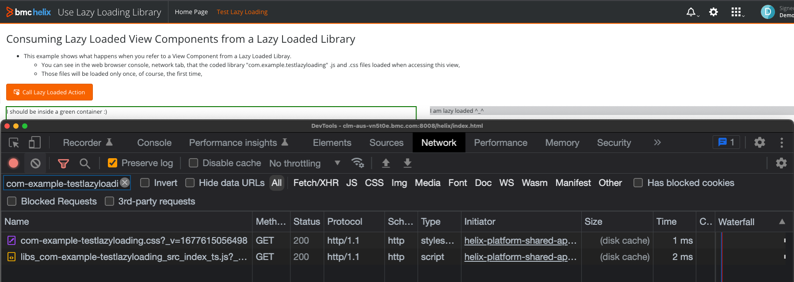

# Testing View Component / Bundle Lazy Loading
History:
* Version:
  * 0.1, 2023/02/28, Initial comments.
* Author: Laurent Matheo.


## Table Of Contents:
* [What is this](#what-is-this),
* [Installation (using the zip file)](#installation),
* [Updating your SDK / Developer Environment (if needed)](#update),
* [Build and installation using the source code](#build),
* [Disclaimer](#disclaimer),
* [Support](#support),
* [Links](#links),
* [More Importantly](#more-importantly),


<a name="what-is-this"></a>
## What is this? :)
This repository shows a very advanced concept available for coded bundles (Application or Library) for Innovation Suite, how to Lazy Load a coded bundle View Components or Actions.  
This means that the coded bundle coded files (.js and .css), would only be loaded when one of its UI element (View Component or action) is used in a View.    
  
For example, let's say that we have:
* A Pizza tool coded Library that has a View Component "Pizza Tracker",
* A Pizza codeless application with a couple of views:
  * Order Console:
    * Generic view listing all orders,
  * Order Details:
    * View displaying the details on an order, using the "Pizza tool" view component "Pizza Tracker",
  
#### When accessing the Pizza codeless application Order Console view:
* The user sees that the code (.js, .css) of the "Pizza tool" coded library is not loaded, as it is set to be "lazy loaded" (we will see how later).  
#### When the user clicks on an order to see the Order Details:
* Since this view leverages the View Component "Pizza Tracker", the Platform automatically loads the coded library "Pizza tool" coded files (.js and .css).   

This example leverages the 22.1.03 SDK (Angular).  


<a name="installation"></a>
## Installation (using the zip files):
There are two bundles in this example:
* The coded library [com.example.testlazyloading-1.0-SNAPSHOT.zip](com.example.testlazyloading-1.0-SNAPSHOT.zip),
* The codeless application [com.example.uselazyloadinglibrary-1.0.0-INSTALL.zip](./_codeless%20application/com.example.uselazyloadinglibrary-1.0.0-INSTALL.zip),

You can just deploy the files on your development environment (the development environment for Angular (22.x) is not yet available on the [BMC Developer Portal](https://developers.bmc.com/site/global/home/index.gsp).    
Here are the [instructions](https://docs.bmc.com/docs/is221/deploying-your-digital-service-application-for-the-first-time-to-start-working-in-bmc-helix-innovation-studio-1039589996.html?src=search) to start working with Innovation Studio. 


<a name="update"></a>
## Updating your SDK / Developer Environment (if needed):
* [21.x to 22.1.00](https://docs.bmc.com/docs/is221/upgrading-bmc-helix-innovation-studio-sdk-to-22-1-00-1039588344.html),
* [22.1.00 to 22.1.01](https://docs.bmc.com/docs/is221/upgrading-bmc-helix-innovation-studio-sdk-to-22-1-01-1139535103.html),
* [22.1.01 to 22.1.02](https://docs.bmc.com/docs/is221/upgrading-bmc-helix-innovation-studio-sdk-to-22-1-02-1139535102.html),
* [22.1.02 to 22.1.03](https://docs.bmc.com/docs/is221/upgrading-bmc-helix-innovation-studio-sdk-to-22-1-03-1145632021.html),
* [22.1.03 to 22.1.04](https://docs.bmc.com/docs/is221/upgrading-bmc-helix-innovation-studio-sdk-to-22-1-04-1172068569.html),


> :memo:  
> You can also look at the [upgrade](#upgrade-breaking-changes) section.


<a name="build"></a>
# Build and installation using the source code from com.example.testlazyloading:
Please follow those steps:
* Prepare your developer environment installing several [pre-requisites](https://docs.bmc.com/docs/is221/setting-up-your-ide-and-installing-bmc-helix-innovation-studio-sdk-1039589980.html?src=search),
  * You will need nodeJs, maven, Yarn, Grunt and Java (OpenJDK).  

Here are the steps:
* Clone this GitHub repository,
* Change the content of the parent "pom.xml" file to insert your credentials:
```xml
    <!-- START: Bundle specific configuration. Verify and Change as per environment -->
    <developerUserName>developer</developerUserName>
    <developerPassword>password</developerPassword>
    <!-- Server name with Jetty port. -->
    <webUrl>https://developerXXXX.innovate.bmc.com</webUrl>
    <!-- END: Bundle specific configuration.-->
```
* run this command to build to deploy the coded application on your developer environment as per the [documentation](https://docs.bmc.com/docs/is221/deploying-your-digital-service-application-for-the-first-time-to-start-working-in-bmc-helix-innovation-studio-1039589996.html?src=search):
  * ```bash
    mvn clean install -Pdeploy
    ```

<a name="lazy-loading"></a>
# How does Lazy Loading work?
This repository shows a very advanced concept available for coded bundles (Application or Library) for Innovation Suite, how to Lazy Load a coded bundle View Components or Actions.  
This means that the coded bundle coded files (.js and .css), would only be loaded when one of its UI element (View Component or action) is used in a View.

For example, let's say that we have:
* A Pizza tool coded Library that has a View Component "Pizza Tracker",
* A Pizza codeless application with a couple of views:
  * Order Console:
    * Generic view listing all orders,
  * Order Details:
    * View displaying the details on an order, using the "Pizza tool" view component "Pizza Tracker",

#### When accessing the Pizza codeless application Order Console view:
* The user sees that the code (.js, .css) of the "Pizza tool" coded library is not loaded, as it is set to be "lazy loaded" (we will see how later).
#### When the user clicks on an order to see the Order Details:
* Since this view leverages the View Component "Pizza Tracker", the Platform automatically loads the coded library "Pizza tool" coded files (.js and .css).

# How to enable Lazy Loading?
You simply need to modify the file [package.json](./bundle/src/main/webapp/package.json) and set in the "manifest" section the "generate" parameter to true.  
By default, the value is set to false. "false" means that the coded bundle code (.js and .css) will always be loaded when any view is accessed.
```json
    "manifest": {
      "generate": true,
      "loadJs": "lazy",
      "loadCss": "lazy"
    }
```

When the maven build command is run ```mvn clean install```, you see in the bundle target folder a new file "./bundle/target/web-build/webapp/scripts/com-example-testlazyloading.json" which contains different information, such as the list of View Components and Actions.  
This file is automatically generated and will be part of the coded bundle installation zip file.
```json
{
  "viewComponents": [
    "com-example-testlazyloading-label-lazy-loaded"
  ],
  "viewActions": [],
  "applicationInitializers": [],
  "options": {
    "loadCss": "lazy",
    "loadJs": "lazy"
  }
}
```


# Note on Design Time (Innovation Studio View Designer)
Even if a coded bundle is marked as lazy loaded, it will always be loaded during Design Time, as its View Component(s) should be available in View Designer Palette or in the Action picker, for example:
<details> 
<summary>View Designer View</summary>  


</details>

<details> 
<summary>View Designer Palette</summary>  


</details>


# How to force the loading of some resources, even if the coded bundle is Lazy Loaded?
In the manifest section of the [package.json](./bundle/src/main/webapp/package.json) file, there are two properties "loadJs" and "loadCss", by default they are set to "lazy":
```json
    "manifest": {
      "generate": true,
      "loadJs": "lazy",
      "loadCss": "lazy"
    }
```
Here are the different values that can be applied to those settings:  
* lazy
  * The Platform will load it (whether it is the coded bundle .js or .css file) when a View Component or Action is used in a view,
* always
  * The Platform will always load it (whether it is the coded bundle .js or .css file), as if it is not lazy loaded,
  * This can be useful when for example some global css classes have been defined and are used to alter some Container appearance. In this case we might want to always load the coded bundle .css file which would contain those styles.


# Example:
In our example, the .js and .css are lazy loaded:  
```json
    "manifest": {
      "generate": true,
      "loadJs": "lazy",
      "loadCss": "lazy"
    }
```

You can see that, when accessing the test codeless bundle "com.example.uselazyloadinglibrary" ("Use Lazy Loading Library") Home Page view that the coded bundle .js and .css files are not loaded:  
<details> 
<summary>Use Lazy Loading Library, Home Page screenshot</summary>  


</details>

When accessing the view "Test Lazy Loading", you can see that the Platform loads the bundle "com.example.testlazyloading" .js and .css resources since the coded library View Component is used in this view:
<details> 
<summary>Use Lazy Loading Library, Test Lazy Loading screenshot</summary>  


</details>


<a name="disclaimer"></a>
# Disclaimer:
These samples are released by Laurent Matheo and are released "as is" as code samples. There is no warranty, liability or support on those examples.  
The license is now BSD 3 (see LICENSE file (https://github.com/bmcsoftware/innovation-studio-developer/blob/main/LICENSE)).  

<a name="support"></a>
# Support:
Please find support on the [BMC Developer Community](https://community.bmc.com/s/group/0F93n000000Plr8CAC/developer-community) if you have any questions or feel free to use this git repo features (bug report etc...).

<a name="links"></a>
# Links:
* [BMC Helix Youtube channel](https://www.youtube.com/channel/UCufKJEem7x7_IaTUPbTYuww),
* [BMC Developer portal](https://developers.bmc.com/site/global/home/index.gsp),
* [BMC Developer Community](https://community.bmc.com/s/group/0F93n000000Plr8CAC/developer-community),
* [BMC Documentation for BMC Helix Platform](https://docs.bmc.com/docs/is221/),

<a name="more-importantly"></a>
## More importantly:
I hope it helps :)
