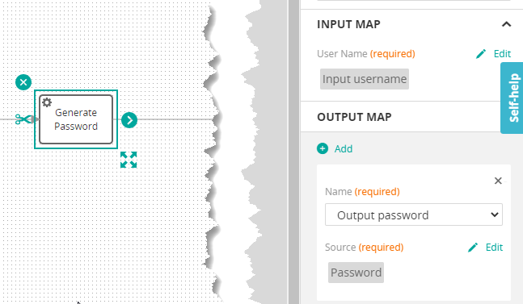
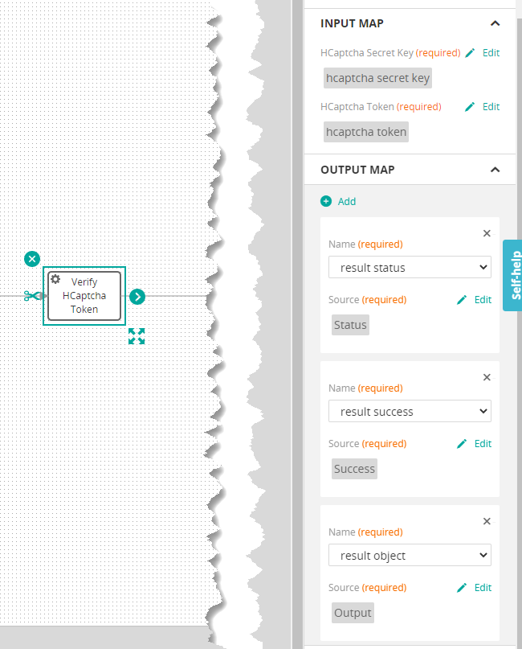
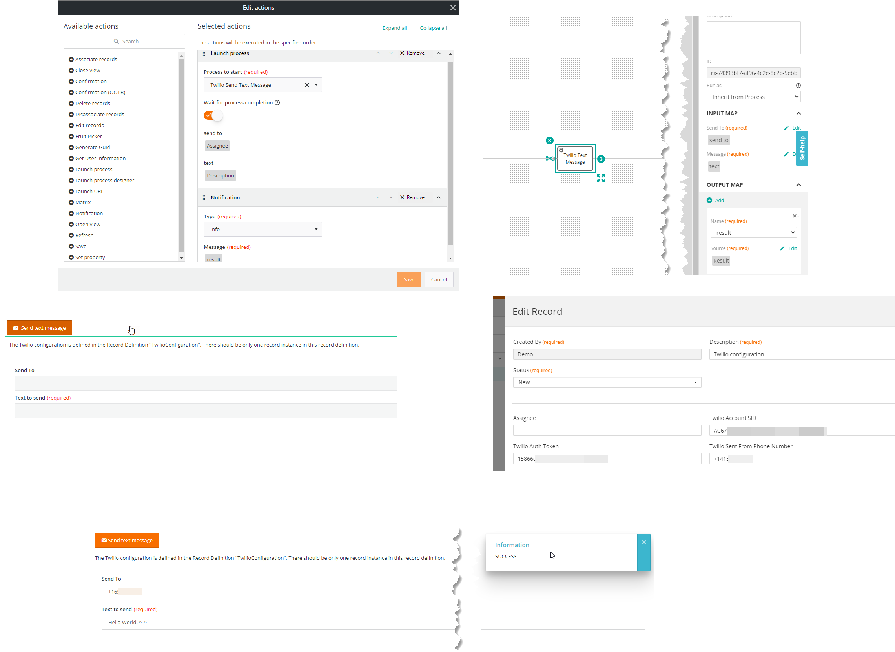
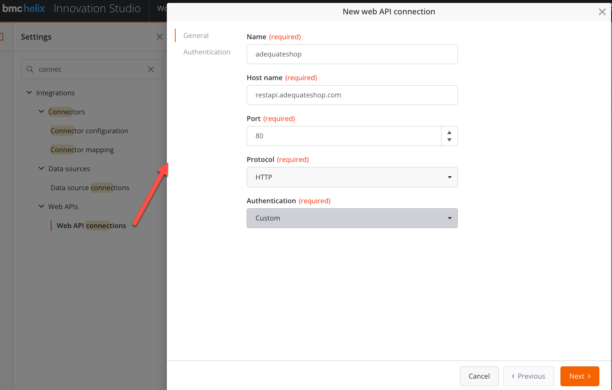
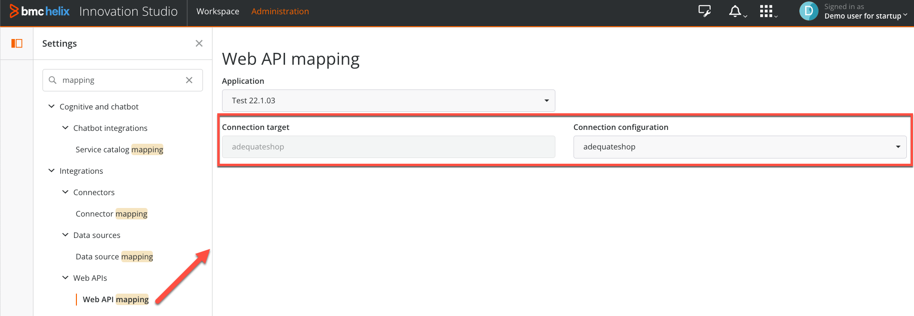

<h1 style="text-align:center">Java (Activities, Rest Api, Command, Datapage Query)</h1>

## Content Details:
It is possible to create some Java objects that can be consumed in [Javascript Actions](./JAVASCRIPT_ACTIONS.MD) / [View Components](./JAVASCRIPT_VIEW_COMPONENTS.MD) or simply by external clients (Postman for example, a [Remedy filter](https://docs.bmc.com/docs/ars221/calling-third-party-rest-apis-in-a-remedy-application-1040157678.html?src=search)) or in Innovation Studio [Process](https://docs.bmc.com/docs/display/is221/Process+designer+elements) / [Rule](https://docs.bmc.com/docs/is221/rule-designer-interface-1039588438.html) designer.  

It is possible to create different types of objects:  
* Activities:
  * Business logic "blocks" that can be used in a Process or a Rule (for example checking a Token). It can have input and output parameters,
* Rest Apis: 
  * Custom Rest Apis, usually consumed by external applications for integration (Remedy, Postman, third party applications) or even using the [Web Api](https://docs.bmc.com/docs/is221/configuring-web-requests-in-a-business-process-1039588905.html) object in innovation Studio,
* Commands:
  * "Special" rest apis, their goal is to trigger a workflow, or an action on the backend side, they do not usually return data,
* Datapage query: 
  * Objects that is usually consumed in a View Component that return formatted data from a source. Usually used in a custom grid,

> **:warning:**  
> It is advised to use the BMC OOTB components if possible.


### How to create a Java Object?:
For now, you would need to create the file structure manually and register the Rest Api, Activity, Command manually in the file "MyApplication.java".


## Java Object list
> :memo:  
> The information for the Java Objects listed here are not exhaustive and should not be taken as a tutorial.  
> Only some specific or interesting details are listed here. Please refer to each Java Objects code as the code is heavily commented.

* [SimpleProcessActivity](#SimpleProcessActivity),
* [CheckHCaptchaToken](#CheckHCaptchaToken),
* [TwilioTextMessage](#TwilioTextMessage),
* [CreateAttachmentFromBase64File](#CreateAttachmentFromBase64File),
* [GetListSize](#GetListSize),
* [GetListValueByIndex](#GetListValueByIndex),
* [AccessRecordInstances](#AccessRecordInstances),
* [XmlAttachmentToJson](#XmlAttachmentToJson),
* [SimpleRest](#SimpleRest),
* [FruitRest](#FruitRest),
* [Test210500GeneratePasswordCommand](#Test210500GeneratePasswordCommand),
* [Test210500FruitDataPageQuery](#Test210500FruitDataPageQuery),


---

<a name="SimpleProcessActivity"></a>
### SimpleProcessActivity (generate password):	
<details> 
<summary>SimpleProcessActivity (generate password) screenshot</summary>  


</details>

* Type: Custom activity,
* Description: Shows how to get an input parameter and return an Object,
* We need to implement **Service** from BMC and create an **@Action**:
```javascript
public class SimpleProcessActivity implements Service
// ...
@Action(name = "generatePassword", scope = Scope.PUBLIC)
public SimpleResponsePayload generatePassword(@ActionParameter(name = "userName") @NotBlank @NotNull String userName) {
```
* ```scope = Scope.PUBLIC``` means that the Activity can be used in all bundles, 
* Complexity: :hot_pepper:
* Used in the example:
  * View component: call-process (through the process below),
  * Process: generate password,

---

<a name="CheckHCaptchaToken"></a>
### CheckHCaptchaToken:
<details> 
<summary>CheckHCaptchaToken screenshot</summary>  


</details>

* Type: Custom activity,
* Description: Consumes hCaptcha rest call to verify a token validity. Accepts an input parameter and returns an Object,
* We need to implement **Service** from BMC and create an **@Action**:
```javascript
public class SimpleProcessActivity implements Service
// ...
@Action(name = "verifyHCaptchaToken",
        scope = Scope.PUBLIC)
public HCaptchaAnswer verifyHCaptchaToken
```
* ```scope = Scope.PUBLIC``` means that the Activity can be used in all bundles,
* Complexity: :hot_pepper: :hot_pepper:
* Used in the example:
  * View: VC Captcha,
  * Process: Validate hCaptcha token,

---

<a name="TwilioTextMessage"></a>
### TwilioTextMessage:
* Type: Custom activity,
* Description: Send a Text message using Twilio,
* We need to declare some maven packages in the /bundle/pom.xml file that are necessary for Twilio:
```xml
<!-- Dependency for Twilio text service :: BEGIN  -->
<dependency>
    <groupId>com.twilio.sdk</groupId>
    <artifactId>twilio</artifactId>
    <version>(7.0,7.9)</version>
</dependency>
<!-- Those two extra dependencies are needed for Twilio... -->
<dependency>
    <groupId>org.apache.httpcomponents</groupId>
    <artifactId>httpclient</artifactId>
    <version>4.5.3</version>
</dependency>
<dependency>
    <groupId>com.google.collections</groupId>
    <artifactId>google-collections</artifactId>
    <version>1.0</version>
</dependency>
<!-- Dependency for Twilio text service :: END  -->
```
* The configuration is stored in the record definition "com.example.test210500:TwilioConfiguration" in the first record instance,
* The view "Send text message using Twilio" allows you to send a text message to a phone number,
  * The button is calling the process "Twilio Text Message" passing the text to send, and the destination phone number as input parameters,
  * The next button action will display the result,
    <details> 
    <summary>TwilioTextMessage screenshot</summary>  
    
    
    </details>
* ```scope = Scope.PUBLIC``` means that the Activity can be used in all bundles,
* Complexity: :hot_pepper: :hot_pepper:
* Used in the example:
  * View: Send text message using Twilio,
  * Process: Twilio Text Message,

> :warning:  
> This example does not provide the Twilio SID and Token.


---

<a name="CreateAttachmentFromBase64File"></a>
### CreateAttachmentFromBase64File:
* Type: Custom activity,
* Description: Create an attachment and adds it to an existing record instance,
* ```scope = Scope.PUBLIC``` means that the Activity can be used in all bundles,
* The file itself is converted form a base64 string to an array of bytes:
```java
        byte[] decompressedBytes = Base64.getDecoder().decode(cleanedBase64String);
```
* We use standard BMC Innovation Studio Java Apis to prepare the Attachment Object:
```java
        Attachment attachedSignature = new Attachment(
            recordDefinitionName,
            recordInstanceId,
            fileName,
            Integer.parseInt(attachmentFieldId),
            decompressedBytes
        );
```
* And then persist (save) the Attachment:
```java
        recordService.persistAttachment(attachedSignature);
```
* Complexity: :hot_pepper: :hot_pepper:
* Used in the example:
  * View: CACT Create attachment from a Custom Process Activity,
  * Process: Create attachment from custom activity,

> :info:  
> This is just for the sake of the example on how to use Java Apis as there is a "Create Attachment" available in Process Designer that can achieve the same result (see "Digital Signature" example).

---

<a name="GetListSize"></a>
### GetListSize:
* Type: Custom activity,
* Description: Returns an array (list) of objects size. For example, it could be a list of Text passed from a Process, or a Document property that would be an array,
* ```scope = Scope.PUBLIC``` means that the Activity can be used in all bundles,
* Since we do not know the type of the array passed and its content, we need to use an array (List) of Objects as the custom activity input:
```java
        public int getListSize(@ActionParameter(name = "list") List<Object> list) {
```
* It is then very easy to return the size:
```java
        listSize = list.size();
```
* Complexity: :hot_pepper:
* Used in the example:
  * View: CACT get list size and get list index,
  * Process: List manipulation,


---

<a name="GetListValueByIndex"></a>
### GetListValueByIndex:
* Type: Custom activity,
* Description: Returns an element (Object) from a given array (list) of Objects. For example, it could be the third element from a list of Text passed from a Process, or a Document property that would be an array,
* ```scope = Scope.PUBLIC``` means that the Activity can be used in all bundles,
* Since we do not know the type of the array passed and its content, we need to use an array (List) of Objects as the custom activity input. We also return an Object:
```java
        public Object getListValueByIndex(@ActionParameter(name = "list") List<Object> list,
                                          @ActionParameter(name = "index") int index) {
```
* It is then very easy to return an element of the list size:
```java
        value = list.get(index);
```
* Complexity: :hot_pepper:
* Used in the example:
  * View: CACT get list size and get list index,
  * Process: List manipulation,


---

<a name="AccessRecordInstances"></a>
### AccessRecordInstances:
* Type: Custom activity,
* Description: This example shows how to manipulate Record Instances in Java using RecordService.
* ```scope = Scope.PUBLIC``` means that the Activity can be used in all bundles,
* It shows how to:
  * Get a record instance,
    * We simply need to call the method getRecordInstance() with the record definition name and the record instance ID (Guid):
      * ```java
        RecordInstance recordInstance = new RecordInstance();
        String recordInstance = recordService.getRecordInstance(RECORD_DEFINITION_NAME, DEMO_RECORD_INSTANCE_ID);
        ```
  * Modify a record instance,
    * We get a record instance using getRecordInstance(), modify some of its values using setFieldValue() and save it using updateRecordInstance():
      * ```java
        RecordInstance recordInstance = new RecordInstance();

        // We first get a record instance:
        recordInstance = recordService.getRecordInstance(RECORD_DEFINITION_NAME, DEMO_RECORD_INSTANCE_ID);

        // And then we modify it, adding the current time stamp.
        String timeStamp = new SimpleDateFormat("yyyy.MM.dd.HH.mm.ss").format(new java.util.Date());

        // We update the field Id 8 value (description field).
        recordInstance.setFieldValue(8, "Udpated " + timeStamp);
        recordService.updateRecordInstance(recordInstance); 
        ```
  * Create a record instance,
    * We prepare a record instance object, and use the method createRecordInstance() to create it:
      * ```java
        RecordInstance recordInstance = new RecordInstance();

        // Getting the record definition.
        RecordDefinition testRecord = recordService.getRecordDefinition(RECORD_DEFINITION_NAME);

        // Preparing a new RecordInstance Object, we are using a helper method.
        // Here we are setting two fields with some values.
        recordInstance.setRecordDefinitionName(RECORD_DEFINITION_NAME);
        addFieldInstanceToRecordInstance(8, "New Description", recordInstance, testRecord);
        addFieldInstanceToRecordInstance(Integer.parseInt(SEARCH_FIELD_ID), "I WILL BE DELETED SOON", recordInstance, testRecord);

        // Creating the new record instance.
        recordService.createRecordInstance(recordInstance);
        ```
  * Delete a record instance,
    * We need simply to provide the record definition name and the record instance Id (GUID) to the method :
      * ```java
        recordService.deleteRecordInstance(RECORD_DEFINITION_NAME, recordInstanceGuid);
        ```
  * Get an attachment,
    * We get an attachment object using the getAttachment method. At this point, it is possible to convert to an array of bytes for example.
      * ```java
        Attachment attachment = recordService.getAttachment(RECORD_DEFINITION_NAME, DEMO_RECORD_INSTANCE_ID, ATTACHMENT_FIELD_ID);
 
        // Getting the attachment filename.
        // The filename has a suffix (MediaType) so we need to remove it.
        fileName = attachment.getFileName();
        String[] arrayInfosFilename = fileName.split(",MediaType");
        fileName = arrayInfosFilename[0];

        // Getting attachment content, for now we return it, but it could be sent to another provider.
        byte[] myContent = attachment.getBinaryData();
        ```
  * Run a datapagequery to look for record instances based on a qualification,
    * Please check the example [Test210500FruitDataPageQuery](#Test210500FruitDataPageQuery),
  * Create an attachment,
    * Please check the example [CreateAttachmentFromBase64File](#CreateAttachmentFromBase64File),
* Complexity: :hot_pepper:
* Used in the example:
  * Process: Test record instances in Java,


---

<a name="XmlAttachmentToJson"></a>
### XmlAttachmentToJson:
* Type: Custom activity,
* Description: This example shows how to convert an Attachment Object (variable or Attachment from a Record Instance or Output from a Web Api returning Xml) to a Json string. This can be very useful when a Web Api returns Xml. In this case, the result is not a String, but an Attachment Object.
* ```scope = Scope.PUBLIC``` means that the Activity can be used in all bundles,
  * It shows how to:
    * Get an Attachment Object as Input Parameter,
      * ```java
         @ActionParameter(name = "xmlAttachment") @NotNull Attachment xmlAttachment
        ```
      * We extract the content of the Attachment object:
        * ```java
           xmlText = new String(xmlAttachment.getBinaryData(), StandardCharsets.UTF_8);
          ```
      * We simply use the objects from the third party library json to convert the xml to Json. Usually the indentation level is set to 100 in the examples.
        * ```java
           JSONObject xmlJSONObj = XML.toJSONObject(xmlText);
           jsonString = xmlJSONObj.toString(indentation);
          ```
* Complexity: :hot_pepper:
* Used in the example:
  * Processes: "Call XML Rest API and convert to Json" and "Convert XML attachment to Json", also in the view "Demo XML to Json conversion",

> :memo:  
> This example consumes a free Rest Api website (http://restapi.adequateshop.com/swagger/ui/index#!/Traveler/Traveler_GetTraveler).
> We are leveraging the third party Maven library "json".
```xml
<dependency>
    <groupId>org.json</groupId>
    <artifactId>json</artifactId>
    <version>20230227</version>
</dependency>
```

> :warning:  
> In order for the Web Api call to work in the View or the Process you will need to:
> Go in "Administration" and create a "Web Api Connection" entering those data, please note the connection "Name".
> 
> 
> Select on the left side this sample bundle, and on the right side the "Web Api Connection" you created in the first step.
> 


---


<a name="SimpleRest"></a>
### SimpleRest:
* Type: Custom Rest Api,
* Description: Shows how to create a GET rest api. Shows how to receive a parameter and return a Json object,
* We need to implement **RestfulResource** from BMC and create one or several Rest Apis, here a GET call:
  * http{s}://{server}:{port}/api/com.example.test210500/simplerestcall/generatepassword/{userName}
```javascript
@Path("simplerestcall")
public class SimpleRest implements RestfulResource
// ...
@GET
@Path("/generatepassword/{userName}")
@RxDefinitionTransactional(readOnly = true)
@AccessControlledMethod(authorization = AccessControlledMethod.AuthorizationLevel.ValidUser)
@Produces(MediaType.APPLICATION_JSON)
public SimpleResponsePayload generateReportEvents(@PathParam("userName") String userName)
```
* Complexity: :hot_pepper:
* Used in the example:
  * View: VC Generate Password,
  * View Component: generate-password,

---

<a name="FruitRest"></a>
### FruitRest:
* Type: Custom Rest api,
* Description:
  * Show how to create a POST. Shows how to receive a Json object and return a Json object,
  * Show how to create a GET call. This GET call with throw a custom exception that can be localized,
* We need to implement **RestfulResource** from BMC and create one or several Rest Apis, here a POST call:
  *  http{s}://{server}:{port}/api/com.example.test210500/fruit/generateconfiguration/
```javascript
@Path("fruit")
public class FruitRest implements RestfulResource
// ...
@POST
@Path("/generateconfiguration/")
@RxDefinitionTransactional(readOnly = true)
@AccessControlledMethod(authorization = AccessControlledMethod.AuthorizationLevel.ValidUser)
@Produces(MediaType.APPLICATION_JSON)
public FruitResponse generateConfiguration(final Fruit fruit)
```
* For the GET call:
  * http{s}://{server}:{port}/api/com.example.test210500/fruit/triggerexception/
```javascript
@GET
@Path("/triggerexception/")
@RxDefinitionTransactional(readOnly = true)
@AccessControlledMethod(authorization = AccessControlledMethod.AuthorizationLevel.ValidUser)
@Produces(MediaType.APPLICATION_JSON)
public String triggerException() 
```
* It is creating on purpose an error to rethrow a custom exception "FruitException":
```javascript
try {
    // We try to get an unknown record instance on an unknown record definition to trigger an exception.
    recordService.getRecordInstance("TOMATO", "TOMATO");
}
catch (RxException e) {
    // Throwing an exception on purpose to test error message localization.
    throw new FruitException(
            FruitException.FruitMessage.IS_TOMATO_A_FRUIT,
            "TOMATO",
            e );
}
```  
* The "FruitException" extends the **RxException** BMC class, provides an enum and overrides some **RxException** constructors:
> :memo:  
> Please see the official [BMC documentation](https://docs.bmc.com/docs/is221/logging-and-error-handling-for-the-mealorderservice-1039588775.html) that gives a very good explanation of the process. 
```javascript
private static final String BUNDLE_ID = "com.example.test210500";

// Defining the error messages enum.
public enum FruitMessage {
    IS_TOMATO_A_FRUIT(600100),
    IS_APPLE_A_FRUIT(600101);
    private final int intValue;

    FruitMessage(int intValue) {
        this.intValue = intValue;
    }

    public int intValue() {
        return intValue;
    }
}

// We need to override some constructors.
public FruitException(FruitMessage errorMessage, String appendedText, RxException e) {
    super(errorMessage.intValue(), BUNDLE_ID, appendedText, e);
}

// We can leverage the localization here.
public FruitException(FruitMessage errorMessage, Exception e) {
    super(errorMessage.intValue(), BUNDLE_ID, e.getLocalizedMessage(), null);
}

public FruitException(FruitMessage errorMessage, String appendedText) {
    super(errorMessage.intValue(), BUNDLE_ID, appendedText, null);
}
```
* As you can see above the error messages used are integers. The text themselves are defined in the file "src/main/resources/localized-strings.properties":
```text
600100=Is Tomato a Fruit?
600101=Is Apple a fruit?
```
> :memo:  
> Please see the [localization chapter](../_guides/LOCALIZATION.MD#how-to-leverage-localization-in-your-java-code) for more information about localizing Java strings.

> :warning:  
> In order for the server to use the strings you will need to run this command once to upload the strings to the server (this is explained in the [localization chapter](../_guides/LOCALIZATION.MD#how-to-leverage-localization-in-your-java-code)):
> ```bash
> mvn clean install -Plocalization
> ```
> else the server would not find the error message and return:
> ```json
> [
>   {
>     "messageType": "ERROR",
>     "messageNumber": 600100,
>     "messageText": "Message not found, [bundleId = com.example.test210500, messageNum = 600100]",
>     "appendedText": "TOMATO"
>   },
>   {
>     "messageType": "ERROR",
>     "messageNumber": 303,
>     "messageText": "Record Definition does not exist on server.",
>     "appendedText": "TOMATO"
>   }
> ]
> ```
* When calling the rest api you will see this error message:
```json
[
  {
    "messageType": "ERROR",
    "messageNumber": 600100,
    "messageText": "Is Tomato a Fruit?",
    "appendedText": "TOMATO"
  },
  {
    "messageType": "ERROR",
    "messageNumber": 303,
    "messageText": "Record Definition does not exist on server.",
    "appendedText": "TOMATO"
  }
]
```
* Complexity: :hot_pepper: :hot_pepper:
* Used in the example:
  * View: AC Fruits,
  * Action: fruit-picker,

---

<a name="Test210500GeneratePasswordCommand"></a>
### Test210500GeneratePasswordCommand:
* Type: Custom Command,
* Description: Shows how to create a Command. A Command is usually used as a way to trigger an action server side and usually does not return a result.  
  Shows how to receive a Input Parameters and return a Json object,
* We need to implement **Command** from BMC and override the **execute** method:
```javascript
public class Test210500GeneratePasswordCommand extends Command
// ...
@Override
@RxDefinitionTransactional(readOnly = true, isolation = Isolation.DEFAULT)
@AccessControlledMethod(authorization = AccessControlledMethod.AuthorizationLevel.ValidUser)
public URI execute(UriInfo arg0)
```
* As we want to return an object in this command, we need to override the **buildResponse** method:
```javascript
@Override
public Response buildResponse(URI uri, HttpHeaders httpHeaders)
```
* Complexity: :hot_pepper: :hot_pepper:
* Used in the example:
  * View: VC Call command,
  * View Component: call-command,

---

<a name="Test210500FruitDataPageQuery"></a>
### Test210500FruitDataPageQuery:
* Type: Custom datapage query,
* Description:
  * Prepares datapage query parameters (sort, field list, qualification),
  * Fetches data from a Record Definition,
  * Formats the data as Datapage Object,
* We need to implement **DataPageQuery** from BMC and set up the implement the class constructor:
```javascript
public class Test210500FruitDataPageQuery  extends DataPageQuery
// ...
public Test210500FruitDataPageQuery(DataPageQueryParameters dataPageQueryParameters) {
  super(dataPageQueryParameters);

  pageSize = dataPageQueryParameters.getPageSize();
  startIndex = dataPageQueryParameters.getStartIndex();
}
```
* We need to override the **execute** method to implement our logic, we need to return a **Datapage** object:
```javascript
@Override
@RxDefinitionTransactional(readOnly = true, isolation = Isolation.DEFAULT, rollbackFor = Exception.class)
@AccessControlledMethod(authorization = AccessControlledMethod.AuthorizationLevel.SubAdministrator, licensing = AccessControlledMethod.LicensingLevel.Application, checkSchemaForSpecialAccess = true, promoteStructAdmin = true)
public DataPage execute()
```
* Complexity: :hot_pepper: :hot_pepper:
* Used in the example:
  * View: VC Custom datapage query,
  * View Component: custom-datapagequery,
