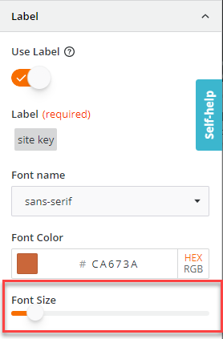
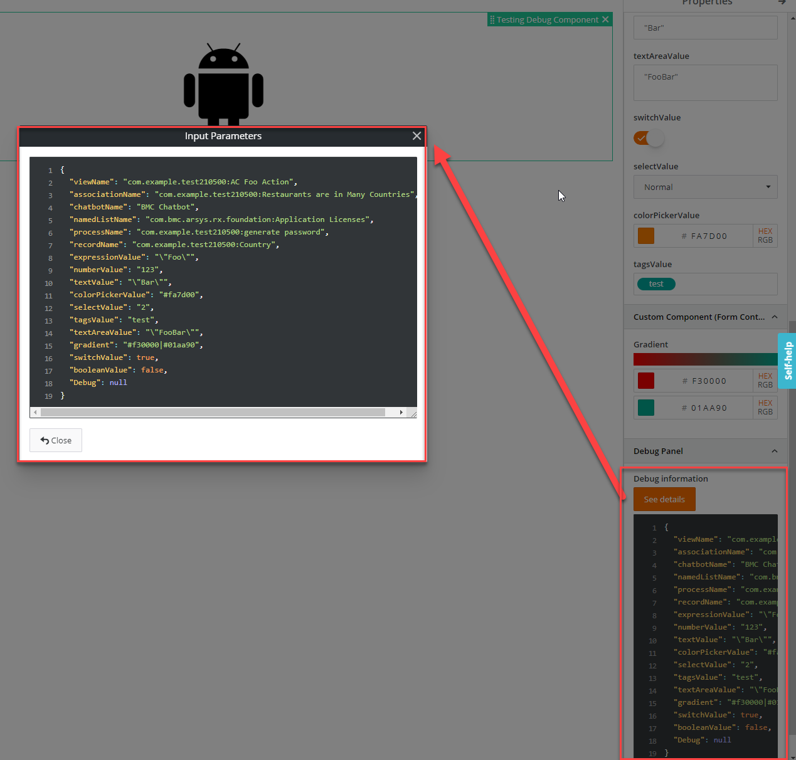
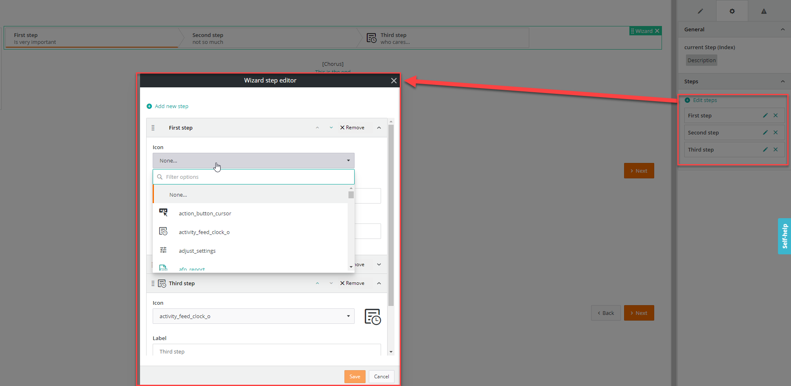

<h1 style="text-align:center">Inspectors (Form Control Components)</h1>

## Content Details:  
Inspectors are "Form Control Components" that are used in Javascript Actions or View Components as helpers when setting Input Parameters.  
For example, we have different types of Inspectors that allow to pick data from a selection field, enter an expression or pick a color using a color picker but not to create a gradient or use a slider.  
You can create your own inspectors (for example a slider) and use them in a [Javascript Action](./JAVASCRIPT_ACTIONS.MD) or [View Component](./JAVASCRIPT_VIEW_COMPONENTS.MD).  

> **:warning:**  
> It is advised to use the BMC OOTB components and if they do not fit the business need to leverage the BMC Adapt libraries to ensure a uniform UX experience.

## How to create one?:
For now, you need to create the file structure manually as there is no schematics for it.  
You can look at existing examples as for a template. Do not forget to have a unique Component name in the Component selector.    
It is advised to create them in the library "inspectors" folder, for example:
```bash
src/main/webapp/libs/com-example-test210500/src/lib/inspectors
```

## Important notes:
### Service created and used in an Inspector:
The inspectors are dynamically instantiated in view designer, which can cause some limitations. If you create a Service that is used by the Inspector, you would need to provide this service in your Inspector.  
You can have a look at the "gradient" example where the GradientService is described in the Gradient component:
```typescript
@Component({
  selector: 'com-example-test210500-com-example-test210500-gradient',
  templateUrl: './gradient.component.html',
  styleUrls: ['./gradient.component.scss'],
  providers: [
    {
      provide: NG_VALUE_ACCESSOR,
      useExisting: GradientComponent,
      multi: true
    },
    // We have to provide the GradientService else we will have an injector error
    // when using the GradientComponent as an Inspector.
    // This is because the Component is dynamically created using createComponent()
    // which seems to ignore the component module which contains the provider.
    GradientService
  ]
})
export class GradientComponent extends ValueAccessor<string> implements IFormControlComponent, AfterViewInit {
```

The other solution is to set the Service injectable at root level, which is usually [recommended](JAVASCRIPT_SERVICES.MD):
```typescript
@Injectable({
  providedIn: 'root'
})
export class GradientService {
```

### Using an Inspector in a View Component or Action:
The inspector module needs to be imported in the registration, design module or runtime modules when used. For example, you can look how the "Gradient" inspector is used in the [display-gradient](../bundle/src/main/webapp/libs/com-example-test210500/src/lib/view-components/display-gradient/runtime/display-gradient.component.ts) runtime component.  
It will depend on your use case:
```typescript
import {GradientModule} from "../../../inspectors/gradient/gradient.module";
// (...)
@Component({
  selector: 'com-example-test210500-com-example-test210500-display-gradient-design',
  styleUrls: ['./display-gradient-design.scss'],
  templateUrl: './display-gradient-design.component.html',
  standalone: true,
  imports: [CommonModule, FormsModule, GradientModule]
})
export class DisplayGradientDesignComponent implements AfterViewInit{
export class DisplayGradientRegistrationModule {
```

## Inspector list
> :memo:  
> The information for the Inspectors listed here are not exhaustive and should not be taken as a tutorial.  
> Only some specific or interesting details are listed here. Please refer to each Inspector code as the code is heavily commented.

* [slider](#slider),
* [gradient](#gradient),
* [log-parameters](#log-parameters),
* [step-editor](#step-editor),

---

## Javascript Inspectors (Form Control Component):
<a name="slider"></a>
### slider:
<details> 
<summary>Slider screenshot</summary>  


</details>

* Description:
  * Allows to select a numeric value using a slider,
  * We need to extend **ValueAccessor** and implements **IFormControlComponent** to tap into the input properties:
    ```typescript
    export class SliderComponent extends ValueAccessor<string> implements IFormControlComponent
    ```
  *  options will contain the different necessary data:
    ```typescript
      @Input()
      options: any;
    ```
  * The options are defined in the View Component design model options object, for example in the View Component [qr-code-generator](./JAVASCRIPT_VIEW_COMPONENTS.MD#qr-code-generator) we define the minValue as 0 and the maxValue as 100. Those values will be available in the ```options: any;``` object seen earlier: 
    ```typescript
      {
        name: 'fontSize',
        component: SliderComponent,
        options: {
          label: 'Font Size',
          minValue: 0,
          maxValue: 100
        } as ISliderOptions
    ```
  * The properties are inherited from the options object, and we can use and set them directly in the html:
    ```html
      <adapt-slider [(ngModel)]="value"
                    [min]="options?.minValue"
                    [max]="options?.maxValue"
                    [rangeHorizontal]="true">
      </adapt-slider>
    ```
  * Shows how to leverage **Adapt Label** and **Adapt Slider** components,
  * It is recommended to create an Interface that would list the different optional or required properties to be used in the View Component design model, here for example "ISliderOptions", 
* Complexity: :hot_pepper:
* Used in the example:
  * View: VC QR code generator,
  * View Component: qr-code-generator,

---

<a name="gradient"></a>
### gradient:
<details> 
<summary>Gradient screenshot</summary>  


</details>

* Description:
  * Allows selecting two colors, the start and end colors to define a gradient,
  * We need to extend **ValueAccessor** and implements **IFormControlComponent** to tap into the input properties:
    ```typescript
    export class GradientComponent extends ValueAccessor<string> implements IFormControlComponent
    ```
  * Shows how to:
    * Implement value getter and setter to get and set the left and right values coming from the html template,
      ```html
        <!--  Color pickers used for the left and right side of the gradient.-->
        <adapt-color-picker [disabled]="isDisabled"
                            [(ngModel)]="gradientLeftValue">
        </adapt-color-picker>
        <adapt-color-picker [disabled]="isDisabled"
                            [(ngModel)]="gradientRightValue">
        </adapt-color-picker>
      ```
    * The value itself is passed automatically by the **onWriteValue()** method:
      ```typescript
        onWriteValue(value: string) {
          this.gradientValue = value ? value : GRADIENT_COMPONENT_OPTIONS.defaultValues.left + '|' + GRADIENT_COMPONENT_OPTIONS.defaultValues.right;
      
          // Applying the gradient to the div sample.
          this.gradientService.drawGradient(this.gradientDivElement, this.gradientLeftValue, this.gradientRightValue);
        }
      ```
    * We can directly set the value using ```this.value```,  
    * Leverage **Adapt Color Picker** component,
    * Provide a service inside the Inspector Component,
* Complexity: :hot_pepper: :hot_pepper:
* Used in the example:
  * View: VC Gradient,
  * View Component: display-gradient,

---

<a name="log-parameters"></a>
### log-parameters:
<details> 
<summary>Log parameters screenshot</summary>  


</details>

* Description:
  * This Inspector is interesting to be added temporarily when developing an Action or View Component. It will display all input parameters and their values, making it easy to debug,
  * We need to extend **ValueAccessor** and implements **IFormControlComponent** to tap into the input properties:
    ```typescript
    export class GradientComponent extends ValueAccessor<string> implements IFormControlComponent
    ```
  * Shows how to:
    * Leverage **Adapt Code Viewer** component,
    * Provide an Adapt service inside the Inspector Component **CodeViewerService**,
    * Shows how to subscribe the View Component or Action configuration Observable object to subscribe to the configuration changes:
      ```typescript
          this.options.inputParameterAttributes$.subscribe((currentInputParameters) => {
            this.inputParameters = currentInputParameters;
            // The code viewer expects a string.
            this.inputParametersString = JSON.stringify(currentInputParameters, undefined, 2);
          });
      ```
      We need to forward this inputParameterAttributes$ observable from the View Component design model, for example in [test-debug-component](./JAVASCRIPT_VIEW_COMPONENTS.MD#test-debug-component):
      ```typescript
          private inputParameterAttributes$: Observable<any>;
          // ...
          this.inputParameterAttributes$ = this.sandbox.componentProperties$;
          // ...
            {
              name: 'Debug',
              component: LogParametersComponent,
              options: {
                label: 'Debug information',
                tooltip: new Tooltip('Here you can see all the different input parameters.'),
                isRequired: true,
                inputParameterAttributes$: this.inputParameterAttributes$
              } as ILogParametersOptions
            }
      ```
    * Use **RxViewActionService** (action "**rxOpenViewAction**") BMC Service to open a view passing view input parameters,
      * The view used here is "com.example.test210500:VC Code Viewer Modal",
* Complexity: :hot_pepper: :hot_pepper:
* Used in the example:
  * View: VC Test Debug,
  * View Component: test-debug-component,

---

<a name="step-editor"></a>
### step-editor:
<details> 
<summary>Step editor screenshot</summary>  


</details>

* Description:
  * This Inspector is specific to the "wizard" view component and allows you to mimic the button "actions" functionalities, aka to:
    * See, edit, remove the different steps,
    * Display a custom modal window to let you create / edit / delete a step,
  * We need to extend **ValueAccessor** and implements **IFormControlComponent** to tap into the input properties:
    ```typescript
    export class GradientComponent extends ValueAccessor<string> implements IFormControlComponent
    ```
  * Shows how to:
    * Create a modal window with **AdaptModalService** Adapt service,
    * Pass data and consume this data using **ActiveModalRef**,
    * Implement a drag&drop UI using Angular CDK,
    * List available Adapt icons and use / display them in a **Adapt RX Select** component,
    * Leverage **Adapt Rx Text Field**, **Adapt Button**, **Adapt Empty State**, **Adapt Accordion** components,
    * Shows how to receive the View Component or Action configuration Observable object to subscribe to the configuration changes, 
    * Use **RxViewActionService** (action "**rxOpenViewAction**") BMC Service to open a view passing view input parameters,
* Complexity: :hot_pepper: :hot_pepper: :hot_pepper: :hot_pepper: 
* Used in the example:
  * View: VC Wizard,
  * View Component: wizard,
  
> **:memo:**  
> It is recommended to look at the code of this Inspector as it is heavily documented.
