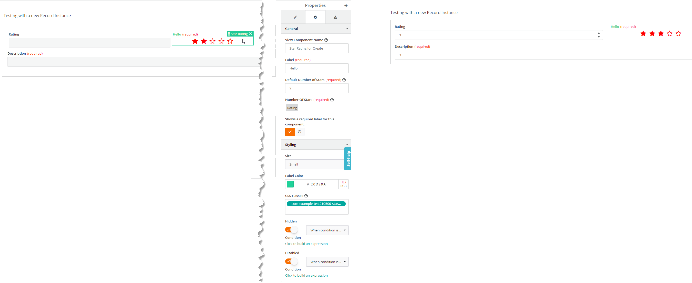

<h1 style="text-align:center">Javascript Record Field View Components</h1>

<a name="record-field-view-components"></a>
 
View Components are elements that can be dragged & dropped in View Designer to create a UI experience.  
They usually have two different components, one for Design time (View Designer) and one for Runtime, when the view is displayed.  
A View component can have input and output parameters.  
Usually a View Component is created when there is a lack in the components provided OOTB by BMC, for example a Gradient, a Lifecycle bar, Charts etc...

> **:memo:**  
> It is advised to use the BMC OOTB components and if they do not fit the business need to leverage the BMC Adapt libraries to ensure a uniform UX experience.


## What is the difference between a Standalone View Component, and a Record Field View Component?:
* [Standalone View Component](./JAVASCRIPT_VIEW_COMPONENTS.MD):
  * It can be used anywhere in the View Designer and does not rely on a Record Editor to get data,
  * It can be a chart for example, or a lifecycle bar,
* Record Field View Component:
  * It is designed to be used within a Record Editor field and is mapped to one of its field (for example a Numeric field),
  * It inherits the default base attributes (value, disabled, hidden) which do not need to be declared as input parameters,
  * It can be a star rating field for example,

## How to create a Record Field View Component?:
You can use our schematics to generate a skeleton code.
Go in the webapp folder and type:
```bash
npx ng g rx-field-view-component "<view-component-name>"
```
For example:
```bash
npx ng g rx-field-view-component "star-rating"
```

> :memo:  
> To do a "dry run", which means trying to create the action without actually creating or updating the files, add "--dry-run" at the end of the command line, for example:
> ```bash
> npx ng g rx-field-view-component "star-rating" --dry-run
> ```

## Record Field View Component list
> :memo:  
> The information for the Record Field View Components listed here are not exhaustive and should not be taken as a tutorial.  
> Only some specific or interesting details are listed here. Please refer to each Record Field View Component code as the code is heavily commented.

* [star-rating-field](#star-rating-field),

---


<a name="star-rating-field"></a>
### star-rating-field
You can see a full tutorial of this Record Field View Component in this [guide](../_guides/_record-field-view-component/VIEW_COMPONENT.MD).

<details> 
<summary>star-rating-field screenshot</summary>  


</details>

* Description:
  * This view component allows the end user to select from 0 to 5 stars, the result would be stored in a numeric field from a record editor,
  * Shows how to:
    * Create a Record Field View Component,
    * Define record component specific properties (Input parameter),
    * Module Registration:
      * Since the View Component will behave like a field in a Record editor it needs to be embeddable in a Record Editor:
      ```typescript
        options: {
            canBeEmbeddedInRecordEditor: true
        }
      ```
      It also needs to be insertable in a record editor:
      ```typescript
        canBeInsertedInto(componentTypes: string[]): boolean {
          return componentTypes.includes(RxViewComponentType.RecordEditor);
        }
      ```
    * When defining custom input parameters for the View Component it is very important to add them to the inherited Base input parameters using "`RX_BASE_FIELD_PROPERTIES.concat`", for example:
    ```typescript
          properties: RX_BASE_FIELD_PROPERTIES.concat([
            {
              name: 'size',
              type: ViewComponentPropertyType.String
            },
            {
              name: 'labelColor',
              type: ViewComponentPropertyType.String
            }
          ])
    ```
    * Design Time:
      * We must define which field type(s) can be used to store the value of the view component, using:
      ```typescript
        // This is the list of record instance fields types that can be used for the Star Rating field.
        fieldResourceTypes = [RX_RECORD_DEFINITION.resourceTypes.integer, RX_RECORD_DEFINITION.resourceTypes.decimal, RX_RECORD_DEFINITION.resourceTypes.real];
      ```
      * Inherit base properties from the BMC **BaseRecordEditorFieldDesign** like:
        * **model.label$**, **model.isRequired$**,
        ```typescript
            export class StarRatingFieldDesignModel extends BaseRecordEditorFieldDesign {
        ```
      * Get and set default Input Parameters values,
      * "Inject" the View Component Input Parameters in the Inspector configuration,
      * Validate the custom input parameters,
        * the "validate()" method is called automatically,
    * Runtime:
      * Inherit base properties or methods from the BMC **BaseRecordEditorFieldComponent** like:
        * **inReadState**, **isDisabled**, **isHidden**, **isRequired**, **getDisplayValue()**, **setFieldValue()**,
        ```typescript
            export class StarRatingFieldComponent extends BaseRecordEditorFieldComponent
        ```
      * Display the data in two modes (create / edit and read),
    * Leverage Adapt Component **rxRating**, and BMC **RxReadOnlyField**,
* Complexity: :hot_pepper: :hot_pepper:
* Used in the example:
  * View: VC star rating as a record editor field,

> **:memo:**  
> Some properties are inherited from the base record editor field design defined in "IBaseRecordEditorFieldProperties":  
> label, model (value)  
> fieldId: string;  
> label: string;  
> disabled: string;  
> hidden: string;  
> value?: string;  
> styles?: string;  

