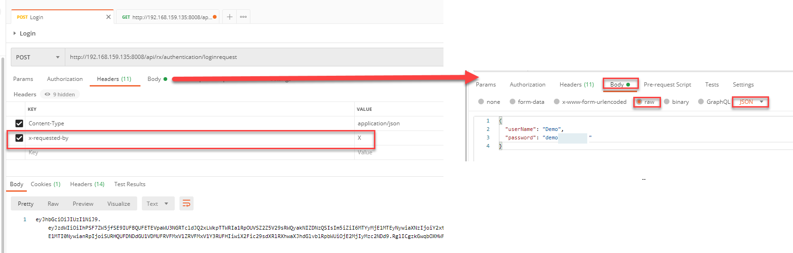
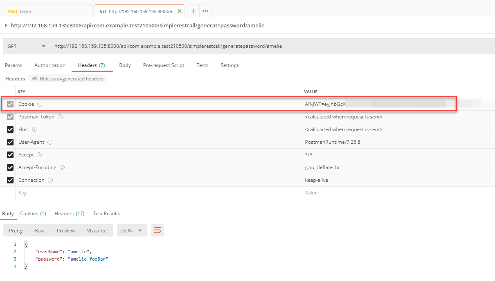
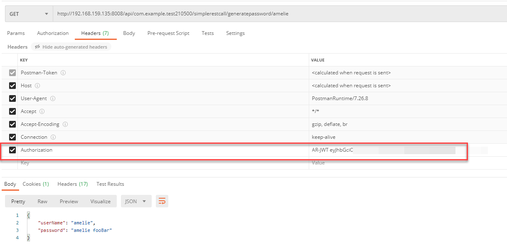

<h1 style="text-align:center">Creating a Java Rest Api</h1>

## Table Of Contents:
* [Introduction](#introduction)
* [Java Rest Api architecture](#architecture)
* [Java Rest Api class](#rest-api)
* [Creating a Rest Api operation](#rest-api-operation)
* [Registering the Rest Api](#registering)
* [Consuming the Rest Api in an Innovation Studio application](#consuming-rest-api)
* [Consuming the Rest Api in a third party application](#consuming-rest-api-third-party)


<a name="introduction"></a>
## Introduction
> :memo:  
> The flow from this tutorial is coming from the [BMC Documentation](https://docs.bmc.com/docs/innovationsuite/233/creating-a-custom-interface-with-rest-1223791389.html).

The Innovation Studio provides Rest Apis to access some of its objects, for example to fetch record instances.   
It is also possible to create custom Rest Apis in your Application or Library to pinpoint a specific function like ordering lunch, updating a lunch order etc...    
  
We will look at the example [SimpleRest](../../_details/JAVA.MD#SimpleRest) which you can find [here](../../bundle/src/main/java/com/example/bundle/SimpleRest.java).

> :warning:  
> You must ensure that you follow naming conventions (namespacing) for all angular object names and all HTML filenames in shared code.  
> See [coding and naming guidelines](../CODING_NAMING_GUIDELINES.MD).

> :memo:  
> This example shows how to create a GET rest call, you can look how to create a POST call in the [FruitRest example](../../_details/JAVA.MD#FruitRest).


<a name="architecture"></a>
## Java Rest Api architecture
The rest Api is added to the bundle code and is accessible automatically through with the bundleId to avoid collision, for example:
```text
http{s}://{server}:{port}/api/<bundleId>/<restApiClass>/<restApiOperation>/{parameter}
```
In our example:
```text
http{s}://{server}:{port}/api/com.example.test210500/simplerestcall/generatepassword/{userName}
```


<a name="rest-api"></a>
## Java Rest Api class
The Rest Api is a Java class extending the **RestfulResource** class and is using the "javax.ws.rs" for annotations. We also need to declare the Rest Api main path using the ```@Path()``` annotation, here "simplerestcall".
```javascript
@Path("simplerestcall")
public class SimpleRest implements RestfulResource
```

The main url would then be:
```text
http{s}://{server}:{port}/api/com.example.test210500/simplerestcall/
```

> :memo:  
> It is recommended to create the Class at the same level of the [MyApplication.java](../../bundle/src/main/java/com/example/bundle/MyApplication.java) file, in the [/bundle/src/main/java/com/example/bundle/](../../bundle/src/main/java/com/example/bundle/) folder.

<a name="rest-api-operation"></a>
## Creating a Rest Api operation
We would also need to add the rest apis themselves, in our case we want to create a GET call. We would need to use the "@GET" annotation and give a sub path for the rest call, here "/generatepassword/{userName}". This means that "username" is a path parameter.
```javascript
    @GET
    @Path("/generatepassword/{userName}")
```

Here is the full code of the GET rest api:
* @GET:
  * CRUD operation, here GET, 
* @Path("/generatepassword/{userName}"):
  * Sub path of the rest api, the full url would then be:
    * ```http{s}://{server}:{port}/api/com.example.test210500/simplerestcall/generatepassword/{userName}```
* @RxDefinitionTransactional(readOnly = true):
  * BMC parameter, it is recommended to let this value as is,
* @AccessControlledMethod(authorization = AccessControlledMethod.AuthorizationLevel.ValidUser): 
    * This means that in order to consume this Rest Api a valid user is required,
    * > :memo:  
      This means that if a third party application tries to consume this Rest Api (Postman for example), this application would need first to perform a login operation to get a JWT authentication token as described in the [documentation](https://docs.bmc.com/docs/innovationsuite/233/login-information-1223791394.html),
* @Produces(MediaType.APPLICATION_JSON):
  * What kind of datatype this api will return, here it will be json,
  * > :memo:  
    It is recommended for any custom rest api to return Json rather than text/html or xml for example.  
    This rest api returns a "SimpleResponsePayload" Object, it will automatically be cast as Json.
```javascript
@GET
@Path("/generatepassword/{userName}")
@RxDefinitionTransactional(readOnly = true)
@AccessControlledMethod(authorization = AccessControlledMethod.AuthorizationLevel.ValidUser)
@Produces(MediaType.APPLICATION_JSON)
public SimpleResponsePayload generateReportEvents(@PathParam("userName") String userName) {
    SimpleResponsePayload simpleResponsePayload = new SimpleResponsePayload();

    simpleResponsePayload.setUserName(userName);
    simpleResponsePayload.setPassword(userName + " fooBar");

    return simpleResponsePayload;
}
```

In order to get the path parameter value we leverage the "@PathParam()" annotation which will store the path parameter value into the variable "userName":
```javascript
public SimpleResponsePayload generateReportEvents(@PathParam("userName") String userName)
```


Here the Rest Api returns a "SimpleResponsePayload" [class](../../bundle/src/main/java/com/example/bundle/SimpleResponsePayload.java). This object will automatically be cast in Json thanks to the "@Produces()" media type.  
In this "SimpleResponsePayload" we have to specify the properties that will be cast using the "@JsonProperty" annotation:
```javascript
import com.fasterxml.jackson.annotation.JsonProperty;

public class SimpleResponsePayload {
    @JsonProperty
    private String userName = "";
    @JsonProperty
    private String password = "";
    // ...
}
```

<a name="registering"></a>
## Registering the Rest Api
Once the Rest Api class ready we need to register it in the [MyApplication.java](../../bundle/src/main/java/com/example/bundle/MyApplication.java) file using the **registerRestfulResource** method:
```javascript
registerRestfulResource(new SimpleRest());
```

<a name="consuming-rest-api"></a>
## Consuming the Rest Api in an Innovation Studio application
Here we are calling the GET rest api with as path parameter "amelie":  
```http://192.168.159.135:8008/api/com.example.test210500/simplerestcall/generatepassword/amelie```
The rest api would return a Json object with the userName and the password:
```json
{
  "userName": "amelie",
  "password": "amelie fooBar"
}
```

You can see how this rest call is consumed in the View Component [generate-password](../../_details/JAVASCRIPT_VIEW_COMPONENTS.MD#generate-password) leveraging [HttpClient](../../bundle/src/main/webapp/libs/com-example-test210500/src/lib/view-components/generate-password/runtime/generate-password.component.ts):
```typescript
export const GENERATE_PASSWORD_OPTIONS = {
  restApiUrl: '/api/com.example.test210500/simplerestcall/generatepassword/'
}
// ...
private getPassword(username: string): Observable<any> {
  const url = GENERATE_PASSWORD_OPTIONS.restApiUrl + encodeURIComponent(username);

  return this.httpClient.get(url);
}
// ...
this.getPassword(this.componentData.username).subscribe((restApiResponse: IRestApiResponse) => {
  this.broadcastPassword(restApiResponse.password);
});
```

<a name="consuming-rest-api-third-party"></a>
## Consuming the Rest Api in a third party application
When consuming the rest api via a third party application (Postman for example), this application would need first to perform a login operation to get a JWT authentication token as described in the [documentation](https://docs.bmc.com/docs/innovationsuite/233/login-information-1223791394.html).  
If the operation modifies data (PUT, DELETE, POST for example), the request header "x-requested-by" is mandatory with a value ("X") for example.

Getting the Jwt token leveraging the "/loginrequest" api call:  


Calling the GET call consuming the Jwt token.  
The Jwt token can be passed in the "Cookie"  or in the "Authorization" Request Header.

Using "Cookie" request header we need to pass the token under this format:
```text
AR-JWT=<token>
```
For example:
```text
AR-JWT=eyJhbG(...)Nkfje4nQ
```



Using the "Authorization" request header we need to pass the token under this format:
```text
AR-JWT <token>
```
For example:
```text
AR-JWT eyJhbG(...)Nkfje4nQ
```
> :warning:  
> As you can see the format is slightly different (AR-JWT=<token> for the cookie, AR-JWT <token> for Authorization).  



> :memo:  
> To see how you can perform the same operation when the server is protected by RSSO please check this thread on the [BMC Community](https://community.bmc.com/s/feed/0D53n00007Zn4yRCAR).  
> You would need to create a "system" user in Innovation Studio (user which password is stored in Innovation Studio and not in your company Active Directory for example) and specify the tenant name in the "userName", here "calbro.com":
> ```json
> {
>   "userName": "amelie@calbro.com",
>   "password": "password"
> }
> ```
