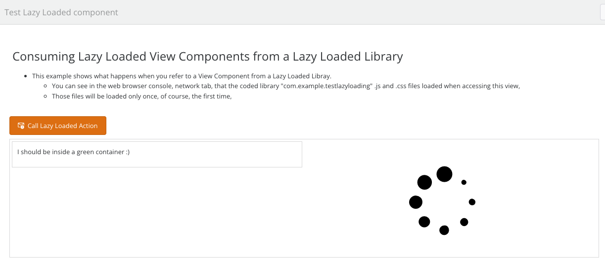
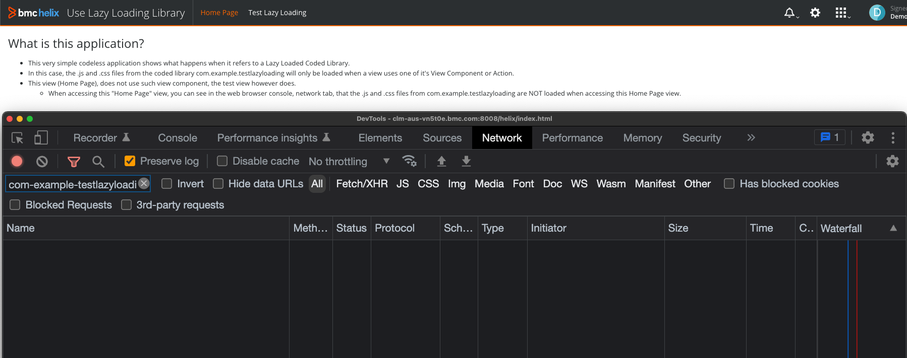
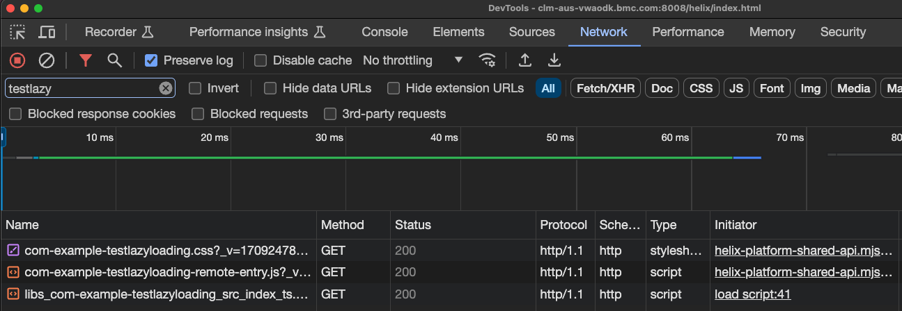

# Testing View Component / Bundle Lazy Loading
History:
* Version:
    * 0.1, 2024/02/29, Updated to use the 23.3.x SDK.
* Author: Laurent Matheo.


## Table Of Contents:
* [What is this](#what-is-this),
* [Installation (using the zip file)](#installation),
* [Updating your SDK / Developer Environment (if needed)](#update),
* [Build and installation using the source code](#build),
* [How does Lazy Loading work?](#lazy-loading),
* [Upgrade notes](#upgrade-notes),
* [Disclaimer](#disclaimer),
* [Support](#support),
* [Links](#links),
* [More Importantly](#more-importantly),


<a name="what-is-this"></a>
## What is this? :)
This repository shows an advanced concept available for coded bundles (Application or Library) for Innovation Suite, how to Lazy Load a coded bundle View Components or Actions. This is coming now for free and by default when creating a new bundle using the 23.3.x SDK.  
This means that the coded bundle coded files (.js and .css), would only be loaded when one of its UI element (View Component or View Action) is used in a View.    
  
For example, let's say that we have:
* A Pizza tool coded Library that has a View Component "Pizza Tracker",
* A Pizza codeless application with a couple of views:
  * Order Console:
    * Generic view listing all orders,
  * Order Details:
    * View displaying the details on an order, using the "Pizza tool" view component "Pizza Tracker",
  
#### When accessing the Pizza codeless application Order Console view:
* The user sees that the code (.js, .css) of the "Pizza tool" coded library is not loaded, as it is set to be "lazy loaded" (we will see how later).  
#### When the user clicks on an order to see the Order Details:
* Since this view leverages the View Component "Pizza Tracker", the Platform automatically loads the coded library "Pizza tool" coded files (.js and .css).   

This example leverages the 22.3.00 SDK (Angular).  


<a name="installation"></a>
## Installation (using the zip files):
There are two bundles in this example:
* The coded library [com.example.testlazyloading-1.0-SNAPSHOT.zip](com.example.testlazyloading-1.0-SNAPSHOT.zip),
* The codeless application [com.example.uselazyloadinglibrary-1.0.0-INSTALL.zip](./_codeless%20application/com.example.uselazyloadinglibrary-1.0.0-INSTALL.zip),

You can just deploy the files on your 23.3.00 development environment which is available on the [BMC Developer Portal](https://developers.bmc.com/site/global/home/index.gsp).    
Here are the [instructions](https://docs.bmc.com/docs/innovationsuite/233/deploying-your-application-for-the-first-time-to-start-working-in-bmc-helix-innovation-studio-1223791377.html?src=search) to start working with Innovation Studio. 


<a name="update"></a>
## Updating your SDK / Developer Environment (if needed):
* [22.x to 23.3.00](https://docs.bmc.com/docs/innovationsuite/233/upgrading-to-the-latest-bmc-helix-innovation-studio-sdk-1247609631.html?src=search),


<a name="build"></a>
# Build and installation using the source code from com.example.testlazyloading:
Please follow those steps:
* Prepare your developer environment installing several [pre-requisites](https://docs.bmc.com/docs/innovationsuite/233/setting-up-your-ide-and-installing-bmc-helix-innovation-studio-sdk-1247609960.html?src=search),
  * You will need nodeJs, maven, Yarn, Grunt and Java (OpenJDK).  

Here are the steps:
* Clone this GitHub repository,
* Change the content of the parent "pom.xml" file to insert your credentials:
```xml
    <!-- START: Bundle specific configuration. Verify and Change as per environment -->
    <developerUserName>developer</developerUserName>
    <developerPassword>password</developerPassword>
    <!-- Server name with Jetty port. -->
    <webUrl>https://yourServer:yourServerPort</webUrl>
    <!-- END: Bundle specific configuration.-->
```
* run this command to build to deploy the coded application on your developer environment as per the [documentation](https://docs.bmc.com/docs/innovationsuite/233/deploying-your-application-for-the-first-time-to-start-working-in-bmc-helix-innovation-studio-1223791377.html?src=search):
  * ```bash
    mvn clean install -Pdeploy
    ```

<a name="lazy-loading"></a>
# How does Lazy Loading work?
This repository shows an advanced concept available for coded bundles (Application or Library) for Innovation Suite, how to Lazy Load a coded bundle View Components or Actions. This is coming now for free and by default when creating a new bundle using the 23.3.x SDK.    
This means that the coded bundle coded files (.js and .css), would only be loaded when one of its UI element (View Component or action) is used in a View.

For example, let's say that we have:
* A Pizza tool coded Library that has a View Component "Pizza Tracker",
* A Pizza codeless application with a couple of views:
  * Order Console:
    * Generic view listing all orders,
  * Order Details:
    * View displaying the details on an order, using the "Pizza tool" view component "Pizza Tracker",

#### When accessing the Pizza codeless application Order Console view:
* The user sees that the code (.js, .css) of the "Pizza tool" coded library is not loaded, as it is set to be "lazy loaded" (we will see how later).
#### When the user clicks on an order to see the Order Details:
* Since this view leverages the View Component "Pizza Tracker", the Platform automatically loads the coded library "Pizza tool" coded files (.js and .css).

# How to enable Lazy Loading?
You simply need to modify the file [package.json](./bundle/src/main/webapp/package.json) and set in the "manifest" section the "generate" parameter to true and the "loadJs" and "loadCss" properties to "lazy". Setting the properties to "always" will deactivate the lazy loading for the Js and / or the Css code and will ensure it will always be loaded.  
This could be useful for example if there are some global CSS classes used to skin a Container, in this case you would want to "always" load the Css code, so setting "loadCss" to "always".   
```json
    "manifest": {
      "generate": true,
      "loadJs": "lazy",
      "loadCss": "lazy"
    }
```

When the maven build command is run ```mvn clean install```, you see in the bundle target folder a new file "./bundle/target/web-build/webapp/scripts/com-example-testlazyloading.json" which contains different information, such as the list of View Components and Actions.  
This file is automatically generated and will be part of the coded bundle installation zip file.
```json
{
  "viewComponents": [
    "com-example-testlazyloading-label-lazy-loaded"
  ],
  "viewActions": [
    "comExampleTestlazyloadingLazyLoadedAction"
  ],
  "applicationInitializers": [],
  "options": {
    "loadCss": "lazy",
    "loadJs": "lazy"
  }
}
```

# Note on necessary annotations ```@RxViewComponent``` and ```@RxViewAction```:
In order for the view components and actions to be detected and added in the manifest file described above, they need to be "described". Those decorators are now required in the 23.3 SDK and added automatically when using our schematics commands.    
We are using for this Angular Decorators, ```@RxViewComponent``` for a View Component and ```@RxViewAction``` for a View Action.  
As we can see in our example for our [demo View Component](../bundle/src/main/webapp/libs/com-example-testlazyloading/src/lib/view-components/label-lazy-loaded/runtime/label-lazy-loaded.component.ts), the decorator must be set in the View Component "runtime" Angular Component and its ```name``` property must match the Angular Component ```selector``` property:    
```typescript
@Component({
  selector: 'com-example-testlazyloading-label-lazy-loaded',
  styleUrls: ['./label-lazy-loaded.scss'],
  templateUrl: './label-lazy-loaded.component.html',
  standalone: true,
  imports: [CommonModule]
})
@RxViewComponent({
  name: 'com-example-testlazyloading-label-lazy-loaded'
})
export class LabelLazyLoadedComponent extends BaseViewComponent implements OnInit,IViewComponent {
```
For an Action, the annotation ```@RxViewAction``` is defined in the [Action service](../bundle/src/main/webapp/libs/com-example-testlazyloading/src/lib/actions/lazy-loaded-action/lazy-loaded-action-action.service.ts) and its ```name``` property:  
```typescript
@Injectable()
@RxViewAction({
  name: 'comExampleTestlazyloadingLazyLoadedAction',
})
export class LazyLoadedActionActionService implements IViewActionService<ILazyLoadedActionActionProperties, any> {
```
is the same that the ```name``` property defined in the [Action module](../bundle/src/main/webapp/libs/com-example-testlazyloading/src/lib/actions/lazy-loaded-action/lazy-loaded-action-action.module.ts):
```typescript
    this.rxViewActionRegistryService.register({
      name: 'comExampleTestlazyloadingLazyLoadedAction',
```

> :memo:  
> You do not need to worry about applying the decorators, they are automatically set with the right values when the View Component or Action is generated using our SDK schematics.  
> However it is interesting to see how we generate the manifest or if you created the coded bundle before the 22.3.x SDK. You might have to add the decorators manually, IF you want the coded bundle to be lazy loaded.  
> If the decorators are not used, the View Components will never be loaded or available.


# Note on Design Time (Innovation Studio View Designer)
Even if a coded bundle is marked as lazy loaded, it will always be loaded during Design Time, as its View Component(s) should be available in View Designer Palette or in the Action picker, for example:
<details> 
<summary>View Designer View</summary>  


</details>

<details> 
<summary>View Designer Palette</summary>  


</details>


# How to force the loading of some resources, even if the coded bundle is Lazy Loaded?
In the manifest section of the [package.json](./bundle/src/main/webapp/package.json) file, there are two properties "loadJs" and "loadCss", by default they are set to "lazy":
```json
    "manifest": {
      "generate": true,
      "loadJs": "lazy",
      "loadCss": "lazy"
    }
```
Here are the different values that can be applied to those settings:  
* lazy
  * The Platform will load it (whether it is the coded bundle .js or .css file) when a View Component or Action is used in a view,
* always
  * The Platform will always load it (whether it is the coded bundle .js or .css file), as if it is not lazy loaded,
  * This can be useful when for example some global css classes have been defined and are used to alter some Container appearance. In this case we might want to always load the coded bundle .css file which would contain those styles.


# Example:
In our example, the .js and .css are lazy loaded:  
```json
    "manifest": {
      "generate": true,
      "loadJs": "lazy",
      "loadCss": "lazy"
    }
```

You can see that, when accessing the test codeless bundle "com.example.uselazyloadinglibrary" ("Use Lazy Loading Library") Home Page view that the coded bundle .js and .css files are not loaded:  
<details> 
<summary>Use Lazy Loading Library, Home Page screenshot</summary>  


</details>

When accessing the view "Test Lazy Loading", you can see that the Platform loads the bundle "com.example.testlazyloading" .js and .css resources since the coded library View Component is used in this view:
<details> 
<summary>Use Lazy Loading Library, Test Lazy Loading screenshot</summary>  


</details>


<a name="upgrade-notes"></a>
# Upgrade notes:  
In the GitHub repository you can see what steps were taken to upgrade this example from the 22.x SDK to the 23.3 SDK.  
* The commit [f129506770038b27638335ae5a24fb46166c6638](https://github.com/bmcsoftware/innovation-studio-developer/commit/f129506770038b27638335ae5a24fb46166c6638) contains the 22.x files,
* The commit [e798a23da04ec740c2dba5d24b6dda84b766339d](https://github.com/bmcsoftware/innovation-studio-developer/commit/e798a23da04ec740c2dba5d24b6dda84b766339d) contains the changes applied manually and automatically to match the 23.3 SDK requirements,
Note:  
The steps to upgrade a 22.x to 23.3 SDK are available in this [link]https://docs.bmc.com/docs/innovationsuite/233/upgrading-to-the-latest-bmc-helix-innovation-studio-sdk-1247609631.html?src=search().  
  
  
  
<a name="disclaimer"></a>
# Disclaimer:
These samples are released by Laurent Matheo and are released "as is" as code samples. There is no warranty, liability or support on those examples.  
The license is now BSD 3 (see LICENSE file (https://github.com/bmcsoftware/innovation-studio-developer/blob/main/LICENSE)).  

<a name="support"></a>
# Support:
Please find support on the [BMC Developer Community](https://community.bmc.com/s/group/0F93n000000Plr8CAC/developer-community) if you have any questions or feel free to use this git repo features (bug report etc...).

<a name="links"></a>
# Links:
* [BMC Helix Youtube channel](https://www.youtube.com/channel/UCufKJEem7x7_IaTUPbTYuww),
* [BMC Developer portal](https://developers.bmc.com/site/global/home/index.gsp),
* [BMC Developer Community](https://community.bmc.com/s/group/0F93n000000Plr8CAC/developer-community),
* [BMC Documentation for BMC Helix Platform](https://docs.bmc.com/docs/is221/),

<a name="more-importantly"></a>
## More importantly:
I hope it helps :)
