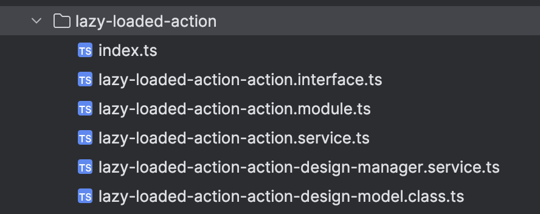

<h1 style="text-align:center">View Action changes</h1>


## Table Of Contents:
* [Best practices changes for the View Action "lazy-loaded-action" (23.3.00 to 23.3.02)](#bp-23302),
* [Main changes](#main-changes)
  * [File structure](#file-structure)
  * [View Action interfaces (lazy-loaded-action-action.types.ts and lazy-loaded-action-action-design.types.ts)](#view-action-interfaces)
  * [View Action module (lazy-loaded-action-action.module.ts)](#view-action-module)
  * [View Action design manager (lazy-loaded-action-action-design-manager.service.ts)](#view-action-design-manager)
  * [View Action design model (lazy-loaded-action-action-design-model.class.ts)](#view-action-design-model)
  * [View Action service (lazy-loaded-action-action.service.ts)](#view-action-service)


<a name="bp-23302"></a>
## Best practices changes for the View Action "lazy-loaded-action" (23.3.00 to 23.3.02)  
In 23.3.02 there are some minor modifications to the SDK and the archetypes used to generate View Component, View Actions, and Record Field View Components.  
These best practices are listed in our [documentation](https://docs.bmc.com/docs/innovationsuite/233/introduction-to-view-components-and-view-actions-1342726343.html?src=search).  
This section will list the changes from 23.3.00 to 23.3.02, as an example.  
You can see the differences after this commit:
* [78767e2a353e8667103c4ba0a45ce73998e9d63c](https://github.com/bmcsoftware/innovation-studio-developer/commit/78767e2a353e8667103c4ba0a45ce73998e9d63c),
More specifically, the changes are in these commits:
* [def34116d5ce4b68b313ec44d5d49b8c2cc19b5c](https://github.com/bmcsoftware/innovation-studio-developer/commit/def34116d5ce4b68b313ec44d5d49b8c2cc19b5c),
* [dce67a94ddba7d0c69f0669eef4fb42d085ef492](https://github.com/bmcsoftware/innovation-studio-developer/commit/dce67a94ddba7d0c69f0669eef4fb42d085ef492),


> :memo:  
> Those modifications are NOT required. The 23.3.00 source code would continue to work.


<a name="main-changes"></a>
## Main changes  

<a name="file-structure"></a>
### File structure  
The 23.3.00 structure was modified:
* lazy-loaded-action
  * lazy-loaded-action-action.module.ts
  * **index.ts** 
    * [23.3.00 / 23.3.02] This file can be removed since the 23.3.00 SDK (see the [upgrade documentation](https://docs.bmc.com/docs/innovationsuite/233/upgrading-to-the-latest-bmc-helix-innovation-studio-sdk-1247609631.html?src=search)),
  * lazy-loaded-action-action.service.ts
  * lazy-loaded-action-action-design-model.class.ts
  * lazy-loaded-action-action-design-manager.service.ts
  * **lazy-loaded-action-action.interface.ts**
    * [23.3.02] This file contained two interfaces, one for Design and one for Runtime operations. We will split those interfaces in two files,
<details> 
<summary>Previous structure</summary>  


</details>

New structure (23.3.02):
* lazy-loaded-action
  * lazy-loaded-action-action.module.ts
  * lazy-loaded-action-action.service.ts
  * lazy-loaded-action-action-design-model.class.ts
  * lazy-loaded-action-action-design-manager.service.ts
  * lazy-loaded-action-action.types.ts
  * lazy-loaded-action-action-design.types.ts
<details> 
<summary>New structure</summary>  


</details>


<a name="view-action-interfaces"></a>
### View Action interfaces (`lazy-loaded-action-action.types.ts` and `lazy-loaded-action-action-design.types.ts`)  
The file `lazy-loaded-action-action.interface.ts` contained two interfaces, one for Design and one for Runtime operations. We split those interfaces in two different files (`lazy-loaded-action-action.types.ts` and `lazy-loaded-action-action-design.types.ts`) for clarity.  
`lazy-loaded-action-action-design.types.ts`:  
```ts
import {IViewActionDesignProperties} from '@helix/platform/view/api';

// [23.3.02] The design time and runtime interfaces are split in two different files.
export interface ILazyLoadedActionActionDesignProperties extends IViewActionDesignProperties {
  message: string;
}
```
  
`lazy-loaded-action-action.types.ts`:  
```ts
// [23.3.02] The design time and runtime interfaces are split in two different files.
export interface ILazyLoadedActionActionProperties {
  message: string;
}
```


<a name="view-action-module"></a>
### View Action module (`lazy-loaded-action-action.module.ts`)  
There are minor changes here as we directly use the services in the constructor instead of using the `private` keyword:    
```ts
export class LazyLoadedActionActionModule {
  // [23.3.02] Removing the "private" in the constructor, for example:
  //     private rxViewActionRegistryService: RxViewActionRegistryService,
  //     to:
  //     rxViewActionRegistryService: RxViewActionRegistryService,
  constructor(
          rxViewActionRegistryService: RxViewActionRegistryService,
          lazyLoadedActionActionService: LazyLoadedActionActionService,
          lazyLoadedActionActionDesignManagerService: LazyLoadedActionActionDesignManagerService
  ) {
    // [23.3.02] Calling the services directly since they are not private anymore, for example using:
    //     rxViewActionRegistryService.register() instead of:
    //     this .rxViewActionRegistryService.register()
    rxViewActionRegistryService.register({
      name: 'comExampleTestlazyloadingLazyLoadedAction',
      label: 'Lazy Loaded Action',
      // (...)
}
```

<a name="view-action-design-manager"></a>
### View Action design manager (`lazy-loaded-action-action-design-manager.service.ts`)
Minor changes are applied in the design manager, we type the validate() method:    
```ts
// (...)
// [23.3.02] We use the new interface.
import { ILazyLoadedActionActionDesignProperties } from './lazy-loaded-action-action-design.types';
// (...)

  // This method will be called automatically to validate view action input parameters.
  // [23.3.02] we Type the validate() method as:
  //    Observable<IViewComponentDesignValidationIssue[]>
  validate(actionProperties: ILazyLoadedActionActionDesignProperties, propertyName: string): Observable<IViewComponentDesignValidationIssue[]> {
    return of(this.validateInputParameters(actionProperties, propertyName));
  }
```

<a name="view-action-design-model"></a>
### View Action design model (`lazy-loaded-action-action-design-model.class.ts`)
Very minor changes are applied in the design model:  
```ts
// (...)
// [23.3.02] We use the new interface.
import { ILazyLoadedActionActionDesignProperties } from './lazy-loaded-action-action-design.types';

  // [23.3.02] We just rename the input parameter for clarity.
  static getInitialProperties(currentInputParams: ViewActionDesignEditableProperties<ILazyLoadedActionActionDesignProperties>) {
```


<a name="view-action-service"></a>
### View Action service (`lazy-loaded-action-action.service.ts`)
Some minor changes are applied in View Action service that is executed at runtime. We better type it:
```ts
// (...)
// [23.3.02] We use the new interface.
import { ILazyLoadedActionActionProperties } from './lazy-loaded-action-action.types';

@Injectable()
@RxViewAction({
  name: 'comExampleTestlazyloadingLazyLoadedAction'
})
// [23.3.02] changing the type from:
//    IViewActionService<ILazyLoadedActionActionProperties, any>
// to:
//    IViewActionService<ILazyLoadedActionActionProperties, never>
export class LazyLoadedActionActionService implements IViewActionService<ILazyLoadedActionActionProperties, never> {
  constructor(private rxModalService: RxModalService) {}

  // Method automatically executed at runtime.
  // inputParameters will contain the different Input parameter values.
  // This method must return an Observable, here of tye "any" due to the use
  // of rxModalService.confirm.
  // [23.3.02] changing the type from:
  //    IViewActionService<ILazyLoadedActionActionProperties, any>
  // to:
  //    IViewActionService<ILazyLoadedActionActionProperties, never>
  execute(inputParameters: ILazyLoadedActionActionProperties): Observable<never> {
      // (...)
```
