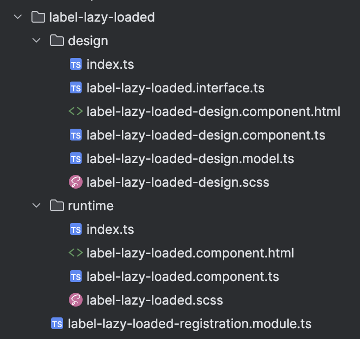
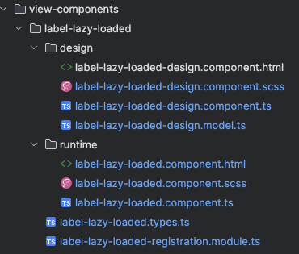
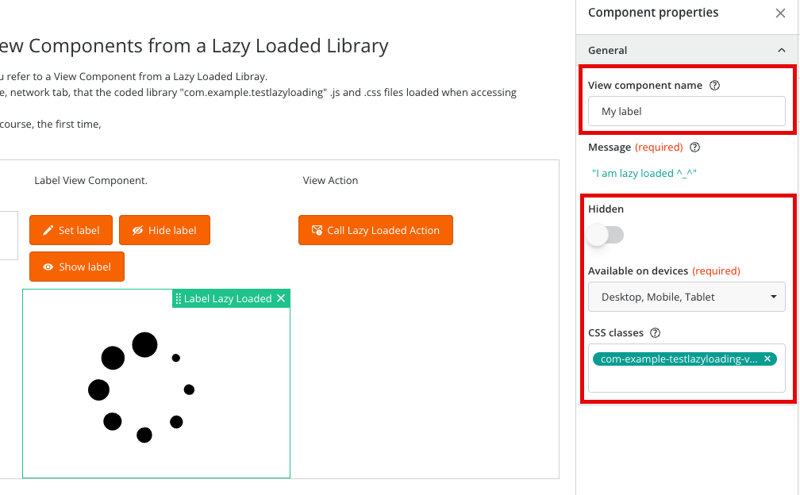
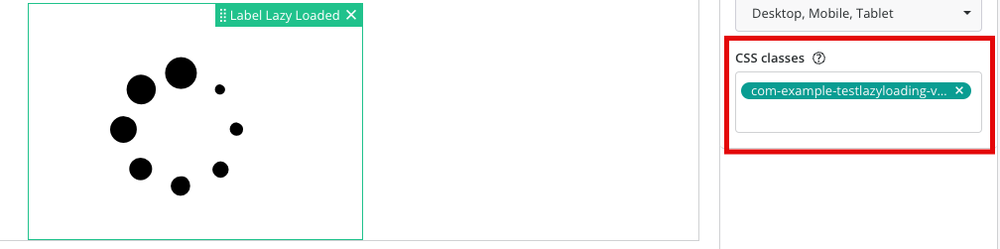

<h1 style="text-align:center">View Component changes</h1>


## Table Of Contents:
* [Best practices changes for the View Component "label-lazy-loaded" (23.3.00 to 23.3.02)](#bp-23302),
* [Main changes](#main-changes)
  * [File structure](#file-structure)
  * [View Component interface (label-lazy-loaded.types.ts)](#view-component-interface)
  * [View Component registration (label-lazy-loaded-registration.module.ts)](#view-component-registration)
  * [View Component global CSS (com-example-testlazyloading.scss)](#view-component-css)
* [Design time changes](#design-time-changes)
  * [label-lazy-loaded-design.component.ts](#design-component)
  * [label-lazy-loaded-design.model.ts](#design-model)
* [Runtime changes](#runtime-changes)
  * [label-lazy-loaded.component.ts](#runtime-component-ts)
  * [label-lazy-loaded.component.html](#runtime-component-html)


<a name="bp-23302"></a>
## Best practices changes for the View Component "label-lazy-loaded" (23.3.00 to 23.3.02)  
In 23.3.02 there are some minor modifications to the SDK and the archetypes used to generate View Component, View Actions, and Record Field View Components.  
These best practices are listed in our [documentation](https://docs.bmc.com/docs/innovationsuite/233/introduction-to-view-components-and-view-actions-1342726343.html?src=search).  
This section will list the changes from 23.3.00 to 23.3.02, as an example.  
You can see the differences after this commit:
* [78767e2a353e8667103c4ba0a45ce73998e9d63c](https://github.com/bmcsoftware/innovation-studio-developer/commit/78767e2a353e8667103c4ba0a45ce73998e9d63c),
  
So, in these commits:
* [60187d519971232df0ef4b796176ec327b38c51e](https://github.com/bmcsoftware/innovation-studio-developer/commit/60187d519971232df0ef4b796176ec327b38c51e),
* [88cdc14045ef5351adb52095a52006c4db9795e7](https://github.com/bmcsoftware/innovation-studio-developer/commit/88cdc14045ef5351adb52095a52006c4db9795e7),
* [9a35dce39e91db36b528d2f95adc6f916dca7461](https://github.com/bmcsoftware/innovation-studio-developer/commit/9a35dce39e91db36b528d2f95adc6f916dca7461),

> :memo:  
> Those modifications are NOT required. The 23.3.00 source code would continue to work.


<a name="main-changes"></a>
## Main changes  

<a name="file-structure"></a>
### File structure  
The 23.3.00 structure was modified:
* label-lazy-loaded
  * label-lazy-loaded-registration.module.ts
  * design 
    * **index.ts** 
      * [23.3.00 / 23.3.02] This file can be removed since the 23.3.00 SDK (see the [upgrade documentation](https://docs.bmc.com/docs/innovationsuite/233/upgrading-to-the-latest-bmc-helix-innovation-studio-sdk-1247609631.html?src=search)),
      * Some code needs to be adapted to remove the import of the index file,
    * label-lazy-loaded-design.component.html 
    * label-lazy-loaded-design.component.ts 
    * label-lazy-loaded-design.model.ts 
    * **label-lazy-loaded-design.scss**
      * [23.3.02] The filename has changed to match the component name, so `label-lazy-loaded-design.component.scss`,
    * **label-lazy-loaded.interface.ts**
      * [23.3.02] The file is moved from /design folder to the View Component folder, and renamed to "label-lazy-loaded.types.ts" since it can be common between the View Component Design time and Runtime,
  * runtime 
    * **index.ts** 
      * [23.3.00 / 23.3.02] This file can be removed since the 23.3.00 SDK (see the [upgrade documentation](https://docs.bmc.com/docs/innovationsuite/233/upgrading-to-the-latest-bmc-helix-innovation-studio-sdk-1247609631.html?src=search)),
      * Some code needs to be adapted to remove the import of the index file,
    * label-lazy-loaded.component.html 
    * label-lazy-loaded.component.ts 
    * **label-lazy-loaded.scss**
      * [23.3.02] The filename has changed to match the component name, to `label-lazy-loaded.component.scss`,
<details> 
<summary>Previous structure</summary>  


</details>

New structure (23.3.02):
* label-lazy-loaded
  * label-lazy-loaded-registration.module.ts
  * label-lazy-loaded.types.ts
  * design
    * label-lazy-loaded-design.component.html
    * label-lazy-loaded-design.component.ts
    * label-lazy-loaded-design.model.ts
    * label-lazy-loaded-design.component.scss
  * runtime
    * label-lazy-loaded.component.html
    * label-lazy-loaded.component.ts
    * label-lazy-loaded.component.scss
<details> 
<summary>New structure</summary>  


</details>


<a name="view-component-interface"></a>
### View Component interface (`label-lazy-loaded.types.ts`)  
Some default View Component properties are now available, we will consume them in the View Component registration module and in the design model. Those default properties are "Hidden", "Available on devices", "CSS classes":
```ts
RX_STANDARD_PROPS_DESC
```

<details> 
<summary>Default properties</summary>  


</details>

> :memo:  
> We do not need to implement those properties as they are properties of the BaseComponent.


  
This means that we need to modify the former interface file (label-lazy-loaded.interface.ts) to extend those standard properties.  
Before in the file `label-lazy-loaded.interface.ts` we only had the message property:
```ts
export interface ILabelLazyLoadedParameters {
  message: string;
}
```

Now in the file `label-lazy-loaded.types.ts` we need to:
* Extend the default properties (`IRxStandardProps`),
* Add the `name` property as we'll need it in the Design model:  
```ts
import { IRxStandardProps } from '@helix/platform/view/api';

export interface ILabelLazyLoadedProperties extends IRxStandardProps {
    name: string;
    message: string;
}
```

<a name="view-component-registration"></a>
### View Component registration (`label-lazy-loaded-registration.module.ts`)  
We now import the standard properties in the registration module, and consume them.  
There are also some changes in the View Component imports since we removed the design and runtime `index.ts` files.  
```ts
import { NgModule } from '@angular/core';
// [23.3.02] We import RX_STANDARD_PROPS_DESC.
import { RX_STANDARD_PROPS_DESC, RxViewComponentRegistryService } from '@helix/platform/view/api';
import { LabelLazyLoadedComponent } from './runtime/label-lazy-loaded.component';
import { LabelLazyLoadedDesignComponent } from './design/label-lazy-loaded-design.component';
import { LabelLazyLoadedDesignModel } from './design/label-lazy-loaded-design.model';

@NgModule()
export class LabelLazyLoadedRegistrationModule {
  // [23.3.02] We removed the private, from:
  //    private rxViewComponentRegistryService: RxViewComponentRegistryService
  //  to:
  //    rxViewComponentRegistryService: RxViewComponentRegistryService
  constructor(rxViewComponentRegistryService: RxViewComponentRegistryService) {
    rxViewComponentRegistryService.register({
      type: 'com-example-testlazyloading-label-lazy-loaded',
      name: 'Label Lazy Loaded',
      group: 'Test Lazy Loading',
      icon: 'left-loader',
      component: LabelLazyLoadedComponent,
      designComponent: LabelLazyLoadedDesignComponent,
      designComponentModel: LabelLazyLoadedDesignModel,
      properties: [
        {
          name: 'message',
          localizable: true,
          enableExpressionEvaluation: true
        },
        // [23.3.02] We add the standard properties.
        ...RX_STANDARD_PROPS_DESC
      ]
    });
  }
}
```

<a name="view-component-css"></a>
### View Component global CSS (`com-example-testlazyloading.scss`)
This is just for demo purposes, to demonstrate that we can apply a CSS style to the View Component using the new imported Default properties.  
This css class is used in the [demo codeless bundle](../_codeless%20application/com.example.uselazyloadinglibrary-1.0.0-INSTALL.zip).  
```scss
/* Adding a global css style to be used for the label view component */
.com-example-testlazyloading-vc-green-container p {
  border: 2px solid green;
}
```

<details> 
<summary>CSS class</summary>  


</details>


<a name="design-time-changes"></a>
## Design time changes  

<a name="design-component"></a>
### label-lazy-loaded-design.component.ts  
Some minor modifications are applied to the Design Component, we removed some imports that were not necessary: 
```ts
import { Component, Input } from '@angular/core';
import { LabelLazyLoadedDesignModel } from './label-lazy-loaded-design.model';
// [23.3.02] We removed unecessary imports CommonModule and FormsModule.

@Component({
  selector: 'com-example-testlazyloading-label-lazy-loaded-design',
  styleUrls: ['./label-lazy-loaded-design.component.scss'],
  templateUrl: './label-lazy-loaded-design.component.html',
  standalone: true
})
export class LabelLazyLoadedDesignComponent {
  @Input()
  model: LabelLazyLoadedDesignModel;
}
```

<a name="design-model"></a>
### label-lazy-loaded-design.model.ts
Some modifications are applied to the Design model to handle the Standard properties default values, and their validation:  
```ts
import { IViewDesignerComponentModel, RX_STANDARD_PROPS_DEFAULT_VALUES } from '@helix/platform/view/api';
// (...)
// [23.3.02] We add the new name property, which is now required since we'll strongly type the sandbox object.
const initialComponentProperties: ILabelLazyLoadedProperties = {
  name: '',
  message: ''
};
// (...)
// [23.3.02] We change the type of the sandbox object from "IViewComponentDesignSandbox" to "IViewComponentDesignSandbox<ILabelLazyLoadedProperties>".
constructor(protected injector: Injector,
        protected sandbox: IViewComponentDesignSandbox<ILabelLazyLoadedProperties>) {
// (...)
// [23.3.02] We set the default values for the standard properties.
static getInitialProperties(initialProperties?: ILabelLazyLoadedProperties): ILabelLazyLoadedProperties {
  return {
    message: '',
    // initial values for the standard properties available for all view components
    ...RX_STANDARD_PROPS_DEFAULT_VALUES,
    // property values of an existing view component that are already saved in the view
    ...initialProperties
  }
}
// (...)
// [23.3.02] Defining the standard properties using the method getStandardPropsInspectorConfigs():
private setInspectorConfig(model: ILabelLazyLoadedProperties) {
  return {
    inspectorSectionConfigs: [
      {
        label: 'General',
        controls: [
          {
            name: 'name',
            component: TextFormControlComponent,
            options: {
              label: 'View component name',
              tooltip: new Tooltip('Enter a name to uniquely identify the view component.')
            }
          },
          {
            name: 'message',
            component: ExpressionFormControlComponent,
            options: {
              label: 'Message',
              tooltip: new Tooltip('The message input parameter is required and will be displayed at runtime.'),
              dataDictionary$: this.expressionConfigurator.getDataDictionary(),
              operators: this.expressionConfigurator.getOperators(),
              isRequired: true
            } as IExpressionFormControlOptions
          },
          // Add standard properties available for most view components, such as
          // Hidden, Available on devices, CSS classes.
          ...getStandardPropsInspectorConfigs()
        ]
      }
    ]
  };
}
// (...)
// [23.3.02] We apply the validations for the standard properties using the method validateStandardProps().
// [23.3.02] We type the sandbox and the validate method.
private validate(
          sandbox: IViewComponentDesignSandbox<ILabelLazyLoadedProperties>,
          model: ILabelLazyLoadedProperties
): IViewComponentDesignValidationIssue[] {
    const validationIssues: IViewComponentDesignValidationIssue[] = [];

    if (!model.message) {
      validationIssues.push(sandbox.createError('Message cannot be blank.', 'message'));
    }

    // Validate standard properties.
    validationIssues.push(...validateStandardProps(model));

    return validationIssues;
  }
```
  
We also allow some properties to be settable using the action "Set Property":  
```ts
this.sandbox.getComponentPropertyValue('name').subscribe((name) => {
  const componentName = name ? `${this.sandbox.descriptor.name} (${name})` : this.sandbox.descriptor.name;

  // Add settable view component properties to the expression builder data dictionary.
  // These properties can be set via the Set property view action.
  this.sandbox.setSettablePropertiesDataDictionary(componentName, this.getSettablePropertiesDataDictionaryBranch());

  // Registering the output parameters.
  this.sandbox.setCommonDataDictionary(this.prepareDataDictionary(componentName));
});

private getSettablePropertiesDataDictionaryBranch(): IViewComponentDesignSettablePropertiesDataDictionary {
  return [
    {
      label: 'Hidden',
      expression: this.getExpressionForProperty('hidden')
    },
    {
      label: 'Message',
      expression: this.getExpressionForProperty('message')
    }
  ];
}
```

<a name="runtime-changes"></a>
## Runtime changes

<a name="runtime-component-ts"></a>
### label-lazy-loaded.component.ts`  
There are multiple small changes in the code, that are detailed in the comments below. Those changes have been implemented to support the default properties and to match the output generated by the 23.3.02 SDK:  
```ts
// [23.3.02] We now need to import Input as the config is now an Input().
import { Component, Input, OnInit } from '@angular/core';
import { Observable, throwError } from 'rxjs';
import { BaseViewComponent, IViewComponent } from '@helix/platform/view/runtime';
import { RxViewComponent } from '@helix/platform/view/api';
import { ILabelLazyLoadedProperties } from '../label-lazy-loaded.types';
import { distinctUntilChanged, takeUntil } from 'rxjs/operators';
// [23.3.02] We removed an unnecessary import (CommonModule).

@Component({
  selector: 'com-example-testlazyloading-label-lazy-loaded',
  styleUrls: ['./label-lazy-loaded.component.scss'],
  templateUrl: './label-lazy-loaded.component.html',
  standalone: true
  // [23.3.02] We removed an unnecessary import (CommonModule).
})
@RxViewComponent({
  name: 'com-example-testlazyloading-label-lazy-loaded'
})
export class LabelLazyLoadedComponent extends BaseViewComponent implements OnInit, IViewComponent {
  // [23.3.02] We now need to import Input as the config is now an Input().
  // [23.3.02] Moreover the config property is now typed. 
  @Input()
  config: Observable<ILabelLazyLoadedProperties>;

  //  [23.3.02] Handling the properties that can be set using the action "Set Property" (Hidden and Message). 
  api = {
    // This method will be called when a component property is set via the Set property view action.
    setProperty: this.setProperty.bind(this)
  };

  // Contains the view component instance id.
  guid: string;
  // Contains the view component instance parameters.
  protected state: ILabelLazyLoadedProperties;

  ngOnInit() {
    // [23.3.02] We call the super.ngOnInit() method from the BaseComponent.
    super.ngOnInit();

    // [23.3.02] This is necessary to register the Set Property.
    // Make component API available to runtime view.
    this.notifyPropertyChanged('api', this.api);

    // [23.3.02] Alternative method to get the View Component configuration.
    // Subscribe to configuration property changes.
    this.config.pipe(distinctUntilChanged(), takeUntil(this.destroyed$)).subscribe((config: ILabelLazyLoadedProperties) => {
      // Setting isHidden property to true will remove the component from the DOM automatically.
      // There is no need to implement this logic manually in the View Component html.
      this.isHidden = Boolean(config.hidden);

      this.state = { ...config };
    });
  }

  //  [23.3.02] Handling the properties that can be set using the action "Set Property" (Hidden and Message).
  private setProperty(propertyPath: string, propertyValue: any): void | Observable<never> {
    switch (propertyPath) {
      case 'hidden': {
        this.state.hidden = propertyValue;
        this.notifyPropertyChanged(propertyPath, propertyValue);
        break;
      }
      case 'message': {
        this.state.message = propertyValue;
        this.notifyPropertyChanged(propertyPath, propertyValue);
        break;
      }
      default: {
        return throwError(`Label Lazy Loaded : property ${propertyPath} is not settable.`);
      }
    }
  }
}

```

<a name="runtime-component-html"></a>
### label-lazy-loaded.component.html  
We now use the state property to display the message or not.  
We can also leverage the new default properties to hide the View Component, apply CSS classes or specify if it needs to be displayed on Desktop / Tablet / Mobile:    

<details> 
<summary>Default properties</summary>  


</details>

> :memo:  
> We do not need to implement those properties in the View Component's code as they are properties of the BaseComponent.


```html
<p>
  {{ state.message ?? '[No message]' }}
</p>
```
