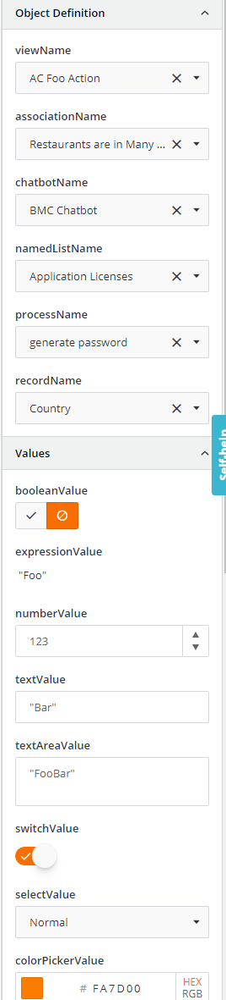

<h1 style="text-align:center">Creating an Action: Design Time</h1>

## Table Of Contents:
* [Introduction](#introduction)
* [".module": Registering the Action](#confirmation-module)
* [".design-model": [Design Time] Describing the Input and Output parameters](#design-model)
    * [".design-model": Setting the Input Parameters default or current values](#design-model-getInitialProperties)
    * [".design-model": Describing the Input Parameters](#design-model-getActionEditorConfig)
    * [".design-model": Describing the Output Parameter](#design-model-getActionOutputDataDictionary)
    * [".design-model": Registering the Input and Output parameters in the constructor](#design-model-constructor)
* [".design-manager": [Design Time] Validating the Input and Output parameters](#design-manager)


<a name="introduction"></a>
## Introduction
We are going to focus here on the design time aspect of the [confirmation](../../_details/JAVASCRIPT_ACTIONS.MD#confirmation) example.

<a name="confirmation-module"></a>
## ".module": Registering the Action
> :memo:
> All parameters are set automatically by the BMC Action Schematic.
> * In **bold** are the parameters and information that deserve special focus,
> * <ins>Underlined</ins> are the default values set by the Schematic. It is recommended not to change the default values,

The [module](../../bundle/src/main/webapp/libs/com-example-test210500/src/lib/actions/confirmation/confirmation-action.module.ts) file aims at registering the Action in Innovation Studio through the **RxViewActionRegistryService**, some parameters are very important:
* <ins>**name**</ins>: Unique action identifier, please see the [coding and naming guidelines](../CODING_NAMING_GUIDELINES.MD) to avoid name collision,
* label: Text displayed in the list actions in View Designer,
* <ins>bundleId</ins>: The application or library bundleId,
* <ins>service</ins>: Angular service that will be executed at runtime,
* <ins>designModel</ins>: Angular service that will be executed at design time which declares the Action Input and Output parameters,
* <ins>designManager</ins>: Angular service that will be executed at design time which contains the Action Input Parameters validation logic,
* parameters: Array of Input parameters,
    * > :memo:  
      The input parameters defined here will mostly be overridden by the "designModel" service though some properties are worth mentioning:
      > * localizable: If set to true this means that the content of this input parameter can be localized. This means that when you export the application localization strings as described [here](../../_guides/LOCALIZATION.MD) you will be able to localize the input parameter,
      > * enableExpressionEvaluation: If set to true that means that the content of this input parameter will be evaluated at runtime. This is used when using other input parameters, a Record editor field for example. Else the content of this Input parameter would be considered as Text,

In the "confirmation" example we added two Input Parameters, "title" and "message", the rest of the values were not modified:
```typescript
    this.rxViewActionRegistryService.register({
      name: 'comExampleTest210500ActionConfirmation',
      label: 'Confirmation',
      bundleId: 'com.example.test210500',
      service: this.confirmationActionService,
      designManager: this.confirmationDesignManagerService,
      designModel: ConfirmationActionDesignModel,
      parameters: [
        {
          name: 'title',
          label: 'Title',
          localizable: true,
          isRequired: true,
          enableExpressionEvaluation: true
        },
        {
          name: 'message',
          label: 'Message',
          localizable: true,
          isRequired: true,
          enableExpressionEvaluation: true
        }
      ]
    })
```

Some Input Parameters have different properties:
* "message" has the property ```enableExpressionEvaluation: true```, which means that an **Expression Builder** will be displayed at runtime,  


> :warning:  
> Those properties can be overridden in the **designModel**, but it is very important that the "type" and "enableExpressionEvaluation" match if declared in both the ".module" and the **designModel**.  
> For example if we do not declare ```enableExpressionEvaluation: true``` here, but we declare as an **ExpressionFormControlComponent** in the **designModel** the expression (for example a reference to a record editor field) will be stored as a string and will not be evaluated. The displayed value would be the expression itself and not its evaluation:
> ```text
> ${view.components.75130d2b-ed61-45d2-baf4-e834632b1eb6.recordInstance.fieldInstances.536870915.value}
> ```

> :warning:  
> Be sure to check in the main library that the action has been imported, in our case in [com-example-test210500.module.ts](../../bundle/src/main/webapp/libs/com-example-test210500/src/lib/com-example-test210500.module.ts):
> ```typescript
> import { ConfirmationActionModule } from './actions/confirmation';
> // ...
> @NgModule({
>   imports: [
>     // ...
>     ConfirmationActionModule
>   ]
> })
> ``` 
> This should be done automatically if you used the BMC Schematics.

<a name="design-model"></a>
## ".design-model": [Design Time] Describing the Input and Output parameters
The [designModel](../../bundle/src/main/webapp/libs/com-example-test210500/src/lib/actions/confirmation/confirmation-action.design-model.ts) is an Angular service that will be executed at design time which declares the Action Input and Output parameters,  
It is constituted from several "blocks":
* Setting the default Input parameter values, or those already saved in the **getInitialProperties()** method,
* Building the Input parameter list and their characteristics in the **getActionEditorConfig()** method,
* Building the Output parameter list in the **getActionOutputDataDictionary()** method,
* Registering the Input and Output parameters built automatically in the **constructor()** method,

<br>  

<a name="design-model-getInitialProperties"></a>
### ".design-model": Setting the default or current values
The **getInitialProperties()** is automatically called by the "parent" code and must return the Input Parameter default or current values:
* initialProperties: contains the current Input Parameter values set in the View Designer,
  In the returned object we set the default values and then override them if necessary with the current values (initialProperties) with the spread operator:
```typescript
  static getInitialProperties(initialProperties: ViewActionDesignEditableProperties<IConfirmationActionDesignProperties>) {
    return {
      title: '',
      message: '',
      ...initialProperties
    };
  }
```  
<br>  

<a name="design-model-getActionEditorConfig"></a>
### ".design-model": Describing the Input Parameters
The **getActionEditorConfig()** is not automatically called by the "parent" code, we will manually register this method in the **constructor()** later on.  
The goal of this method is to return an array of the Input Parameters with all its properties.  
Here we have two Input Parameters that we already saw in the [module](#confirmation-module), "title" and "message":
```typescript
  private getActionEditorConfig() : IViewActionDesignPropertyEditorConfig {
  return [
    {
      name: 'title',
      component: ExpressionFormControlComponent,
      options: {
        label: 'Title',
        isRequired: true,
        dataDictionary$: this.expressionConfigurator.getDataDictionary(),
        operators: this.expressionConfigurator.getOperators()
      } as IExpressionFormControlOptions
    },
    {
      name: 'message',
      component: ExpressionFormControlComponent,
      options: {
        label: 'Message',
        isRequired: true,
        dataDictionary$: this.expressionConfigurator.getDataDictionary(),
        operators: this.expressionConfigurator.getOperators()
      } as IExpressionFormControlOptions
    }
  ];
}
```

As you can see there are some different "types", defined using the "component" attribute that we call internally "form control components" or "inspectors".  
The "component" attribute will define how the Input parameter will be set in the View designer. You can leverage the OOTB inspectors or create your own as described in this [document](../../_details/JAVASCRIPT_INSPECTORS.MD).  
A nearly full list of "inspectors" is inside the example [test-debug-component](../../bundle/src/main/webapp/libs/com-example-test210500/src/lib/view-components/test-debug-component/):
<details> 
<summary>Inspectors screenshot</summary>  


</details>

Since we defined them with "enableExpressionEvaluation: true" we want to provide the Business Analyst an Expression Builder to let him/her leverage not only a fixed string but also other fields or components from the current View:
<details> 
<summary>Expression builder screenshot</summary>  


</details>

For this we need to declare the type of Input parameter (inspector) in "Component" and pass in "options" the relevant options such as the "label", "isRequired" or "Tooltip" properties.  
Since in this case we want to leverage the Expression Builder:
* **"name"** should match the input parameter name, this is not the "label",
* "Component" needs to be set to "ExpressionFormControlComponent",
* "options" must be typed as "IExpressionFormControlOptions" which requires passing the "dataDictionary$" and "operators",
    * Those two properties can be set to the default values as shown below where "expressionConfigurator" is inherited,
```typescript
    {
      name: 'title',
      component: ExpressionFormControlComponent,
      options: {
        label: 'Title',
        isRequired: true,
        dataDictionary$: this.expressionConfigurator.getDataDictionary(),
        operators: this.expressionConfigurator.getOperators()
      } as IExpressionFormControlOptions
    }
```

<a name="design-model-getActionOutputDataDictionary"></a>
### ".design-model": Describing the Output Parameter
The **getActionEditorConfig()** is not automatically called by the "parent" code, we will manually register this method in the **constructor()** later on.  
The goal of this method is to return an array of the Output Parameters.  
Here we have one Output Parameter, "signature":
* label: Label displayed in the Data dictionary in View Designer,
  <details> 
    <summary>Output Parameter screenshot</summary>  

  
  </details>

* **expression**: contains the output parameter name that will be referred in the runtime code, here "signature",
```typescript
  private getActionOutputDataDictionary(): IViewActionOutputDataDictionary {
    return [
      {
        label: 'Signature',
        expression: this.getOutputExpressionForPropertyPath('signature')
      }
    ];
  }
```

<a name="design-model-constructor"></a>
### ".design-model": Registering the Input and Output parameters in the constructor
In the **constructor()** we will register now the methods that are not automatically called by the parent leveraging the "sandbox":
* For the Input parameters we will leverage the **sandbox.setActionPropertyEditorConfig()** method:
  ```typescript
  this.sandbox.setActionPropertyEditorConfig(this.getActionEditorConfig());
  ```
* For the Output parameters we will leverage the **sandbox.setActionOutputDataDictionary()** method:
  ```typescript
  this.sandbox.setActionOutputDataDictionary(this.getActionOutputDataDictionary());
  ```

Overall:
```typescript
  constructor(protected injector: Injector,
              readonly sandbox: IViewActionDesignSandbox<IConfirmationActionDesignProperties>) {
    super(injector, sandbox);

    this.sandbox.setActionPropertyEditorConfig(this.getActionEditorConfig());
    this.sandbox.setActionOutputDataDictionary(this.getActionOutputDataDictionary());
  }
```

<a name="design-manager"></a>
## ".design-manager": [Design Time] Validating the Input and Output parameters
The [designManager](../../bundle/src/main/webapp/libs/com-example-test210500/src/lib/actions/confirmation/confirmation-design-manager.service.ts) is an Angular service that will be executed at design time which validates the Action Input parameters values, for example to check if a required value is set or not and add validation error or warning messages accordingly.

There is one method **validate()** that will be called automatically that needs to return an Observable of Array of "IViewComponentDesignValidationIssue" objects:
```typescript
  validate(actionProperties: IConfirmationActionDesignProperties, propertyName: string): Observable<IPlainObject[]> {
    return of(this.validateInputParameters(actionProperties, propertyName));
  }
```

We implement the validation logic in a separate method **validateInputParameters()** here, passing as parameters:
* actionsParams: the current Input parameter values typed by the Business Analyst,
* **issuePropertyName**: property name,
  Here you can see that we check if an Input parameter has been set and if not we create a validation issue object based on the interface "IViewComponentDesignValidationIssue".
> :memo:  
> The different types for validation are usually "error" and "warning". If there are any "error" defined the Business Analyst will not be able to "Save" the view.
```typescript
    if (!actionsParams.title) {
      validationIssues.push({
        type: 'error',
        propertyName: issuePropertyName,
        description: `${actionDescriptor.label}: title is a required field.`
      });
    }
```

The validation message will be displayed in View Designer accordingly. Clicking on the "Correct" link will open the Action:
<details> 
<summary>Validation messages screenshot</summary>  


</details>

Overall the validation method looks like this once fully implemented:
* actionDescriptor: contains the Action object with its properties like name, label, etc....
```typescript
  private validateInputParameters(
    actionsParams: IConfirmationActionDesignProperties,
    issuePropertyName: string
  ): IViewComponentDesignValidationIssue[] {
    const actionDescriptor = this.rxViewActionRegistryService.get(actionsParams.name);
    const validationIssues: IViewComponentDesignValidationIssue[] = [];

    // The input parameters "title" and "message" are required.
    if (!actionsParams.title) {
      validationIssues.push({
        type: 'error',
        propertyName: issuePropertyName,
        description: `${actionDescriptor.label}: title is a required field.`
      });
    }

    if (!actionsParams.message) {
      validationIssues.push({
        type: 'error',
        propertyName: issuePropertyName,
        description: `${actionDescriptor.label}: message is a required field.`
      });
    }

    return validationIssues;
  }
```
