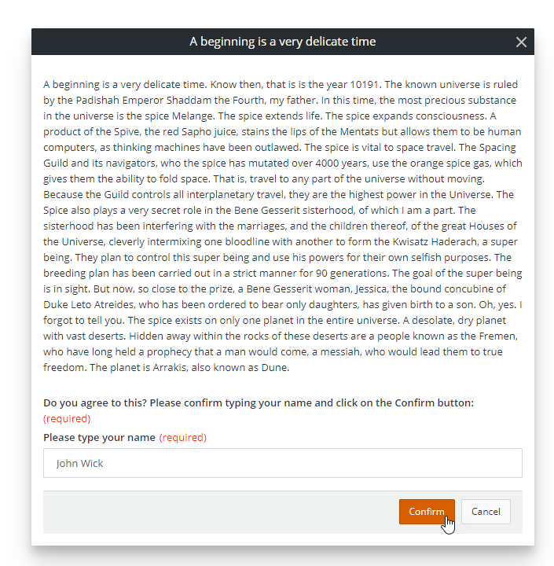
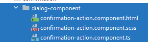

<h1 style="text-align:center">Creating an Action: Runtime</h1>

## Table Of Contents:
* [Introduction](#introduction)
* [".service": [Runtime] Asking the End User for confirmation](#runtime)
    * [Leveraging AdaptModalService to open the modal window](#runtime-modal)
    * [Returning the Action Output Parameter or prevent next actions from executing](#runtime-modal-result)


<a name="introduction"></a>
## Introduction
We are going to focus here on the runtime aspect of the [confirmation](../../_details/JAVASCRIPT_ACTIONS.MD#confirmation) example.


<a name="runtime"></a>
## ".service": [Runtime] Asking the End User for confirmation
The [service](../../bundle/src/main/webapp/libs/com-example-test210500/src/lib/actions/confirmation/confirmation-action.service.ts) is an Angular service that will be executed at runtime which in our example:
* Will display a modal Window requiring the End User to enter his/her name,
* Clicking on the "Confirm" button will set the name to the "signature" output parameter and let the next actions execute,
* Clicking on the "Cancel" button will prevent the next actions from executing,
<details> 
<summary>Runtime screenshot</summary>  


</details>

As explained earlier we expect the Action to be synchronous, aka the future actions should not be executed until the user Confirmed or Cancelled the confirmation modal window.  
The **execute()** method will be called automatically when the action is executed and will contain the different Input Parameter values. It should output an Observable:
```typescript
  execute(inputParameters: IConfirmationActionProperties): Observable<any> {
    // Opens an Adapt Modal Dialog window and waits for the user confirmation.
    const modalDialogConfig: ModalDialog = {
      isDialog: true,
      content: ConfirmationActionComponent,
      title: inputParameters.title,
      data: inputParameters.message
    };

    // AdaptModalService.open returns a promise, we need to return an Observable.
    return from(this.adaptModalService.open(modalDialogConfig)).pipe(
      switchMap((signature: string) => {
        if (signature) {
          return forkJoin({
            // Output parameter.
            signature: of(signature)
          });
        } else {
          // throwing an error will not be displayed in the UI but will
          // stop the action chain (following actions will not be executed).
          return throwError(null);
        }
      })
    );
  }
```

> :memo:  
> The best practice is to define the Input Parameters in an Interface, here "IConfirmationActionDesignProperties" which is in the file [.interface](../../bundle/src/main/webapp/libs/com-example-test210500/src/lib/actions/confirmation/confirmation-action.interface.ts):
> ```typescript
> export interface IConfirmationActionDesignProperties extends IViewActionDesignProperties{
>   title: string;
>   message: string;
> }
> ```
> The design time interface is different from the runtime interface as the design time interface extends "IViewActionDesignProperties".

<a name="runtime-modal"></a>
### Leveraging AdaptModalService to open the modal window
We leverage the Adapt **AdaptModalService** to open a modal window:
```typescript
  constructor(private adaptModalService: AdaptModalService) {
  }
```

We open the Adapt modal window passing the Action Input Parameters "title" and "message" and we are using an Angular Component "ConfirmationActionComponent" that will be used to display the information:
```typescript
    const modalDialogConfig: ModalDialog = {
      isDialog: true,
      content: ConfirmationActionComponent,
      title: inputParameters.title,
      data: inputParameters.message
    };
  // ...
  this.adaptModalService.open(modalDialogConfig)
```
<details> 
<summary>Modal Component screenshot</summary>  


</details>

The Component itself is out of scope of this tutorial as it is a pretty standard Angular Component, and you can refer to the different files in the "dialog-component" [folder](../../bundle/src/main/webapp/libs/com-example-test210500/src/lib/actions/confirmation/dialog-component/) but here are the main interesting points:
* Some properties like the "title" are automatically inherited,
* The Component gets the "data" information object (here the ```inputParameters.message```) thanks to the **activeModalRef.getData()** method:
  ```typescript
    constructor(@Optional() public activeModalRef:ActiveModalRef) {
      this.message = this.activeModalRef ? this.activeModalRef.getData() : '';
    }
  ```
The same **activeModalRef** object would be used to close or cancel the modal window. When the user clicks on the "Confirm" button we pass the name he/she entered in a text field:
```html
    <adapt-rx-textfield [label]="'Please type your name'"
                        [(ngModel)]="confirmationText"
                        [required]="true"
                        [requiredLabel]="'com.bmc.arsys.rx.standardlib.common.required.label' | translate"
                        [maxlength]="100"
    ></adapt-rx-textfield>
<!---->
<button class="btn btn-primary btn-sm"
        (click)="confirm()" [disabled]="!confirmationText">Confirm</button>
```
```typescript
  confirm(): void {
    this.activeModalRef.close(this.confirmationText);
  }

```
When the user clicks on the "Cancel" button we dismiss the modal window:
> :memo:  
> "CONFIRMATION_ACTION" is a constant defined in the [.types](../../bundle/src/main/webapp/libs/com-example-test210500/src/lib/actions/confirmation/confirmation-action.types.ts) file.
```html
<button class="btn btn-secondary btn-sm"
        (click)="cancel()">Cancel</button>
```
```typescript
  cancel(): void {
    this.activeModalRef.dismiss(CONFIRMATION_ACTION.cancelReasons.onClick);
  }
```


<a name="runtime-modal-result"></a>
### Returning the Action Output Parameter or prevent next actions from executing
As explained earlier, the Action **execute()** method needs to return an Observable. The **adaptModalService.open()** method returns a promise, so we need to "convert" it as an Observable and depending on the user Confirmation or Cancellation return the user signature or prevent the future actions from executing.  
For this we "cast" the promise as an Observable, and we are using RxJs "SwitchMap" operator to transform the original Observable into another observable:
```typescript
    return from(this.adaptModalService.open(modalDialogConfig)).pipe(
    switchMap((signature: string) => {
        // ...
    })
);
```

If the user clicked on "Cancel" the "signature" would be empty. In order to prevent the future actions to execute we use "throwError":
> :memo:  
> This will not trigger an error in the UI.
```typescript
return throwError(null);
```

If the "signature" is not empty this means that the user Confirmed, and we want to put this signature in the output parameter.  
In order to return the output parameter "signature" defined in the [design-model](#design-model) we need to return a key/value pair object with the value being an Observable, such as:
```typescript
{
    outputParameterName: Observable<value>
}
```
So here:
```typescript
{
    signature: of(signature)
}
```

We use the RxJs "forkJoin" operator to emit the last value of the "of(signature)" when it completes, so here:
```typescript
return forkJoin({
    signature: of(signature)
});
```

Overall:
```typescript
    return from(this.adaptModalService.open(modalDialogConfig)).pipe(
    switchMap((signature: string) => {
        if (signature) {
            return forkJoin({
                // Output parameter.
                signature: of(signature)
            });
        } else {
            // throwing an error will not be displayed in the UI but will
            // stop the action chain (following actions will not be executed).
            return throwError(null);
        }
    })
);
```

> :memo:  
> The best practice is to define the Input Parameters in an Interface, here "IConfirmationActionDesignProperties" which is in the file [.interface](../../bundle/src/main/webapp/libs/com-example-test210500/src/lib/actions/confirmation/confirmation-action.interface.ts):
> ```typescript
> export interface IConfirmationActionProperties {
>   title: string;
>   message: string;
> }
> ```
> The design time interface is different from the runtime interface as the design time interface extends "IViewActionDesignProperties".

> :memo:  
> This code shows how ensure that the Action is Synchronous, which means that we are waiting for the user Confirmation or Cancellation before triggering the next actions.  
> If you desire the Action to be Asynchronous, simply return directly an Observable with values rather than doing a SwitchMap of the modal window. 
