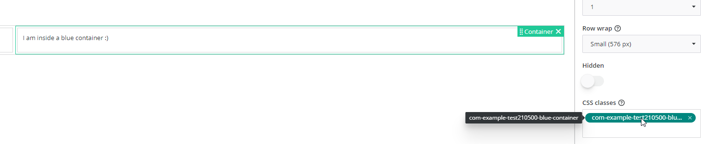
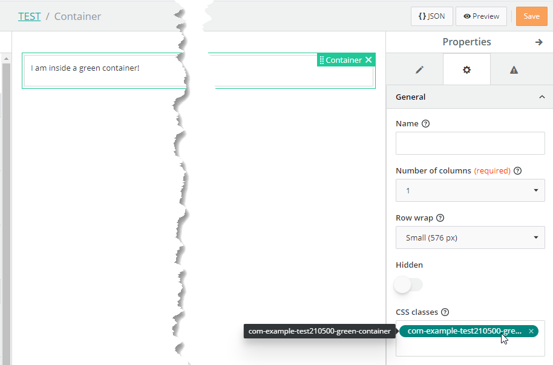
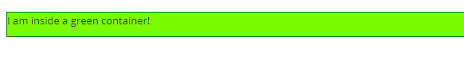

<h1 style="text-align:center">Global Css Styles</h1>

## Table Of Contents:
* [Introduction](#introduction)
* [Impact on lazy loading (Manifest)](#manifest)
* [Library default css file](#library-css-file)
* [Additional css file](#additional-css-file)
* [Dynamically loaded css file](#dynamically-loaded-css-file)
* [Tutorial](#tutorial)


<a name="introduction"></a>
## Introduction
Usually Css styles or classes are "local" to the View Component or Action. In an Angular Component the classes are automatically suffixed to avoid collision and so a class defined in a Component cannot really be used on another component or, for example, in a **Container** in View Designer as the class name will change at runtime.  
As it is possible to add Css Classes to some View Designer components, such as a **Container**, we might need to declare "global" Css Classes. For example in the view "Test Lmame Label View Components and global css pure javascript assets" some containers have a Css Class added:
<details> 
<summary>Container Css Class screenshot</summary>  


</details>

There are a couple of ways to achieve this that are detailed below.

> :warning:  
> To avoid collision with existing Css Classes be sure to respect the [coding and naming guidelines](../_guides/CODING_NAMING_GUIDELINES.MD).
> 


<a name="manifest"></a>
## Impact on lazy loading (Manifest)
The manifest will automatically list the different View Components, View Actions and Initializers contained in a bundle. This will be used later to know which UI element belongs to and allow lazy loading, aka only load a coded bundle code if one of its element is used in a View.  
Please refer to the bundle example [testlazyloading](../../../testlazyloading/README.MD) for more details.  
if you created [global Css](../../_details/ASSETS.MD#global-css-class) to apply a Css class to a container for example, you might have to change the loadCss property to always be loaded. For example if the Css class is in a library and used in another bundle (for example an application), we need to always load the Css so it can be applied. In this case, you can change the property `loadCss` to `always` in the file [package.json](../../bundle/src/main/webapp/package.json):
```json
  "config": {
    "manifest": {
      "generate": true,
      "loadJs": "lazy",
      "loadCss": "always"
    }
```


<a name="library-css-file"></a>
## Library default css file
By default, each Library has a pre-defined .scss file, in this example "com-example-test210500.scss" in the folder "src/main/webapp/libs/com-example-test210500/src/lib/styles/".  
This file is already declared in the library "angular.json" in the "styles" section, this means that this file will be taken into account during the build process to create the final file "com-example-test210500.css" (built from the "bundleName" attribute): 
```json
"styles": [
  {
    "input": "libs/com-example-test210500/src/lib/styles/com-example-test210500.scss",
    "bundleName": "com-example-test210500"
  }
]
```
For example in the capture below we are using the Css Class "com-example-test210500-blue-container" which is defined in this file:
<details> 
<summary>Container Css Class screenshot</summary>  


</details>

```scss
// This is a css class that can be used to style a view component in View Designer
.com-example-test210500-blue-container {
  border: 1px solid blue;
}
```

> :memo:  
> This is the recommended way to create global Css Styles.

> :memo:  
> There is no autocompletion in View Designer for the class name, you will have to enter it manually, without the leading "." so for example:
> ```text
> com-example-test210500-blue-container
> ```

> :warning:  
> To avoid collision with existing Css Classes be sure to respect the [coding and naming guidelines](../_guides/CODING_NAMING_GUIDELINES.MD).


<a name="additional-css-file"></a>
## Additional css file
On some occasion we might prefer create additional Scss files rather than using the library default one. For example here we created in the library [assets](../../_details/ASSETS.MD) folder the file "_global-styles.scss" that contains some Css classes, for example:
```scss
.com-example-test210500-red-container {
  border: 1px solid red;
}
```
  
By default, this file will not be taking into account during the build process and will not be available in Design Time (View Designer) or runtime.  
We would need to add a new entry in the "angular.json" "styles" section, for example:
```json
"styles": [
  {
    "input": "libs/<library-name>/src/lib/assets/_global-styles.scss",
    "bundleName": "<library-name>"
  }
]
```
In our case:
```json
"styles": [
  {
    "input": "libs/com-example-test210500/src/lib/assets/_global-styles.scss",
    "bundleName": "com-example-test210500"
  }
]
```

> :warning:  
> Do NOT remove the entry of the main library scss file (here "com-example-test210500.scss"), add a new entry.  
> The "bundleName" needs to be identical as the main .scss file value:
> ```json
> "assets": [
>   {
>     "glob": "**/*",
>     "input": "libs/com-example-test210500/src/lib/assets/pictures/",
>     "output": "assets/libs/test210500/resources/pictures/"
>   },
>   {
>     "glob": "**/*",
>     "input": "libs/com-example-test210500/src/lib/assets/scripts/",
>     "output": "assets/libs/test210500/resources/scripts/"
>   }
> ]
> ```

> :memo:  
> This method is not recommended as can be error-prone.  

> :warning:  
> To avoid collision with existing classes be sure to respect the [coding and naming guidelines](../_guides/CODING_NAMING_GUIDELINES.MD).


<a name="dynamically-loaded-css-file"></a>
## Dynamically loaded css file
We saw on some example, for example the [floating-panel](../../_details/JAVASCRIPT_VIEW_COMPONENTS.MD#floating-panel) view component that it is possible to dynamically load some css files using the custom Service [**DynamicScriptLoaderServiceService**](../../_details/JAVASCRIPT_SERVICES.MD#DynamicScriptLoaderServiceService):
  
In this case it would be necessary to:
* Create the css file in the library [assets](../../_details/ASSETS.MD) folder,
  * Make sure that this file is copied in the final bundle adding an entry in the "angular.json" "assets" section,
    * In our example the file "jspanel.css" is in the folder "/assets/scripts/jspanel-4.11.3/" so here we have an entry for the parent folder "/assets/scripts/",
      * It is very important to have the "library name" in the output attribute, here "test210500", please read the [assets](../../_details/ASSETS.MD) guide for more information:
      * ```json
         "output": "assets/libs/<library-name>/resources/scripts/"
         ```
        Here:
         > ```json
         > "assets": [
         >   {
         >     "glob": "**/*",
         >     "input": "libs/com-example-test210500/src/lib/assets/scripts/",
         >     "output": "assets/libs/test210500/resources/scripts/"
         >   }
         > ]
         > ```

In the View Component that is using this css file you would have to find a way to load it at runtime. In our case we used the custom Service [**DynamicScriptLoaderServiceService**](../../_details/JAVASCRIPT_SERVICES.MD#DynamicScriptLoaderServiceService):
```typescript
const promises: any[] = [];
// ...
promises.push(this.dynamicScriptLoaderServiceService.loadScriptByUrl(assetFolderPath + 'scripts/jspanel-4.11.3/jspanel.js', 'jspaneljs'));
promises.push(this.dynamicScriptLoaderServiceService.loadStylesheetByUrl(assetFolderPath + 'scripts/jspanel-4.11.3/jspanel.css', 'jspanelcss'));
// ...
Promise.all(promises).then((result) => {
  this.createPanel();
});
```


> :warning:  
> This method is not recommended as can be error-prone, quite complex and not automatic. It is not fit for most use cases and should not be used.

> :warning:  
> To avoid collision with existing classes be sure to respect the [coding and naming guidelines](../_guides/CODING_NAMING_GUIDELINES.MD).


<a name="tutorial"></a>
## Tutorial
Let's say we have a View with a **Container** containing some Rich Text field, and we would like to give this **Container** some properties:
* Green border,
* Light green background color,

The easy way to implement this would be to add a new Css class in the pre-created library file "<library-name>.scss" which is in the folder "src/main/webapp/libs/<library-name>/src/lib/styles/" as seen in the [first chapter](#library-css-file).  
In our example the file is "com-example-test210500.scss" and is in the folder "src/main/webapp/libs/com-example-test210500/src/lib/styles/".  
We would just to create a new Css class respecting the [coding and naming guidelines](../_guides/CODING_NAMING_GUIDELINES.MD), for example:
```scss
.com-example-test210500-green-container {
  border: 1px solid green;
  background-color: lawngreen;
}
```

In order for the Css class to be available the bundle needs to be built and deployed, for example:
```bash
mvn clean install -Pexport -Pdeploy
```

Once the bundle is deployed, we can add the class to the **Container** (without the leading "."), so here:
```text
com-example-test210500-green-container
```

For example in the view "Tutorial Global Css Style":
<details> 
<summary>Container screenshot</summary>  


</details>

The class will then be applied at runtime:
<details> 
<summary>Runtime screenshot</summary>  


</details>
