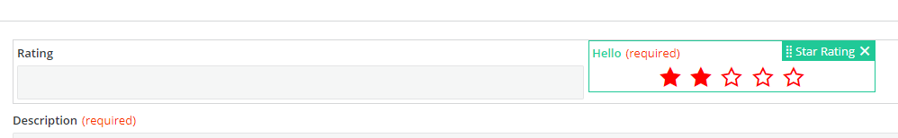

<h1 style="text-align:center">Creating a Record Field View Component: Design Time (design.component)</h1>

## Table Of Contents:
* [Introduction](#introduction)
* ["design.component.ts": Registering the Modules required by the Angular Component](#component-module-import)
* [Design Time Component template (.html)](#component-template)
* [Design time Component logic (.ts)](#component-logic)
  * [Subscribing to the Input Parameters changes](#component-logic-subscription)
  * [Updating the default number of stars](#component-logic-update)

  
<a name="introduction"></a>
## Introduction
We are going to focus here on the design time aspect of the [star-rating-field](../../_details/JAVASCRIPT_RECORD_FIELD_VIEW_COMPONENTS.MD#star-rating-field) example and more specifically on the "design.component" which is the Angular Component displayed in the View Designer canvas:


We will also handle the ".module" responsible for its registration.  
The design time Component is a regular Angular Component. 


<a name="component-module-import"></a>
## "design.component.ts": Registering the Modules required by the Angular Component
There is usually nothing to do or modify in this file which is automatically generated by the schematics.  
The only modification to these files are usually third party Angular modules that the Angular Component is leveraging.  
In the "star-rating" example we leverage the Adapt **adapt-rx-rating** component, so we need to import its module **AdaptRxRatingModule**.  
The **FormsModule** module is necessary as we are using "ngModel" in the [component template](#component-template).  
The imports are usually automatically performed by your IDE (like Webstorm).  
Since we are now using [Angular standalone](https://angular.io/guide/standalone-components) component concept, we do not need a module file (.module.ts) file as we did in previous versions of our SDK to declare our Component. The module imports needed by the Component are now directly referred in the component.ts file imports section, so here in the file [star-rating-field-design.component.ts](../../bundle/src/main/webapp/libs/com-example-test210500/src/lib/view-components/star-rating-field/design/star-rating-field-design.component.ts):
```typescript
@Component({
  selector: 'com-example-test210500-com-example-test210500-star-rating-field-design',
  templateUrl: './star-rating-field-design.component.html',
  standalone: true,
  imports: [CommonModule, FormsModule, AdaptRxRatingModule]
})
```

> :memo:  
> The design time component **StarRatingFieldDesignComponent** is automatically declared in the [registration.module](./REGISTRATION.MD) if you used the BMC Schematics.


<a name="component-template"></a>
## Design Time Component template (.html)
The Angular Component template is a regular [html](../../bundle/src/main/webapp/libs/com-example-test210500/src/lib/view-components/star-rating-field/design/star-rating-field-design.component.html) html file.  
Here it leverages the Adapt **adapt-rx-rating** Component. This Component requires the module **AdaptRxRatingModule** to be imported in the design time component module as seen in the [previous chapter](#module).  
The Adapt Component has multiple attributes that will be passed by the design time component [typescript file](../../bundle/src/main/webapp/libs/com-example-test210500/src/lib/view-components/star-rating-field/design/star-rating-field-design.component.ts).
```html
<adapt-rx-rating
        [size]="selectedSize"
        [style]="labelStyle"
        [classList]="starRatingFieldParameters.styles"
        [required]="model.isRequired$ | async"
        [readonly]="isReadonly"
        [label]="model.label$ | async"
        [(ngModel)]="value">
</adapt-rx-rating>
```


<a name="component-logic"></a>
## Design time Component logic (.ts)
The Angular Component logic is a regular Component [typescript](../../bundle/src/main/webapp/libs/com-example-test210500/src/lib/view-components/star-rating-field/design/star-rating-field-design.component.ts) file.  

<a name="component-logic-subscription"></a>
### Subscribing to the Input Parameters changes
View Designer will automatically pass as **Input()** the "model" object from the [model.design](./DESIGN_TIME_MODEL.MD#design-model):
```typescript
  @Input()
  model: StarRatingFieldDesignModel;
```

We can directly subscribe to the **this.model.componentProperties$** Observable to subscribe to the inherited and custom Input Parameters to display the number of stars, the label, the label's color etc...:
* starRatingFieldParameters: the Input Parameters,
* selectedSize: size of the Adapt **adapt-rx-rating** Component,
* labelStyle: label's custom color,
```typescript
  ngOnInit(): void {
  // Subscribing to the field properties changes.
  // We subscribe to the component input parameters to receive their values when modified
  // in the inspectors so we can update the view component layout (style or size for example).
  combineLatest([this.model.componentProperties$])
  .subscribe(([componentProperties]) => {
    this.starRatingFieldParameters = componentProperties as IStarRatingFieldDesignTimeParameters;
    // Adapt rx-rating component expects an enum value for the size (RxRatingSize),
    // though the options return a String so we need to cast it into a Number.
    this.selectedSize = this.starRatingFieldParameters.size ? Number(this.starRatingFieldParameters.size) : this.selectedSize;

    if (this.starRatingFieldParameters.labelColor) {
      this.labelStyle = {
        color: this.starRatingFieldParameters.labelColor
      };
    }
  });
}
```

> :warning:  
> The Input Parameters interface used during design time **IStarRatingFieldDesignTimeParameters** is different from the one used during [runtime](./RUNTIME.MD).  
> During design time we need to extend **IBaseRecordEditorFieldProperties**:
> ```typescript
> export interface IStarRatingFieldDesignTimeParameters extends IBaseRecordEditorFieldProperties {
> size?: string;
> labelColor?: string;
> }
> ```

> :memo:  
> This is a difference with a standalone View Component, the **componentProperties$** observable is directly accessible via the **model** object.

As you can see in the [template](#component-template) some values are directly used from the "model" object and do not come from the "starRatingFieldParameters" object:
* model.isRequired$: contains the "required" Observable value to tell if the field is required or not,
* model.label$: contains the field "label" Observable,
* isReadonly: tells if the field is in a read only record editor or not,
Some properties are hardcoded:
* value: set to 5,
Some properties are our Custom Input Parameters, "selectedSize" and "labelStyle",
```html
<adapt-rx-rating
        [size]="selectedSize"
        [style]="labelStyle"
        [classList]="starRatingFieldParameters.styles"
        [required]="model.isRequired$ | async"
        [readonly]="isReadonly"
        [label]="model.label$ | async"
        [(ngModel)]="value">
</adapt-rx-rating>
```
