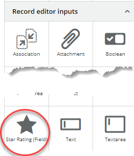

<h1 style="text-align:center">Creating a Record Field View Component: Registration</h1>

## Table Of Contents:
* [Introduction](#introduction)
* ["registration.module": Registering the Record Field View Component](#registration)


<a name="introduction"></a>
## Introduction
We are going to focus here on the registration aspect of the [star-rating-field](../../_details/JAVASCRIPT_RECORD_FIELD_VIEW_COMPONENTS.MD#star-rating-field) example.

<a name="registration"></a>
## "registration.module": Registering the View Component
> :memo:
> All parameters are set automatically by the BMC View Component Schematic.
> * In **bold** are the parameters and information that deserve special focus,
> * <ins>Underlined</ins> are the default values set by the Schematic. It is recommended not to change the default values,

> :warning:  
> Most parameters, as the label, value, hidden and disabled will be inherited since this View Component will be a record field View component.  
> We should not declare them again.  
> This is one of the main differences between a "record field view component", and a "standalone" view component.

The [registration.module](../../bundle/src/main/webapp/libs/com-example-test210500/src/lib/view-components/star-rating-field/star-rating-field-registration.module.ts) file aims at registering the View Component in Innovation Studio through the **RxViewComponentRegistryService**, some parameters are very important:
* <ins>**type**</ins>: Unique View Component identifier, please see the [coding and naming guidelines](../CODING_NAMING_GUIDELINES.MD) to avoid name collision,
* name: Text displayed in the View Designer palette,
* group: Group where the View Component will be displayed in the View Designer palette,
* icon: Adapt icon that will be displayed in the View Designer palette,
  * > :memo:  
    You can look at the documentation to see which icon can be used, or run the view component [list-icons](../../bundle/src/main/webapp/libs/com-example-test210500/src/lib/view-components/list-icons) to perform a search on available icons,  
  
* <ins>component</ins>: Registering the runtime angular Component,
* <ins>designComponent</ins>: Registering the design angular Component,
* <ins>designComponentModel</ins>: Angular service that will be executed at design time which declares the View Component Input and Output parameters, and the Input Parameters validation logic,
* <ins>**options**</ins>: This tells that this View Component can be embedded inside a **record editor** view component, which is required for a "record field view component",
    ```typescript
        options: {
            canBeEmbeddedInRecordEditor: true
        }
    ```
* <ins>**canBeInsertedInto**</ins>: This tells in what Component this view component can be embedded, in our case this needs to be a record editor,
    ```typescript
        canBeInsertedInto(componentTypes: string[]): boolean {
            return componentTypes.includes(RxViewComponentType.RecordEditor);
        }
    ```
* properties: Array of Input parameters,
    * > :memo:  
      The input parameters defined here will mostly be overridden by the "designComponentModel" service though some properties are worth mentioning:
      > * localizable: If set to true this means that the content of this input parameter can be localized. This means that when you export the application localization strings as described [here](../../_guides/LOCALIZATION.MD) you will be able to localize the input parameter,
      > * enableExpressionEvaluation: If set to true that means that the content of this input parameter will be evaluated at runtime. This is used when using other input parameters, a Record editor field for example. Else the content of this Input parameter would be considered as Text,
    * > :memo:  
      The output parameters are not defined here but will be defined in the **designComponentModel**,
    * > :warning:  
      Most parameters, as the label, value, hidden and disabled will be inherited since this View Component will be a record field View component.  
      We should not declare them again. We need only to provide the "custom" parameters specific to this View Component and not provided by the base component, for example the label color,
    * Since we are "extending" the default Input Parameters, the custom input parameters (here "size" and "labelColor") need to be added to the existing list,
      * We leverage the lodash "concat" utility to add those two input parameters to the existing array which is defined in **RX_BASE_FIELD_PROPERTIES**,
        * > :warning:  
          This step is essential and should not be overlooked, or the record field view component will not function properly.

In the "star-rating-field" example we added only two Input Parameters, specific to this Component ("size" and "labelColor"):
```typescript
    rxViewComponentRegistryService.register({
    type: 'comExampleTest210500StarRatingField',
    name: 'Star Rating (Field)',
    icon: 'star',
    group: 'Record editor inputs',
    options: {
        canBeEmbeddedInRecordEditor: true
    },
    canBeInsertedInto(componentTypes: string[]): boolean {
        return componentTypes.includes(RxViewComponentType.RecordEditor);
    },
    component: StarRatingFieldComponent,
    // Some properties are inherited from the base record editor field design defined in "IBaseRecordEditorFieldProperties":
    //  label, model (value)
    //  fieldId: string;
    //  label: string;
    //  disabled: string;
    //  hidden: string;
    //  value?: string;
    //  styles?: string;
    // VERY IMPORTANT: Do NOT forget to concatenate the custom properties with the
    // common properties!
    // If RX_BASE_FIELD_PROPERTIES is not here an error will be triggered in "base-record-editor-field-component.class.ts"
    // LMA:: TODO:: Error: trapping in code:
    // in onConfigInitialized() because the config.recordDefinition does not contain the recordDefinition object
    // but its expression ${view.components.<guidRecordDefinition>.recordDefinition} as it was never evaluated.
    // recordInstance has the same problem.
    // So the next line returns undefined:
    // find(config.recordDefinition.fieldDefinitions) ...
    // And this one fails because this.fieldDefinition is undefined:
    // this.isRequired = this.fieldDefinition.fieldOption
    properties: RX_BASE_FIELD_PROPERTIES.concat([
        {
            name: 'size',
            type: ViewComponentPropertyType.String
        },
        {
            name: 'labelColor',
            type: ViewComponentPropertyType.String
        }
    ]),
    designComponent: StarRatingFieldDesignComponent,
    designComponentModel: StarRatingFieldDesignModel
});
```

Both Input Parameters have the same properties:
* "size" and "labelColor" have just a "type" set as "string",  

> :warning:  
> Those properties can be overridden in the **designComponentModel**, but it is very important that the "type" and "enableExpressionEvaluation" match if declared in both the "registration.module" and the **designComponentModel**.  
> For example if we do not declare ```enableExpressionEvaluation: true``` here, but we declare as an **ExpressionFormControlComponent** in the **designComponentModel** the expression (for example a reference to a record editor field) will be stored as a string and will not be evaluated. The displayed value would be the expression itself and not its evaluation:
> ```text
> ${view.components.75130d2b-ed61-45d2-baf4-e834632b1eb6.recordInstance.fieldInstances.536870915.value}
> ```

> :memo:
> All Input parameters should be declared in the [.interface](../../bundle/src/main/webapp/libs/com-example-test210500/src/lib/view-components/star-rating-field/design/star-rating-field.interface.ts) to ensure a strong Typing.  
> There are two different interfaces, one for the Design time extending **IBaseRecordEditorFieldProperties**, one for the Runtime extending **IBaseRecordEditorFieldComponentConfig**:
> ```typescript
> export interface IStarRatingFieldDesignTimeParameters extends IBaseRecordEditorFieldProperties {
>   size?: string;
>   labelColor?: string;
> }
>
> export interface IStarRatingFieldRuntimeParameters extends IBaseRecordEditorFieldComponentConfig {
>   size?: string;
>   labelColor?: string;
> }
> ```

> :warning:  
> Be sure to check in the main library that the view component has been imported, in our case in [com-example-test210500.module.ts](../../bundle/src/main/webapp/libs/com-example-test210500/src/lib/com-example-test210500.module.ts):
> ```typescript
> import { StarRatingFieldRegistrationModule } from './view-components/star-rating-field/star-rating-field-registration.module';
> // ...
> @NgModule({
>   imports: [
>     // ...
>     StarRatingFieldRegistrationModule
>   ]
> })
> ``` 
> This should be done automatically if you used the BMC Schematics.
