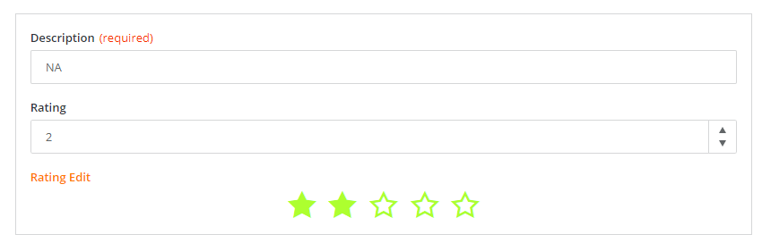
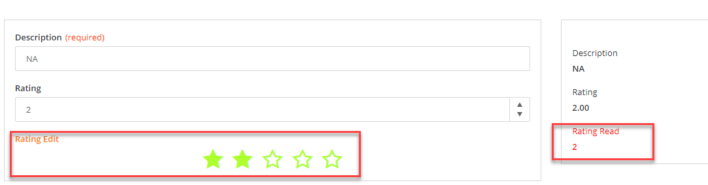

<h1 style="text-align:center">Creating a Record Field View Component: runtime</h1>

## Table Of Contents:
* [Introduction](#introduction)
* [".component.ts": Registering the Modules required by the Angular Component](#component-module-import)
* [Runtime Component template (.html)](#component-template)
* [Runtime Component logic (.ts)](#component-logic)
  * [Record Field View Component difference with a Standalone View Component](#design-model-inheritance)
  * [Subscribing to the Input Parameters changes](#component-logic-subscription)
  * [Read and Write "modes"](#component-read-write)
  * [Updating the default number of stars](#component-logic-update)


<a name="introduction"></a>
## Introduction
We are going to focus here on the runtime aspect of the [star-rating-field](../../_details/JAVASCRIPT_RECORD_FIELD_VIEW_COMPONENTS.MD#star-rating-field) example and more specifically on the "component" which is the Angular Component displayed in the view at runtime:


We will also handle the ".module" responsible for its registration.  
The runtime Component is a regular Angular Component.


<a name="component-module-import"></a>
## ".component.ts": Registering the Modules required by the Angular Component
Since we are now using [Angular standalone](https://angular.io/guide/standalone-components) component concept, we do not need a module file (.module.ts) file as we did in previous versions of our SDK to declare our Component. The module imports needed by the Component are now directly referred in the component.ts file imports section, so here in the file [star-rating-field.component.ts](../../bundle/src/main/webapp/libs/com-example-test210500/src/lib/view-components/star-rating-field/runtime/star-rating-field.component.ts).  
We need to declare the third party Angular modules that the Angular Component is leveraging, for example those modules are necessary:
* The **FormsModule** module is necessary as we are using "ngModel" in the [component template](#component-template),
* The **ReadOnlyFieldModule** module is necessary as we are using the OOTB "rx-read-only-field" component in the [component template](#component-template),
* Adapt **adapt-rx-rating** component, so we need to import its module **AdaptRxRatingModule**,
  
It is very important to keep the decorator `@RxViewComponent` as it is used in the manifest file that will list all UI elements (View Actions, View Components, Initializer) available in the bundle. The manifest file is automatically created during the build.  
The entry should be created automatically and set with the right `name` value if you used BMC schematics command line to generate the View Component:

> :memo:  
> The imports are usually automatically performed by your IDE (like Webstorm):
```typescript
@Component({
  selector: 'com-example-test210500-com-example-test210500-star-rating-field',
  templateUrl: './star-rating-field.component.html',
  standalone: true,
  imports: [CommonModule, AdaptRxRatingModule, FormsModule, ReadOnlyFieldModule]
})
@RxViewComponent({
  name: 'comExampleTest210500StarRatingField'
})
export class StarRatingFieldComponent extends BaseRecordEditorFieldComponent implements IViewComponent, OnInit, AfterViewInit {
```

> :memo:  
> The runtime component **StarRatingFieldComponent** is automatically declared in the [registration.module](./REGISTRATION.MD) if you used the BMC Schematics.


<a name="component-template"></a>
## Runtime Component template (.html)
The Angular Component template is a regular [html](../../bundle/src/main/webapp/libs/com-example-test210500/src/lib/view-components/star-rating-field/runtime/star-rating-field.component.html) html file.  
Here it leverages several components:
* The Adapt **adapt-rx-rating** Component,
  * This Component requires the module **AdaptRxRatingModule** to be imported in the runtime component module as seen in the [previous chapter](#module),
  * The Adapt Component has multiple attributes that will be passed by the runtime component [typescript file](../../bundle/src/main/webapp/libs/com-example-test210500/src/lib/view-components/star-rating-field/runtime/star-rating-field.component.ts),  
  * When the End User will choose a value clicking on one of the stars an event "onRateChange" will be emitted and handled by the method **onRateChange()**,
* The OOTB component **rx-read-only-field** that will be used when the Record Editor is in read mode,
  * This Component requires the module **ReadOnlyFieldModule** to be imported in the runtime component module as seen in the [previous chapter](#module),
```html
<ng-container>
  <rx-read-only-field
          *ngIf="inReadState; else editStateElementRef"
          [label]="label"
          [style]="labelStyle"
          [value]="getDisplayValue()"
  ></rx-read-only-field>
</ng-container>

<ng-template #editStateElementRef>
  <adapt-rx-rating
          #starRatingFieldComponent
          [label]="label"
          [disabled]="isDisabled"
          [hidden]="isHidden"
          [required]="isRequired"
          [style]="labelStyle"
          [size]="selectedSize"
          [ngModel]="getDisplayValue()"
          (onRateChange)="onRateChange($event)"
  >
  </adapt-rx-rating>
</ng-template>
```

Here is the difference between Create / edit and Read mode:  



<a name="component-logic"></a>
## Runtime Component logic (.ts)
The Angular Component logic is a regular Component [typescript](../../bundle/src/main/webapp/libs/com-example-test210500/src/lib/view-components/star-rating-field/runtime/star-rating-field.component.ts) file.


<a name="design-model-inheritance"></a>
###  Record Field View Component difference with a Standalone View Component
The main difference is that as we saw in the [registration](./REGISTRATION.MD) most Input Parameters are inherited and do not need to be declared again as taken caren of by the parent Component.  
We are extending **BaseRecordEditorFieldComponent** in the case of a Record Field View Component and do not have to "worry" about Input Parameters belonging to a "base record field".  
As a reminder here are the Input Parameters already declared and taken care of:
```typescript
// Some properties are inherited from the base record editor field design defined in "IBaseRecordEditorFieldProperties":
label, model (value)
fieldId: string;
label: string;
disabled: string;
hidden: string;
value?: string;
styles?: string;
```

We need to call some parents methods, the **constructor()** and **ngOnInit()**:
```typescript
  ngOnInit() {
    super.ngOnInit();
  }

  constructor(injector: Injector) {
    super(injector);
  }
```

We also handle the "touched" property in the **ngAfterViewInit()** method:
```typescript
  ngAfterViewInit(): void {
    // The formControl object is inherited from BaseRecordEditorFieldComponent.
    // ngModel is mapped to field #starRatingFieldComponent that does not exist in Read state.
    if (!this.inReadState) {
      this.formControl.touched$
        .pipe(takeUntil(this.destroyed$))
        .subscribe((touched) => {
          return touched? this.ngModel.control.markAsTouched() : this.ngModel.control.markAsUntouched();
        });
    }
  }
```
Which requires taping into the Adapt "adapt-rx-rating" component using the Angular **ViewChild()** decorator:
```html
  <adapt-rx-rating
    #starRatingFieldComponent
  >
  </adapt-rx-rating>
```
```typescript
@ViewChild('starRatingFieldComponent', {read: NgModel})
ngModel: NgModel;
```

<a name="component-logic-subscription"></a>
### Subscribing to the Input Parameters changes
This is done by implementing two inherited methods, **onConfigInitialized()** and **onConfigUpdated()**. In both cases the "config" object contains the Input Parameters values, both inherited and custom:
* **onConfigInitialized()**: method called when the Record Field Component is initialized,
  * > :warning:  
     We need to call the parent **onConfigInitialized()** method,
    ```typescript
      onConfigInitialized(config: IStarRatingFieldRuntimeParameters): void {
        this.starRatingFieldRuntimeParameters = config;
        super.onConfigInitialized(config);
  
        // Setting the view component custom properties from (size and labelColor)
        // saved from the View Designer properties.
        this.selectedSize = config.size ? Number(config.size) : this.selectedSize;
  
        if (config.labelColor) {
          this.labelStyle = {
            color: config.labelColor
          };
        }
      }
    ```
* **onConfigUpdated()**: method called when the Input Parameters or properties have been updated,
  * > :warning:  
    We need to call the parent **onConfigUpdated()** method,
  ```typescript
    onConfigUpdated(config: IStarRatingFieldRuntimeParameters) {
      super.onConfigUpdated(config);
  
      this.starRatingFieldRuntimeParameters = config;
    }
  ```

> :warning:  
> The Input Parameters interface used during runtime **IStarRatingFieldRuntimeParameters** is different from the one used during [design time](./DESIGN_TIME_MODEL.MD).  
> During runtime we need to extend **IBaseRecordEditorFieldProperties**:
> ```typescript
> export interface IStarRatingFieldRuntimeParameters extends IBaseRecordEditorFieldProperties {
>   size?: string;
>   labelColor?: string;
> }
> ```

In the Component's [template](#component-template) we refer to some values directly from the parent:
* label: property inherited by the parent
* isDisabled: property inherited by the parent
* isHidden: property inherited by the parent
* isRequired: property inherited by the parent
* getDisplayValue(): returns the current value, this method is inherited by the parent,
Some values come from our custom Input Parameters:
* "labelStyle": 
    * ```typescript
        this.labelStyle = {
          color: config.labelColor
        };
       ```
* "selectedSize":
  * ```this.selectedSize = config.size ? Number(config.size) : this.selectedSize;```,
```html
  <adapt-rx-rating
    #starRatingFieldComponent
    [label]="label"
    [disabled]="isDisabled"
    [hidden]="isHidden"
    [required]="isRequired"
    [style]="labelStyle"
    [size]="selectedSize"
    [ngModel]="getDisplayValue()"
    (onRateChange)="onRateChange($event)"
  >
  </adapt-rx-rating>
```


<a name="component-read-write"></a>
### Read and Write "modes"
As we saw in the [template](#component-template) we can display a same value two different ways, depending on the record editor is in "read" mode or not. In this example when the record editor is in read mode we simply display the value as text using the OOTB "rx-read-only-field" component.  
In order to do this we rely on another inherited property, "inReadState", which will indicate if the Record Editor is currently in a Read State or not:
```html
<ng-container>
  <rx-read-only-field
    *ngIf="inReadState; else editStateElementRef"
    [label]="label"
    [style]="labelStyle"
    [value]="getDisplayValue()"
  ></rx-read-only-field>
</ng-container>

<ng-template #editStateElementRef>
  <adapt-rx-rating
    #starRatingFieldComponent
    [label]="label"
    [disabled]="isDisabled"
    [hidden]="isHidden"
    [required]="isRequired"
    [style]="labelStyle"
    [size]="selectedSize"
    [ngModel]="getDisplayValue()"
    (onRateChange)="onRateChange($event)"
  >
  </adapt-rx-rating>
</ng-template>
```


<a name="component-logic-update"></a>
### Updating the number of stars
When the End User clicks on a star, we saw [previously](#component-template) that Adapt will fire an event "onRateChange" and call the method **onRateChange()**.  
Adapt pass the number of stars selected, we catch it and:
* We set the inherited parent "value" to 0, or the current value accordingly leveraging the parent's inherited method **this.setFieldValue()**,
```typescript
onRateChange(value: number): void {
  if (isNull(value)) {
    this.setFieldValue(0);
  } else {
    this.setFieldValue(value);
  }
}
```
