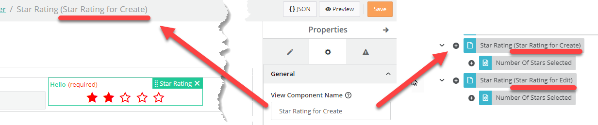
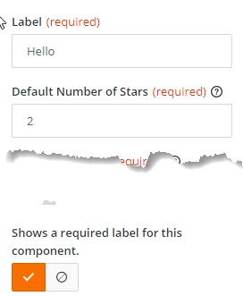
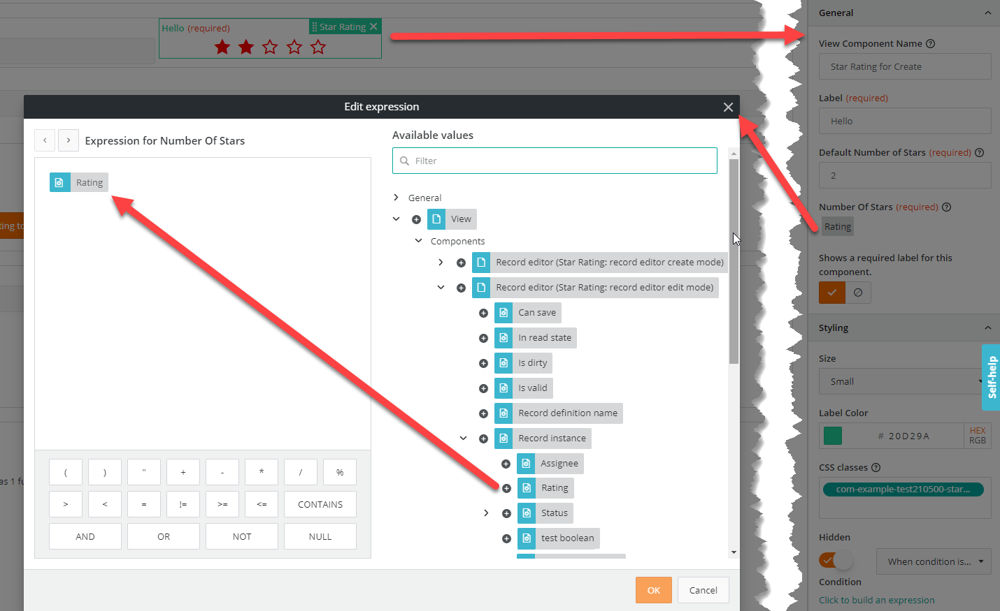
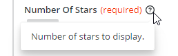
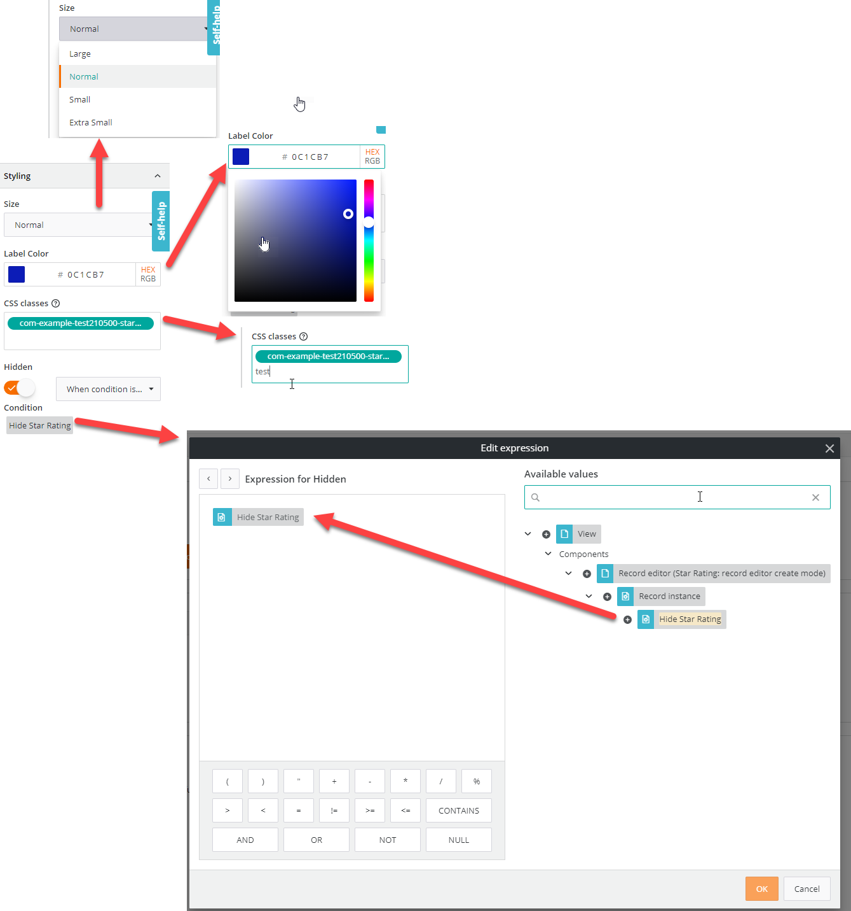
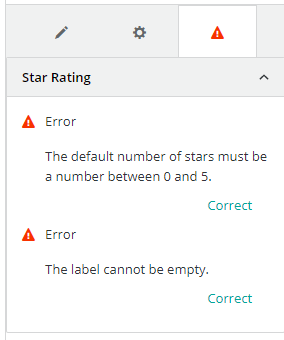
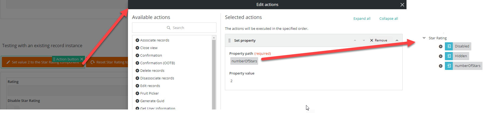

<h1 style="text-align:center">Creating a View Component: Design Time (design.model)</h1>

## Table Of Contents:
* [Introduction](#introduction)
* [What is the design.model file?](#design-model)
* [Setting the default or current values](#design-model-getInitialProperties)
* [Describing the Input Parameters](#design-model-updateInspectorConfig)
  * ["Simple" types (text, boolean, number)](#simple-type)
  * [Expression Builder](#expression)
  * [Color picker, styles, selection and optional controls](#other-types)
* [Input parameters validation](#design-model-setValidationIssues)
* [Declaring which properties can be set using a button "Set property" action](#design-model-setSettablePropertiesDataDictionary)
* [Describing the Output Parameter](#design-model-setCommonDataDictionary)
* [Giving a distinctive name to the View Component](#design-model-view-component-name)
* [Registering the Input and Output parameters, validation logic, properties that can be set in the constructor](#design-model-constructor)
* [Passing information to the design time Component](#design-model-component-preparation)
     

<a name="introduction"></a>
## Introduction
We are going to focus here on the design time aspect of the [star-rating](../../_details/JAVASCRIPT_VIEW_COMPONENTS.MD#star-rating) example and more specifically on the "design.model".  
In another chapter we will see the [design time Component](./DESIGN_TIME_COMPONENT.MD).  

<a name="design-model"></a>
## What is the design.model file?
The [design.model](../../bundle/src/main/webapp/libs/com-example-test210500/src/lib/view-components/star-rating/design/star-rating-design.model.ts) is an Angular service that will be executed at design time which declares the Action Input and Output parameters and the Input parameters validation,  
> :memo:  
> It is referred in the [registration.module](./REGISTRATION.MD) under the **designComponentModel** property,

It is constituted from several "blocks":
* Setting the default Input parameter values, or those already saved in the **getInitialProperties()** method,
* Building the Input parameter list and their characteristics in the **updateInspectorConfig()** method,
* Building the Input parameter validation in the **setValidationIssues()** method,
* Building the properties that can be set through a button "set property" action in the **setSettablePropertiesDataDictionary()** method,
* Building the Output parameter list in the **setCommonDataDictionary()** method,
* Building a custom breadcrumb in the View designer using the **setBreadcrumbs()** method,

<br>  

<a name="design-model-getInitialProperties"></a>
## Setting the default or current values
The **getInitialProperties()** is automatically called by the "parent" code and must return the Input Parameter default or current values:
* initialProperties: contains the current Input Parameter values set in the View Designer,
  In the returned object we set the default values and then override them if necessary with the current values (initialProperties) with the spread operator:
```typescript
  static getInitialProperties(initialProperties?: IStarRatingParameters): IStarRatingParameters {
    return {
      name: '',
      defaultNumberOfStars: 2.5,
      numberOfStars: 0,
      numberOfStarsSelected: 0,
      hidden: "0",
      disabled: "0",
      label: '',
      size: '',
      cssStyles: null,
      labelColor: '#000000',
      ...initialProperties,
      isRequired: initialProperties && String(initialProperties.isRequired) === 'true'
    }
  }
```
> :warning:  
> All the values are stored as strings in the View definition. If some inspectors expect a different type, like a **BooleanFormControlComponent** would expect a boolean for example, we need to cast them into the right type.  
> Here this is the case for the "isRequired" Input parameter:
> ```typescript
> isRequired: initialProperties && String(initialProperties.isRequired) === 'true'
> ```

> :warning:  
> As you can see for the same casting reasons the default values for the "hidden" and "disabled" Input parameters are set to "0" for false.  
> For true we would use "1" for example.


> :memo:
> All Input parameters should be declared in the [.interface](../../bundle/src/main/webapp/libs/com-example-test210500/src/lib/view-components/star-rating/design/star-rating.interface.ts) to ensure a strong Typing:
> ```typescript
> export interface IStarRatingParameters {
>   name: string;
>   defaultNumberOfStars: number;
>   numberOfStars: number;
>   numberOfStarsSelected: number;
>   hidden: boolean;
>   disabled: boolean;
>   label: string;
>   size: string;
>   cssStyles: string;
>   labelColor: string;
>   isRequired: boolean;
> }
> ```

> :memo:  
> As you can see we have here an Input parameter "name" which was not declared in the [registration.module](./REGISTRATION.MD). This Input parameter is a bit special and will allow us later to give an additional "label" to the View Component.  
> This can be useful when you have in a same view multiple View Components of the same type to distinct them, for example:


<br>  

<a name="design-model-updateInspectorConfig"></a>
## Describing the Input Parameters
The **updateInspectorConfig()** is not automatically called by the "parent" code, we will manually register this method in the **constructor()** later on.  
The goal of this method is to return an array of the Input Parameters with all its properties.  
Here we have multiple Input Parameters that we already saw in the [registration.module](./REGISTRATION.MD):
```typescript
  private setInspectorConfig(model) {
  return {
    inspectorSectionConfigs: [
      {
        label: 'General',
        controls: [
          {
            name: 'name',
            component: TextFormControlComponent,
            options: {
              label: 'View Component Name',
              tooltip: new Tooltip('Enter a name to uniquely identify the Star Rating Component')
            }
          },
          {
            name: 'label',
            component: TextFormControlComponent,
            options: {
              label: 'Label',
              required: true
            }
          },
          {
            name: 'defaultNumberOfStars',
            component: TextFormControlComponent,
            options: {
              label: 'Default Number of Stars',
              tooltip: new Tooltip('Default number of stars, between 0 and 5.'),
              required: true
            }
          },
          {
            name: 'numberOfStars',
            component: ExpressionFormControlComponent,
            options: {
              label: 'Number Of Stars',
              tooltip: new Tooltip('Number of stars to display.'),
              isRequired: true,
              dataDictionary$: this.expressionConfigurator.getDataDictionary(),
              operators: this.expressionConfigurator.getOperators(),
            } as IExpressionFormControlOptions
          },
          {
            name: 'isRequired',
            component: BooleanFormControlComponent,
            options: {
              description: 'Shows a required label for this component.'
            } as ICheckboxFormControlOptions
          }
        ]
      },
      {
        label: 'Styling',
        controls: [
          {
            name: 'size',
            component: SelectFormControlComponent,
            options: {
              label: 'Size',
              // the list of options must be an array of id and name, such as:
              // [{id:'', name:''},...]
              // Both id and name must be Strings (ISelectOption[]).
              options: values(STAR_RATING_SIZE_OPTIONS.sizeOptions),
              sortAlphabetically: false
            } as ISelectFormControlOptions
          },
          {
            name: 'labelColor',
            component: ColorPickerFormControlComponent,
            options: {
              label: 'Label Color'
            }
          },
          {
            name: 'cssStyles',
            component: TagsFormControlComponent,
            options: {
              label: 'CSS classes',
              placeholder: 'Add CSS classes',
              autocompleteValues: supportedCssClasses,
              tooltip: new Tooltip('Enter CSS class names to apply to this view component.'),
              errorCheck: validateCssClassName
            } as ITagsFormControlOptions
          },
          {
            name: 'hidden',
            component: OptionalExpressionControlComponent,
            options: {
              label: 'Hidden',
              dataDictionary$: this.expressionConfigurator.getDataDictionary(),
              operators: this.expressionConfigurator.getOperators(),
            }
          },
          {
            name: 'disabled',
            component: OptionalExpressionControlComponent,
            options: {
              label: 'Disabled',
              dataDictionary$: this.expressionConfigurator.getDataDictionary(),
              operators: this.expressionConfigurator.getOperators(),
            }
          }
        ]
      }
    ]
  };
}
```

As you can see there are some different "types", defined using the "component" attribute that we call internally "form control components" or "inspectors".  
The "component" attribute will define how the Input parameter will be set in the View designer. You can leverage the OOTB inspectors or create your own as described in this [document](../../_details/JAVASCRIPT_INSPECTORS.MD).  
A nearly full list of "inspectors" is inside the example [test-debug-component](../../bundle/src/main/webapp/libs/com-example-test210500/src/lib/view-components/test-debug-component/):
<details> 
<summary>Inspectors screenshot</summary>  


</details>

---
<a name="simple-type"></a>
### "Simple" types (text, boolean, number)
When there is no need to refer to another View Component (a record editor field), and the type is "simple" like a hardcoded value you can leverage "simple" types like text, boolean, number.  
Some parameters leverage those "simple" types, like:
* label or defaultNumberOfStars: hardcoded string, we will use the component **TextFormControlComponent**,
* isRequired: boolean we will use the component **BooleanFormControlComponent**,

For the "label" input parameter:
* **"name"** should match the input parameter name, this is not the "label" displayed in the view designer,
* "Component" needs to be set to "TextFormControlComponent",
* "options" contains the field properties,
  * label: Label displayed in the View Designer,
  * required: Visual indicator to tell that this Input parameter is required,
```typescript
{
  name: 'label',
  component: TextFormControlComponent,
  options: {
    label: 'Label',
    required: true
  }
}
```

For the "isRequired" input parameter:
* **"name"** should match the input parameter name, this is not the "label" displayed in the view designer,
* "Component" needs to be set to "BooleanFormControlComponent",
* "options" contains the field properties and should be typed as "ICheckboxFormControlOptions",
  * description: Label displayed in the View Designer,
  * required: Visual indicator to tell that this Input parameter is required,
```typescript
{
  name: 'isRequired',
  component: BooleanFormControlComponent,
  options: {
    description: 'Shows a required label for this component.'
  }
}
```

<details> 
<summary>Simple types screenshot</summary>  


</details>

---
<a name="expression"></a>
### Expression Builder
Since we defined some Input Parameters with "enableExpressionEvaluation: true" we want to provide the Business Analyst an Expression Builder to let him/her leverage not only a fixed string but also other fields or components from the current View:
<details> 
<summary>Expression builder screenshot</summary>  


</details>

For this we need to declare the type of Input parameter (inspector) in "Component" and pass in "options" the relevant options such as the "label", "isRequired" or "Tooltip" properties.  
Since in this case we want to leverage the Expression Builder:
* **"name"** should match the input parameter name, this is not the "label" displayed in the view designer,
* "Component" needs to be set to "ExpressionFormControlComponent",
* "options" must be typed as "IExpressionFormControlOptions" which requires passing the "dataDictionary$" and "operators",
    * Those two properties can be set to the default values as shown below where "expressionConfigurator" is inherited,
    * label: Label displayed in the View Designer,
    * tooltip: Text displayed in the tooltip next to the label,
    * isRequired: Visual indicator to tell that this Input parameter is required,
```typescript
{
  name: 'numberOfStars',
  component: ExpressionFormControlComponent,
  options: {
    label: 'Number Of Stars',
    tooltip: new Tooltip('Number of stars to display.'),
    isRequired: true,
    dataDictionary$: this.expressionConfigurator.getDataDictionary(),
    operators: this.expressionConfigurator.getOperators()
  } as IExpressionFormControlOptions
}
```
<details> 
<summary>Number of stars screenshot</summary>  


</details>

---
<a name="other-types"></a>
### Color picker, styles, selection and optional controls
Some types are a bit more complex, for example picking a color from a color picker, entering Css classes or optional conditions.  
Those inspectors are provided OOTB.   
Some parameters leverage those more "complex" types, like:
* labelColor: color picked using a color picker component **ColorPickerFormControlComponent**,
* cssStyles: list of Css classes displayed as tags using the component **TagsFormControlComponent** with some special validation,
* size: list of possible values displayed in a dropdown list using the component **SelectFormControlComponent**,
* hidden and disabled: Switches that contain a dropdown list and an expression builder on some occasion using the component **OptionalExpressionControlComponent**,

For the "labelColor" input parameter:
* **"name"** should match the input parameter name, this is not the "label" displayed in the view designer,
* "Component" needs to be set to "ColorPickerFormControlComponent",
* "options" contains the field properties,
  * label: Label displayed in the View Designer,
```typescript
{
  name: 'labelColor',
  component: ColorPickerFormControlComponent,
  options: {
    label: 'Label Color'
  }
}
```

For the "cssStyles" input parameter:
* **"name"** should match the input parameter name, this is not the "label" displayed in the view designer,
* "Component" needs to be set to "TagsFormControlComponent",
* "options" contains the field properties and typed as "ITagsFormControlOptions",
  * label: Label displayed in the View Designer,
  * placeholder: Text displayed in the tag field when no tag is present,
  * tooltip: Text displayed in the tooltip next to the label,
  * errorCheck: Special validation for the Css classes, provided OOTB, here the service **validateCssClassName**,
```typescript
{
  name: 'cssStyles',
  component: TagsFormControlComponent,
  options: {
    label: 'CSS classes',
    placeholder: 'Add CSS classes',
    autocompleteValues: supportedCssClasses,
    tooltip: new Tooltip('Enter CSS class names to apply to this view component.'),
    errorCheck: validateCssClassName
  } as ITagsFormControlOptions
}
```

For the "size" input parameter:
* **"name"** should match the input parameter name, this is not the "label" displayed in the view designer,
* "Component" needs to be set to "SelectFormControlComponent",
* "options" contains the field properties and typed as "ISelectFormControlOptions",
  * label: Label displayed in the View Designer,
  * options: Values displayed in the dropdown,
    * The list of options must be an array of id and name, such as:
    * ```[{id:'', name:''},...]```
    * Both id and name must be Strings (ISelectOption[]). 
  * sortAlphabetically: Are the labels sorted or not,
```typescript
{
  name: 'size',
  component: SelectFormControlComponent,
  options: {
    label: 'Size',
    options: values(STAR_RATING_SIZE_OPTIONS.sizeOptions),
    sortAlphabetically: false
  } as ISelectFormControlOptions
}
```
> :memo:  
> The options are defined this way in the file [star-rating.types.ts](../../bundle/src/main/webapp/libs/com-example-test210500/src/lib/view-components/star-rating/star-rating.types.ts).  
> The lodash **values** utility will return an array of the object values:
> ```typescript
> export const STAR_RATING_SIZE_OPTIONS = {
>   sizeOptions: {
>     large: {
>       id: String(RxRatingSize.lg),
>       name: 'Large'
>     },
>     normal: {
>       id: String(RxRatingSize.md),
>       name: 'Normal'
>     },
>     small: {
>       id: String(RxRatingSize.sm),
>       name: 'Small'
>     },
>     extraSmall: {
>       id: String(RxRatingSize.xs),
>       name: 'Extra Small'
>     }
>   }
> }
> ```

For the "hidden" input parameter:
* **"name"** should match the input parameter name, this is not the "label" displayed in the view designer,
* "Component" needs to be set to "OptionalExpressionControlComponent",
* This component requires passing the "dataDictionary$" and "operators",
  * Those two properties can be set to the default values as shown below where "expressionConfigurator" is inherited,
* "options" contains the field properties,
  * label: Label displayed in the View Designer,
```typescript
{
  name: 'hidden',
  component: OptionalExpressionControlComponent,
  options: {
    label: 'Hidden',
    dataDictionary$: this.expressionConfigurator.getDataDictionary(),
    operators: this.expressionConfigurator.getOperators()
  }
}
```

<details> 
<summary>Complex types screenshot</summary>  


</details>


<a name="design-model-setValidationIssues"></a>
## Input parameters validation
The **setValidationIssues()** is not automatically called by the "parent" code, we will manually register this method in the **constructor()** later on.  
The goal of this method is to return an array of the validation issues for the current component.  
For example when a required field does not contain any value, or the number of stars is not correct:
<details> 
<summary>Validation issues screenshot</summary>  


</details>

"model" contains the current Input parameters values, and we leverage the "sandbox.createError()" or "sandbox.createWarning()" methods to add error or warning messages.
```typescript
private validate(
        sandbox: IViewComponentDesignSandbox,
        model: any
): IViewComponentDesignValidationIssue[] {
  let validationIssues = [];

  // The model contains the input parameter values.
  if (model.defaultNumberOfStars < 0 ||  model.defaultNumberOfStars > 5 ) {
    validationIssues.push(sandbox.createError('The default number of stars must be a number between 0 and 5.', 'defaultNumberOfStars'));
  }

  if (!model.label) {
    validationIssues.push(sandbox.createError('The label cannot be empty.', 'label'));
  }

  // We are leveraging the Platform Css class validator.
  validationIssues = validationIssues.concat(validateCssClassNames(model.cssStyles));

  return validationIssues;
}
```

> :memo:  
> If there are error messages the Business Analyst will not be able to save the view.


<a name="design-model-setSettablePropertiesDataDictionary"></a>
## Declaring which properties can be set using a button "Set property" action
It is possible to define which Input parameters can be set through a button "Set property" action. This is optional.
The **setSettablePropertiesDataDictionary()** is not automatically called by the "parent" code, we will manually register this method in the **constructor()** later on.  
The goal of this method is to return an array of the different properties that can be set through a "Set property" button action.  
Here we have one of those properties, "numberOfStars":
<details> 
  <summary>Set property screenshot</summary>  


</details>

For each property we can set during runtime we need to provide:
* **"label"** property name displayed in the data dictionary,
* **expression**: contains the property name that will be referred in the runtime code, here "numberOfStars" for example,
```typescript
  private prepareSetProperties(): IViewComponentDesignSettablePropertiesDataDictionary {
  return [
    {
      label: 'Hidden',
      expression: this.getExpressionForProperty('hidden'),
    },
    {
      label: 'Disabled',
      expression: this.getExpressionForProperty('disabled'),
    },
    {
      label: 'numberOfStars',
      expression: this.getExpressionForProperty('numberOfStars'),
    }
  ];
}
```

<a name="design-model-setCommonDataDictionary"></a>
## Describing the Output Parameter
The **setCommonDataDictionary()** is not automatically called by the "parent" code, we will manually register this method in the **constructor()** later on.  
The goal of this method is to return an object describing the Output Parameters.  
Here we have one Output Parameter, "numberOfStarsSelected":
* label: Label displayed in the Data dictionary in View Designer,
  <details> 
    <summary>Output Parameter screenshot</summary>  

  
  </details>

For the "numberOfStarsSelected" input parameter:
* The output parameter is defined in the "children" array:
  * **"label"** output parameter name label displayed in the data dictionary,
  * **expression**: contains the output parameter name that will be referred in the runtime code, here "numberOfStarsSelected",
```typescript
  private prepareDataDictionary(componentName: string): IViewComponentDesignCommonDataDictionaryBranch {
  return {
    label: componentName,
    expression: this.getExpressionForProperty('api'),
    children: [
      {
        label: 'Number Of Stars Selected',
        expression: this.getExpressionForProperty('numberOfStarsSelected')
      }
    ]
  }
}
```

<a name="design-model-view-component-name"></a>
## Giving a distinctive name to the View Component
It is possible to give a distinct name to a View Component which allows the Business Analyst to give an additional "label" to the View Component.  
This can be useful when you have in a same view multiple View Components of the same type to distinct them, for example:
  
We declared earlier in the [Input Parameters](#design-model-updateInspectorConfig) "name":
```typescript
{
  name: 'name',
  component: TextFormControlComponent,
  options: {
      label: 'View Component Name',
    tooltip: new Tooltip('Enter a name to uniquely identify the Star Rating Component')
  }
}
```
In the **constructor()** method we can listen to the changes on the "name" Input Parameter and automatically update the **breadcrumb** and add a label next to the View Component name in the **data dictionary**:


The logic is described below:
* We subscribe to the input parameter "name" change using ```this.sandbox.getComponentPropertyValue('name')```,
* We create a new "component name" using the current Input Parameter "name" value ```const componentName = name ? `${this.sandbox.descriptor.name} (${name})` : this.sandbox.descriptor.name;```,
* We pass this new name when setting the properties that can be set through a button "Set property" action or output parameters,
* We update the **breadcrumb** using the **this.sandbox.setBreadcrumbs()** method,
```typescript
  // We set the data dictionary and the properties that can be set using a button action "set property".
  this.sandbox.getComponentPropertyValue('name').subscribe((name) => {
    // This is used when we want here to give a specific name to the view component.
    // This way if we have multiple view components in the view we can make them specific
    // and find them easily in the data dictionaries.
    const componentName = name ? `${this.sandbox.descriptor.name} (${name})` : this.sandbox.descriptor.name;

    // Setting the properties that can be set through a button action "Set Property".
    this.sandbox.setSettablePropertiesDataDictionary(componentName, this.prepareSetProperties());

    // Adding the data dictionary used to declare output parameters. A difference with AngularJs were it could be
    // automatic.
    // Note: The refresh action will not appear if the view component does not have at least one output parameter.
    this.sandbox.setCommonDataDictionary(this.prepareDataDictionary(componentName));

    // Setting the breadcrumb with the view component type and optional name.
    // This call is optional.
    this.sandbox.setBreadcrumbs(componentName);
  });
```


<a name="design-model-constructor"></a>
## Registering the Input and Output parameters, validation logic, properties that can be set in the constructor
In the **constructor()** we will register now the methods that are not automatically called by the parent leveraging the "sandbox":
* For the Input parameters we will leverage the **sandbox.updateInspectorConfig()** method:
  ```typescript
  sandbox.updateInspectorConfig(this.setInspectorConfig(propertiesForInspector));
  ```
* For the Output parameters we will leverage the **sandbox.setCommonDataDictionary()** method:
  ```typescript
  this.sandbox.setCommonDataDictionary(this.prepareDataDictionary(componentName));
  ```

* For the validation we will leverage the **sandbox.setValidationIssues()** method each time the Input Parameters are modified by the Business Analyst, subscribing to the Input Parameters change using ```combineLatest([this.sandbox.componentProperties$])```:
  ```typescript
    combineLatest([this.sandbox.componentProperties$])
          .pipe(
                  map(([componentProperties]) => {
                    return this.validate(this.sandbox, componentProperties);
                  })
          )
          .subscribe((validationIssues) => {
            this.sandbox.setValidationIssues(validationIssues);
          });
  ```
* For the properties that can be set using a button "Set property" action we will leverage the method **sandbox.setSettablePropertiesDataDictionary()**:
  ```typescript
  this.sandbox.setSettablePropertiesDataDictionary(componentName, this.prepareSetProperties());
  ```
* For the breadcrumb (please refer to the previous [chapter](#design-model-view-component-name)), we will leverage the method **this.sandbox.setBreadcrumbs()**,
  ```typescript
  this.sandbox.setBreadcrumbs(componentName);
  ```
  
Overall:
```typescript
  constructor(protected injector: Injector,
        protected sandbox: IViewComponentDesignSandbox) {
  super(injector, sandbox);

  // Used for the design time component to subscribe to this.sandbox.componentProperties$.
  this.modelSandbox = sandbox;

  // Here we define the properties passed to the Inspector.
  // Those are not the default values.
  sandbox.updateInspectorConfig(this.setInspectorConfig(propertiesForInspector));

  // Registering the custom validation.
  combineLatest([this.sandbox.componentProperties$])
          .pipe(
                  map(([componentProperties]) => {
                    return this.validate(this.sandbox, componentProperties);
                  })
          )
          .subscribe((validationIssues) => {
            this.sandbox.setValidationIssues(validationIssues);
          });

  // We set the data dictionary and the properties that can be set using a button action "set property".
  this.sandbox.getComponentPropertyValue('name').subscribe((name) => {
    // This is used when we want here to give a specific name to the view component.
    // This way if we have multiple view components in the view we can make them specific
    // and find them easily in the data dictionaries.
    const componentName = name ? `${this.sandbox.descriptor.name} (${name})` : this.sandbox.descriptor.name;

    // Setting the properties that can be set through a button action "Set Property".
    this.sandbox.setSettablePropertiesDataDictionary(componentName, this.prepareSetProperties());

    // Adding the data dictionary used to declare output parameters. A difference with AngularJs were it could be
    // automatic.
    // Note: The refresh action will not appear if the view component does not have at least one output parameter.
    this.sandbox.setCommonDataDictionary(this.prepareDataDictionary(componentName));

    // Setting the breadcrumb with the view component type and optional name.
    // This call is optional.
    this.sandbox.setBreadcrumbs(componentName);
  });
}
```

<a name="design-model-component-preparation"></a>
## Passing information to the design time Component
We want to implement some logic in the design time Component, mainly displaying in real time the number of stars, the label color, and allowing the Business Analyst to set the default number of stars when he / she clicks on the star component:
<details> 
<summary>Design Time Component screenshot</summary>  


</details>

In order to achieve this we need to pass the **sandbox** object to the Component since it contains the different methods and values (Input Parameters) that are necessary to get or update the Input Parameters.  
We create a "modelSandbox" variable and set it to the "sandbox" in the **constructor()** method:
```typescript
modelSandbox: IViewComponentDesignSandbox;

constructor(protected injector: Injector,
        protected sandbox: IViewComponentDesignSandbox) {
  super(injector, sandbox);

  // Used for the design time component to subscribe to this.sandbox.componentProperties$.
  this.modelSandbox = sandbox;
  
  // ...
}
```
