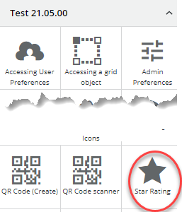
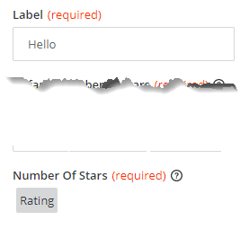

<h1 style="text-align:center">Creating a View Component: Registration</h1>

## Table Of Contents:
* [Introduction](#introduction)
* ["registration.module": Registering the View Component](#registration)


<a name="introduction"></a>
## Introduction
We are going to focus here on the registration aspect of the [star-rating](../../_details/JAVASCRIPT_VIEW_COMPONENTS.MD#star-rating) example.

<a name="registration"></a>
## "registration.module": Registering the View Component
> :memo:
> All parameters are set automatically by the BMC View Component Schematic.
> * In **bold** are the parameters and information that deserve special focus,
> * <ins>Underlined</ins> are the default values set by the Schematic. It is recommended not to change the default values,

The [registration.module](../../bundle/src/main/webapp/libs/com-example-test210500/src/lib/view-components/star-rating/star-rating-registration.module.ts) file aims at registering the View Component in Innovation Studio through the **RxViewComponentRegistryService**, some parameters are very important:
* <ins>**type**</ins>: Unique View Component identifier, please see the [coding and naming guidelines](../CODING_NAMING_GUIDELINES.MD) to avoid name collision,
* name: Text displayed in the View Designer palette,
* group: Group where the View Component will be displayed in the View Designer palette,
* icon: Adapt icon that will be displayed in the View Designer palette,
  * > :memo:  
    You can look at the documentation to see which icon can be used, or run the view component [list-icons](../../bundle/src/main/webapp/libs/com-example-test210500/src/lib/view-components/list-icons) to perform a search on available icons,
  
* <ins>bundleId</ins>: The application or library bundleId,
* <ins>componentFactory</ins>: Registering the runtime angular Component,
* <ins>designComponentModel</ins>: Angular service that will be executed at design time which declares the View Component Input and Output parameters, and the Input Parameters validation logic,
* properties: Array of Input parameters,
    * > :memo:  
      The input parameters defined here will mostly be overridden by the "designComponentModel" service though some properties are worth mentioning:
      > * localizable: If set to true this means that the content of this input parameter can be localized. This means that when you export the application localization strings as described [here](../../_guides/LOCALIZATION.MD) you will be able to localize the input parameter,
      > * enableExpressionEvaluation: If set to true that means that the content of this input parameter will be evaluated at runtime. This is used when using other input parameters, a Record editor field for example. Else the content of this Input parameter would be considered as Text,
  * > :memo:  
    The output parameters are not defined here but will be defined in the **designComponentModel**,
* options: By default this property is not generated. It is usually used to add additional properties, here to tell that this View Component can be embedded inside a **record editor** view component:
    ```typescript
        options: {
            canBeEmbeddedInRecordEditor: true
        }
    ```

In the "star-rating" example we added many Input Parameters as you can see below. They will hold some star rating styling (color, size, styles), field properties (required, hidden, disable) and other properties like its label, or the number of stars to display initially:
```typescript
    rxViewComponentRegistryService.register({
    type: 'comExampleTest210500StarRating',
    name: 'Star Rating',
    group: 'Test 21.05.00',
    componentFactory: this.componentFactoryResolver.resolveComponentFactory(StarRatingComponent),
    icon: 'star',
    options: {
        canBeEmbeddedInRecordEditor: true
    },
    properties: [
        {
            name: 'label',
            type: ViewComponentPropertyType.String,
            localizable: true
        },
        {
            name: 'defaultNumberOfStars',
            type: ViewComponentPropertyType.Number
        },
        {
            name: 'numberOfStars',
            type: ViewComponentPropertyType.Number,
            enableExpressionEvaluation: true
        },
        {
            name: 'size',
            type: ViewComponentPropertyType.String
        },
        {
            name: 'isRequired',
            type: ViewComponentPropertyType.Boolean
        },
        {
            name: 'labelColor',
            type: ViewComponentPropertyType.String
        },
        {
            name: 'cssStyles',
            type: ViewComponentPropertyType.String
        },
        {
            name: 'hidden',
            type: ViewComponentPropertyType.Boolean,
            enableExpressionEvaluation: true
        },
        {
            name: 'disabled',
            type: ViewComponentPropertyType.Boolean,
            enableExpressionEvaluation: true
        }
    ],
    designComponentFactory: this.componentFactoryResolver.resolveComponentFactory(StarRatingDesignComponent),
    designComponentModel: StarRatingDesignModel,
    bundleId: 'com.example.test210500'
});
```

Some Input Parameters have different properties:
* "numberOfStars" has the property ```enableExpressionEvaluation: true```, which means that an **Expression Builder** will be displayed at runtime,
* "label" has just a "type" set as "string", which means that a simple text input field will be displayed at runtime,  


> :warning:  
> Those properties can be overridden in the **designComponentModel**, but it is very important that the "type" and "enableExpressionEvaluation" match if declared in both the "registration.module" and the **designComponentModel**.  
> For example if we do not declare ```enableExpressionEvaluation: true``` here, but we declare as an **ExpressionFormControlComponent** in the **designComponentModel** the expression (for example a reference to a record editor field) will be stored as a string and will not be evaluated. The displayed value would be the expression itself and not its evaluation:
> ```text
> ${view.components.75130d2b-ed61-45d2-baf4-e834632b1eb6.recordInstance.fieldInstances.536870915.value}
> ```

> :memo:
> All Input parameters should be declared in the [.interface](../../bundle/src/main/webapp/libs/com-example-test210500/src/lib/view-components/star-rating/design/star-rating.interface.ts) to ensure a strong Typing:
> ```typescript
> export interface IStarRatingParameters {
>   name: string;
>   defaultNumberOfStars: number;
>   numberOfStars: number;
>   numberOfStarsSelected: number;
>   hidden: boolean;
>   disabled: boolean;
>   label: string;
>   size: string;
>   cssStyles: string;
>   labelColor: string;
>   isRequired: boolean;
> }
> ```

> :warning:  
> Be sure to check in the main library that the view component has been imported, in our case in [com-example-test210500.module.ts](../../bundle/src/main/webapp/libs/com-example-test210500/src/lib/com-example-test210500.module.ts):
> ```typescript
> import { StarRatingRegistrationModule } from './view-components/star-rating/star-rating-registration.module';
> // ...
> @NgModule({
>   imports: [
>     // ...
>     StarRatingRegistrationModule
>   ]
> })
> ``` 
> This should be done automatically if you used the BMC Schematics.

The "registration.module" also imports both the design time and runtime Angular Component modules:
```typescript
import { StarRatingModule } from './runtime';
import { StarRatingDesignModule } from './design';
// ...
@NgModule({
  imports: [StarRatingDesignModule, StarRatingModule]
})
```
> :memo:  
> Those modules are automatically imported in the if you used the BMC Schematics.
