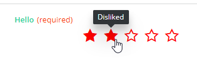
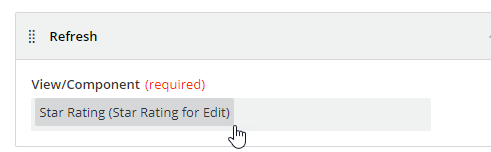

<h1 style="text-align:center">Creating a View Component: runtime</h1>

## Table Of Contents:
* [Introduction](#introduction)
* [".module": Registering the Angular Component](#module)
* [Runtime Component template (.html)](#component-template)
* [Runtime Component logic (.ts)](#component-logic)
  * [Subscribing to the Input Parameters changes](#component-logic-subscription)
  * [Updating the number of stars](#component-logic-update)


<a name="introduction"></a>
## Introduction
We are going to focus here on the runtime aspect of the [star-rating](../../_details/JAVASCRIPT_VIEW_COMPONENTS.MD#star-rating) example and more specifically on the "component" which is the Angular Component displayed in the view at runtime:


We will also handle the ".module" responsible for its registration.  
The runtime Component is a regular Angular Component.


<a name="module"></a>
## ".module": Registering the Angular Component
There is usually nothing to do or modify in this file which is automatically generated by the schematics.  
The only modification to these files are usually third party Angular modules that the Angular Component is leveraging.  
In the "star-rating" example we leverage the Adapt **adapt-rx-rating** component, so we need to import its module **AdaptRxRatingModule**.    
The **FormsModule** module is necessary as we are using "ngModel" in the [component template](#component-template).  

> :memo:  
> The imports are usually automatically performed by your IDE (like Webstorm):
```typescript
import { NgModule } from '@angular/core';
import { CommonModule } from '@angular/common';
import { StarRatingComponent } from './star-rating.component';
import { AdaptRxRatingModule} from '@bmc-ux/adapt-angular';
import { FormsModule } from '@angular/forms';

@NgModule({
  imports: [CommonModule, AdaptRxRatingModule, FormsModule],
  exports: [StarRatingComponent],
  declarations: [StarRatingComponent],
  entryComponents: [StarRatingComponent]
})
export class StarRatingModule {
}
```

> :memo:  
> The runtime module **StarRatingModule** is automatically imported in the [registration.module](./REGISTRATION.MD) if you used the BMC Schematics.


<a name="component-template"></a>
## Runtime Component template (.html)
The Angular Component template is a regular [html](../../bundle/src/main/webapp/libs/com-example-test210500/src/lib/view-components/star-rating/runtime/star-rating.component.html) html file.  
Here it leverages the Adapt **adapt-rx-rating** Component. This Component requires the module **AdaptRxRatingModule** to be imported in the runtime component module as seen in the [previous chapter](#module).  
The Adapt Component has multiple attributes that will be passed by the runtime component [typescript file](../../bundle/src/main/webapp/libs/com-example-test210500/src/lib/view-components/star-rating/runtime/star-rating.component.ts).  
When the End User will choose a value clicking on one of the stars an event "onRateChange" will be emitted and handled by the method **onRateChange()**:
```html
<adapt-rx-rating
        [size]="selectedSize"
        [style]="labelStyle"
        [classList]="componentInputParametersValues.cssStyles"
        [required]="componentInputParametersValues.isRequired"
        [hidden]="componentInputParametersValues.hidden"
        [label]="componentInputParametersValues.label"
        [readonly]="componentInputParametersValues.disabled"
        [(ngModel)]="componentInputParametersValues.numberOfStars"
        (onRateChange)="onRateChange($event)">
</adapt-rx-rating>
```


<a name="component-logic"></a>
## Runtime Component logic (.ts)
The Angular Component logic is a regular Component [typescript](../../bundle/src/main/webapp/libs/com-example-test210500/src/lib/view-components/star-rating/runtime/star-rating.component.ts) file.

<a name="component-logic-subscription"></a>
### Subscribing to the Input Parameters changes
Since the Component extends the OOTB **BaseViewComponent** some properties are readily available. In the **ngOnInit()** method we subscribe to the Input Parameters changes through the "config" object.  
As you can see instead of directly subscribing to "this.config" we use the rxJs "pipe" operator to add two conditions:
* ```distinctUntilChanged(isEqual)```: The subscription will only fire if the configuration is different from the previous values
  * We leverage the lodash "isEqual" utility to do the object comparison,
* ```takeUntil(this.destroyed$)```: the "this.destroyed$" is a ReplaySubject that is set when the **BaseViewComponent** parent Component is destroyed,
  * This will ensure the subscription will stop when the View Component is destroyed,
  * This is best practice,
```typescript
    this.config.pipe(
      distinctUntilChanged(isEqual),
      takeUntil(this.destroyed$)
    ).subscribe((config: IStarRatingParameters) => {
        // ...
    });
```

The value returned by the observable contains the different Input Parameters:
* We store them in a "componentInputParametersValues" variable.
  ```typescript
  componentInputParametersValues: IStarRatingParameters;
  // ...
  this.config.pipe(
          distinctUntilChanged(isEqual),
          takeUntil(this.destroyed$)
  ).subscribe((config: IStarRatingParameters) => {
    this.componentInputParametersValues = config;
  });
  ```
* We also leverage the **BaseViewComponent** **this.notifyPropertyChanged()** method to broadcast the current value in the output parameter "numberOfStarsSelected":
  ```typescript
  this.notifyPropertyChanged('numberOfStarsSelected', this.componentInputParametersValues.numberOfStars)
  ```
* We set the label's color accordingly depending on the Business Analyst chosen color (if any),
  
Overall here is the initialization of the Component:
```typescript
ngOnInit() {
  this.config.pipe(
          distinctUntilChanged(isEqual),
          takeUntil(this.destroyed$)
  ).subscribe((config: IStarRatingParameters) => {
    this.componentInputParametersValues = config;
    this.selectedSize = this.componentInputParametersValues.size ? Number(this.componentInputParametersValues.size) : this.selectedSize;

    if (this.componentInputParametersValues.labelColor) {
      this.labelStyle = {
        color: this.componentInputParametersValues.labelColor
      };
    }

    this.notifyPropertyChanged('numberOfStarsSelected', this.componentInputParametersValues.numberOfStars);
  });
  // ...
}
```

<a name="component-logic-set-property"></a>
### Handling "Set property" button action, refresh and setFocus methods
As we saw in the [design.model](./DESIGN_TIME_MODEL.MD#design-model-setSettablePropertiesDataDictionary) some properties can be set by a button "Set property" action (hidden, disabled, numberOfStars).  
We need to override the Component base api to implement the **setProperty()**, **setFocus()** and **refresh()**:
```typescript
  api = {
    setProperty: this.setProperty.bind(this),
    setFocus: this.setFocus.bind(this),
    refresh: this.refresh.bind(this)
  };
```

> :memo:  
> The **refresh()** method will be triggered when a "Refresh" action is triggered by a button:
> 


Those methods point to local methods:
```typescript
setProperty(propertyPath: string, propertyValue: any): void {
  switch (propertyPath) {
  case 'hidden': {
      this.componentInputParametersValues.hidden = propertyValue;
      break;
    }
  case 'disabled': {
      this.componentInputParametersValues.disabled = propertyValue;
      break;
    }
  case 'numberOfStars': {
      this.componentInputParametersValues.numberOfStars = propertyValue;
      this.notifyPropertyChanged('numberOfStarsSelected', this.componentInputParametersValues.numberOfStars);
      break;
    }
  default: {
      this.rxLogService.warning(`Standalone Field: property ${propertyPath} is not settable, value was ${propertyValue}.`);
    }
  }
}

setFocus(): Observable<any> {
  this.rxLogService.warning('Executing the view component focus method.');

  return EMPTY;
}

refresh(): Observable<any> {
  this.componentInputParametersValues.numberOfStars = this.componentInputParametersValues.defaultNumberOfStars;
  this.notifyPropertyChanged('numberOfStarsSelected', this.componentInputParametersValues.numberOfStars);

  return EMPTY;
}
```

Once the apis are overridden we need to tell the base component to use those new apis, for this we are leveraging the **BaseViewComponent** **this.notifyPropertyChanged()** method which is used to broadcast a change in a specific property. We do this in the "ngOnInit()":
```typescript
this.notifyPropertyChanged('api', this.api);
```

> :memo:  
> **this.notifyPropertyChanged()** will also be used later to broadcast a change in an output parameter.

--- 
#### Setting properties
When a button action "Set property" is executed this method will now be called passing two information:
* propertyPath: property that needs to be modified (here "hidden", "disabled" and "numberOfStars"),
* propertyValue: the value,
In our case we:
* Set the Input Parameters to the new values,
* For "numberOfStars" we also broadcast the new value in the Output Parameter "numberOfStarsSelected" leveraging the **BaseViewComponent** **this.notifyPropertyChanged()** method,

> :memo:  
> It is a best practice to handle the case where an unknown property is set.

```typescript
setProperty(propertyPath: string, propertyValue: any): void {
  switch (propertyPath) {
  case 'hidden': {
      this.componentInputParametersValues.hidden = propertyValue;
      break;
    }
  case 'disabled': {
      this.componentInputParametersValues.disabled = propertyValue;
      break;
    }
  case 'numberOfStars': {
      this.componentInputParametersValues.numberOfStars = propertyValue;
      this.notifyPropertyChanged('numberOfStarsSelected', this.componentInputParametersValues.numberOfStars);
      break;
    }
  default: {
      this.rxLogService.warning(`Standalone Field: property ${propertyPath} is not settable, value was ${propertyValue}.`);
    }
  }
}
```

#### Refresh
The **refresh()** method will be triggered when a "Refresh" action is triggered by a button. In our case we do not really use for a "refresh" action but to "reset" the star rating component to its default values.  
As it is not possible to implement custom api methods we overrode the "refresh" method for this purpose.  
* We set the Input Parameter "numberOfStars" to the default number of stars value set in the Input Parameter "defaultNumberOfStars",
* We also broadcast the new value in the Output Parameter "numberOfStarsSelected" leveraging the **BaseViewComponent** **this.notifyPropertyChanged()** method,
* We return an Empty Observable (returning an Observable is required),
```typescript
refresh(): Observable<any> {
  this.componentInputParametersValues.numberOfStars = this.componentInputParametersValues.defaultNumberOfStars;
  this.notifyPropertyChanged('numberOfStarsSelected', this.componentInputParametersValues.numberOfStars);

  return EMPTY;
}
```

#### Set Focus
This function is internal and not yet exposed to developers.  
It returns an Empty Observable (returning an Observable is required),
```typescript
setFocus(): Observable<any> {
  this.rxLogService.warning('Executing the view component focus method.');

  return EMPTY;
}
```

<a name="component-logic-update"></a>
### Updating the number of stars
When the End User clicks on a star, we saw [previously](#component-template) that Adapt will fire an event "onRateChange" and call the method **onRateChange()**.  
Adapt pass the number of stars selected, we catch it and:
* We set the Input Parameter "numberOfStars",
* We also broadcast the new value in the Output Parameter "numberOfStarsSelected" leveraging the **BaseViewComponent** **this.notifyPropertyChanged()** method,
```typescript
  onRateChange(value: number) {
  this.componentInputParametersValues.numberOfStars = value;
  this.notifyPropertyChanged('numberOfStarsSelected', value);
}
```
